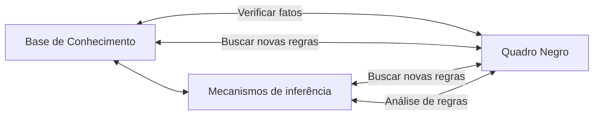
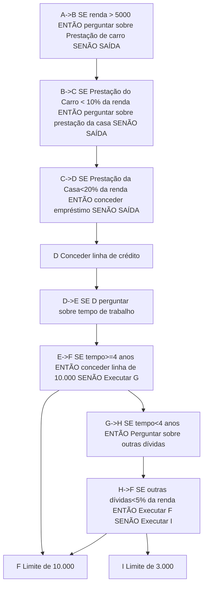

## Aula 1
### INTRODUÇÃO À INTELIGÊNCIA ARTIFICIAL

A IA surgiu em meados da década de 1950.

A tecnologia conta, a partir da IA, com a simulação de processos inteligentes que auxiliam no reconhecimento de padrões, na tomada de decisão ou na execução de tarefas repetitivas.

### DEFINIÇÕES DE INTELIGÊNCIA ARTIFICIAL

|        | Ser humano                             | Racionalidade                     |
| ------ | -------------------------------------- | --------------------------------- |
| Pensar | Sistemas que pensam como seres humanos | Sistemas que pensam racionalmente |
| Agir   | Sistemas que agem como seres humanos   | Sistemas que agem racionalmente   |

Fonte: adaptado de Russel e Norvig (2005, p. 5)

| Quadrante              | Definições                                                   |
| ---------------------- | ------------------------------------------------------------ |
| Pensar como ser humano | “O novo e interessante esforço para fazer os computadores pensarem...máquinas com mentes, no sentido total e literal”. (HAUGELAND, 1985). “\[Automatização de\] atividades que associamos ao pensamento humano, atividades como a tomada de decisões, a resolução de problemas, o aprendizado”. (BELLMAN, 1978). |
| Pensar racionalmente   | “O estudo das faculdades mentais pelo uso de modelos computacionais”. (CHARNIAK; MCDERMOTT, 1985). “O estudo das computações que tornam possível perceber, raciocinar e agir”. (WINSTON, 1992). |
| Agir como ser humano   | “A arte de criar máquinas que executam funções que exigem inteligência quando executadas por pessoas”. (KURZWEIL, 1990). |
| Agir racionalmente     | “A Inteligência Computacional é o estudo do projeto de agentes inteligentes”. (POOLE et al., 1998). |

Fonte: adaptado de Russel e Norvig (2004, p. 5)

O comportamento inteligente requer que exista uma ação sobre o ambiente, sendo característico da automação e da robótica.

No caso de robôs que executem alguma atividade no ambiente, de forma diferente de como um ser humano faria, caracteriza a definição do “agir racionalmente”.

### LINHAS DE PESQUISA

Temos uma linha de pesquisa dentro da IA que se denomina conexionista, a qual está interessada na arquitetura de dispositivos que simulem as células biológicas que interagem para o surgimento de processos inteligentes. Dentro da linha conexionista, temos como exemplo as redes neurais artificiais e os sistemas imunológicos artificiais. As redes neurais artificiais (RNA) constituem um campo de pesquisa em que a preocupação é lidar com tarefas tais como o reconhecimento de padrões, a previsão e a tomada de decisão utilizando redes de unidades conectadas, treinadas a partir de algoritmos que funcionam baseados em amostras do mundo real e podem assim aprender a classificar padrões (HAYKIN, 2001). Os sistemas imunológicos artificiais são baseados no funcionamento do sistema imunológico que aprende de uma forma muito rápida sobre elementos estranhos (antígenos) que entram em um sistema vivo e que desencadeiam uma reação contrária, com a produção de anticorpos para eliminar os antígenos (MEDEIROS et al., 2008).

Temos a linha de pesquisa denominada simbólica. A linha simbólica busca lidar com processos inteligentes, utilizando linguagens baseadas em lógica e construção de redes semânticas para solucionar problemas e simular conhecimento especialista para contextos de diagnóstico. Os sistemas derivados desta linha de pesquisa se denominam ainda de sistemas baseados em conhecimento. Nessa linha são derivadas as pesquisas sobre a linguagem LISP (BITTENCOURT, 1998, p.169), que trabalha com representação de conhecimento na forma de listas, e a linguagem de programação lógica PROLOG, (PALAZZO, 1997, p. 2), que permite a manipulação de símbolos por meio de representação de conhecimento na forma de fatos e regras.

Os sistemas especialistas (RUSSELL; NORVIG, 2004, p. 24) são uma das áreas mais relevantes dentro da linha simbólica, referindo-se a sistemas em que o conhecimento de um especialista humano em uma área bem delimitada é representado em uma linguagem, de forma a permitir o diagnóstico de situações e a execução de ações que seriam feitas como se fosse por um ser humano. Portanto, é importante salientar que na linha simbólica, a preocupação se volta à forma como a mente pensa, e não como o cérebro nas suas partes e divisões funciona.

Ainda na área simbólica, temos as pesquisas que são feitas na área de ontologias. As ontologias se referem a representações de conhecimento alcançadas por consenso, em áreas específicas de domínio do conhecimento humano, que podem ser manipuladas tanto por seres humanos quanto por agentes inteligentes. As ontologias permitem tanto a representação quanto os procedimentos para inferência e raciocínio sobre tal representação, possibilitando o desenvolvimento da Web Semântica (CORCHO et al., 2008).

Outra linha de pesquisa que se soma às linhas simbólica e conexionista e que foge do esquema mente-cérebro é a denominada linha evolucionária. As pesquisas da IA na linha evolucionária se baseiam na forma como se processa a evolução biológica sobre o planeta, e busca simular tais processos evolucionários em sistemas de computador para a resolução de problemas. Dentro desta linha de pesquisa, podemos encontrar uma das áreas mais exploradas que são os algoritmos genéticos. Os algoritmos genéticos são caracterizados como uma classe de algoritmos de busca. Eles implementam o conceito de uma solução inicial, a qual evolui ao longo da execução do algoritmo, em que são aplicados operadores que simulam a seleção natural biológica, o cruzamento de cromossomos e a mutação genética, produzindo soluções melhores ao longo de várias gerações (LINDEN, 2012). Outra área bastante estudada é a programação genética. Aqui não há a preocupação de se fazer programas, mas o próprio algoritmo cria programas iniciais e blocos de programas que vão se combinando e evoluindo de acordo com o objetivo a ser alcançado, até chegar em programas capazes de executar a tarefa. Também são aplicados à programação genética processos equivalentes à seleção natural biológica e à mutação genética (KOZA,1992).

### BREVE HISTÓRICO

Linha do tempo com alguns eventos relativos à linha conexionista da Inteligência Artificia

   {: width="100" height="100" }

Linha do tempo com alguns eventos relativos à linha simbólica da Inteligência Artificial

   {: width="100" height="100" }

A história da IA simbólica é dividida em três períodos: clássica, romântica e moderna. A era clássica (1956-1970) tinha como objetivo a simulação da inteligência humana, utilizando solucionadores gerais de problemas e sistemas baseados em lógica proposicional e de primeira ordem. O principal motivo do fracasso foi a subestimação da complexidade computacional dos problemas.

Na era romântica (1970-1980), o objetivo já era o de simular a inteligência humana em situações predeterminadas, utilizando formalismos de representação do conhecimento adaptados ao problema, e não mais gerais como proposto na era anterior. Mesmo assim, o motivo do fracasso foi a subestimação da quantidade de conhecimento necessária para resolver mesmo o problema mais banal do cotidiano. Entretanto, surgiram vários conceitos que impulsionaram algumas áreas da ciência da computação como a orientação a objeto, os ambientes de desenvolvimento e software e o processamento de tempo compartilhado.

Na era moderna (1980 até este momento), o objetivo foi o de simular o comportamento de um especialista humano ao resolver problemas em domínios bem específicos. Como metodologias, utilizavam-se sistemas de regras de produção, modelos de representação de conhecimento com incerteza e também algumas abordagens conexionistas. Ainda assim, o motivo do fracasso continuou sendo o das subestimações do problema de aquisição de conhecimento. Porém outras áreas da computação foram beneficiadas com as pesquisas, tais como a engenharia de software e bancos de dados.

Linha do tempo com alguns eventos relativos à linha evolucionária da Inteligência Artificial

   {: width="100" height="100" }

## Aula 2

### AGENTES INTELIGENTES

Podemos definir um agente como sendo um artefato equipado com sensores com capacidade de perceber o ambiente e com capacidade de ação sobre o ambiente por meio de atuadores. Mas um agente precisa também processar os sinais provenientes dos sensores para efetuar alguma ação que seja caracterizada como inteligente sobre o seu ambiente. Contudo um agente não deve considerar apenas o que está sendo percebido no momento, mas também considerar a memória do que já foi percebido por ele, o que podemos definir como uma sequência de percepções. Em matemática, diz-se que o comportamento de um agente é definido pela função do agente. A função do agente tem o objetivo de mapear as possíveis ações com as sequências de percepções disponíveis no armazenamento do agente.

Uma das dificuldades de construção de agentes inteligentes está em quão completa pode ser a descrição do comportamento de um agente. Dessa forma, entende-se a função do agente como uma descrição matemática

abstrata, enquanto que um programa de agente é uma implementação concreta, ligada à forma que o agente é construído, ou seja, à sua arquitetura.

Agente racional: o agente que, a partir das suas ações, obterá o maior sucesso. Assim, é necessário algum método para quantificar o sucesso de um agente. Por meio de medidas de desempenho, pode-se verificar se um agente teve sucesso na execução da sua tarefa.

Para cada sequência de percepções possível, um agente racional deve selecionar uma ação que se espera venha a maximizar sua medida de desempenho, dada a evidência fornecida pela sequência de percepções e por qualquer conhecimento interno do agente.

Assim, a racionalidade em qualquer instante depende de quatro fatores:

 A medida de desempenho como critério para obtenção do sucesso da tarefa;

 O conhecimento prévio do agente com relação ao ambiente;

 As ações que o agente pode executar;

 A sequência de percepções que o agente tem até o momento.

A racionalidade em um agente significa que ele buscará maximizar o desempenho esperado, não o desempenho real.

Em outras situações, é necessário que o agente não reaja apenas às informações que são coletadas, mas também possa aprender a partir das suas percepções. Aliado a isso, temos o conceito de autonomia. A autonomia significa o quanto o agente depende de um conhecimento prévio ou deve aprender ao longo da sua tarefa para compensar premissas incorretas que foram planejadas.

### NATUREZA DOS AMBIENTES

Na modelagem de um agente racional, precisamos definir de maneira tão completa e precisa possível o ambiente de tarefa. O ambiente de tarefa pode ser definido por meio do PEAS (Performance, Environment,

Actuators and Sensors – Desempenho, Ambiente, Atuadores e Sensores).

| Tipo de Agente                | Medida de desempenho                      | Ambiente                                                     | Atuadores                                            | Sensores                                           |
| ----------------------------- | ----------------------------------------- | ------------------------------------------------------------ | ---------------------------------------------------- | -------------------------------------------------- |
| Sistema de diagnóstico médico | Paciente saudável, minimizar custos       | Quarto de hospital, paciente, equipe                         | Mostrar perguntas, testes, diagnósticos, tratamentos | Entrada por teclado, voz, descoberta de informação |
| Sistema de xadrez             | Calcular a jogada ótima, ganhar a partida | Tabuleiro 8x8, peças de xadrez, posições iniciais, jogadas possíveis | Braço articulado para mover as peças                 | Câmera para ver as posições das peças              |

### PROPRIEDADES DOS AMBIENTES DE TAREFAS

| **Critérios**                                      | **Descrição**                                                | **Exemplo**                                                  |
| -------------------------------------------------- | ------------------------------------------------------------ | ------------------------------------------------------------ |
| Completamente observável x parcialmente observável | Se os sensores do agente acessam de forma completa os estados do ambiente em cada instante, o ambiente é completamente observável. Se houver ruído, sensoriamento impreciso ou lacunas nos estados, é parcialmente observável. | Um jogo de xadrez á completamente observável. Um sistema de busca na internet é parcialmente observável. |
| Determinístico x Estocástico                       | Se o próximo estado é completamente determinado pelo estado atual e pela ação executada pelo agente, o ambiente é dito determinístico, senão, é estocástico. Se o sistema é determinístico mas apresenta elementos estocásticos, o ambiente é dito estratégico. | O exemplo do robô aspirador de pó é determinístico. Um carro com direção autônoma é estocástico. |
| Episódico x Sequencial                             | Num ambiente de tarefa episódico, o agente experimenta os eventos de maneira atômica, com os episódios começando com a percepção do agente e na execução de uma única ação. Num ambiente sequencial, há a dependência dos estados atuais com os estados anteriores. | Um jogo de xadrez é sequencial. Um robô aspirador de movimento aleatório é episódico. |
| Estático x Dinâmico                                | Caso o ambiente se altere enquanto o agente está executando a tarefa, ele é dinâmico. Se o ambiente não se modifica ao longo da execução, é estático (Há situações em que os ambientes podem ser caracterizados como semidinâmicos) | Um jogo de xadrez é estático. Um carro com direção autônoma é dinâmico (ou semidinâmico, considerando as rotas predefinidas). |
| Discreto x Contínuo                                | Refere-se ao modo como o tempo é considerado, e também ao estado do ambiente e das percepções e ações. Uma sequência de estados discretos muda de forma brusca de um estado para outro. Uma sequência de estados contínua muda de forma suave. | Um jogo de xadrez é considerado discreto. Um sistema de refrigeração de temperatura pode ser contínuo. |
| Individual x Multiagente                           | Se no ambiente existe apenas um agente atuando para resolver o problema, ou se o sistema considerado é multiagente. | Um jogo de xadrez pode ser um agente individual (Se um agente joga contra outro, é multiagente). Um sistema de busca na internet pode ser multiagente por utilizar vários bots que encontram e organizam a informação. |

### ESTRUTURAS DE AGENTES

Os agentes podem ser classificados em quatro tipos:

 Agentes reativos simples;

Os agentes reativos simples selecionam as ações a serem executadas com base na percepção atual, desconsiderando o histórico de percepções. Podem ser implementados utilizando as regras de produção ou regras se-então.

   {: width="100" height="100" }

 Agentes reativos baseados em modelo;

Em um ambiente caracterizado por ser observável parcialmente, se o agente puder manter internamente estados internos que sejam dependentes da sequência de percepções, ele pode lidar de forma mais efetiva na resolução do problema. Nesse caso, o agente trabalha com um estado interno que é dependente das informações sobre como o mundo (ambiente) evolui. Um agente que tem o conhecimento de “como o mundo funciona”, possui o que se denomina de modelo do mundo. Assim, o agente que utiliza este modelo é chamado de agente reativo baseado em modelo.

   {: width="100" height="100" }

 Agentes baseados em objetivos;

Ter o conhecimento do estado atual do ambiente não é condição suficiente para que se decida o que fazer. Além de o agente saber uma descrição do estado atual, é necessário ainda alguma informação quanto aos objetivos que se relacionam a situações ou cenários desejáveis. Uma tomada de decisão baseada em objetivos é diferente da utilização de regras se-então, por envolver uma consideração sobre o futuro. O agente então se pergunta: “o que vai acontecer se eu fizer esta ação ou aquela outra?” ou “isso irá me fazer feliz?”. Tais informações nos agentes reativos não são representadas de maneira explícita, devido ao mapeamento direto das percepções para as ações. Ainda que o agente baseado em objetivos possa parecer menos eficiente, ele tende a ser mais flexível. O conhecimento que dá o suporte às suas decisões é representado explicitamente, podendo ser atualizado ou modificado.

Os objetivos permitem que se distingam entre estados “felizes e “infelizes” de forma binária. Quando um agente precisa lidar com mais de um objetivo, diferentes objetivos podem entrar em contradição ou nenhum deles pode ser alcançado com certeza, então é necessário especificar o programa com uma função que possa lidar com situações de forma mais adequada ou útil.

   {: width="100" height="100" }

 Agentes baseados na utilidade.

Uma função de utilidade permite quantificar o mapeamento de um estado ou uma sequência de estados em um número que descreve o grau de “felicidade” alcançado. Dessa forma, uma especificação de uma função de utilidade permite a tomada de decisões racionais em dois casos em que os objetivos são inadequados:

 Quando são contraditórios e apenas alguns deles podem ser alcançados;

 Quando há vários objetivos e nenhum deles pode ser alcançado com certeza.

No primeiro caso, uma função de utilidade pode especificar o grau de compromisso mais apropriado. No segundo caso, uma função de utilidade pode fornecer um número que expresse um grau de probabilidade de sucesso que possa ponderar a importância dos objetivos.

### AGENTES COM APRENDIZAGEM

O agente com aprendizagem permite ir além do conhecimento prévio na construção do agente, dotando-o de mecanismos para que possa aprender na experiência com o ambiente, tornando-se mais competente o longo da sua operação. Um agente de aprendizado pode ser dividido em quatro elementos conceituais:

 Elemento de desempenho: é a parte considerada até agora sobre agentes, que recebe as percepções e decide qual ação executar.

 Crítico: elemento do agente que informa como o agente está se comportando em relação ao seu padrão constante de desempenho.

 Elemento de aprendizado: utiliza a informação proveniente do crítico para modificar o elemento de desempenho em direção a um melhor funcionamento no futuro.

 Gerador de problemas: elemento responsável para sugestão de novas regras e ações que podem levar a novas experiências.

   {: width="100" height="100" }

## Aula 3

### RESOLUÇÃO DE PROBLEMAS POR BUSCA

Os agentes inteligentes mais simples, os reativos, conferem as suas ações ao mapeamento direto dos estados. Em ambientes nos quais tal mapeamento é grande demais, tanto em termos de memória quanto de tempo de processamento, os agentes não são eficientes. Nestes casos, os agentes que são baseados em objetivos saem-se melhor por considerarem os possíveis cenários e o quanto os resultados são bons ou não.

Os agentes de resolução de problemas tomam decisões sobre os próximos passos, encontrando as sequências de ações que resultam estados desejáveis. Um algoritmo de busca recebe na sua entrada um problema e apresenta na sua saída uma solução, descrita sob a forma de uma sequência de ações definidas.

Um problema pode ser definido de maneira formal em quatro componentes:

Um estado inicial: o estado no qual o agente começa.

Uma função sucessor: Dado um estado particular x, SUCESSOR(x) retorna um conjunto de pares ordenados <ação,sucessor> em que cada ação é uma das ações válidas no estado x, e cada sucessor pode ser alcançado partindo-se de x. O estado inicial e a função sucessor definem o espaço de estados do problema, ou seja, o conjunto de todos os estados acessíveis, tendo como partida o estado inicial. O espaço de estados representa um grafo no qual os nós são os estados e os arcos entre os nós são as ações.

O teste de objetivo: determina se um estado é um estado objetivo. Em alguns casos, um objetivo pode ser definido como uma propriedade abstrata e não por um estado ou conjunto de estados específicos.

A função de custo: também chamada de função de custo de caminho, que atribui um custo numérico a cada caminho. O agente irá escolher, portanto, uma função de custo que irá significar a sua própria medida de desempenho.

Definidos os quatro elementos da formulação do problema, uma solução para um problema é um caminho que leva o agente desde o estado inicial até o estado objetivo. Considerando a qualidade da solução, a qual é medida pela função custo, uma solução ótima é aquela que apresenta o menor custo dentre todas as soluções possíveis.

O problema do caixeiro viajante é uma extensão do problema de roteirização, em que todos os pontos de uma rede precisam ser visitados, em vez de apenas alguns. Este problema demonstra a explosão combinatória que pode acontecer, mesmo o problema tendo poucas instâncias para resolução. A quantidade de possibilidades de rotas por todos os pontos é da ordem de (n-1)!

### BUSCA DE SOLUÇÕES

O propósito da busca é fazer esta expansão de forma contínua, avaliando os nós gerados, escolhendo um especificamente e verificando se o nó é um estado objetivo ou não. Nesse processo, a escolha de qual estado expandir é determinada pela estratégia de busca.

Um algoritmo de resolução de problemas resulta uma solução ou uma falha. As falhas podem acontecer devido ao algoritmo ficar paralisado em um loop infinito e, assim, nunca retornar uma saída. A avaliação de desempenho de um algoritmo pode ser feita a partir de quatro aspectos:

Completeza: o algoritmo de busca oferece a garantia de encontrar uma solução quanto ela existir?

Otimização: A estratégia encontra a solução ótima?

Complexidade de tempo: Quanto tempo é dispendido para encontrar uma solução?

Complexidade de espaço: Quanto de memória é necessária para a execução da busca?

### ESTRATÉGIAS DE BUSCA

As estratégias de busca dividem-se em duas classes: estratégias sem informação ou estratégias cegas e estratégias com informação ou busca heurística. As estratégias se diferenciam conforme a ordem de expansão dos nós da árvore de busca. As estratégias sem informação dividem-se em:

 Busca em extensão ou amplitude;

A busca em extensão ou amplitude é uma estratégia simples na qual o nó raiz é expandido inicialmente, depois os sucessores do nó raiz, depois os sucessores dos sucessores do nó raiz e assim por diante. A busca em extensão é completa: se o nó objetivo estiver em uma profundidade finita d, a busca em extensão encontrará após a expansão de todos os nós mais rasos, considerando que o fator de ramificação b seja finito. O nó objetivo mais raso não significa que seja o nó ótimo. A busca em extensão será ótima se o custo do caminho for uma função não decrescente da profundidade do nó, como por exemplo, se o custo for o mesmo para todas as ações.

 Busca de custo uniforme;

A busca de custo uniforme difere da busca em extensão por considerar a expansão do nó com o custo mais baixo. Este tipo de busca não se importa com o número de passos em um caminho, mas apenas com o custo total. Pode-se garantir a completeza desde que o custo em cada passo seja maior ou igual a um valor constante positivo pequeno denominado aqui de ε. Esta condição garante o caráter ótimo, significando que o custo é crescente à medida que se percorre o caminho.

 Busca em profundidade;

A estratégia de busca em profundidade expande sempre o nó mais profundo na borda atual da árvore de busca. A busca vai prosseguindo até o nível mais profundo da árvore, onde não existem mais nós sucessores. Após visitar os nós mais profundos, a busca retorna ao nível mais raso, que ainda possui nós não explorados. Uma das vantagens da busca em profundidade é que ela possui requisitos de memória pequenos em relação às outras estratégias. Só é necessário armazenar um único caminho do nó raiz até o nó sendo visitado. À medida que os nós e seus descendentes são explorados, eles podem ser removidos da memória. A desvantagem da estratégia de busca em profundidade é que ela pode descer um caminho muito longo (ou ainda infinito), podendo ficar paralisada, quando o nó objetivo poderia estar bem próximo do nó raiz da árvore de busca.

 Busca em profundidade limitada;

A abordagem da busca em profundidade limitada permite que atenuemos o problema das árvores muito grandes ou ilimitadas, delimitando a profundidade a um valor máximo x. Ou seja, os nós na profundidade x são tratados como se não tivessem nós sucessores. Ele permite resolver o problema dos percursos infinitos, mas pode trazer um fator de incompleteza, ou seja, se x < d, então o objetivo mais raso estaria além do limite imposto. Quando se tem algum conhecimento sobre o problema, pode-se impor um limite à estratégia de busca em profundidade.

 Busca de aprofundamento iterativo;

Esta estratégia é uma variação da busca em profundidade, que procura aumentar gradualmente o limite de profundidade a partir do nó raiz, depois 1, depois 2, e assim sucessivamente, até que encontre um objetivo. Isso deverá ocorrer quando o limite da profundidade alcançar d, a profundidade do nó objetivo mais raso. A estratégia de aprofundamento iterativo combina os benefícios da busca em profundidade e da busca em extensão. Os requisitos de memória também são modestos. Assim como na busca em extensão ou amplitude, o algoritmo é completo quando o fator de ramificação for finito, e ótimo quando o custo do caminho é uma função não decrescente em relação à profundidade do nó. A complexidade de tempo da busca em aprofundamento iterativo é melhor que a da busca em extensão. De forma geral, a busca por aprofundamento iterativo em profundidade é o método de busca sem informação preferido quando há um espaço de busca muito grande e a profundidade da solução dentro da árvore não é conhecida.

 Busca bidirecional;

A noção na estratégia de busca bidirecional é a execução de duas buscas que acontecem simultaneamente, uma de forma direta, partindo do estado inicial como temos visto até agora, e outra que parte do objetivo, acontecendo a parada quando as buscas se encontram em um estado intermediário. A motivação principal é que uma busca que tenha uma expansão bd/2 + bd/2 é bem menor do que bd. Por exemplo, se o fator de ramificação b = 10 e a profundidade d = 6, numa busca em extensão padrão, teríamos um total de N = 11.111.101 nós (mais de 11 milhões de nós), enquanto que na busca bidirecional (considerando agora a profundidade d = 3, duas vezes) teríamos N = 22.202 nós.

 Busca em Extensão ou Amplitude.

As estratégias de busca sem informação tendem a ser ineficientes na maioria dos casos. Estratégias de busca que utilizam algum conhecimento específico do sistema pode ser uma melhor opção mais eficiente. As estratégias neste caso apresentam uma abordagem denominada de busca pela melhor escolha. Esta busca considera um algoritmo que é uma especialização do algoritmo geral da busca em árvore, em que um nó é selecionado para expansão com base em uma função de avaliação f(n). Na verdade, não há de fato uma melhor escolha, mas a escolha que parece ser a melhor, conforme a função de avaliação.

Existem dois tipos de busca com informação: a busca gulosa e o algoritmo A\* (chamado de “A-estrela”).

A busca gulosa é uma estratégia que tenta expandir o nó mais próximo à meta, na suposição de que levará provavelmente a uma solução de forma rápida, avaliando apenas a função heurística: f(n) = h(n).

A busca A\* é a estratégia mais conhecida de busca pela melhor escolha. A avaliação da busca combina o custo para alcançar cada nó, dado por g(n), e o custo para ir do nó em questão até o objetivo h(n) na forma: f(n) = g(n) + h(n). Assim, f(n) representa o custo estimado da solução de custo mais baixo passando pelo nó n.

### FUNÇÕES HEURÍSTICAS

A definição de uma função heurística h(n) irá depender da natureza do problema de busca. Vimos que uma boa função heurística requer uma heurística admissível, cujo comportamento nunca superestime o custo para se alcançar o objetivo (RUSSELL; NORVIG, 2004, p. 97). Assim, a modelagem de uma função heurística requer uma dose de bom senso no estudo das características do problema.

## Aula 4

### SISTEMAS ESPECIALISTAS

Dentro da linha de pesquisa simbólica da IA, os Sistemas Especialistas (SE) são programas de computador que imitam o comportamento de especialistas humanos dentro de um domínio específico de conhecimento. Podemos afirmar que SE é uma técnica da IA desenvolvida para resolver problemas em um determinado domínio, cujo conhecimento utilizado é obtido de pessoas que são especialistas naquele domínio.

### COMPONENTES DE UM SISTEMA ESPECIALISTA

De forma geral, um sistema especialista pode ser dividido em três módulos: uma base de conhecimento, um quadro negro e um mecanismo de inferência (também chamado de motor de inferência). A base de conhecimento é onde fica armazenado o conhecimento obtido do domínio no qual atua o SE, traduzido na forma de regras, e também uma memória de trabalho. No quadro negro, as informações são alimentadas ao sistema com relação às variáveis que são lidas do ambiente. O mecanismo de inferência é o responsável pelo encadeamento e teste das regras, fornecendo um resultado em função dos fatos alimentados ao sistema especialista.

A base de conhecimento contém as condições expressas nas regras que se referem às perguntas. Estas perguntas envolvem variáveis que precisam ser instanciadas (receber valores) e passar logo após por um processo de inferência. O motor de inferência controla, portanto, a atividade do sistema especialista, ocorrendo em ciclos que se constituem de três fases:

1) A seleção das regras a partir dos dados correspondentes de entrada;

2) A resolução de conflitos indicando quais regras serão efetivamente executadas, a partir de priorização e ordenação;

3) A ação propriamente dita.

### ETAPAS PARA CONSTRUÇÃO DE UM SISTEMA ESPECIALISTA

1) Identificação e definição do domínio do problema;

a. são identificadas possíveis variáveis e possibilidade de divisão do problema a ser abordado em subproblemas.

2) Aquisição do Conhecimento;

a. é considerada a parte mais sensível no desenvolvimento de um SE, muitas vezes o gargalo do processo. Essa dificuldade está relacionada muitas vezes com a dificuldade de transmissão do conhecimento por parte do especialista; ou porque o conhecimento não é bem definido, ou porque é difícil expressar este conhecimento em palavras. A aquisição de conhecimento é realizada geralmente por meio de entrevistas e interações com especialistas do domínio. A aquisição de conhecimento consiste, assim, na coleta e análise de informações de um ou mais especialistas e qualquer outra fonte, possibilitando a produção de documentos.

3) Organização e Representação do Conhecimento;

a. A organização do conhecimento de um SE é feita de fatos e regras. Um fato é uma forma de conhecimento declarativo. Fatos são usados para descrever relacionamentos entre estruturas de conhecimento mais complexas e controlar o uso destas estruturas durante a resolução de problemas. Em IA e SE, um fato é às vezes referenciado como uma proposição. Uma proposição é uma declaração que pode ser verdadeira ou falsa. A representação do conhecimento em um SE utiliza, como visto anteriormente, regras. Regras são sequências lógicas compostas por premissas (antecedentes) e conclusões (consequentes). É comum o uso da expressão condicional SE-ENTÃO para representar regras dentro de um sistema especialista. As regras podem ser deterministas ou probabilísticas.

4) Implementação do SE;

a. Para a fase de implementação, é realizada aqui a escolha de uma linguagem de programação ou pacote (muitas vezes chamado de shell) pelo analista, na implementação do sistema. As linguagens utilizadas para codificar sistemas especialistas geralmente diferem das linguagens convencionais, tais como C ou Java, e tal escolha pode implicar no desenvolvimento do próprio mecanismo de inferência do SE. As shells apresentam vários benefícios no desenvolvimento de um SE, pois já implementam o motor de inferência. Um exemplo de shell é o Expert SINTA.

5) Testes e Validação.

### EXEMPLO DE SISTEMA ESPECIALISTA

### PROGRAMAÇÃO LÓGICA COM PROLOG

Uma das principais ideias subjacentes da programação em lógica é de que um algoritmo é constituído por dois elementos disjuntos: a lógica e o controle. O componente lógico corresponde à definição do que deve ser solucionado. O componente de controle estabelece como a solução pode ser obtida.

Quando programando em PROLOG, o programador precisa somente descrever o componente lógico de um algoritmo, deixando o controle da execução para ser exercido pelo sistema de programação em lógica utilizado. A atividade do programador passa a ser simplesmente a especificação do problema que deve ser solucionado.

Assim, um programa em lógica é a representação de um problema expresso por meio de um conjunto finito de um tipo especial de sentenças lógicas denominadas de cláusulas.

Ao contrário de um programa em linguagens como C ou Java, um programa em lógica não é a descrição de um procedimento para se obter a solução de um problema; o sistema é inteiramente responsável pelo procedimento a ser adotado na execução. Por isso, é dito que o paradigma fundamental da programação em lógica é o da programação declarativa, em oposição à programação procedural, típica das linguagens convencionais como C ou Java. O ponto focal da programação em lógica consiste em identificar a noção de computação com a noção de dedução.

Uma cláusula em PROLOG pode ser de três tipos:

 Fatos: Denotam uma verdade incondicional;

 Regras: Definem as condições que devem ser satisfeitas para que uma declaração seja considerada verdadeira;

 Consulta: Interrogação ao programa para verificar a verdade do conhecimento nele contido.

| Cláusula | Exemplo                    | Descrição                                                    |
| -------- | -------------------------- | ------------------------------------------------------------ |
| Fato     | pai(joão, luiz).           | Este fato é traduzido como “João é o pai de Luiz”.           |
| Regra    | filho(X,Y) :- pai(Y,X).    | Se X é filho de Y, então Y é pai de X. O sinal “:-“ funciona como uma “seta à esquerda”, donde a conclusão à direita é obtida a partir das premissas que estão na direita. |
| Consulta | ?- filho(luiz, joão). True | A consulta tenta obter se, a partir dos fatos e das regras existentes na base de conhecimento, Luiz é filho de João. A regra acima deduz um novo fato, a partir do fato e da regra anterior. |

Uma cláusula é dividida nos seguintes componentes:

 Corpo: lista de objetivos separados por vírgulas, que devem ser interpretadas por conjunções;

 Cabeça: contém o resultado do corpo, inferido a partir dos objetivos.

Um fato contém apenas “cabeça”. A consulta só possui o “corpo”. Uma regra contém tanto cabeça quanto corpo.

Uma variável é composta de uma cadeia de letras, dígitos e do caractere “\_”. O caractere “\_” sozinho significa uma variável anônima, que é utilizada no caso de uma determinada variável não ter importância para o processo de dedução de uma solução. O fator chave que diferencia em PROLOG uma variável de uma constante é a primeira letra da variável sempre estar em maiúsculas (“caixa alta”).

## Aula 5

### INTRODUÇÃO A REDES NEURAIS ARTIFICIAIS

O trabalho em Redes Neurais Artificiais (RNA) tem sido motivado desde o começo pelo reconhecimento de que o cérebro humano processa informações de uma forma inteiramente diferente de um computador convencional. O cérebro é um computador altamente complexo, não linear e paralelo possui a capacidade de organizar seus constituintes estruturais, os neurônios, de forma a realizar certos processamentos tais como reconhecimento de padrões, percepção e controle motor, de forma mais rápida que o mais rápido computador existente.

Podemos conceituar uma rede neural artificial como um processador maciçamente e paralelamente distribuído constituído de unidades de processamento simples, que têm a propensão natural para armazenar conhecimento experimental e torná-lo disponível para o uso. Parte da linha de pesquisa conexionista.

Uma rede neural artificial tem uma série de propriedades:

**Não linearidade:** neurônios podem ser lineares ou não lineares, dessa forma, permitem aproximações robustas de funções de mapeamento que tenham característica não linear.

**Mapeamento Entrada-Saída:** A rede aprende a partir de exemplos, estabelecendo mapeamento entre os padrões apresentados na entrada com as saídas dadas pelos exemplos.

**Adaptabilidade:** redes neurais podem ser treinadas e armazenar o conhecimento nos pesos sinápticos, podendo se adaptar caso o conjunto de amostras utilizado para o treinamento se modifique ao longo do tempo.

**Resposta a Evidências:** uma rede neural pode perfazer uma tarefa de seleção de um padrão, mas também informar sobre o grau de confiança ou crença referente ao padrão escolhido.

**Informação Contextual:** o conhecimento é armazenado na própria estrutura e pela ativação da rede neural.

**Tolerância a falhas:** redes que sejam implementadas em hardware são tolerantes a falhas, em caso de neurônios ou conexões que possam ser danificados, ou mesmo em software utilizando técnicas de poda de redes, que reduzem a quantidade de neurônios ou sinapses, mantendo a mesma condição de performance.

Uma rede neural artificial tem a sua construção dependente de alguns elementos:

**Número de camadas:** as RNA possuem pelo menos uma camada de entrada, de onde recebe os sinais ou características das amostras, e uma camada de saída que apresenta os padrões ou classes, mapeados para os conjuntos de treinamento. Também podem possuir uma ou mais camadas ocultas, como no caso do perceptron multicamada e das redes de base radial.

**Quantidade de neurônios por camada:** a quantidade de neurônios irá depender da natureza do problema sendo abordado. A camada de entrada terá tantos neurônios conforme as características das amostras do conjunto de treinamento. A camada de saída terá os neurônios referentes às classes a que pertencem as amostras do conjunto de treinamento. A camada oculta ou escondida pode ter a quantidade de neurônios variável, conforme a característica do mapeamento que se deseja.

**Tipo de função de transferência:** a função de transferência define a ativação do neurônio. Podem ser utilizadas funções discretas (tais como a função degrau, utilizada no perceptron a ser explicado adiante) ou funções contínuas (como a função sigmoide para o perceptron multicamada).

**Método de treinamento:** ao longo dos anos foram desenvolvidos diversos métodos ou algoritmos de treinamento. Dentre os métodos mais utilizados está o algoritmo de retropropagação (backpropagation), que utiliza a informação do erro na atualização dos pesos.

As RNA podem aprender de diversas formas:

**Aprendizagem por correção de erros:** a informação do erro é utilizada para modificar os pesos sinápticos.

**Aprendizagem baseada em memória:** um grande número de exemplos de entrada e saída são armazenados, e uma amostra é comparada com a sua vizinhança para se identificar a classe à qual pertence.

**Aprendizagem hebbiana:** com base nos estudos de Hebb, utiliza uma regra associativa, que aumenta a força dos pesos positivamente correlacionados ou diminui daqueles negativamente correlacionados.

**Aprendizagem competitiva:** neste tipo de aprendizagem, os neurônios competem entre si, tendo-se um vencedor que estará ativo em um certo instante (aprendizagem denominada também de winner-takes-all).

**Aprendizagem de Boltzmann:** aprendizagem com características estocáticas derivada das ideias da mecânica estatística. Nesse caso, os neurônios constituem uma estrutura recorrente e operando de maneira binária, controlados por uma função de energia. A atualização dos pesos se dá por correlação, operando em duas condições: uma condição presa (os neurônios visíveis estão presos a estados específicos) e outra condição livre (todos os neurônios podem operar livremente).

A aprendizagem ainda pode ser caracterizada como supervisionada (em que há o feedback que retorna à rede para orientar o treinamento) e não supervisionada (a rede aprende de forma auto-organizada). Quanto às tarefas que podem ser executadas por uma RNA estão:

 Associação de padrões;

 Reconhecimento de padrões;

 Aproximação de funções;

 Controle;

 Filtragem.

### O PERCEPTRON

O perceptron foi um dispositivo eletrônico inventado em 1957 por Frank Rosenblatt (1928-1971). O perceptron foi construído de acordo com princípios biológicos e que mostrava capacidade de aprendizado. Era organizado em três camadas de unidades (ou neurônios): unidades sensoriais (S), associativas (A) e geradoras de respostas (R), alimentada à frente.

   {: width="100" height="100" }

O perceptron obtém os sinais do ambiente por meio das entradas, nas quais são apresentados os valores correspondentes aos padrões que queremos classificar, por exemplo, valores de pixels de imagem ou características de um produto.

Fazendo parte da estrutura interna do perceptron, temos os pesos ou sinapses. Os pesos assumirão valores tais que, quando aplicarmos um padrão na entrada, obteremos uma saída intermediária d. O aprendizado da rede ficará armazenado nos pesos e seus valores são obtidos mediante um processo de treinamento. O valor w0. é chamado de bias, sendo fixo e entendido como uma espécie de ajuste fino, o qual não multiplica com entrada nenhuma.

A saída intermediária d é calculada mediante o somatório da multiplicação entre cada entrada e seu peso. Ou seja,

d = w1x1 + w2x2 + w3x3 + w4x4 + w5x5 + w0

Após o cálculo da saída intermediária d, precisamos então calcular agora a saída ativada o (do inglês output). Como visto na figura 3, a saída ativada o depende do resultado da saída intermediária d. Caso o resultado obtido em d for maior ou igual a 0 (zero), o será igual a +1(um); se d for menor que 0 (zero), o será igual a –1 (menos um).

### PERCEPTRON MULTICAMADA

O perceptron multicamada se diferencia do perceptron simples por incluir camadas escondidas ou ocultas na RNA. Com a inclusão de camadas ocultas, o número de pesos ou sinapses aumenta consideravelmente. A consequência disso é a possibilidade de melhorar o mapeamento das entradas com as saídas. Um perceptron simples trabalha de forma linear, enquanto que o perceptron multicamada tem condições de lidar com conjuntos de treinamento cuja separabilidade seja não linear.

A arquitetura com camadas ocultas requer algoritmos de aprendizagem que contemplem a atualização dos pesos relacionados às camadas internas. O processo de ativação acontece primeiramente nas camadas ocultas para depois chegar até a camada de saída. A retroalimentação do erro também é feita nos pesos que conectam a(s) camada(s) oculta(s).

   {: width="100" height="100" }

A dinâmica do perceptron multicamada envolve o processamento de dois tipos de sinais se propagando pela rede:

**Sinal funcional:** é o sinal apresentado à camada de entrada referente aos atributos do vetor de amostras, que propaga-se para a frente na rede, nó por nó, ativando os neurônios até a camada de saída.

**Sinal de erro:** tem origem em um neurônio da camada de saída, porém se propagando para trás na rede, ajustando os valores dos pesos ou sinapses.

**Normalização**: A utilização do perceptron multicamada para vários tipos problemas requer que os valores dos neurônios das camadas de entrada e saída sejam modificados para trabalhar numa faixa específica, que facilite a codificação do algoritmo e evite possíveis erros relacionados com overflow de variáveis. A fórmula que poderemos utilizar para a normalização será:
$$
x_{\text{normalizado}}=\frac{x_{\text{entrada}}-x_{\text{min}}}{x_{\text{max}}-x_{\text{min}}}
$$

## Aula 6

### INTRODUÇÃO A ALGORITMOS GENÉTICOS

As pesquisas de IA, dentro da linha evolucionária, baseiam-se na observação de mecanismos evolutivos da natureza, incluindo auto-organização e comportamento adaptativo. Os modelos mais conhecidos de algoritmos evolucionários são os algoritmos genéticos, a programação genética e as estratégias evolucionárias.

Um algoritmo genético (AG) faz parte da classe de algoritmos de busca. O algoritmo procura uma solução dentro de um espaço para um problema de otimização. Assim, os algoritmos genéticos podem ser uma boa opção para efetuar a busca em problemas considerados intratáveis.

Podemos afirmar que um AG é considerado um algoritmo de busca em feixe estocástica, em que os estados sucessores são criados a partir da combinação de dois (ou mais) estados “pais”, em vez de serem criados a partir da variação de um único estado. Temos assim uma analogia com a seleção natural proveniente da biologia. A busca em feixe se dá pelo uso de uma população inicial gerada aleatoriamente, que evolui ao longo das “gerações” (iterações do algoritmo). A produção de uma nova população é avaliada por uma “função objetivo”, ou “função de fitness”. Essa função retorna à nova população, priorizando os estados melhores.

Dos principais fatores que têm feito dos AG uma técnica de busca bem-sucedida e utilizada, estão:

 Possui operacionalização simples;

 Baixa dificuldade de implementação;

 Apresenta alta eficácia com relação ao processo de busca na região onde provavelmente se encontra o valor máximo global;

 Útil quando se tem pouco ou mesmo nenhum conhecimento do problema, ou ainda quando tal conhecimento é impreciso.

Pelas suas características, os AGs fazem parte dos métodos probabilísticos de busca e otimização. Os AGs utilizam o conceito de probabilidade, mas não são considerados simples buscas aleatórias. Ao contrário, eles direcionam a busca para regiões onde é mais provável encontrar uma solução ótima. Diferente das técnicas de busca convencionais, as principais diferenças residem em:

 “A busca da melhor solução é feita sobre uma população de pontos e não sobre um único ponto (busca em feixe)”;

 “Os AGs perfazem uma busca cega, sendo a única exigência o conhecimento da função objetivo de cada indivíduo, não sendo necessária nenhuma informação adicional”;

 “Os AGs usam operadores estocásticos ou probabilísticos e não regras determinísticas na direção de uma busca altamente exploratória e estruturada; as informações das gerações anteriores são acumuladas, auxiliando a direcionar estas buscas”.

Passos genéricos para o Algoritmo Genético:

1\. Gera-se aleatoriamente uma população de candidatos a solução do problema.

2\. Enquanto não satisfaz as condições de terminação (cada iteração e geração):

(a) Gera-se uma nova população inicialmente vazia.

(b) Enquanto a nova população não estiver completa:

i. Executa a seleção de dois indivíduos aleatoriamente da população atual, dando preferência na seleção àqueles indivíduos que possuem maior fitness.

ii. Executa o crossover dos dois indivíduos, conforme um ponto de corte, para obter dois novos indivíduos.

(c) Concede a cada membro da nova população a chance da operação de mutação.

(d) Substitui a população atual com a nova população.

3\. Escolhe o indivíduo da população com a melhor avaliação de fitness para ser a solução do problema.

**População** é o conjunto de candidatos a soluções do problema em questão. Por meio das sucessivas gerações, novos candidatos são gerados na população, ao passo que outros desaparecem, ou seja, são descartados da população. Uma solução na população é denominada **indivíduo**. A adaptação ou adequação (**fitness**), relacionada a um indivíduo, significa a qualidade dessa medida representada por esse indivíduo. “Quanto melhor a solução, maior será a sua adaptação. É claro que isso depende das características do problema a ser resolvido”.

Os indivíduos que fazem parte de um AG precisam de uma codificação que o simbolize no espaço possível de indivíduos que caracterizam o problema. Essa codificação é feita utilizando-se cromossomos. Um cromossomo é a tradução das características do indivíduo no alfabeto utilizado pelo AG. Podemos concluir que um cromossomo é uma sequência de bits, sendo constituídos por “genes” que se referem a cada bit. Os algoritmos geralmente utilizam como alfabeto a codificação binária (0’s e 1’s) para sua representação. Um cromossomo terá também um comprimento fixo de bits ou genes.

Os operadores mais comuns utilizados nos AG para criar os novos indivíduos através das gerações são:

 Seleção: Os indivíduos mais adaptados (ou seja, aqueles que apresentam melhor fitness) são selecionados para gerarem a descendência. Um dos métodos mais utilizados para perfazer a seleção é o método da roleta viciada ou roleta ponderada. Esse método dá mais probabilidade para que um indivíduo de maior fitness seja escolhido em contrapartida a outro elemento que tenha menor fitness. Isso não quer dizer que os indivíduos que possuam menor fitness não passem para a próxima geração, mas que a probabilidade de fazerem parte dessa nova geração é reduzida.

 Cruzamento ou crossover: O crossover ou cruzamento ocorre pela mistura de duas soluções ou indivíduos, com o objetivo de criar dois novos indivíduos. Esse cruzamento tende a formar novos indivíduos, que possuem características dos “pais”, e que têm a possibilidade de atender melhor o fitness. O crossover atua considerando dois indivíduos pais, assumindo um ponto de corte em seus cromossomos e intercalando as partes, resultando novos indivíduos. AGs podem ter pontos de corte fixos ou aleatórios ao longo das gerações.

 Mutação: Durante cada geração, existe uma pequena chance de que um indivíduo dentro da população sofra uma mutação, que vai mudar a característica do indivíduo levemente. A mutação embute no AG uma característica totalmente aleatória. Conforme uma taxa especificada no algoritmo, alguns genes dentro dos cromossomos são escolhidos de forma randômica e alterados para outros valores permitidos pelo alfabeto do cromossomo.

Uma variável relevante para o funcionamento do AG é o tamanho da população. O aumento dos indivíduos em uma população permitirá o alcance de um número maior de soluções possíveis, implicando assim na variabilidade de alternativas oferecidas pelo AG. Isso permitirá que as melhores soluções, que estejam próximas de uma solução ótima (se esta existir) sejam criadas. Portanto, o tamanho da população deve ser grande, levando-se em conta as restrições físicas (GOMEZ, 2005). O que limita o tamanho da população é o tempo que vai demorar o AG na sua execução, e a quantidade de memória para guardar a população.

### AG EM JAVA

Biblioteca Java API for Genetic Algorithms (JAGA).