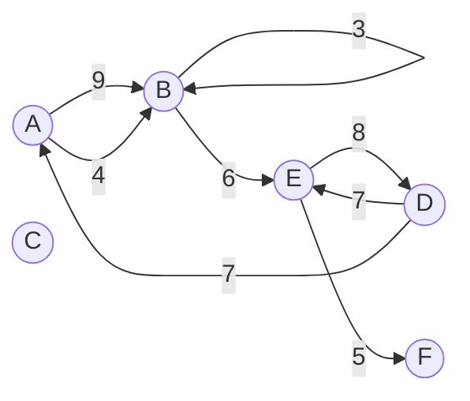
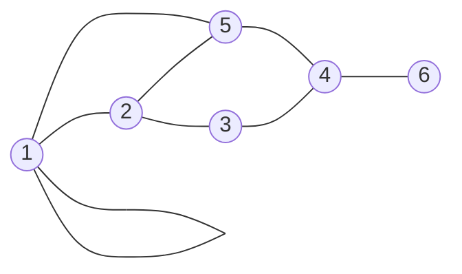
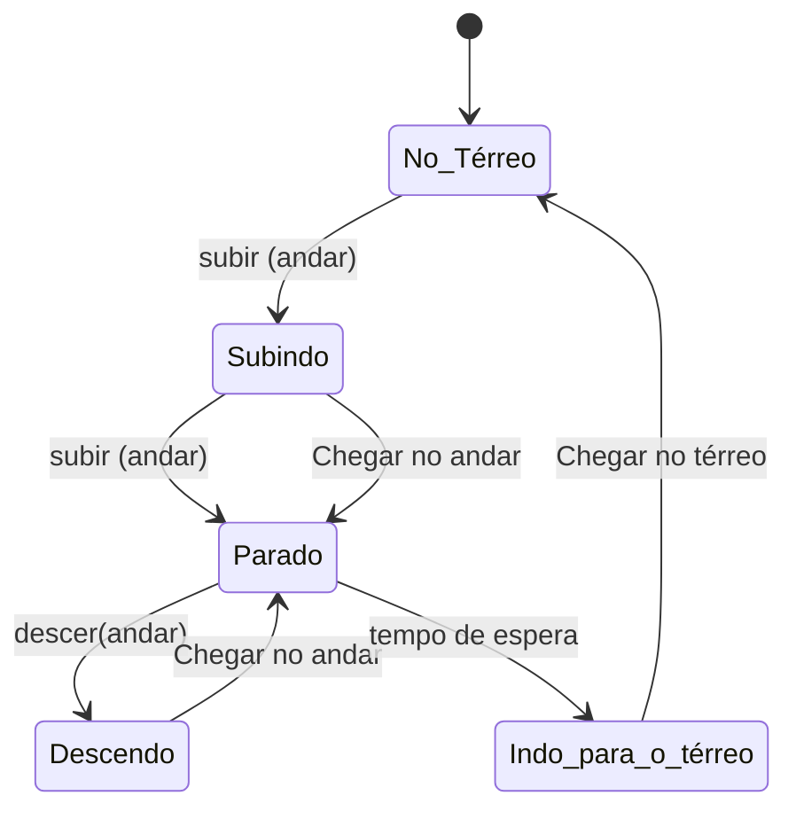
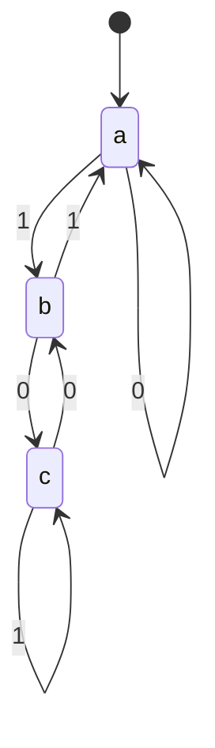
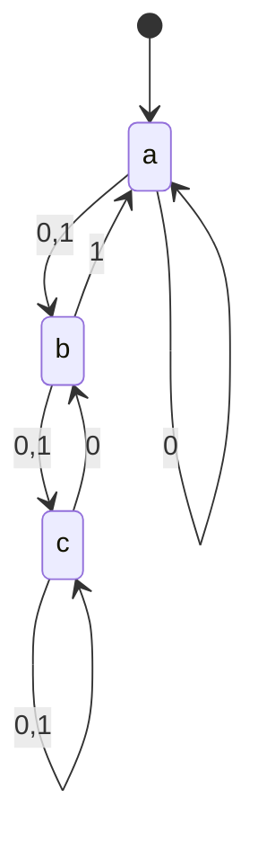
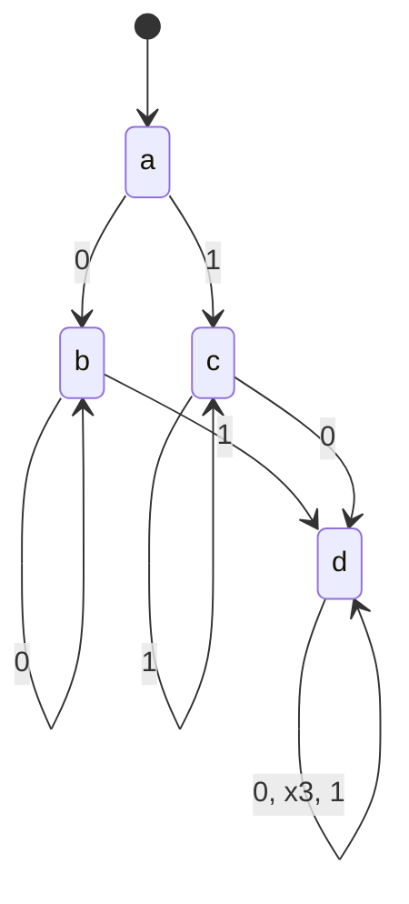
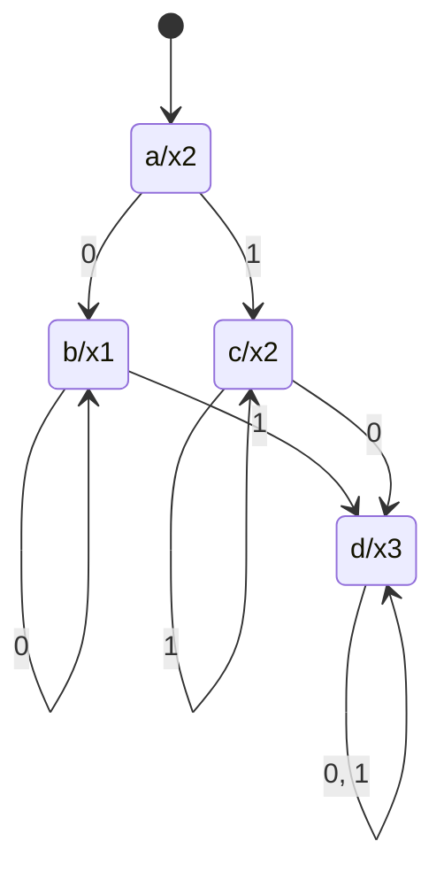

## 1 Sistemas de Numeração, Lógica e Aritmética Binária, Conversão de Base

### Sistemas de numeração

· Sistema de numeração decimal: posicional

N = {0,1,2,3,4,5,6,7,8,9}

$\beta =10$

A posição do símbolo no número refere-se ao expoente da base do sistema. Ex: $(153)_{10}=153=(1\times10^2)+(5\times10^1)+(3\times10^0)$

· Sistema de numeração octal

N = {0,1,2,3,4,5,6,7}

$\beta =8$

Ex: $(153)_8= (107)_{10} = (1\times8^2)+(5\times8^1)+(3\times8^0)$

· Sistema de numeração hexadecimal

N = {0,1,2,3,4,5,6,7,8,9,A,B,C,D,E,F}

$\beta =16$

Ex: $(153)_{16}=(339)_{10}=(1\times16^2)+(5\times16^1)+(3\times16^0)$

· Sistema de numeração binário

N = {0,1}

$\beta =2$

Ex: $(1001 1001)_2= (153)_{10}$

### Conversão entre sistemas

$(abc,de)_\beta=(a\beta^2+b\beta^1+c\beta^0+d\beta^{-1}+e\beta^{-2})_{10}$

Para convertermos um valor expresso no sistema decimal (base 10) para um sistema de base β fazemos divisões sucessivas do número na base 10 pela base β, até que o quociente seja menor que β. Isto se aplica à conversão da parte inteira do valor. Já para o valor fracionário devemos fazer multiplicações sucessivas pela base β até obtermos um valor exclusivamente inteiro. Ao efetuarmos cada multiplicação devemos descartar a parte inteira da multiplicação anterior.

   {: width="100" height="100" }

$(0,828125)_{10}=(?)_2$
$0,828125\times2=\textbf{1},65625$
$0,65625\times2=\textbf{1},3125$
$0,3125\times2=\textbf{0},625$
$0,625\times2=\textbf{1},25$
$0,25\times2=\textbf{0},50$
$0,50\times2=\textbf{1}$
$(0,828125)_{10}=(0,110101)_2$

Uma opção para fazer a conversão entre sistemas é a substituição direta, que é possível nos casos da conversão dos sistemas hexadecimal e octal para binário, ou vice-versa. Isso porque as bases destes sistemas, 16 e 8, são potências de 2.

**Três dígitos binários para cada dígito octal, já que 23 = 8**

**Quatro dígitos binários para cada digito hexadecimal, já que 24 = 16**

   {: width="100" height="100" }

### Erros de conversão

1\. Os erros de precisão, que ocorrem em função da quantidade insuficiente de dígitos para representar o valor. Nos sistemas de computação digital o número de dígitos binários usados para representar os números é geralmente pré-definido e limitado: caso haja a necessidade de representar um valor com uma quantidade de dígitos maior que o limite, ocorrerá um erro de precisão. Esta ocorrência é típica das variáveis em programas de computador.

2\. Os erros de exatidão ocorrem quando há a aproximação, o arredondamento ou a ocorrência de dízimas periódicas. Neste caso, devido à limitação do número de dígitos ou da capacidade de cálculo, geralmente há uma interrupção inesperada da representação.

O limite de precisão resulta em truncamento, e afeta principalmente os cálculos com os números irracionais, com o número π (Pi). Em geral este número é representado com duas casas decimais, como 3,14, porém as calculadoras podem representá-lo com oito casas decimais (3,1415926), o que é razoável para maioria dos cálculos. Porém, em cálculos mais extensos é necessário usar uma maior precisão, tal como a representação do Pi com cinquenta e duas casas decimais

O erro absoluto é a diferença entre o valor real e a forma na qual foi expresso. Calculamos o erro absoluto pela seguinte fórmula: $EA_x=x-\overline{x}$ 

O erro relativo é a razão entre o erro absoluto EA e o valor real x, isto é: $ER_x=\frac{EA_x}{x}$

### Lógica binária

· NOT: "não" ou "negação" $\sim A$ ou $\overline{A}$

· AND: “e” & (Ampersand) ^

· OR: “ou” + v

· XOR: "ou exclusivo" $\oplus$

· SHIFT: “deslocamento”

A operação binária de deslocamento (ou rotação) de bits efetua a divisão ou multiplicação por 2 (e por seus múltiplos). Dado um número binário, ao deslocarmos os bits da direta para a esquerda em uma posição (operação representada pelo sinal <>), dividimos o valor por 2, com o resultado inteiro.

   {: width="100" height="100" }

### Aritmética Binária

A adição ou soma binária assemelha-se à soma decimal, incluindo a operação de “vai-um” – que aqui denominamos Carry Out, porém utilizando somente os dígitos do sistema de numeração binário (zero e um).

$0+0=0$

$0+1=1$

$1+0=1$

$1+1=0$ e "vai um" (*Carry Out*=1)

$1+1+1=1$ e "vai um" (*Carry Out*=1)

$0\times0=0$

$0\times1=0$

$1\times0=0$

$1\times1=1$

$0-0=0$

$0-1=1$ e "pede emprestado" 1 ao dígito da esquerda

$1-0=1$

$1-1=0$

O modelo da divisão binária segue o mesmo processo da divisão em decimal, operando inclusive com os mesmos componentes.

## 2 Estrutura de Dados, Ponto Flutuante, Grafos, Contagem

### Estruturas de dados

· Vetores: Os vetores têm seus elementos posicionados em sequência, e esses elementos são acessados usando-se uma chave, o índice do vetor. Os vetores integram os elementos de dados que são fundamentais para a resolução de problemas por meio da organização dos dados em programas de computador. Vetores também representam segmentos de reta na geometria – uma sequência de pontos que forma a reta, sendo dessa forma um elemento gráfico. Em ambientes de computação, os vetores fazem parte das estruturas de dados homogêneas, por conter somente dados de um único tipo.

· Matrizes: Em computação as matrizes são um tipo de arranjo de vetores com duas ou mais dimensões, cujos dados contêm características comuns. Esses dados são organizados sequencialmente e, tal como os vetores, acessados por meio da chave – ou índice – da matriz. As matrizes também fazem parte das estruturas de dados essenciais para o tratamento de problemas matemáticos em ambientes computacionais, especialmente os de computação gráfica. As matrizes também são um tipo de estrutura de dados homogêneas, ou, como já dissemos, um tipo de arranjo de vetores, em que cada vetor corresponde à uma dimensão da matriz. As aplicações de planilhas de dados, como o Microsoft Excel, por exemplo, são a representação mais típica das matrizes. Também os elementos de imagens, tais como os desenhos, as fotografias e os filmes, são compostos por matrizes multidimensionais. A tela do computador que você está usando neste momento é uma matriz visível, na qual cada minúsculo ponto (ou pixel) representa um elemento com várias dimensões, tais como cor, posição e intensidade luminosa (brilho/contraste).

· Conjuntos: Os conjuntos são agrupamentos ou coleções de objetos – denominados elementos ou membros do conjunto –, cujas características são comuns entre si. Os conjuntos são geralmente representados por uma letra maiúscula, e os seus elementos são expressos entre chaves. Podemos também representar os conjuntos em sua forma gráfica com o diagrama de Venn.

### Aritmética de ponto flutuante

Os computadores representam os números reais, com a Aritmética de Ponto Flutuante, formulada por F\[β, t, -p, p\], representando o sistema F do sistema de numeração de base β com a quantidade t de dígitos na mantissa – ou dígitos significativos, e limites de expoente de -p até p. Os números desse sistema são então expressos no seguinte formato:

± (0,𝒅𝟏𝒅𝟐 … 𝒅𝒕 )$β^e$

No qual:

β é a base do sistema de numeração com o qual o computador opera (geralmente 2, ou binária, para a computação digital);

d é um dos dígitos da mantissa, cuja quantidade máxima é definida por t;

e representa o expoente, cujo intervalo é definido por p, variando de -p até p.

Por exemplo: Dado o sistema de representação F\[10, 3, -5, 5\], que significa β = 10, t = 3 e e ∈ \[-5,5\], temos então:

O menor número, em valores absolutos (m), é 0,001 x 10-5 , ou seja, 10-8 ;

O maior número, em valores absolutos (M), é 0,999 x 105 , ou seja, 99900.

Se usarmos esse sistema para representar um dado número, como por exemplo N = 227,68 ou seja, N = 0,22768 x 103, será representado como 0,227 x 103 – caso a opção seja o truncamento ou corte – ou 0,228 x 103 , caso a opção seja o arredondamento.

Tabela - A precisão numérica definida pela norma IEEE 754

| Propriedade      |         Precisão          |          Precisão          |          Precisão           |
| ---------------- | :-----------------------: | :------------------------: | :-------------------------: |
| Propriedade      |          Simples          |           Dupla            |          Estendida          |
| Total de bits    |            32             |             64             |             80              |
| Bits da mantissa |            23             |             52             |             64              |
| Bits do expoente |             8             |             11             |             15              |
| Base             |             2             |             2              |              2              |
| Exp. Máximo      |            127            |            1023            |            16383            |
| Exp. Mínimo      |           -126            |           -1022            |           -16382            |
| Maior nº         | $\cong3,40\times10^{38}$  | $\cong1,80\times10^{308}$  | $\cong1,19\times10^{4932}$  |
| Menor nº         | $\cong1,18\times10^{-38}$ | $\cong2,23\times10^{-308}$ | $\cong3,36\times10^{-4932}$ |
| Decimais         |             7             |             16             |             20              |

   {: width="100" height="100" }

· Adição e subtração: 1. Comparamos a magnitude dos expoentes dos operadores e nivelamos esses expoentes, ajustando o do número de menor valor (alinhamento); 2. Realizamos a operação (adição ou subtração); 3. Ajustamos a mantissa e o expoente do número resultante (normalização).

· Multiplicação: multiplicam-se as bases e somam-se os expoentes. Nesse caso, a base é a mantissa.

· Divisão: dividem-se as bases e subtraem-se os expoentes, lembrado que a base é a mantissa.

### Erros

Temos erros de precisão, decorrentes da limitação de dígitos usados para representar os valores – o número de dígitos é geralmente pré-definido em decorrência da utilização do sistema binário e da constituição do hardware. Este tipo de erro é comum em programação, no caso das variáveis utilizadas nos programas de computador. Por outro lado, a aproximação, o arredondamento ou a ocorrência de dízimas periódicas geram os erros de exatidão, devido à interrupção abrupta ou forçada da representação.

Nos ambientes computacionais, as operações com ponto flutuante podem resultar em interrupção do processamento, o que não é algo esperado. Essas operações são decorrentes basicamente de cinco tipos de operações – ou exceções:

1\. O overflow é um resultado apresentado quando é gerado um resultado infinito ou muito além da capacidade de representação do sistema.

2\. O underflow ocorre quando é obtido um resultado zero após um arredondamento de um valor diferente de zero, ou seja, um valor muito menor do que a capacidade de representação do sistema.

3\. A divisão por zero geralmente é o resultado de um cálculo com um underflow ou valor pouco significativo para o sistema. Uma divisão por zero não possibilita qualquer solução matemática.

4\. Um resultado inexato, apesar de ser algo que pode acontecer com relativa frequência, pode resultar tanto de um cálculo que gere overflow quanto de arredondamentos. Geralmente, essas ocorrências não geram uma interrupção do processo, porém podem, caso façam parte de um processo recorrente ou recursivo, se transformar em algo mais crítico, e por isso pode ser tratado como uma exceção.

5\. Um número inválido é o resultado de uma operação que não pode ser considerado um número, conhecido pela sigla em inglês NaN – Not a Number, como por exemplo a raiz quadrada de um número negativo, uma divisão de zero por zero ou de infinito por infinito.

O cancelamento catastrófico é o nome que se dá ao efeito que ocorre quando um cálculo atinge o épsilon ε do sistema computacional. O épsilon do sistema é o menor número que, somado a 1, resulta em um número diferente de 1; ou seja, não é arredondado. O épsilon representa a precisão aritmética relativa da máquina, e é consequência da precisão finita da aritmética de ponto flutuante.

### Elementos matemáticos computacionais

· Grafos: A estrutura gráfica utilizada em matemática para apresentar as relações entre os elementos ou objetos de um conjunto é denominada grafo. Grafos são expressos na forma de equação como G (V,A), na qual são representados seus dois elementos: os vértices e as arestas. Os elementos do conjunto – ou componentes, objetos – são representados por círculos ou pontos e denominados vértices. Já as relações, ligações, dependências ou “caminhos” entre os vértices são representados por segmentos de reta ou linhas, as arestas.

· Os grafos que têm suas arestas direcionadas são denominados grafos orientados (ou ainda grafos dirigidos, direcionados ou dígrafos). Um vértice pode ser ligado a ele próprio, formando um laço ou loop. As arestas podem conter rótulos de identificação, de peso ou valor numérico. Um grafo G é um grafo dirigido G = (V, A), tal que V = {A, B, C, D, E, F, G} e A = {(A,B), (B,C), (B,D), (B,E), (C,E), (D,E), (E,F), (G,D)}. Neste exemplo, é possível identificar rotas ou fluxos entre os vértices, traçando caminhos entre eles.

   {: width="100" height="100" }

   {: width="100" height="100" }

A representação de um grafo finito com n vértices pode ser feita por uma matriz de adjacência. Essa matriz tem as dimensões definidas pelo número de vértices (n-por-n), e o valor na linha i e coluna j fornece o número de arestas que conectam o i-ésimo ao j-ésimo vértices.

Um Grafo dirigido rotulado:

Uma matriz de adjacência com o respectivo grafo:

$A=\begin{vmatrix}
 1  1  0  0  1  0\\
 1  0  1  0  1  0\\
 0  1  0  1  0  0\\
 0  0  1  0  1  1\\
 1  1  0  1  0  0\\
 0  0  0  1  0  0
\end{vmatrix}$ 

· Em um dígrafo, contemplamos os graus de saída (o número de arestas saindo de um vértice) e de entrada (o número de arestas entrando em um vértice);

· O grau de um vértice de um dígrafo é igual à soma dos graus de saída e de entrada.

· **Árvores:** Uma árvore é um grafo conexo, aquele no qual sempre existe uma aresta entre dois quaisquer de seus vértices, e que é também acíclico, isto é, não existem ciclos ou loops. As árvores correspondem a uma das mais importantes estruturas de dados não lineares da computação.

Com relação à definição de árvores, podemos afirmar que nem todo grafo é uma árvore, mas que toda árvore é um grafo. Além disso, é um grafo bipartido, isto é, apresenta pelo menos dois níveis. Toda árvore também é um grafo planar, que é representado em um plano, em apenas duas dimensões. Por outro lado, todo grafo conexo inclui ao menos uma árvore de extensão associada a si, composta de todos os seus vértices e de algumas de suas arestas.

Para considerarmos um grafo G com n vértices como uma árvore, devemos verificar se esse grafo: · É conexo, e há um único caminho entre dois vértices quaisquer; deixará de ser conexo se qualquer aresta for removida; · É acíclico, tem n – 1 arestas, e ao se incluir uma nova aresta fecha-se um novo ciclo.

Se um determinado vértice da árvore é escolhido como especial, a árvore é denominada enraizada, e o vértice escolhido é denominado raiz. Uma árvore livre é aquela que não tem raiz. O número máximo de arestas – ou ramos – em um vértice – ou elemento – é chamado de ordem ou grau, e a máxima sequência de vértices de grau um ou maior define a quantidade de níveis de uma árvore.

· Árvore binária: A árvore binária é o tipo de árvore que a computação mais utiliza, e é definida como um grafo acíclico, conexo, dirigido. Cada nó tem grau (ou ordem) menos ou igual a. Cada ramo da árvore é um vértice dirigido, sem peso, que chega ao próximo (sucessor ou filho) a partir do seu anterior (antecessor ou pai), formando uma hierarquia, e fazendo com que só exista um único caminho entre dois nós distintos.

Os percursos possíveis em uma árvore binária são a leitura em pré-ordem, em ordem e em pós-ordem. Em “pré-Ordem” (ou RED = raiz, esquerda, direita) é acessado um nó raiz, depois seu sucessor da esquerda e em seguida o da direita. No acesso “em ordem” (In-Order ou ERD = esquerda, raiz, direita) é acessada uma folhada esquerda, sua raiz (ou predecessor), e depois o nó da direita. Já no acesso em “pós-ordem” (ou EDR = esquerda, direita, raiz), o acesso inicia-se pelo nó da esquerda, desloca-se para o da direita e então segue à raiz deles. A Figura 14 apresenta uma árvore binária com o acesso em pré-ordem (RED): F,B,A,D,C,E,G,I,H. Nessa mesma árvore, podemos ter o acesso em pósordem (EDR): A,C,E,D,B,H,I,G,F ou em ordem (ERD): A,B,C,D,E,F,G,H,I.

   {: width="100" height="100" }

### Contagem

Existe um princípio, denominado princípio fundamental da contagem, ou também princípio multiplicativo, que estabelece o seguinte: “quando um evento é composto por n etapas sucessivas e independentes, de tal modo que as possibilidades da primeira etapa é x e as possibilidades da segunda etapa é y, resulta no número total de possibilidades de o evento ocorrer, dado pelo produto (x) . (y)”

· Arranjo: Os arranjos são subconjuntos nos quais a ordem e a natureza fazem a diferença. Considerando um conjunto de n elementos, organizados em subconjuntos de p elementos, sendo p ≤ n, utilizamos a seguinte fórmula para o arranjo: $A_{n,p}=\frac{n!}{(n-p)!}$

**Permutação:** A permutação nada mais é do que um caso específico de arranjo, no qual o número de elementos do conjunto (n) é igual ao número total de elementos. Isso resulta em que o denominador, na fórmula do arranjo, seja igual a uma unidade (1). A consequência é que a permutação é representada pela seguinte fórmula: $P_n=n!$

**Combinação:** Diferentemente dos arranjos, as combinações são subconjuntos para os quais a ordem dos elementos não importa, porém, a sua natureza, sim. Deste modo, para obtermos uma combinação simples de n elementos combinados p a p, sendo ($p\le n$), recorremos à seguinte fórmula: $C_{n,p}=\frac{n!}{p!(n-p)!}$

## 3 Probabilidade

Denomina-se probabilidade o processo pelo qual conseguimos estimar as chances de ocorrência de determinado fato determinado ou evento. É também a denominação de um ramo ou área da matemática que usa modelos para o estudo de experimentos ou ocorrências dos fenômenos ditos aleatórios. Estes eventos são aqueles nos quais há incerteza no que se refere às possibilidades de ocorrerem, ou seja, são prováveis ou improváveis.

O conjunto de resultados possíveis é denominado Espaço Amostral, e é representado pela letra S ou por Ω, a letra grega ômega.

Quando todos os elementos têm a mesma chance de ocorrência, são denominados equiprováveis.

### Eventos

· Denominamos Evento qualquer elemento ou subconjunto, mesmo um unitário – que faz parte do espaço amostral.

Caso um evento coincida com a totalidade do espaço amostral, é chamado de evento certo, e o oposto, que resulta em um conjunto vazio, é dito evento impossível. Quando dois eventos não podem ocorrer de modo simultâneo, ou quando a ocorrência de um elimina a possibilidade da ocorrência de outro, então são chamados de eventos mutuamente exclusivos.

· Eventos complementares, isto é, a união deles resulta no espaço amostral e a interseção resulta em um conjunto vazio.

· Eventos mutuamente exclusivos: quando interseção de dois eventos resulta em um conjunto vazio isto significa que a ocorrência de um implica na impossibilidade da ocorrência do outro. $P(A)=\frac{n(A)}{n(S)}$

Dois eventos são ditos independentes quando a ocorrência ou a não ocorrência de um deles não influi na probabilidade da ocorrência do outro, e vice-versa.

União de eventos: $n(A\cup B)=n(A)+n(B)-n(A\cap B)$

Probabilidade de eventos complementares: $A\cup\overline{A}=S; A\cap\overline{A}=\emptyset$

## 4 Modelagem Matemática, Máquinas de Estado, Autômatos, Máquinas de Mealy e Turing

### Máquina de estados

· As máquinas de estado são uma forma matemática de abstrair processos ou o funcionamento de equipamentos reais, sejam eletrônicos ou mecânicos, e ainda dos softwares. Em outras palavras, as máquinas de estado são um modelo matemático de sistemas que possuem entradas e saídas discretas e a capacidade de representar, em um certo momento, um estado preestabelecido.

· As máquinas de estado também são chamadas autômatos, ou máquinas de estado finito (FSM – Finite State Machine, em inglês). Apesar de possuir a capacidade de representar múltiplos estados, uma FSM só pode apresentar-se em um estado por vez, denominado estado atual, sendo esta é principal característica de uma máquina de estados.

· Uma FSM pode ser representada por uma quíntupla (Q, ∑, δ, q0, F):

a. Q é um conjunto finito de estados;

b. ∑ é conjunto finito de símbolos, chamado de alfabeto da FSM;

c. δ é a função de transição, na qual δ: Q × ∑ → Q;

d. q0 é o estado inicial no qual qualquer entrada é processada (q0 ∈ Q);

e. F é um conjunto de estado/estados finais de Q (F ⊆ Q).

· A terminologia aplicada às FSM inclui os seguintes termos:

a. Alfabeto é um conjunto finito de símbolos. Por exemplo: ∑ = {a, b, c, d} é um conjunto do alfabeto no qual ‘a’, ‘b’, ‘c’, e ‘d’ são símbolos.

b. String é uma sequência finita de símbolos obtidos de ∑. Por exemplo, a string ‘cabcad’ é uma string válida do conjunto do alfabeto ∑ = {a, b, c, d}.

c. Comprimento de uma string é o número de elementos presentes na string, denotado por |S|. Por exemplo, se S = ‘cabcad’, |S|= 6. Se |S|= 0, então a string é chamada string vazia, denotada por λ or ε).

d. Fecho de Kleene ou Operador de Kleene, ∑\*, é um operador unário ou um conjunto de símbolos ou strings ∑, dado um infinito conjunto de todas as possíveis strings de todos os possíveis comprimentos sobre ∑ incluindo λ. A representação: ∑\* = ∑0 ∪ ∑1 ∪ ∑2 ∪……. ∑p é o conjunto de todas as strings possíveis de comprimento p. Por exemplo, se ∑ = {a, b}, ∑\* = {λ, a, b, aa, ab, ba, bb, ………..}.

e. Fecho de Kleene / Mais, ∑+ é um conjunto infinito de possíveis strings de todos os possíveis comprimentos sobre ∑ excluindo λ. A representação é: ∑+ = ∑1 ∪ ∑2 ∪ ∑3 ∪……. ∑+ = ∑\* − { λ }. Por exemplo, se ∑ = { a, b }, então ∑+ = { a, b, aa, ab, ba, bb, ………..}.

f. Linguagem é um subconjunto de ∑\* para algum alfabeto ∑, que pode ser finito ou infinito. Por exemplo, se a linguagem L compreende todas as strings possíveis de comprimento 2 sobre ∑ = {a, b}, então L = { ab, aa, ba, bb}.

· A base do funcionamento de uma FSM é justamente isso: considerar que um estado armazena informações sobre as etapas anteriores, isto é, o passado do processo. Além disso, o estado reflete as mudanças ocorridas desde a entrada neste estado até o momento presente. Uma mudança de estado - geralmente descrita ou especificada por uma condição que precisa ser atendida ou ocorrer – refere-se à uma transição. Uma ação refere-se à uma atividade a ser realizada para gerar a transição, ou mesmo à uma atividade que ocorre em função de uma transição.

· Um diagrama de estado é a forma gráfica que utilizamos para representar o funcionamento de uma máquina de estado. As tabelas de transição de estado também podem representar as FSM - máquinas de estado.

Tabela de Transição de Estados:

| Condição | Estado A | Estado B | Estado C |
| -------- | -------- | -------- | -------- |
| 1        | ...      | ...      | ...      |
| 2        | ...      | Estado C | ...      |
| 3        | ...      | ...      | ...      |

· As máquinas de estado podem ser de dois tipos: as do tipo aceitadoras (ou reconhecedoras), que produzem uma saída binária, restrita a sim ou não, para informar se a entrada é aceita pela máquina ou não, e as do tipos transdutoras que produzem uma informação na saída baseada em um estímulo ou informação de entrada e/ou um estado utilizando ações, e que geralmente são utilizadas para aplicações de controle.

· Máquina de Estado Finito M = \[E, I, O, fE, fO\] é uma máquina de estado finito se E é um conjunto finito de estados, I é um conjunto finito de símbolos de entrada (o alfabeto de entrada), O é um conjunto finito de símbolos de saída (o alfabeto de saída) e fE, fO são funções, onde: fE: E x I →E e fO : E → O A máquina sempre começa inicializada por um estado inicial fixo e0 .

· os exemplos utilizados até aqui tratam de um tipo de FSM que denominamos AFD – Autômato Finito Determinístico, ou seja, uma estrutura matemática constituída por três tipos de elementos: um conjunto de estados, um alfabeto (com os símbolos reconhecidos como entrada e saída) e um conjunto de transições. Entre os estados destacamos um único estado inicial e um subconjunto composto dos estados finais.

· Ex: Q = {a, b, c}; ∑ = {0, 1}; q0 = {a}; F = {c}.

| Estado atual | Próximo estado para uma entrada 0 | Próximo estado para uma entrada 1 |
| :----------: | :-------------------------------: | :-------------------------------: |
|      a       |                 a                 |                 b                 |
|      b       |                 c                 |                 a                 |
|      c       |                 b                 |                 c                 |

· Em um AFD, para cada par (estado, símbolo) há uma transição para um único estado, o que confere um caráter determinístico ao funcionamento deste autômato. Caso eliminemos essa restrição, ou seja, se para um determinado par (estado, símbolo) for possível haver transições para dois ou mais estados, passamos a denominar a FSM como AFN – Autômato Finito não Determinístico. Ou seja, em um AFN é possível haver um conjunto com várias operações possíveis para a mesma palavra ou símbolo de entrada em um estado. Os componentes de um AFN são basicamente os mesmos de um AFD, porém um AFN contempla as seguintes definições:

a. Um AFN pode ter mais que um estado inicial;

b. A função de transição apresenta, para cada par (estado, símbolo), um conjunto de estados.

· Um AFN - Autômato Finito Não-Determinístico é representado por uma quíntupla (Q, ∑, δ, q0, F), na qual:

a. Q é um conjunto finito de estados;

b. ∑ é um conjunto finito de símbolos chamado alfabeto;

c. δ é a função de transição, na qual δ: Q × ∑ → 2 Q (2 elevado a Q deve-se ao fato de que a transição de um estado pode para qualquer combinação de Q);

d. q0 é o estado inicial a partir do qual qualquer entrada é processada (q0 ∈ Q);

e. F é um conjunto de estado/estados finais de Q (F ⊆ Q).

· Ex: Q = {a, b, c}; ∑ = {0, 1}; q0 = {a}; F = {c};

| Estado atual | Próximo estado para uma entrada 0 | Próximo estado para uma entrada 1 |
| :----------: | :-------------------------------: | :-------------------------------: |
|      a       |                a,b                |                 b                 |
|      b       |                 c                 |                a,c                |
|      c       |                b,b                |                 c                 |

· Comparativo entre AFD e AFN

| AFD                                                          | AFN                                                          |
| ------------------------------------------------------------ | ------------------------------------------------------------ |
| A transição de um estado ocorre para um único estado próximo particular, para cada símbolo de entrada. Por isso, é chamado determinístico. | A transição de um estado pode ocorrer para vários estados seguintes, para cada símbolo de entrada. Por isso, é chamado de não-determinístico. |
| Transições de strings vazias não existem.                    | Transições de strings vazias podem ocorrer.                  |
| O retrocesso é permitido.                                    | O retrocesso nem sempre é possível.                          |
| Requer mais espaço.                                          | Requer menos espaço.                                         |
| Uma string é aceita se passar para um estado final.          | Uma string é aceita se pelo menos uma das transições possíveis terminar em um estado final. |

· Um AFD pode ser representado pela arquitetura mostrada na figura: uma máquina que opera com uma leitura sequencial – em uma fita – e em apenas uma direção: para a direita. Esta fita contém os símbolos distribuídos em células, sendo um único símbolo em cada célula. A máquina também tem um registrador para armazenar o estado atual, um conjunto de instruções – a função de transição do AFD – e uma unidade de controle. É possível também que se possa fazer a leitura bidirecional da fita, permitindo que a transição possa avançar ou retroceder na leitura dos símbolos. Nesse caso, para evitar que a leitura avança para além do final, ou retroceda para antes do começo, é necessário que existam mais duas células com símbolos especiais < e >, que, na prática, limitam as transições.

   {: width="100" height="100" }

   {: width="100" height="100" }

### Autômatos de pilha

Apesar da sua extensa aplicação, as máquinas de estado finito – FSM, ou autômatos finitos, não atendem à totalidade dos problemas. É o caso, por exemplo, de aplicações para as quais é necessário usar expressões aritméticas. Nesses casos, falta aos autômatos uma memória que permita registrar todos os valores – ou as ocorrências dos símbolos. Para atender à essa necessidade são utilizados os AP – Autômatos de Pilha (pushdown automata, em inglês).

   {: width="100" height="100" }

· Diferentemente dos autômatos finitos, um autômato de pilha não determinístico tem uma abrangência muito superior a dos AP determinísticos. Um autômato de pilha é uma máquina de estados bastante semelhante à um AFD, porém com o adicional de uma pilha.

· A pilha, tal como uma fita, compõe-se de células que são capazes de receber apenas um símbolo por vez. A leitura, porém, é feita apenas na célula do topo da pilha. No início do processo, o registrador contém o estado inicial do AP. A fita então recebe a palavra de entrada da sua primeira célula, pois o cabeçote de leitura está posicionado na primeira célula da fita. Neste momento, a pilha está vazia. À medida em que a leitura da fita prossegue e as transições resultam em um uso da pilha, um símbolo de fim de pilha (F) é inserido na pilha, de modo a identificar esse status novamente quando a pilha for lida.

· A principal diferença entre um APD – Autômato de Pilha Determinístico e um APN – Autômato de Pilha Não-Determinístico reside no fato de que o APN pode contemplar transições compatíveis entre si.

### Máquina de Mealy

· Uma máquina de Mealy é uma FSM cuja saída depende do estado atual, bem como da entrada. Pode ser descrita por uma sêxtupla (Q, ∑, O, δ, X, q0) em que:

a. Q: conjunto finito de estados;

b. ∑: conjunto finito de símbolos denominado alfabeto de entrada;

c. O: conjunto finito de símbolos denominado alfabeto de saída;

d. δ: função de entrada de transição em que δ: Q × ∑ → Q;

e. X: função de saída da transição em que X: Q × ∑ → O;

f. q0: estado inicial a partir do qual qualquer entrada é processada (q0 ∈ Q).

| Próximo estado$\rightarrow$ | Entrada=0 | Entrada=0 | Entrada=1 | Entrada=1 |
| :-------------------------: | :-------: | :-------: | :-------: | :-------: |
|  Estado atual$\downarrow$   |  Estado   |   Saída   |  Estado   |   Saída   |
|             ->a             |     b     |    x1     |     c     |    x1     |
|              b              |     b     |    x2     |     d     |    x3     |
|              c              |     d     |    x3     |     c     |    x1     |
|              d              |     d     |    x3     |     d     |    x2     |

### Máquina de Moore

· Uma máquina de Moore é uma FSM cujas saídas dependem apenas do estado atual. Pode ser descrita por uma sêxtupla (Q, ∑, O, δ, X, q0) em que:

a. Q: conjunto finito de estados;

b. ∑: conjunto finito de símbolos denominado alfabeto de entrada;

c. O: conjunto finito de símbolos denominado alfabeto de saída;

d. δ: função de entrada de transição em que δ: Q × ∑ → Q;

e. X: função de saída da transição em que X: Q → O;

f. q0: estado inicial a partir do qual qualquer entrada é processada (q0 ∈ Q).

| Estado atual | Entrada=0 | Entrada=1 | Saída |
| :----------: | :-------: | :-------: | :---: |
|     ->a      |     b     |     c     |  x2   |
|      b       |     b     |     d     |  x1   |
|      c       |     c     |     d     |  x2   |
|      d       |     d     |     d     |  x3   |

### Máquina de Turing

· A Máquina de Turing é um dispositivo inventado em 1936 por Alan Turing, matemático inglês, que aceita as linguagens (conjunto recursivamente enumerável) geradas por gramáticas tipo 0. Uma máquina de Turing é um modelo matemático que consiste em uma fita de comprimento infinito, dividida em células, pelas quais a entrada é dada, e de uma cabeça de leitura que lê a fita de entrada. Um registrador de estado armazena o estado da máquina de Turing. Depois de ler um símbolo de entrada, este é substituído por outro símbolo, o estado interno da máquina é alterado, e a cabeça de leitura se move uma célula, para a direita ou para a esquerda. Se a máquina atingir o estado final, a string de entrada será aceita; caso contrário, será rejeitada.

· Uma máquina de Turing pode ser formalmente descrita com uma sétupla (Q, X, ∑, δ, q0, B, F), em que:

a. Q é um conjunto finito de estados;

b. X é o alfabeto da fita;

c. ∑ é o alfabeto de entrada

d. δ é a função de transição δ: Q × X → Q × X × {deslocamento à esquerda, deslocamento à direita}.

e. q0 é o estado inicial;

f. B é o símbolo de ‘Espaço em Branco’;

g. F é o conjunto de estados finais.

· Comparação:

|  Tipo de Máquina  |       Estrutura de Pilha de Dados       | Determinística? |
| :---------------: | :-------------------------------------: | :-------------: |
| Autômatos Finitos |                   N/A                   |       Sim       |
| Autômato de Pilha | Último a entrar, primeiro a sair (LIFO) |       Não       |
| Máquina de Turing |              Fita infinita              |       Sim       |

· Ex: Q = {q0, q1, q2, qf}; X = {a, b}; ∑ = {1}; q0 = {q0}; B = espaço em branco; F = {qf}

| Símbolo do Alfabeto da Fita | Estado atual '$q_0$' | Estado atual '$q_1$' | Estado atual '$q_2$' |
| :-------------------------: | :------------------: | :------------------: | :------------------: |
|              a              |       $1Rq_1$        |       $1Lq_0$        |       $1Lq_f$        |
|              b              |       $1Lq_2$        |       $1Rq_1$        |       $1Rq_f$        |

· A complexidade do tempo pode ser representada por T (n) = O 16 (n log n). A complexidade do espaço da máquina de Turing pode ser representada por S (n) = O (n).

· Quanto à linguagem, uma máquina de Turing aceita uma linguagem se entrar em um estado final para qualquer string de entrada escrita. Uma linguagem é dita recursivamente enumerável (gerada pela gramática Tipo 0) se for aceita por uma máquina de Turing. Uma MT decide por uma linguagem se o aceita e entra em um estado de rejeição para qualquer entrada que não esteja nessa linguagem. Uma linguagem é recursiva se for decidida por uma máquina de Turing. Podem haver alguns casos em que uma máquina de Turing não para. Então essa máquina de Turing aceita a linguagem, mas não a decide.

## 5 Criptografia

### Introdução à Criptografia

· Criptografia é a ciência de transformar a informação para restringi-la, de forma que possa ser armazenada e transportada de maneira segura, e, assim, torne-se imune a modificações e acesso indevido. Forouzan (2008) acrescenta que “a criptografia também pode ser usada para autenticação do emissor e do receptor da mensagem entre si”, ou seja, quando emissores e receptores precisam de reconhecimento mútuo.

· A criptografia é uma ciência que pertence ao domínio da Matemática, destinada ao estudo de técnicas e princípios de transformação da informação de sua forma original para outra, ininteligível, de forma que possa ser conhecida e utilizada apenas quando autorizado. Esse processo de transformação da informação em seu estado original, chamado de texto plano (plain text), para um formato protegido pela ocultação de seu significado, chamado de texto cifrado ou codificado, é denominado cifragem (ou também criptografia, encriptação). O processo oposto é denominado decifragem (ou descriptografia, descriptação). Quando é feito à revelia dos interessados ou proprietários da informação – de forma maliciosa ou não – é chamado de quebra da criptografia ou do código.

· A criptografia emprega os termos texto claro (ou texto plano), que se refere à mensagem original, não modificada pelo processo criptográfico. Já o texto cifrado é a mensagem submetida a um algoritmo criptográfico, isto é, o código ou o programa de computador que transforma o texto plano em texto cifrado. Esse algoritmo criptográfico é também chamado de cifra, e geralmente faz uso de uma chave, um valor numérico que será aplicado à mensagem para produzir uma modificação controlada e reversível. Uma chave pode ser usada para criptografar (cifrar) ou para descriptografar (decifrar).

· O processo de criptografia pode ser realizado por meio de dois tipos básicos de cifragem/decifragem: a criptografia simétrica, de chave única ou de chave secreta, e a criptografia assimétrica ou de chave pública. Na criptografia simétrica a mesma chave é utilizada para a cifragem e a decifragem da mensagem, e o algoritmo de cifragem e decifragem é o mesmo.

· Já na criptografia de chave assimétrica são utilizadas duas chaves no processo de cifragem/decifragem, a chave pública e a chave privada. A chave pública, usada para cifrar a mensagem, é compartilhada com os possíveis emissores de mensagem para o receptor, que guarda consigo a chave privada para decifrar a mensagem recebida. Essas chaves são diferentes entre si.

### Criptografia Simétrica

· Os algoritmos utilizados para a criptografia simétrica apresentam desempenho muito superior, razão pela qual são preferidos em processos de criptografia de bloco e de fluxo.

· Data Encryption Standard (DES), criado pela IBM em 1974. Mais tarde ele evoluiu para o 3DES ou Triple DES. O algoritmo RC4, desenvolvido por Ronald Rivest, é utilizado no SSL e é um dos mais empregados na criptografia de fluxo de dados. Já o RC5, do mesmo autor, é empregado para cifragem de blocos de extrema facilidade. Ambos têm a chave de tamanho fixo.

· O Blowfish é um algoritmo de criptografia de blocos com chave de tamanho variável, desenvolvido em 1993 por Bruce Schneier. O International Data Encryption Algorithm (IDEA) foi criado em 1991 por James Massey e Xuejia Lai. É também um algoritmo de bloco semelhante ao DES e de fácil implementação.

· O algoritmo Advanced Encryption Standard (AES) é um algoritmo de criptografia de bloco padronizado pelo NIST em 2001. É usado pelo governo dos Estados Unidos em substituição ao DES/3DES, sendo um dos mais populares algoritmos da atualidade, por combinar características de segurança, desempenho, facilidade de implementação e flexibilidade.

· As cifras simétricas são utilizadas desde os primórdios da história, quando a humanidade passou a utilizar a comunicação escrita, e continuam populares. Essas cifras compreendem as cifras de substituição e as cifras de transposição.

· Nas cifras de substituição um símbolo da mensagem – uma letra, sinal ou número – é substituído por um outro símbolo. Na cifragem monoalfabética essa troca é constante, ou seja, em qualquer posição da mensagem acontece a mesma troca. A chave criptográfica, nesse caso, contempla uma simples tabela de equivalência, que é usada em ambos os processos – cifragem e decifragem.

· Já em uma cifra polialfabética a substituição de símbolos é variável, sendo um mesmo símbolo substituído por vários outros no decorrer da cifragem, configurando uma relação de um-para-muitos. Nesse caso a chave e o processo de cifragem devem tratar das possibilidades de substituição. Uma forma de fazer isso é a divisão do texto em blocos de tamanho fixo, e a repetição da chave para completar o tamanho desses blocos.

· Cifras de transposição: Nesse processo a chave é uma relação entre as posições dos símbolos no texto plano e no texto cifrado. A cifragem consiste em uma transposição com base em uma tabela DePara, na qual a chave numérica representa as posições dos símbolos e a sequência na qual serão transpostas.

· Cifras modernas simples:

a. XOR: A cifra XOR é um processo que aplica a operação aritmética lógica OuExclusivo (XOR), comparando os bits do texto plano com os da chave para gerar o texto cifrado. Além da elevada velocidade, por tratar-se de uma operação muito simples, essa cifra tem a vantagem de que o processo de cifragem e decifragem é exatamente o mesmo, ou seja: M Ꚛ K = C tanto quanto C Ꚛ K = M.

b. Rotação: Na cifra de rotação os bits de um símbolo ou bloco são deslocados para a esquerda ou para a direita. Esse processo pode ser fixo, com o número de posições do deslocamento sendo constante, ou variável, em função do valor da chave. Uma característica interessante desse processo é que, se aplicarmos um deslocamento idêntico ao número de bits do fluxo de entrada (N), o resultado é inócuo. Portanto o número de deslocamentos deve ficar entre 1 e N-1. Para a decifragem, é necessária a chave, se houver, e uma operação de deslocamento no sentido contrário ao da cifragem.

c. Substituição S-Box: Esse processo é semelhante à cifra de substituição de símbolos ou caracteres, porém realizado com bits. Não são utilizadas chaves, e o processo geralmente serve como um estágio intermediário para outros tipos de cifragens mais complexas.

d. Transposição P-Box: A caixa de permutação (Permutation Box) é a correspondente, para bits, da cifra de transposição. Geralmente implementado por hardware, por ser mais ágil, esse processo não requer chave, e realiza a permutação direta, por expansão ou por compressão.

· Cifras modernas cíclicas: O uso da computação na aplicação de cifragem possibilitou o surgimento de cifras complexas, nas quais o processo de cifragem simples é repetido inúmeras vezes, usando toda a chave, partes ou variações dela de forma cíclica, até produzir o resultado cifrado.

a. DES: O Data Encryption Standard (DES), ou Padrão de Criptografia de Dados, é uma cifra de bloco de chave simétrica publicada pelo Instituto Nacional de Padrões e Tecnologia (NIST). O DES é uma implementação de uma Cifra Feistelque utiliza 16 ciclos da estrutura de Feistel. O tamanho do bloco de dados a ser criptografado é de 64 bits. Embora o tamanho da chave seja de 64 bits, o DES usa um comprimento de chave efetivo de 56 bits, pois 8 dos 64 bits da chave não são usados pelo algoritmo de criptografia, e funcionam apenas como bits de verificação. O DES satisfaz ambas as propriedades desejadas da cifra de bloco. Duas propriedades tornam a cifra muito forte: o efeito avalanche – uma pequena mudança no texto simples resulta na grande mudança no texto cifrado; e a completude – cada bit de texto cifrado depende de muitos bits de texto simples. A criptoanálise já encontrou alguns pontos fracos no DES, especialmente quanto ao tamanho da chave, considerada muito curta.

   {: width="100" height="100" }

a. 3DES (Triple DES) : existem duas variantes do Triple DES, conhecidas como 3- chave Triple DES (3TDES) e 2-chave Triple DES (2TDES).

   {: width="100" height="100" }

a. AES: O algoritmo de criptografia simétrica mais popular e mais adotado atualmente é o Advanced Encryption Standard (AES) – Padrão Avançado de Criptografia, cujo desempenho é cerca de seis vezes mais rápido que o do 3DES. Com o aumento do poder de computação, um substituto para o DES tornou-se necessário, pois a chave do DES era muito pequena, o que o tornava vulnerável a ataques de busca de chave exaustivos. O 3DES foi projetado para superar essa desvantagem, mas foi considerado lento. Então, em função de uma solicitação do governo americano, foi desenvolvido o AES, cujas características principais são as seguintes: · Chave simétrica de bloco simétrico; · Dados de 128 bits, chaves de 128/192/256 bits; · Mais forte e mais rápido que o 3DES; · Fornece detalhes completos de especificação e design; · Software implementável em C e Java.

b. O algoritmo AES é uma cifra iterativa que, em vez de Feistel, baseia-se na "rede de substituição-permutação". É composto por uma série de operações vinculadas, algumas das quais envolvem a substituição de entradas por saídas específicas (substituições) e outras envolvem a divisão aleatória de bits (permutações). Porém, o AES executa todos os seus cálculos em bytes, em vez de bits. O AES trata os 128 bits de um bloco de texto simples como 16 bytes. Esses 16 bytes são organizados em quatro colunas e quatro linhas para processamento como uma matriz.

c. Ao contrário do DES, o número de rodadas no AES é variável e depende do tamanho da chave. O AES usa 10 rodadas para chaves de 128 bits, 12 rodadas para chaves de 192 bits e 14 rodadas para chaves de 256 bits. Cada uma dessas rodadas usa uma chave redonda de 128 bits diferente, que é calculada com base na chave AES original. O esquema da estrutura AES é mostrado abaixo.

   {: width="100" height="100" }

· Cifras de bloco: Uma cifra de bloco processa os blocos de dados de tamanho fixo. Geralmente o tamanho de uma mensagem é maior que o tamanho do bloco. Portanto, a mensagem longa é dividida em uma série de blocos de mensagens sequenciais, e a cifra opera nesses blocos, um de cada vez. As principais cifras de bloco são: · Livro de Código Eletrônico (ECB – Electronic Code Book); · Encadeamento de Blocos de Cifras (CBC - Cipher Block Chaining); · Codificação com feedback (CFB - Cipher Feedback); · Feedback de Saída (OFB - Output Feedback); · Contador (CTR - Counter).

### Criptografia assimétrica

1. Chaves diferentes são usadas para criptografia e descriptografia, propriedade que a diferencia da criptografia simétrica;

2. Cada receptor possui uma chave de descriptografia exclusiva, geralmente referida como sua chave privada;

3. O receptor precisa publicar uma chave de criptografia, conhecida como sua chave pública;

4. Alguma garantia da autenticidade de uma chave pública é necessária neste esquema para evitar a falsificação do adversário como receptor;

5. A criptografia assimétrica pode envolver terceiros confiáveis, que certificam que uma determinada chave pública pertence apenas a uma pessoa ou entidade específica;

6. O algoritmo de criptografia é complexo o suficiente para impedir que o invasor consiga produzir um texto simples com base no texto cifrado e a chave de criptografia (pública).

Embora as chaves pública e privada estejam relacionadas matematicamente, não é possível calcular a chave privada com base na chave pública. Na verdade, a parte inteligente de qualquer sistema criptográfico de chave pública está no projeto da relação entre as duas chaves.

· Criptografia RSA: A criptografia RSA é um dos primeiros sistemas criptográficos de chave pública e o mais empregado atualmente.

o Geração de par de chaves:

· Selecione dois primos grandes, p e q;

· Calcule n = p \* q. Para criptografia forte e inquebrável, deve ser um número grande, normalmente um mínimo de 512 bits.

· Encontre o Número Derivado (e): O número e deve ser maior que 1 e menor que (p - 1) (q - 1);

· Não deve haver nenhum fator comum para e e (p - 1) (q - 1), exceto para 1. Em outras palavras, dois números e e (p - 1) (q - 1) são primos;

· Forme a chave pública: O par de números (n, e) forma a chave pública RSA e é tornada público.

o Embora n seja parte da chave pública, a dificuldade em fatorar um grande número primo assegura que um atacante não encontre em tempo finito os dois primos (p & q) usados para obter n. Essa é a força do RSA. Para a geração da chave privada, eis os passos:

· A chave privada d é calculada com base em p, q e e. Para dado n e e, existe um número único d;

· O número d é o inverso de e módulo (p - 1)(q - 1). Isso significa que d é um número menor que (p - 1)(q - 1), tal que, quando multiplicado por e, é igual a 1 módulo (p - 1) (q - 1);

· Essa relação é escrita matematicamente da seguinte maneira: e . d = 1 mod (p - 1) (q - 1)

· O Algoritmo Euclidiano Estendido toma p, q e e como entrada e fornece d como saída.

o Cifragem RSA: Um emissor que deseje enviar uma mensagem de texto para alguém cuja chave pública seja (n, e) representa o texto simples como uma série de números menor que n. Para criptografar o primeiro texto simples P, que é um número módulo n, o processo de criptografia é simples, representado matematicamente como: C = Pe mod n Ou seja, o texto cifrado C é igual ao texto simples P multiplicado por si mesmo e vezes e depois reduzido ao módulo n. Isso significa que C também é um número menor que n.

o Decifragem RSA: O processo de descriptografia do RSA é igualmente simples. Considerando que o receptor, que gerou o par de chaves públicas (n, e), recebeu o texto cifrado C, basta então que eleve C à potência de sua chave privada d. O resultado no módulo n será o texto claro P, originalmente transmitido. Representando matematicamente: P = Cd mod n

o A segurança do RSA depende da complexidade de duas funções separadas. O sistema de criptografia RSA é o mais popular sistema criptográfico de chave pública, baseado na dificuldade prática de fatorar números primos muito grandes. Sua função de criptografia é considerada uma função unidirecional de conversão de texto simples em texto cifrado que pode ser revertida somente com o conhecimento da chave privada d. A geração da chave é baseada na dificuldade de determinar uma chave privada de uma chave pública RSA, o que é o equivalente a fatorar o módulo n. Portanto, não se pode usar o conhecimento de uma chave pública RSA para determinar uma chave privada RSA, a menos que se consiga fatorar n.

o Também é uma função unidirecional: passar dos valores de p e q para o módulo n é fácil, mas o inverso é praticamente impossível. Se qualquer uma dessas duas funções for provada não unidirecional, o RSA será quebrado. De fato, se uma técnica de fatoração eficiente for desenvolvida, o RSA não será mais seguro. A força da criptografia RSA é reduzida drasticamente se os números p e q não forem primos grandes, mas também se a chave pública escolhida e for um número pequeno.

· Criptografia ElGamal: Existem diversos modelos de criptografia baseados em diferentes versões do Problema do Logaritmo Discreto. O ElGamal, chamado de Variante de Curva Elíptica, é um deles, e a sua força vem do pressuposto de que os logaritmos discretos não podem ser encontrados em um período curto, para determinado número, ao passo que a operação inversa de potenciação pode ser calculada eficientemente.

o Geração do par de chaves ElGamal :

· Escolhe um grande primo p. Geralmente, um número primo de 1024 a 2048 bits de comprimento é escolhido;

· Escolhe um elemento gerador g. Esse número deve estar entre 1 e p - 1, mas não pode ser qualquer número: é um gerador do grupo de múltiplos inteiros de módulo p. Isto significa que para todo inteiro m co-primo para p, existe um inteiro k tal que g k = a mod n. Por exemplo, 3 é gerador do grupo 5 (Z5 = {1, 2, 3, 4}), como podemos ver na tabela a seguir:

| n    | $3^n$ | $3^n mod5$ |
| ---- | ----- | ---------- |
| 1    | 3     | 3          |
| 2    | 9     | 4          |
| 3    | 27    | 2          |
| 4    | 81    | 1          |

· Escolhe a chave privada: a chave privada x é qualquer número maior que 1 e menor que p – 1;

· Calcula parte da chave pública: o valor y é calculado com base nos parâmetros p, g e da chave privada x pela seguinte fórmula: y = gx mod p

· Obtém a chave pública: a chave pública ElGamal consiste nos três parâmetros (p, g, y).

o Cifragem ElGamal : A geração de um par de chaves ElGamal é comparativamente mais simples que o processo equivalente para RSA, porém a criptografia e a descriptografia são um pouco mais complexas que o RSA. Vamos supor que um emissor deseja enviar um texto simples para alguém, cuja chave pública ElGamal seja (p, g, y). Ele representa o texto plano como uma série de números módulo p. Para criptografar o primeiro texto simples P – que é representado como um número módulo p – de modo a obter o texto cifrado C, ele faz o seguinte:

· Gera aleatoriamente um número k;

· Calcula dois valores C1 e C2, de modo que: C1 = gk mod p C2 = (P\*yk) mod p

· Envia o texto cifrado C, consistindo nos dois valores separados (C1, C2), enviados juntos.

o Decifragem ElGamal: Para descriptografar o texto cifrado (C1, C2) usando a chave privada x, devemos:

· Calcular o inverso modular de (C1) x módulo p, que é (C1) -x, chamado de fator de decodificação.

· Obter o texto original (texto plano P) com base no seguinte cálculo: P = C2 × (C1)\-x mod p

· Criptografia de curva elíptica (ECC) : conjunto de ferramentas e protocolos criptográficos cuja segurança é baseada em versões especiais do problema do logaritmo discreto. Não usa números módulo p. O ECC é baseado em conjuntos de números associados a objetos matemáticos chamados curvas elípticas.

### Assinatura Digital

As assinaturas digitais são as formas primitivas de chave pública de autenticação de mensagens. Assinatura digital é um valor criptográfico calculado com base em dados e uma chave secreta conhecida apenas pelo signatário. O receptor da mensagem precisa ter certeza de que a mensagem pertence ao remetente, sem poder negar a origem dessa mensagem. Esse requisito é crucial no mundo dos negócios para manter a confiança nas negociações.

   {: width="100" height="100" }

A chave privada usada para assinatura é referida como chave de assinatura e a chave pública, como chave de verificação.

Deve-se notar que, em vez de assinar os dados diretamente com o algoritmo da assinatura, isso é feito com o hash dos dados. Como o hash de dados é uma representação única de dados, basta assinar o hash no lugar dos dados. A razão mais importante do uso de hash em vez de dados diretamente para assinatura é a eficiência do processo.

· Os objetivos da assinatura digital: Autenticação da mensagem; Integridade de dados; Não repúdio; Privacidade.

### Infraestrutura de Chaves Públicas

A principal característica da Infraestrutura de Chave Pública (ICP) – ou Public Key Infrastructure (PKI) – é que ela usa um par de chaves para prover os serviços de segurança subjacentes. Como já vimos, o par de chaves é composto por chave privada e chave pública. Como as chaves públicas estão em domínio aberto e podem ser violadas, é necessário estabelecer e manter algum tipo de infraestrutura confiável para gerenciar essas chaves.

Além disso, existem dois requisitos específicos de gerenciamento de chaves para criptografia de chave pública: 1. O segredo das chaves privadas; 2. A garantia das chaves públicas.

   {: width="100" height="100" }

· A PKI fornece garantia de chave pública. Ela fornece a identificação de chaves públicas e sua distribuição. Uma estrutura de PKI compreende os seguintes componentes:

o Certificado de chave pública, comumente chamado de "certificado digital";

o Tokens de chave privada;

o Autoridade Certificadora;

o Autoridade de Registro;

o Sistema de Gerenciamento de Certificados.

· Certificados digitais: Por analogia, um certificado pode ser considerado como a carteira de identidade de uma pessoa. Os certificados digitais são baseados no padrão X.509 da ITU, que define um formato de certificado padrão para certificados de chave pública e validação de certificação. A chave pública referente ao cliente do usuário é armazenada em certificados digitais pela Autoridade Certificadora (CA – Certification Autority), juntamente com outras informações relevantes, como informações do cliente, data de validade, uso, emissor etc. A CA assina digitalmente toda essa informação e inclui uma assinatura digital no certificado. Qualquer pessoa que precise da garantia sobre a chave pública e as informações associadas do cliente pode realizar o processo de validação de assinatura usando a chave pública da CA.

· Autoridade certificadora (CA): a CA emite o certificado para um cliente e ajuda outros usuários a verificar o certificado. A CA assume a responsabilidade de identificar corretamente a identidade do cliente que está solicitando a emissão de um certificado, garante que as informações contidas no certificado estejam corretas e as assina digitalmente.

   {: width="100" height="100" }

· Classes de certificados

o Classe 1: Podem ser facilmente adquiridos pelo fornecimento de um endereço de e-mail;

o Classe 2: Exigem informações pessoais adicionais;

o Classe 3: Só podem ser adquiridos após a verificação da identidade do solicitante;

o Classe 4: Usados por governos e organizações financeiras que precisam de níveis muito altos de confiança.

· Autoridade de registro (RA) : A CA pode usar uma Autoridade de Registro (Registration Authority – RA) terceirizada para executar as verificações necessárias da pessoa ou organização que solicita o certificado, para confirmar sua identidade. A RA pode parecer uma autoridade certificadora para o cliente, porém não assina o certificado emitido. O Sistema de Gerenciamento de Certificados (Certificate Management System – CMS) é o sistema de gestão pelo qual os certificados são publicados, temporariamente ou permanentemente suspensos, renovados ou revogados.

· Token de chave privada: Enquanto a chave pública de um cliente é armazenada no certificado, a chave privada secreta associada pode ser armazenada no computador do proprietário da chave. Esse método geralmente não é adotado. Se um invasor obtiver acesso ao computador, ele poderá obter acesso à chave privada com facilidade. Por esse motivo, uma chave privada é armazenada em um acesso seguro, vinculado ao token de armazenamento removível protegido por uma senha. Diferentes fornecedores costumam usar formatos de armazenamento diferentes e, por vezes, proprietários, para armazenar chaves. Por exemplo, o Entrust usa o formato proprietário .epf, ao passo que a Verisign, GlobalSign e Baltimore usam o formato padrão .p12.

· Hierarquia de Cas: A CA Raiz está no topo da hierarquia da CA e o certificado da CA raiz é um certificado auto assinado. As autoridades certificadoras secundárias, subordinadas diretamente à autoridade certificadora raiz, possuem certificados de autoridade certificadora assinados pela autoridade certificadora raiz.

· No Brasil, a Infraestrutura de Chaves Públicas ICP-Brasil, vinculada ao Instituto Nacional de Tecnologia da Informação da Casa Civil da Presidência da República, é quem responde pela AC-Raiz. A ela estão vinculadas todas as Autoridades Certificadoras (ACs) de 1º e 2º nível, e as Autoridades de Registro (ARs), da ICP-Brasil (ITI, 2018).

## 6 Ferramentas de Computação Matemática, Algoritmos de Euclides, Teorema de Euler

### Aritmética Modular

· Seja um número n inteiro e positivo, que faz parte de um conjunto {0,...,n1}, o qual representamos como ℤn. Podemos considerar que dois inteiros desse conjunto, x e y, são os mesmos se x e y diferem por um múltiplo de n, o que escrevemos assim:

o x = y (mod n)

· E dizemos que x e y são congruentes módulo n. Quando o mod n está claramente definido pelo contexto, então pode ser omitido. Todo inteiro x é congruente para determinados y em ℤn. Quando somamos ou subtraímos múltiplos de n de um inteiro x para determinar y ∈ ℤn, então dizemos que estamos reduzindo x módulo n e y é o resto (ou residual).

· A aritmética com elementos de ℤn é a mais natural possível. Dados dois elementos x e y ∈ ℤn podemos realizar somas, subtrações e multiplicações e o resultado será congruente com um elemento de ℤn., como nos exemplos a seguir: 6 + 7 = 1 (mod 12) 3 x 20 = 10 (mod 50) 12 – 14 = 16 (mod 18)

· Entretanto não há nenhuma noção de grandeza ou proporção.

· A divisão, porém, é um caso à parte, posto que está fora dessa constatação.

· Caso esse resultado não seja obtido, concluímos que y não tem um inverso. De certa forma, a aritmética modular é mais fácil do que a aritmética com inteiros, posto que existem apenas muitos elementos finitos. Então, para encontrar uma solução de um problema, podemos sempre tentar todas as possibilidades. Agora temos uma boa definição para divisão: x dividido por y é x multiplicado por y-1, se o inverso de y existe. Caso contrário a resposta é indefinida.

· Para evitar confusão com a divisão de números inteiros, é comum evitar o uso da barra “/” como símbolo de divisão na aritmética modular: para expressar a divisão de x por y escreve-se xy-1. Como exemplo, temos a seguinte equação: 2 x 3 + 4(5\-1) = 2 (mod 6)

### Algoritmo de Euclides

O algoritmo de Euclides é uma forma eficiente e simples para encontrar o MDC (Máximo Divisor Comum) para dois inteiros diferentes de zero, sem exigir a fatoração.

· mdc (x, y) = mdc (y, r) Onde r é o resto da divisão de x por y

· Primeiro, se d divide x e d divide y então d divide também a soma de x e y. De modo semelhante, divide também a diferença entre eles, (x – y), considerando que x é o maior dos dois números. E isso significa que diminuímos o tamanho do problema inicial. Agora só precisamos calcular mdc (x, x – y), e o processo pode repetir-se até zerar o resto, e obter o resultado.

### Logaritmos Discretos

· Seja p um número primo, e g, h dois elementos de ℤ𝐩𝐩 ∗ (ou seja, números inteiros menores que p). Suponhamos que saibamos que gx = h (mod p). Então, qual é o valor de x?

· O algoritmo de Euclides nos fornece uma maneira mais efetiva de computar inversos, porém não conhecemos nenhum algoritmo rápido para encontrar os logaritmos discretos. Os melhores algoritmos conhecidos para calcular logaritmos discretos são muito mais rápidos do que tentar todos os elementos, mas mesmo assim não são equivalentes ao tempo do cálculo polinomial.

· Esse conceito de logaritmos discretos é de fundamental importância, na atualidade, para os mecanismos de chave pública e assinatura digital. O entendimento desse conceito e de sua aplicação no contexto computacional passa pelos conhecimentos básicos da teoria dos números que estamos apresentando. Em função desse entendimento, dizemos que dois números são relativamente primos se não tiverem fatores primos em comum, isto é, se seu máximo divisor comum for 1.

### Teoremas de Euler e Fermat

· Como já dissemos, o problema do logaritmo discreto pode ser complexo, porém temos a nosso favor alguns pontos sobre a potência de uma unidade a ∈ ℤ𝒏 ∗ . Primeiramente, $a^k = 1$ para algum valor de k: uma vez que existem diversas unidades, em quantidade finita, é possível que devamos ter $a^x = a^y$ para algum x < y eventualmente, e uma vez que existe um a − 1 podemos encontrar $a^{x – y} = 1$.

· Os teoremas apresentados a seguir reduzem drasticamente o conjunto dos valores possíveis para a ordem de uma unidade.

· Pequeno Teorema de Fermat:

o Então, em resumo, o pequeno teorema de Fermat afirma que se p é um número primo, então para qualquer inteiro a, o número ap - a é um inteiro múltiplo de p. Em notação aritmética modular escrevemos deste modo: $a^p ≡ a (mod p)$

o $a^{p-1} ≡ 1 (mod p)$

· Teorema de Euler: é, de certa forma, um modo genérico do pequeno teorema de Fermat, que vimos antes. O modo formal de expressar o teorema de Euler é o seguinte: se a ∈ ℤ𝒏 ∗ então $a^{ϕ(n)} = 1 (mod n)$. Isso reduz o pequeno teorema de Fermat quando n é primo.

· Teorema de Euler e o problema do logaritmo discreto: Uma vez que já fomos apresentados ao Teorema de Euler, vamos retomar o problema do logaritmo discreto. Se t e n são números relativamente primos, então: $t^{Φ(n)} = 1 ( mod n)$ Vamos considerar a seguinte equação: $t^x = 1 ( mod n)$

· Cálculo do logaritmo discreto: O cálculo do logaritmo discreto consiste em solucionar o seguinte problema: "Dados três números primos, b, t e p, encontrar x de modo que b = t x mod p".

· Multiplicação e Ordem: “para os elementos com ordens de coprimos, a ordem de seu produto é igual ao produto de suas ordens”.

### Testes de Fermat e Miller-Rabin

O uso de números primos grandes é essencial para alguns algoritmos de criptografia. Porém um dos complicadores do uso desses números é exatamente a identificação deles. Por definição, um número primo é aquele divisível apenas por 1 e por ele mesmo. Imaginemos um inteiro qualquer n: como podemos afirmar que n é primo? Vamos assumir que n seja ímpar, já que o único caso de número par e primo é o do número 2. A forma mais corriqueira de verificar se n é primo seria procurar os fatores de n, entretanto, como já sabemos, ainda não conhecemos nenhum algoritmo de fatoração eficiente para essa operação.

· Teste de Fermat: Conhecemos como teste de Fermat ou teorema de Fermat o seguinte enunciado: se o número n é primo, então para qualquer a temos que $a^{n-1} = 1 (mod n)$.

· Teste de Miller-Rabin:

o Dado n, encontramos s de modo que $n − 1 = 2^sq$ para algum q ímpar.

o Escolhemos um valor aleatório para a de tal modo que a ∈ {1, ..., n − 1}

o Se $a^q = 1$, então n passa no teste, e finalizamos o teste.

Para toda iteração i=0,...,s-1 verificamos se $a^{2^{i}q}=-1$. Caso seja, n passa no teste, e finalizamos o teste.

o Caso contrário, n é um número composto, e, portanto, não é primo.