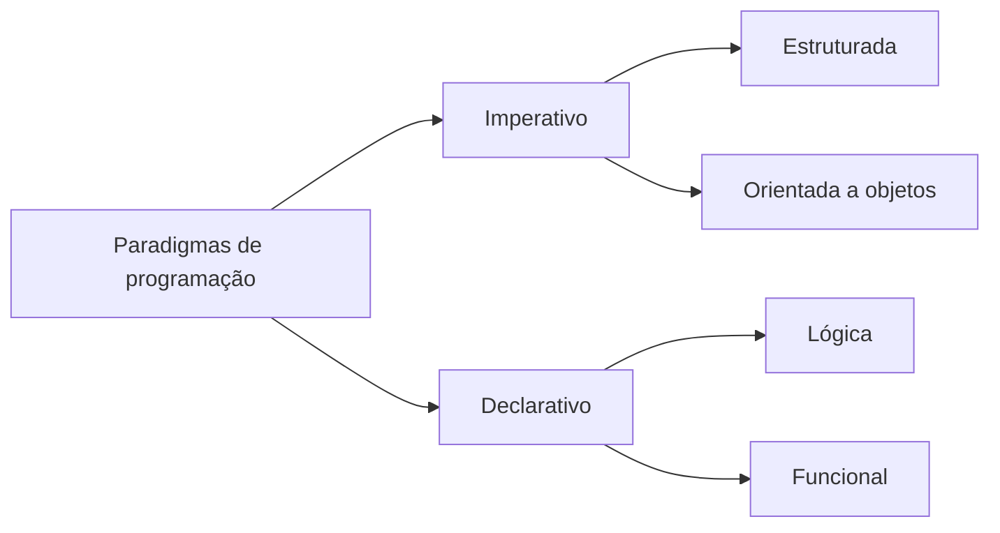
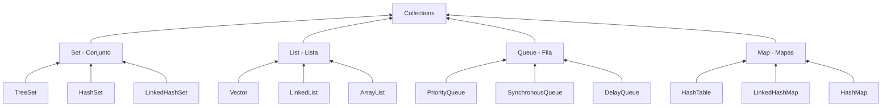
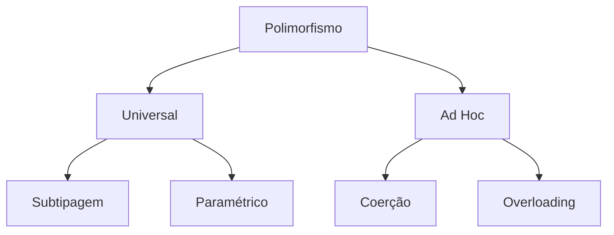
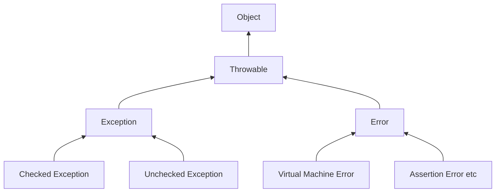

## Paradigmas de programação e história da programação orientada a objetos

Por meio do paradigma procedural que geralmente iniciamos o aprendizado na programação, podemos citar como exemplo a linguagem C, que utiliza exclusivamente esse paradigma. No paradigma procedural baseamos nosso código em comandos que mudam o estado da memória de forma detalhada e sequencial, ou seja, procedural. Reservamos espaços de memória por meio de variáveis para armazenar nossos dados e criamos funções que definem comportamentos desejados para esses dados. Esse paradigma se aproxima da forma com que o processador interpreta os comandos e trabalha com os dados efetivamente, dando maior liberdade para o programador desenvolver algoritmos eficientes. 

Junto ao paradigma procedural surgiu também o paradigma funcional, no qual o código é pensado e descrito por meio da resolução de funções matemáticas. Esse paradigma facilita o desenvolvimento de certos algoritmos que são mais facilmente representados de forma puramente matemática. Trata-se de um paradigma ainda muito utilizado em certas linguagens que combinam paradigmas como a linguagem Scala. 

Outro importante paradigma que surgiu na década de 50 foi o paradigma lógico, no qual uma base de declarações lógicas matemáticas é gerada pelo programador com a qual o computador se baseia para calcular respostas fundamentadas na base inicialmente criada. Uma linguagem proeminente que adota esse paradigma de forma exclusiva é o Prolog, que possui diversas aplicações na inteligência artificial. 

Em meados dos anos 60, um pesquisador chamado Alan Kay, influenciado por sua formação em biologia e matemática, além de outras tecnologias da época, como Sketchpad e Simula, pensou em uma nova arquitetura de programação que chamou de paradigma orientado a objetos. Em sua concepção original, a programação orientada a objeto deveria se basear em células independentes trocando mensagens entre si, retirando o foco dos dados. As linguagens de programação Simula e Smalltalk foram as primeiras a adotar as práticas propostas por Alan Kay.



Paradigmas de tipo Imperativo, voltados para representar os comandos que resolvem o problema, focado no COMO resolver. Em contrapartida temos os paradigmas do tipo declarativos, que não focam nas mudanças de estado sequencial de um programa, mas sim O QUE se deve resolver. 

### Paradigma de programação orientada a objetos

Sua grande popularidade influenciou todas as principais linguagens de programação de hoje, C++, C#, PHP, Python e Java que é a linguagem base de nossa disciplina.

Em programação estruturada o foco está nas ações, por exemplo: em um programa de computador de vendas, o conjunto de instruções que efetua a compra de itens por um cliente geralmente seria agrupado em uma função chamada comprar(). Porém, em um sistema orientado a objetos, pensamos primeiro no objeto, “Quem está realizando essa compra?”, e teríamos um objeto cliente com todos os seus dados em específico e teríamos um comando como cliente.comprar(). Associamos sempre os objetos (cliente neste exemplo) na ação (comprar), que deixa mais claro e intuitiva a leitura dos códigos, pois tem maior contexto pensar em um “cliente comprando” do que simplesmente na ação comprar isolada, trazendo o código mais perto de como entendemos o mundo. Associando essa prática com outros conceitos como herança, polimorfismo, encapsulamento, entre outros, promovemos ganhos de produtividade especialmente na manutenção de códigos pela maior facilidade no entendimento.

## História do Java

A Linguagem Java surgiu no início dos anos 90, em uma importante empresa de tecnologia chamada Sun Microsystems. A equipe responsável pelo desenvolvimento dessa linguagem atuava no chamado Green Project e foram liderados pelo cientista da computação James Gosling. O Green Project tinha por objetivo gerar tecnologias voltadas para conectividade de equipamentos domésticos. A comunicação entre os dispositivos deveria se dar por meio de uma linguagem de programação que fosse independente de plataforma. A linguagem Oak possuía o diferencial de ser uma linguagem interpretada por uma máquina virtual fornecida pela Sun. Todo o dispositivo que rodasse a máquina virtual da Sun, seria capaz de executar códigos Oak sem necessidade de compilação específica para o dispositivo em questão. Por questões legais e de registro de marca, a linguagem Oak, em 1995, mudou seu nome para Java.

Na década de 1990 e 2000, a popularização da internet levou uma grande popularização da linguagem Java, que recebeu suporte de grandes companhias de informática, como IBM. E, de certa forma, o objetivo inicial Green Project foi atingido com Java sendo utilizado para conectar todo o tipo de dispositivo móvel, celulares, tablets, computadores, e até uma das primeiras sondas espaciais robóticas a atingir solo marciano em 2004 utilizou linguagem Java.

A linguagem Java adotou licença de software livre GPL v3 em 2006, o que significa que os programas feitos pela Sun para permitir o funcionamento do Java, assim como suas bibliotecas, possuem código aberto para consulta, cópia e modificação, desde que o desenvolvedor que faça modificações também disponibilize seu código livremente. A Sun Microsystems foi adquirida pela Oracle, em 2010, que é quem oferece suporte ao Java até hoje.

Trata-se de uma linguagem Orientada a Objetos com sintaxe baseada na linguagem C. 

## Organização do Java

Tradicionalmente as linguagens de programação passam por um processo denominado compilação, que transforma o código alto nível escrito pelo programador no que chamamos de código de máquina, ou binário. Esse código nativo é lido pelo processador que executa as instruções. Os programas .exe do windows são um exemplo de binário. 

Em contrapartida existem também linguagens que são interpretadas que não passam por esse processo de compilação, de modo que o código escrito pelo programador em tempo de execução é traduzido para código de máquina. 

Códigos interpretados são essencialmente menos eficientes do que códigos compilados, pela quantidade extra de instruções que requer sua interpretação. Porém possuem a vantagem de serem facilmente portados para diferentes plataformas justamente por não o necessitar de recompilação para cada plataforma, por exemplo um mesmo código interpretado sem alterações pode ser executado em diferentes computadores com sistema operacional Linux, Windows ou Mac. 

Quanto ao Java dependendo do ambiente de execução é possível trabalhar com ele tanto interpretado quanto compilado. Porém tipicamente ele funciona em um processo em dois passos. Primeiro o código alto nível é compilado para um conjunto de instruções internas do java denominado bytecode. Esse código bytecode, posteriormente, é interpretado por um programa chamado máquina virtual Java, em inglês Java Virtual Machine, e ao longo das aulas chamaremos pela sigla JVM. As JVM para as principais plataformas são mantidas pela Oracle, mas podem ser desenvolvidas de forma independente para os mais diversos dispositivos por qualquer equipe, visto que possui licença livre. Portanto um mesmo bytecode pode ser executado em qualquer sistema que possua uma JVM. 

Pelo fato de o Java utilizar JVM para interpretar seus bytecodes, existe uma perda em desempenho quando comparado a um código compilado nativo. Porém as JVM evoluíram muito ao longo dos anos, e uma das principais tecnologias nesse sentido é o chamado Hotspot. Estudos estatísticos mostram que, na grande maioria dos programas, 80% do processamento se concentra em somente 20% do código. O Hotspot é uma tecnologia que identifica esses trechos de código com muito processamento e executa uma compilação dos mesmos durante a execução do código. Essa tecnologia de compilação em tempo de execução é chamada de Just in time compilation, mais conhecida pela sigla JIT. A combinação das duas tecnologias, dentre outras melhorias, tornou o Java muito eficiente, diminuindo a distância em relação às linguagens compiladas.

Quando se deseja apenas executar bytecodes do Java, é necessário instalar em sua máquina o Ambiente de execução Java, em inglês, Java Runtime Environment, mais conhecido pela sigla JRE. Ela é composta principalmente pela JVM e bibliotecas padrão do Java.

 Agora quando desejamos programar em Java, precisamos instalar o Kit de desenvolvimento Java, em inglês Java Development Kit, mais conhecido pela sigla JDK. Ele é composto por um conjunto de utilitários como o compilador de bytecode além de uma JRE. 

## Versões do Java

- O **Java ME** visa a construção de softwares para dispositivos embarcados, sistemas de propósito específico com poucos recursos computacionais. Ela é compatível com uma biblioteca básica de classes e se torna especialmente importante no contexto de soluções desenvolvidas pensando na internet das coisas. 
- **Java SE** é a edição padrão do Java com o principal conjunto de bibliotecas, perfeita para desenvolver programas desktop e de console. Por console entenda programas com interface puramente em modo texto que são geralmente executados por prompt de comando sistema operacional Windows ou terminal do Linux. 
- Por fim **Java EE** é a edição mais completa, já vem equipada com bibliotecas prontas para soluções empresariais especialmente voltadas para internet e banco de dados. Trata-se de uma série de especificações que foi desenvolvida integralmente ou parcialmente na forma de servidor de aplicações por diversos fornecedores. Uma importante tecnologia que ajuda a formar a espinha dorsal da internet hoje.

Os principais elementos que compõem o projeto são: 

Bibliotecas: Que são bytecodes com funcionalidades específicas implementadas. Permitem o programador reaproveitar códigos geralmente desenvolvidos por equipes diversas e que já são muito bem testados e eficientes. No caso o Eclipse já inclui uma biblioteca básica em todos os projetos. 

Pacotes: Um conceito semelhante ao de pasta/diretório para organizar a estrutura dos códigos Java. Supondo que temos um projeto grande com muitos códigos, podemos agrupar os arquivos ligados a bancos de dados em um pacote e que estão ligados a interface visual em outro por exemplo. Usualmente o pacote principal de um projeto é nomeado com o inverso do domínio da sua instituição. Por exemplo empresa.com se torna com.empresa essa é uma prática comum porém não é necessário. Esse pacote principal fica inserido dentro de uma pasta nomeada src (que vem da palavra source, código em inglês). 

Classe: Os códigos são descritos em arquivos com extensão .java e geralmente temos um arquivo por classe.

## Visão Geral sobre o Código Java

### Principais comandos

Entrada e saída:

```java
System.out.print("msg1"); //Imprime uma mensagem
System.out.println("msg2"); //Imprime uma mensagem e pula linha
System.out.printf("msg3 %d", 10); //Imprime mensagens formatadas, análogo ao printf da linguagem C

import java.util.Scanner;
Scanner teclado = new Scanner(System.in);
int idade = teclado.nextInt();
```

### Tipos de dados

| Tipo    | Tamanho | Descrição                                                    |
| ------- | ------- | ------------------------------------------------------------ |
| byte    | 1 byte  | Números inteiros (-128 até 127)                              |
| short   | 2 bytes | Números inteiros (-32.768 até 32.767)                        |
| int     | 4 bytes | Números inteiros (-2.147.483,648 até 2.147.483.647)          |
| long    | 8 bytes | Números inteiros (-9.223.372.036.854.775.808 até 9.223.372.036.854.775.807) |
| float   | 4 bytes | Armazena números inteiros e fracionários até 6 a 7 dígitos decimais. |
| double  | 8 bytes | Armazena números inteiros e fracionários até 15 dígitos decimais. |
| boolean | 1 bit   | Armazena apenas 0 ou 1 (false ou true)                       |
| char    | 2 bytes | Armazena um único caractere, letra ou ASCII values           |

## Classes e Atributos
Os objetos são os elementos em si que compõem o nosso sistema, enquanto as classes são a descrição desses objetos, e como o nome sugere, classificam um conjunto de objetos que pertençam a um mesmo conjunto.
De forma geral cada objeto possui três aspectos principais: 
Atributos: São as variáveis que descrevem o objeto. 
Métodos: São como funções que dizem o que cada objeto faz. 
Estado: Seria o valor de cada atributo que representa aquele objeto específico.
A convenção entre os programadores Java é a de criar um arquivo separado para cada Classe Java. O arquivo que contém o método main também é uma classe própria geralmente.
No POO, um objeto pode ser chamado de instância de uma classe e criar uma nova instância, o que é chamado de instanciação.
## Métodos
Mais do que agrupar um conjunto de variáveis, as classes também possuem o que chamamos de métodos, que são equivalentes às funções em programação estruturada, um bloco de código que só é executado quando chamado. Os métodos podem receber dados de entrada (parâmetros) e opcionalmente um valor de retorno. A diferença básica do método em relação à função, é que o método está sempre associado a um objeto e consegue acessar os dados internos do objeto associado.
## Padrões e modificador Static
O padrão principal da linguagem é o Camel Case, que consiste em descrever uma palavra composta ou frase sem dar espaços ou utilizar underline (ou sublinha), mas utilizando letras maiúsculas para indicar a letra inicial da próxima palavra.
Dentro do Java, os padrões são os seguintes: 
Pacotes: são descritos inteiramente em letras minúsculas. Ex: com.empresa 
Classes: inicia com letra maiúscula e segue o Camel Case. Ex: Aluno 
Métodos, atributos e variáveis: iniciam com letra minúscula e seguem o Camel Case. Ex: nomeCompleto 
Constantes: inteiramente com letras maiúsculas separadas por underline. Ex: VALOR\_PI 
A palavra reservada static possui dois usos na linguagem JAVA. Um quando é associada a um método e outro quando é associada a um atributo. Nos dois casos significa que o atributo ou método poderá ser acessado de forma independente de instâncias. Métodos e atributos sempre são relativos a um objeto, porém métodos e atributos estáticos são independentes. 
Um atributo estático pode ser entendido como uma variável global da classe, todas as instâncias podem trabalhar sobre a mesma variável.
## Construtores
No bloco de código de um construtor qualquer código pode ser escrito, mas usualmente utilizamos para carregar alguma informação, especialmente informações que sejam cruciais para o funcionamento do objeto no momento da sua criação. 
Os construtores são criados de forma semelhante aos métodos, porém, devem possuir o mesmo nome da classe e não possuem valor de retorno. É possível também possuir diversos construtores para uma mesma classe variando apenas os parâmetros de entrada.
Quando criamos uma classe, um construtor vazio implícito que não executa nenhum código é criado. No entanto, a partir do momento que criamos um construtor qualquer, esse construtor vazio implícito deixa de existir.
## Visibilidade
Outra prática que nos ajuda a simplificar o uso das classes é esconder métodos e atributos que sejam de uso interno da classe, de forma que, ao fazermos uso da classe posteriormente, não seja exibido detalhes de implementação, e sim apenas os métodos e atributos que sejam pertinentes. 
Antes da definição de cada método, atributo e classe, podemos colocar um dos três modificadores: 
Public: o elemento é público e pode ser acessado por qualquer outra classe sem restrições. 
Private: o elemento é privado e só pode ser acessado internamente na classe. 
Protected: o elemento é protegido e será acessado somente de dentro da própria classe, outras classes no mesmo pacote e também por classes filhas. A definição de classe filha será abordada em detalhes na aula de herança. 
Default (sem nenhum modificador): o elemento, neste caso, é acessível por classes dentro do mesmo pacote.
## Encapsulamento
Entende-se que o Paradigma Orientado a Objetos possui três pilares, herança, polimorfismo e o encapsulamento. Alguns autores defendem a abstração como um quarto pilar, no entanto, ela pode também ser entendida como parte do encapsulamento.
Em uma classe que segue boas práticas de encapsulamento, seria possível trocar a classe por outra que possua a mesma interface (métodos com os mesmos nomes e parâmetros) e, por mais que as suas implementações internas mudem, o sistema continuará funcional sem maiores mudanças.
Em resumo, a vantagem do encapsulamento são: 
1. A abstração oferecida em que o funcionamento interno dos objetos da classe não fica visível ao programador que utiliza a classe. 
2. A possibilidade de acrescentar funcionalidades à classe desde que respeitando a interface original manterá o sistema funcional sem alterações. 
3. Simplificação da utilização dos objetos em um alto nível acelera o desenvolvimento dos códigos. 
4. O sistema fica robusto a mudanças internas, mesmo uma substituição completa do código que poderia até mesmo ser desenvolvido por outra equipe que não manteve contato com a primeira, bastando respeitar a interface.
## Collections

* ArrayList é uma das classes mais comuns dentro da API Collections, como já apresentada anteriormente ele representada um array dinâmico. Os elementos dentro dela possuem uma ordem definida e trazem métodos de manipulação, como remoção, inserção, busca, entre outros. 
* LinkedList é outra classe que também implementa um array dinâmico com as mesmas funcionalidades do ArrayList tradicional, no entanto, sua implementação interna utiliza a estratégia de lista ligada e realiza as operações de remoção e inserção de forma muito mais rápida e a busca por elementos de forma muito mais lenta em comparação ao ArrayList tradicional. 
	De maneira geral, é mais comum ao longo da execução de um programa que mais buscas sejam executadas do remoções/inserções, portanto, o ArrayList de forma geral é o mais indicado, entretanto, para aqueles casos em que isso não ocorre, contamos com essa alternativa. 
* HashSet na computação, o termo Hash diz respeito a uma função que transforma um valor em outro, e a palavra Set tem diversos significados diferentes sendo que, nessa situação específica, significa conjunto. Então uma HashSet é um conjunto de elementos organizados por meio de uma função Hash. Ela realiza operações de adição, remoção e busca de forma muito rápida, contudo, não garante uma ordem dos elementos. 
* LinkedHashSet é semelhante a HashSet, porém, ele armazena a ordem em que os elementos foram adicionados. 
* HashMap é a estrutura de dados também baseada em Hash, com a diferença que é possível mapear (daí o nome Map) uma ID de um tipo diverso. Por exemplo, podemos ordenar os filmes de um catálogo não por um valor inteiro, mas por uma string contendo o nome do filme seguido do ano de exibição. Não possui ordem garantida. 
* TreeMap semelhante a HashMap, entretanto, também armazena a ordem dos itens, essa ordem pode ser livremente manipulada combinando as características de em um array. 
* LinkedHashMap é semelhante a HashMap, todavia, internamente também armazena a ordem em que os elementos foram adicionados. 
* Queue é uma estrutura de dados geralmente adotada para representar filas de prioridade, queue no inglês significa fila. Ela pode implementar uma fila de prioridade comum, semelhante a uma fila convencional no mundo real em que o primeiro elemento a entrar é o primeiro a ser atendido. 
* Stack é outra classe semelhante a fila de prioridades, mas implementa uma fila reversa à ordem de inserção, o último elemento adicionado é o primeiro a ser tratado, conceito denominado pilha, se empilharmos diversos objetos um sobre o outro, o último objeto empilhado será o primeiro que vamos acessar.
### Métodos Estáticos Collections
* Sort (List<> lista): coloca em ordem crescente os itens da lista passada por parâmetro. 
* Shuffle (List<> lista, Random rnd): embaralha de forma aleatória os elementos da lista passada por parâmetro, a aleatoriedade do embaralhamento é dada pelo objeto da classe Random passado por parâmetro também. 
* Max (Collection<> coll, Comparator<> comp): retorna o maior elemento, aceita tanto lista, quanto hash. Como segundo parâmetro, você pode indicar como deseja realizar a comparação com um objeto da classe Comparator, caso passe null como segundo parâmetro, a ordem natural será adotada.
* Min (Collection<> coll, Comparator<> comp): análogo ao max, porém, retorna o menor elemento. 
* Reverse (List<> lista): coloca todos os itens em ordem reversa.
## Iterator
Quando desejamos visitar os dados em uma estrutura de dados, as estratégias mudam dependendo da estrutura, listas contam com índices inteiros, mapas são indexados pelas chaves que foram definidas, conjuntos não possuem forma de indexação alguma. No entanto, os iterators são uma ferramenta poderosa nesse sentido, pois com eles é possível navegar pelos dados independentes da classe Collections utilizada.
O iterator é bastante simples e compatível com diversas estruturas de dados, o que o torna particularmente útil para criar um código flexível e independente da estrutura de dados adotada.
## Classe LocalDate
A classe LocalDate representa datas de forma bem prática. Cada data sendo um objeto LocalDate, para, por exemplo, recuperarmos a data do momento da execução de uma linha de código. LocalDate.now().
Se imprimirmos na tela objeto do tipo LocalDate, teremos a impressão no formato americano que coloca o mês na frente do dia. Para representar no formato brasileiro, é necessário criar um objeto do tipo DateTimeFormatter, que estabelece formatações para datas e horários.

## Herança
 É possível que uma classe (filha) herde comportamentos (métodos) e características (atributos) de outra classe (mãe), e nessa relação a classe filha pode ter suas características e comportamentos únicos também. De forma geral, a classe herdeira pode ampliar as funcionalidades da classe herdada e também modificar algumas das tais funcionalidades.
Termos atribuídos à classe herdada e à classe herdeira:

| Classe herdada  |  Classe herdeira  |
| :-------------: | :---------------: |
|   Classe mãe    |   Classe filha    |
|   Superclasse   |     Subclasse     |
|   Classe base   | Classe específica |
| Classe original |  Classe derivada  |

## Construtores e Herança
Os construtores funcionam de forma parecida com os métodos, pois são códigos executados no momento da instanciação. A aplicação mais comum dos construtores é a definição de valores para os atributos no momento em que o objeto é instanciado. Relembrando o que já sabemos sobre o tema, para criar construtores, devemos fazê-lo semelhante a um método só que sem um parâmetro de retorno e com nome igual ao da classe.
Diferente dos métodos e atributos, os construtores não são herdados pelas classes filhas, mas podem ser invocados por elas.

## Palavras reservadas *super* e *this*
O comando super faz uma referência explícita à superclasse, à classe herdada, semelhante à palavra this que faz referência explícita à classe corrente. 
Outro uso importante e bastante comum da palavra reservada super é para invocar o construtor
da classe mãe.
### Palavra reservada *instanceOf*
Além de herdar atributos, a tipagem também é herdada. Ou seja, se temos uma classe Base e outra Derivada herdeira de Base, então objetos da classe Derivada também são do tipo Base. Em outras palavras, as classes filhas são consideradas do tipo da classe mãe também. Existe um comando chamando instanceof (instância de, em tradução do inglês), que é utilizado justamente para identificar se uma determinada instância pertence a determinada classe, ele retorna true ou false (verdadeiro ou falso) caso seja ou não uma instância. 

## Herança e UML
Associação é um cenário bastante comum, em que existe um vínculo entre as classes.
Agregação é um tipo especial de associação em que a temos uma classe que representa o todo e outra classe que representa a parte.
Composição pode ser entendida como uma variação da agregação, pois também representa uma relação de todo-parte, no entanto a relação aqui é mais próxima entre o todo e a parte, sendo que a parte não faz sentido sem o todo, pois o todo cria e destrói as partes.
A herança é outra relação representada pelo UML e serve para indicar qual é a classe geral e a classe especializada. É importante observar que os métodos da classe superclasse são acessados pelas subclasses também.
Dependência é outra relação importante que pode ser representada pelo UML. Essa relação indica simplesmente a dependência para compilar de uma classe pela outra.

## Polimorfismo
O nome polimorfismo vem do grego (polýs = muitas; morphé = formas) e geralmente descreve a capacidade de objetos de uma superclasse assumirem a forma (métodos e atributos internos) de diferentes subclasses, mas existem outras situações que também são denominadas de polimorfismo que veremos na sequência.
Segundo a classificação mais amplamente adotada na literatura sobre polimorfismo, podemos agrupá-lo em duas categorias, universal e ad hoc:
Universal: é o tipo de polimorfismo em que temos um mesmo algoritmo, um mesmo comportamento, que pode ser executado para diversas classes ou dados primitivos.
Ad Hoc: é outra forma de polimorfismo, que atua em um conjunto específico de classes para as quais uma mesma chamada de método permite comportamentos diferentes para cada tipo.

* **Subtipagem:** É a forma mais usualmente associada ao nome polimorfismo. Ela ocorre quando temos uma superclasse que possui determinado método, e suas subclasses reimplementam esse método com outro comportamento. Lembramos que uma subclasse, além de herdar métodos e atributos, herda ainda a tipagem, portanto, é possível instanciar uma subclasse e referenciá-la como membro da sua superclasse.
* **Paramétrico**: É o tipo de polimorfismo em que uma função e os dados dentro dela podem ser escritos de forma genérica para diferentes tipos de dado. Uma função matemática que você deseja que funcione da mesma forma para valores de entrada do tipo int, float ou double seria um exemplo de uso. Nas linguagens Java e C#, o conceito é chamado de Generics, enquanto no C++ damos o nome de Template.
* **Coerção**: Esse tipo de polimorfismo mais frequentemente visto em códigos com tipos primitivos, embora seja possível também com objetos, ocorre quando fazemos conversão seja ela implícita, feitas de forma automática pelo compilador, ou explícita, com código descrevendo a transformação entre tipos diferentes de dados.
* **Overloading**: Neste tipo de polimorfismo, temos funções com o mesmo nome, mas com parâmetros de entrada diferentes, o que permite que executem códigos distintos. Em português, podemos chamar esse conceito de sobrecarga.
### Referência e instanciação
Quando criamos uma variável de uma classe na linguagem Java, esta se comporta como uma
referência, semelhante ao conceito de ponteiro da C/C++. Em outras palavras, a variável indica
(aponta) uma posição de memória. Para indicar que desejamos criar um novo objeto na memória
reservando espaço e efetivamente instanciar o mesmo, utilizamos o comando new.

## Classe abstrata
No contexto de orientação a objetos, eventualmente teremos classes que não desejamos instanciar.
Propriedades das classes abstratas:
1. Pode referenciar objetos de subclasses graças ao polimorfismo.
2. Permite que criemos métodos desprovidos de implementação, mas que obrigatoriamente devem ser implementados por suas subclasses.
3. 3. Não podem ser instanciadas, ocorre um erro ao tentarmos instanciar um objeto dessa classe. Erros de compilação, ao contrário do senso comum, são muito positivos pois são fáceis de se identificar e corrigir, diferentemente de um bug que só será identificado durante a execução do programa e não possui qualquer indicação de onde possa estar no código. Os erros de compilação caem em duas categorias: erros léxicos, quando um comando é escrito errado, e semânticos, quando o comando é escrito corretamente, mas em local que não faça sentido; o compilador detecta esses erros, que são fáceis de localizar. Erros semânticos são aqueles em que o comando está escrito certo, no local certo, mas executa instruções diferentes das desejadas, em outras palavras, o significado do que está escrito não é o que se imaginava.
## Interface
Na linguagem Java, não é possível termos múltiplas superclasses para uma mesma subclasse, certas linguagens permitem isso, como o C++, porém, não é o caso do Java. No entanto, temos o que chamamos de Interface. A palavra interface diz respeito ao meio de ligação/comunicação entre dois sistemas.
A Interface força que classes diferentes implementem métodos com os mesmos nomes, entradas e saídas, garantindo que a classe Principal possa acessar as diferentes classes de banco de dados da mesma forma.
Em resumo, uma interface pode ser entendida como um protocolo que explica como deve ser a
assinatura dos métodos de uma classe.
As interfaces funcionam de forma semelhante a classes que não podem ser instanciadas, mas
podem servir de referência para cenários de polimorfismo.
 Interface funciona de forma muito semelhante à herança, no entanto, em vez da palavra extends, utilizamos a palavra implements. 

| Propriedade             | Interface                                                    | Classe abstrata                                              |
| ----------------------- | ------------------------------------------------------------ | ------------------------------------------------------------ |
| Herança                 | Classes podem implementar diversas interfaces.               | Uma classe só pode herdar uma única superclasse.             |
| Métodos                 | Interface só possui a assinatura dos métodos                 | Uma classe abstrata pode implementar códigos dentro de seus métodos, que serão ou não sobrescritos. |
| Atributos               | Só pode possuir atributos estáticos.                         | Pode ter tanto atributos estáticos quanto não estáticos.     |
| Adaptação               | Fácil adaptar uma classe existente para implementar uma interface, bastando implementar os métodos conforme a assinatura. | Adaptar uma classe existente para herdar uma classe abstrata pode ser trabalhoso por ser necessário modificar a hierarquia já existente de heranças. |
| Quando usar?            | Classes que compartilham mesmo comportamento, assinatura.    | Classes que compartilham os mesmos atributos e precisam ter seu estado avaliado de forma compatível. |
| Modificações adicionais | Ao adicionar um novo método a uma interface, todas as classes devem trazer suas implementações. | Ao adicionar um novo método, é possível trazer uma implementação padrão que servirá para todas as classes filhas. |

## Enum
Em diversas linguagens de programação, incluindo a Java, existe o conceito de enum, que consiste de uma classe especial de rápida e simples implementação que é capaz de representar um grupo de constantes enumerando-as geralmente por debaixo dos panos, com inteiros em sequência.
Geralmente é adotado para representar estados.
Para criar um enum, utilizamos a palavra reservada enum em vez de class ou interface. E dentro do corpo do enum, deve vir o nome das constantes separadas por vírgula, pela convenção estabelecida oficialmente pela Oracle. Ademais, as constantes devem sempre descritas em letras maiúsculas na linguagem Java.
Enum pode ser declarado no próprio arquivo como uma classe, e geralmente é, ou pode ser declarado internamente dentro de uma classe existente para ser utilizado apenas localmente.
Enum, na linguagem Java, é representado como uma classe, que inclusive pode possuir métodos e atributos, no entanto, suas constantes são sempre entendidas como public, static, final.
* public: as constantes são acessíveis por qualquer classe que possua visibilidade do enum.
* static: existe apenas uma constante para a classe inteira, e não uma por instância.
* final: não pode ter o valor alterado em tempo de execução.
Quando utilizar enum? Ele é recomendado especialmente em situações em que você tem que
descrever uma coleção de valores fixos que não variam, como meses, cores, baralho de cartas etc.

## Tratamento de exceções
* Erro (Error): é um problema sério que ocorre em tempo de execução, impossível para o compilador detectar e que geralmente não tem tratamento para ele. No geral, são problemas na plataforma que está rodando o programa Java.
Por exemplo, a falta de memória para alocar recursos necessários do programa gera um erro que, na maioria das aplicações, não existirá meio de se contornar e, na maioria das vezes, o programa deverá simplesmente ser interrompido. A solução real seria realmente agir na plataforma em que o software está rodando e cabe ao programa gerar um log (relatório), ou alerta descrevendo o evento. O Java, ao detectar esse problema, lança esse erro no formato java.lang.OutOfMemoryError.
* Exceção (Exception): também é um problema, mas que geralmente pode ser manejado pelo programa e tratado de alguma forma. Por exemplo, ao tentar ler dados em um arquivo que foi apagado e não existe mais, irá gerar a exceção chamada pelo Java de FileNotFoundException. Nesta situação, geralmente é possível em vez de simplesmente encerrar o programa repentinamente, apresentar uma mensagem para o usuário e solicitar alguma intervenção e seguir com o programa funcionando.
Tanto os erros quanto as exceções no Java, ao ocorrerem, são identificadas e lançadas de uma
forma que determinados comandos conseguem recuperar o controle do programa e impedir que ele seja encerrado subitamente. Erros e exceções geram subclasses de uma superclasse Throwable e
respeitam a hierarquia da figura a seguir.

Quando ocorre uma exceção/erro em um método, ele gera um objeto do tipo específico e envia para a máquina virtual Java (JVM). O objeto Exception contém o nome, uma descrição e o estado do programa no momento que ocorreu o problema. A ordenação das chamadas dos métodos é conhecida como Call Stack (pilha de chamadas). Depois isso, ocorre a seguinte sequência de passos.
* A JVM busca na call stack um método que contenha um bloco de código capaz de tratar a exceção, vamos chamar de bloco tratador de exceção. A busca inicia no método que gerou a exceção e segue ordem reversa de chamada.
* Ao encontrar um bloco tratador apropriado, ele recebe o controle do fluxo de código junto ao objeto exceção. Por apropriado, entendemos que ele trata um tipo de exceção compatível com a que foi gerada.
* Se a JVM não encontrar um bloco tratador de exceções na call stack, então a JVM utiliza um bloco tratador de exceções padrão que irá encerrar o programa imediatamente e imprimir uma mensagem no console dando todas as informações da exceção, nome, descrição e a call stack.
### Lidando com exceções
Na linguagem Java, assim como nas principais linguagens de programação, existem os comandos try (tentar) e catch (capturar). O comando try é associado a um bloco de código que será executado e caso um erro ou exceção aconteça o programa não encerrará automaticamente com mensagem de alerta no console, mas, sim, o controle será devolvido ao programa dentro do bloco catch adequado. Opcionalmente, é possível colocar o comando finally (finalmente) que também é associado a um bloqueio de código que será executado independente de o código ter entrado ou não no bloco catch.

## Criando as próprias exceções
Além de tratar as exceções e erros que o sistema lança por padrão, podemos lançar exceções e até mesmo criar nossas próprias exceções. A ideia por trás de lançar exceções está em evitar que o programa continue executando mediante situações anormais e devolver o controle para o método tratador adequado.
Por exemplo, se o seu programa falhar em conectar com o banco de dados, o sistema lançará uma exceção de forma automática, provavelmente do tipo java.sql.SQLException. No entanto, se o banco de dados conectar adequadamente, mas um dado crítico para o funcionamento do seu programa não estiver presente na base dados, então não existirá uma exceção e, caso a situação não seja devidamente identificada e tratada, o programa continuará em execução com um comportamento imprevisível.
Este é o cenário adequado para se lançar uma exceção própria, identificando que o dado crítico não está presente na base de dados e isso pode ser feito por meio do comando throw. Esse comando é capaz de explicitamente lançar uma exceção qualquer. 
### Tipos de exceções
1. Checked: são exceções verificadas em tempo de compilação, checked em inglês significa checada. Isso significa que ao lançar uma exceção desse tipo o método deve tratar ela com try/catch ou explicitamente anunciar na assinatura do método que pode lançar esse tipo de exceção com a palavra throws, caso não faça nenhuma das duas coisas, o compilador irá gerar um erro. 
Todo o método A que explicitamente lance uma exception na assinatura obriga que, ao ser invocado por um outro método B, ele deva ou tratar com try/catch ou ele também lançar a exception na sua assinatura. No caso da main, se ela lançar a exceção para quem a invocou, o programa será interrompido imediatamente com mensagem no console informando a exceção.
2. Unchecked: são exceções que não são checadas em tempo de compilação, dispensam o uso de throws na assinatura da função quando não tratadas, fica livre ao programador decidir se precaver com o uso de try/catch ou não. Problemas do tipo Error também não são checados, na hierarquia de classes, as exceções não checadas também são chamadas de RuntimeException.
### Desenvolvendo sua própria Exception
Além de lançar as exceções existentes, é possível criar a sua própria exceção subclasse de Exception ou RuntimeException e até mesmo Error. Ao criar uma exceção que estende Exception, ela será do tipo checada e, se ela estender RuntimeException, será do tipo não checada. Basta criar uma subclasse e ela poderá ser utilizada para descrever uma situação inesperada.

## Igualdade
No Java as Strings são objetos e não tipos primitivos, portanto, não é possível comparar o conteúdo com \==, para isso utilizamos um método chamado equals. 
O método equals é um padrão dentro do Java e serve justamente para comparar conteúdos, não é obrigatório implementar o método equals para todas as classes, mas é uma convenção para aquelas classes que faça sentido a comparação entre objetos. Essa padronização garante a compatibilidade com certas classes do sistema também.
Diversas IDE Java, incluindo o Eclipse, conseguem gerar o código do equal automaticamente na
opção Source/Generate hashCode() and equals()...

## Métodos especiais: toString()
Como já foi discutido anteriormente, todo o objeto Java é diretamente ou indiretamente subclasse de Object. E a classe Object possui o método toString() que, por padrã,o retorna uma String com o endereço na memória daquele objeto. Esse método toString() é implicitamente acessado sempre que tentamos ler o objeto no formato de uma string.
Temos o comando @Override, que serve para indicar que o método está sobrescrevendo outro de sua superclasse, esse comando não é necessário, no entanto, ele possui dois papéis: indicar aos programadores que lerão o código que aquele é um método sobrescrevendo outro e fazer com que o compilador verifique a adequação da assinatura do método. 
Também é possível em diversas IDEs Java, incluindo eclipse, gerar o código automaticamente para o método toString, indo na opção Source/Generate toString().

## Modificadores Java (Singleton)
Um problema recorrente é a necessidade de termos um objeto que seja instanciado uma única vez e sempre que seja solicitado pelas classes de um projeto seja direcionado ao mesmo objeto. Um conceito semelhante ao de uma variável global, porém, utilizando uma instância.
Dentro da literatura de design pattern, a solução para essa situação é a utilização do que chamamos de Singleton. Alguns exemplos comuns de uso do padrão Singleton é quando temos algum tipo de recurso compartilhado. Por exemplo, diversas classes requisitando acesso a uma impressora, banco de dados ou um mesmo arquivo não é interessante que esses recursos sejam acessados paralelamente por múltiplas instâncias, poderia causar conflitos entre as requisições, nesse tipo de situação, Singleton seria bem aplicado. 
Outro exemplo comum é a classe responsável por efetuar log de atividades. Essa tarefa é constantemente invocada em diferentes etapas de um sistema e ter uma única instância realizando-a minimiza o overhead (trabalho extra de gestão) da classe, visto que essa operação é realizada de forma constante e relativamente independentemente do restante do projeto. 
Na prática, para criar uma classe Singleton, são necessários dois passos: 
1. Ter um construtor privado. 
2. Criar um método estático que retorna um objeto da classe em questão instanciado. Conceito conhecido como Lazy initialization (inicialização preguiçosa), em que o objeto é criado depois de declarado.