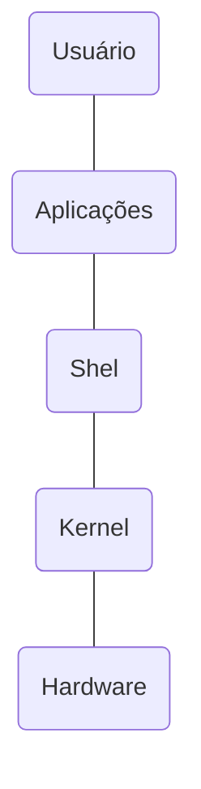
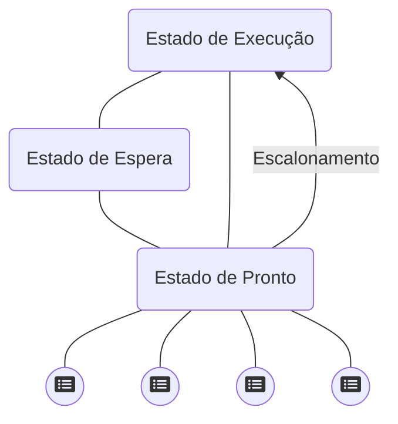
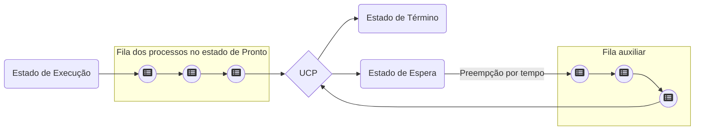
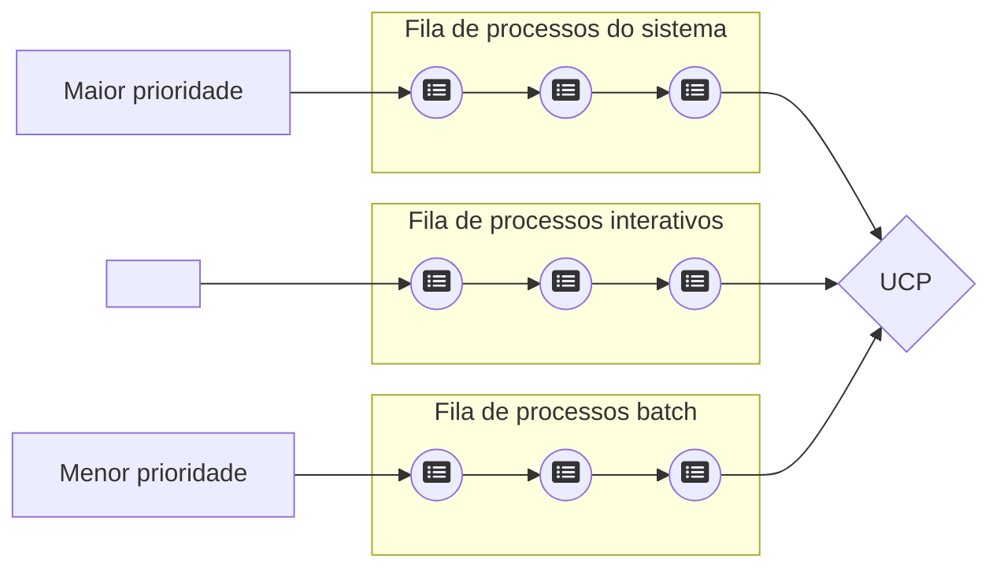
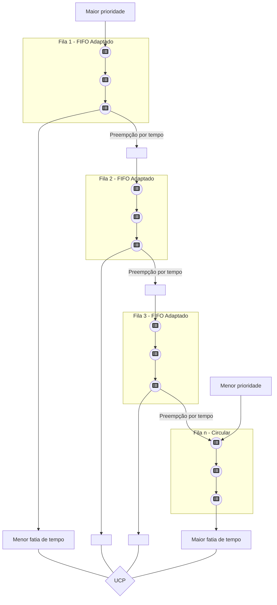

## 1 Conceito

Um sistema operacional é um conjunto de elementos (programas) capazes de fazer um todo (computador) funcionar. É uma camada de software colocada entre o hardware e os programas que executam tarefas dos usuários. Seus principais objetivos são: tornar a utilização do computador mais eficiente e conveniente; distribuição dos recursos de memória, processador e dispositivos pelos programas; esconder os detalhes de baixo nível; prover recursos em alto nível para acesso a periféricos;

## 2 História dos Sistemas Operacionais

O primeiro computador digital foi desenvolvido por Charles Babbage, também chamado de motor analítico.

O primeiro sistema operacional, chamado monitor por sua simplicidade, foi desenvolvido em 1953 pelos usuários do computador IBM 701 do Centro de Pesquisas da Gereral Motors, justamente para tentar automatizar as tarefas manuais até então utilizadas. Posteriormente, este sistema seria reescrito para um computador IBM 704 pelo grupo de usuários da IBM.

Os sistemas operacionais foram desenvolvidos para automatizar a execução de programas (JOBS) e facilitar a vida de usuários e programadores.

Evolução Histórica – Primeira Geração de Computadores • ENIAC – Programação em linguagem de máquina

Evolução Histórica – Segunda Geração de Computadores • Jobs em cartões magnéticos • Uso de Sistema Operacional para leitura dos cartões • Programas em Assembly e Fortran

Evolução Histórica – Terceira Geração de Computadores • Inicio da multiprogramação, compartilhamento de tempo entre jobs • Desenvolvimento do Unix

Evolução Histórica – Quarta Geração de Computadores • Surgimento dos computadores pessoais • Criação de uma interface amigável baseada em ícones (GUI)

Linha do Tempo

• 1950 – O conceito de sistema operacional apareceu durante a segunda geração da computação moderna

• 1969 – Primeira versão do Unix

§ 1981 – Lançamento do MS DOS 1984 – Sistemas Operacionais com Interface gráfica

§ 1991 – Surgimento do Linux

§ 2001 – Windows XP

§ 2005 – Android

§ 2009 – Windows 7

§ 2010– Chromium OS

§ 2011 – Windows 8

201...

§ SO integrados a web (Windows 10, Firefox OS)

## 3 Tipos de Sistemas Operacionais

Os sistemas operacionais são classificados quanto ao tempo de resposta e entrada de dados em sistema operacional em lote (batch), Interativos, tempo real, Híbridos.

Sistema de processamento batch, não exige interação com usuário a entrada de dados feita por meio de um dispositivo, geralmente arquivos em disco, processamento de cálculos, compilações, ordenações, backups.

Os sistemas interativos, também conhecidos como sistemas de tempo compartilhado, geralmente permitem a interação com usuário por meio de terminais, vídeo, teclado e mouse.

Sistemas de processamento em tempo real, implementados para responder 100% das respostas em tempo real, o tempo de resposta é o fator principal do sistema, utilizado em monitoramentos, controle de tráfego aéreo, de usinas nucleares. Os sistemas híbridos é uma combinação de sistema batch com sistemas interativos.

Quanto a execução de tarefas os sistemas operacionais são classificados como sistemas monotarefas, multitarefas e multiprocessamento.

Os sistemas monotarefas são caracterizados por executarem uma única aplicação de cada vez, já nos sistemas multitarefas, varias programas concorrem pelos recursos de processamento. Os sistemas multiprocessados, possuem duas ou mais CPUs interligas trabalhando em conjunto fortemente acoplados ou fracamenta acoplados.

Os sistemas com multiprocessadores fortemente acoplados são aqueles que possuem duas ou mais CPUs que compartilham uma única memória e são controladas por um único sistema operacional. Os fracamente acoplados, possuem duas ou mais CPUs cada uma com a sua memória e controladas por sistemas operacionais independentes.

Quanto a estrutura (do núcleo/kernel), os sistemas operacionais são classificados como Monolíticos, em camadas, máquinas virtuais, microkernel e cliente servidor.

Monolíticos: Pode ser comparada com uma aplicação formada por vários módulos que são compilados separadamente e depois linkados.

   {: width="100" height="100" }

Em camadas: O sistema é dividido em níveis sobrepostos § Cada camada oferece um conjunto de funções que podem ser utilizadas apenas pelas camadas superiores.

Os sistemas operacionais ainda são classificados como sistemas operacionais de computadores de grande porte, servidores, computadores pessoais e sistemas operacionais embarcados.

Grande Porte: Possuem muitas E/S. Processamento simultâneo de muitos jobs. Permite que múltiplos acessos remotos executem jobs simultaneamente.

Servidores: Servem múltiplos usuários de uma vez. Permite o compartilhamento de recursos de hardware e software. Provem serviços de impressão, armazenamento ou web.

Os embarcados são sistemas que controlam dispositivos móveis ou que não são computadores, como exemplo, micro-ondas, geladeiras os IPads, Iphone, PDAs e etc.

Os sistemas operacionais modernos são divididos em várias camadas, onde cada camada prove serviços a camada superior mais próxima e oferece proteção a camada mais inferior, o núcleo do sistema ou Kernel do sistema operacional.

O acesso ao recursos do Kernel é feito por meio de chamada de sistemas (system calls) de forma protegida para evitar dano ao sistema. As instruções que têm o poder de comprometer o sistema são conhecidas como instruções privilegiadas (modo kernel), enquanto as instruções não-privilegiadas são as que não oferecem perigo ao sistema.

As chamadas de sistemas são os comandos de acesso as funções do SO, e podem ser dividas em chamadas para Gerenciamento de Processos, para sinalização, para gerencia de arquivos, para manipulação de diretórios, para proteção e para gerenciamento de tempo.

## 4 O conceito de concorrência em Sistemas Operacionais

Sistemas Operacionais podem ser vistos como um conjunto de rotinas executadas de forma concorrente e ordenada. (Pinkert, 1990). A possibilidade de o processador executar instruções ao mesmo tempo que outras operações, como, por exemplo, operações de E/S, permite que diversas tarefas sejam executadas concorrentemente pelo sistema. O conceito de concorrência é o princípio básico para o projeto e a implementação dos sistemas multiprogramáveis.

Nos sistemas multiprogramáveis, vários programas podem estar residentes em memória, concorrendo pela utilização do processador. Dessa forma, quando um programa solicita uma operação de E/S outros programas poderão utilizar o processador.

   {: width="100" height="100" }

Para permitir a concorrência entre programas, o sistema operacional implementa vários mecanismos de software e ou de hardware.

As interrupções são o mecanismo que tornou possível a implementação da concorrência nos computadores é sempre gerada por algum evento externo ao programa, exemplo uma operação de E/S.

A exceção é gerada por um evento síncrono direto do programa concorrente.

Os controladores são mecanismos de hardware que controlam as operações de I/o em disco, liberando o processador para executar outras tarefas. O controlador sinaliza as interrupções ao processador.

A técnica de buffering consiste na utilização de uma área na memória principal, denominada buffer, para a transferência de dados entre os dispositivos de E/S e a memória. Esta técnica permite que em uma operação de leitura o dado seja transferido primeiramente para o buffer, liberando imediatamente o dispositivo de entrada para realizar nova tarefa.

A técnica de spooling utiliza uma área em disco como se fosse um grande buffer. Neste caso, dados podem ser lidos ou gravados em disco, enquanto programas são executados concorrentemente. Todos os sistemas operacionais utilizam esta técnica no gerenciamento de impressão. (arquivos de spool).

A reentrância é a capacidade de um código executável (código reentrante) ser compartilhado por diversos usuários, exigindo que apenas uma cópia do programa esteja na memória.

   {: width="100" height="100" }

Técnica de DMA: Acesso direto a memória: técnica que permite a transferência de dados direto da memória para o dispositivo de saída sem passar pelo processador.

## 5 Gerência de Processos

Um processo pode ser entendido inicialmente como um programa em execução, só que seu conceito é mais abrangente. Este conceito torna-se mais claro quando pensamos de que forma os sistemas multiprogramáveis (multitarefa) atendem os diversos usuários (tarefas) e mantêm informações a respeito dos vários programas que estão sendo executados concorrentemente \[MACHADO, 1997\].

Um processo possuí informações do contexto de hardware, software e endereçamento de memória.

   {: width="100" height="100" }

O contexto de hardware é fundamental para a implementação dos sistemas time-sharing, onde os processos se revezam na utilização do processador, podendo ser interrompidos e, posteriormente, restaurados como se nada tivesse acontecido. A troca de um processo por outro na CPU, realizada pelo sistema operacional, é denominada mudança de contexto (context switching). A mudança de contexto consiste em salvar o conteúdo dos registradores da CPU e carregá-los com os valores referentes ao do processo que esteja ganhando a utilização do processador. Essa operação resume-se, então, em substituir o contexto de hardware de um processo pelo de outro.

O contexto de software especifica características do processo que vão influir na execução de um programa, como o número máximo de arquivos abertos simultaneamente ou o tamanho do buffer para operações de E/S. Essas características são determinadas no momento da criação do processo, mas algumas podem ser alteradas durante sua existência. O contexto de software define basicamente três grupos de informações de um processo: sua identificação, suas quotas e seus privilégios.

O espaço de endereçamento é a área de memória do processo onde um programa poderá ser executado, além do espaço para os dados utilizados por ele. Cada processo possui seu próprio espaço de endereçamento, que deve ser protegido do acesso dos demais processos.

Os processos são executados de forma cíclica alternando seu estado. Estado de execução (running) quando está sendo processado pela CPU. Estado de pronto, (ready) quando apenas aguarda uma oportunidade para executar, ou seja, espera que o sistema operacional aloque a CPU para sua execução. Estado de espera (wait) quando aguarda algum evento externo ou algum recurso para poder prosseguir seu processamento.

Tipos de Processos Foreground X Background:

   {: width="100" height="100" }

Tipos de Processos CPU-Bound X I/O-Bound:

   {: width="100" height="100" }

### Threads

Em sistemas tradicionais, cada processo tem seu espaço de endereçamento individual e apenas um fluxo de controle (thread). No entanto, algumas vezes desejamos ter vários fluxos de controle (threads) no mesmo espaço de endereçamento simulando uma execução em paralelo, como se cada fluxo fosse visto realmente como um processo distinto (exceto pelo fato de compartilharem um único espaço de endereçamento).

Muitos threads podem existir dentro de um único contexto de processo, cooperando entre si a fim de realizar um dado cálculo e compartilhando o espaço de endereçamento e o restante do contexto desse processo. (multithread).

Um ambiente multithread se utiliza dos mesmos mecanismos de concorrência entre processos, interrupções, exceções e a comunicação entre processos (Inter Process Comunication – IPC), essenciais para permitir acesso concorrente a um recurso compartilhado.

Vantagens para Utilização de Thread: § São mais fáceis de criar e destruir que os processos § Compartilham espaço físico de memória, disco, periféricos e outros recursos § Apresentam melhor performance do que os processos.

Utilização de Thread: § O sistema operacional deverá ter suporte à thread. API CreateThread do Windows § A ferramenta de programação (linguagem) também deverá ter suporte para threads (JAVA).

#### Conceitos para gerência de threads

Região Crítica: Também chamada de Seção Crítica. É a parte do sistema que permite acesso concorrente entre os processos. Exemplo: spool de impressão, buffer de memória, etc.;

Exclusão Mútua: É uma técnica usada em programação concorrente para evitar que dois ou mais processos ou threads tenham acesso simultaneamente a um recurso compartilhado do sistema, ou seja, a uma região crítica;

Sinais: São interrupções de software que notificam ao processo que um evento ocorreu. Os sinais não permitem que processos especifiquem dados para trocar com outros processos. São utilizados para sincronização entre processos e S.O, ou seja, os sinais só ocorrem entre processos ou entre um processo e o S.O.

Trap: É o sinal que o processo envia para o S.O solicitando um serviço protegido do mesmo (como por exemplo sua entrada em uma região crítica). Um trap bloqueia o processo até que o serviço requerido pelo mesmo, ao sistema operacional, seja realizado.

#### Problema de comunicação entre processos ou threads

Processos podem solicitar recursos, mesmo que estejam de posse de recursos obtidos anteriormente. Caso estes recursos já estejam alocados a outros processos, o processo solicitante deve aguardar pela liberação do mesmo. Essa é a condição natural do sistema de alocação de recursos, porém, alguns problemas naturalmente podem ocorrer, neste caso temos os problemas de comunicação entre processos ou threads.

Condição de Corrida: Também chamada de Corriza de Hazards, é uma das consequências da sincronização incorreta, gerando a disputa de recursos do sistema por múltiplos processos, ou threads, causando o corrompimento dos dados, onde parte dos dados são modificados por um processo/thread e parte por outro, ou seja, acontece quando dois ou mais processos entram simultaneamente na região crítica.

Starvation: Também chamado de Livelock, acontece quando processos/threads estão em execução, mas nada acontece, isso ocorre geralmente quando dois ou mais processos/threads então trabalhando com intenções contrarias, o que é feito por um processo/thread é desfeito pela outro. Também ocorre quando um processo/thread tenta o acesso a um recurso que está sendo utilizado por outro processo/thread, o S.O pede para que o mesmo aguarde sua liberação, porém o processo/thread não está preparado para o aguardo, ou seja, ele vai continuar solicitando o recurso indefinidamente, mesmo que o recurso seja liberado, pois o processo/thread não foi programado para uma “rejeição”.

Deadlock: É o problema mais terrível e mais estudado em sistemas operacionais. É uma situação em que dois ou mais processos/threads estão em estado simultâneo de espera, cada um aguardando que um dos demais libere um bloqueio para ele poder prosseguir, ou seja, um conjunto de N processos está em deadlock quando cada um dos N processos está bloqueado à espera de um recursos que somente pode ser liberado por um processo desse conjunto.

#### Sequência lógica para que processos utilizem recursos do sistema

Pedido: o processo cria um trap para solicitar um recurso. Se o processo não tiver seu pedido atendido, pois o recurso não está livre, ele é bloqueado e ficará esperando até ganhar a posse do recurso.

Uso: tendo posse do recurso ele poderá utilizá-lo.

Liberação: desalocar o recurso adquirido pelo processo o liberando para outro processo. O gerenciamento desses recursos é feito pelo sistema operacional através de uma tabela, que registra se cada recurso está livre ou ocupado. Caso o recurso esteja ocupado, também é especificado o processo que tem a posse do recurso.

## 6 Gerência do processador

A política de escalonamento de um sistema operacional tem diversas funções básicas, como a de manter o processador ocupado a maior parte do tempo, balancear o uso da UCP entre processos, privilegiar a execução de aplicações críticas, maximizar o throughput do sistema e oferecer tempos de resposta razoáveis para usuários interativos. Em ambientes que implementam apenas processos, o escalonamento é realizado com base nos processos prontos para execução. Em sistemas que implementam threads, o escalonamento é realizado considerando os threads no estado de pronto, independentemente do processo.

### Critérios de escalonamento

As características de cada sistema operacional determinam quais são os principais aspectos para a implementação de uma política de escalonamento adequada. Os principais critérios são:

Utilização do processador: Na maioria dos sistemas é desejável que o processador permaneça a maior parte do tempo ocupado.

Throughput: representa o número de processos executados em um determinado intervalo de tempo.

Tempo de Processador /Tempo de UCP: É o tempo que um processo leva no estado de execução durante seu processamento.

Tempo de Espera: É o tempo total que um processo permanece na fila de pronto durante seu processamento, aguardando para ser executado.

Tempo de Turnaround: É o tempo que um processo leva desde a sua criação até seu término, levando em consideração todo o tempo gasto na espera para alocação de memória, espera na fila de pronto, processamento na UCP e na fila de espera, como nas operações de E/S.

Tempo de Resposta: Tempo decorrido entre uma requisição ao sistema ou à aplicação e o instante em que a resposta é exibida.

### Tipos de escalonamento

1. Não-Preemptivos e Preemptivos: As políticas de escalonamento podem ser classificadas segundo a possibilidade de o sistema operacional interromper um processo em execução e substituí-lo por um outro, atividade esta conhecida como preempção. O escalonamento não-preemptivo (sem interrupção) foi o primeiro tipo de escalonamento implementado nos sistemas multiprogramáveis, onde predominava tipicamente o processamento bath. No escalonamento preemptivo, o sistema operacional pode interromper um processo em execução e passá-la para o estado de pronto, com o objetivo de alocar outro processo na UCP.

2. Escalonamento First-in-First-Out (FIFO): O processo que chegar primeiro ao estado de pronto é o selecionado para execução.

3. Escalonamento Shortest-Job-First (SJF): Seleciona primeiro o processo de menor tempo de processador ainda por executar.

4. Escalonamento Cooperativo: É uma implementação que busca aumentar o grau de multiprogramação em políticas de escalonamentos que não possuam mecanismos de preempção. Neste caso, um processo em execução pode voluntariamente liberar o processador para outro processo.

5. Escalonamento Circular: É um escalonamento do tipo preemptivo, projetado especialmente para sistemas de tempo compartilhado. Quando um processo passa para o estado de execução existe um tempo-limite para uso contínuo do processador denominado fatia de tempo (time slice) ou quantum.

6. Escalonamento por Prioridades: É um escalonamento do tipo preemptivo realizado com base em um valor associado a cada processo denominado prioridade de execução. O processo com maior prioridade no estado de pronto é sempre o escolhido para execução, e processos com valores iguais são escalonados seguindo critérios de FIFO.

7. Escalonamento Circular com Prioridades: Implementa o conceito de fatia de tempo e de prioridade de execução associada a cada processo.

8. Escalonamento por Múltiplas Filas: Existem diversas filas de processos no estado de pronto, cada qual com uma prioridade específica. Os processos são associados às filas em função de características próprias, como importância para a aplicação, tipo de processamento ou área de memória necessária.

9. Escalonamento por Múltiplas Filas com Realimentação: É semelhante ao escalonamento por Múltiplas Filas, porém os processos podem trocar de filas durante seu processamento. Possibilidade de reorganizar os processos nas filas de acordo com o seu comportamento.

Circular com fila auxiliar:

Múltiplas filas:

Realimentação:

## 7 Gerência de memória

Historicamente, a memória principal sempre foi vista como um recurso escasso e caro. Uma das maiores preocupações dos projetistas foi desenvolver sistemas operacionais que não ocupassem muito espaço de memória e, ao mesmo tempo, otimizassem a utilização dos recursos computacionais. A gerência de memória deve tentar manter na memória principal o maior número de processos residentes, permitindo maximizar o compartilhamento do processador e demais recursos computacionais.

### Tipos de alocação

Alocação Contigua Simples: A memória principal é subdivida em duas áreas: uma para o sistema operacional e outra para o programa do usuário.

   {: width="100" height="100" }

Técnica de Overlay: A memória é dividida em área do sistema operacional, área do módulo principal do programa do usuário e uma área de troca entre os módulos secundários do programa do usuário, denominada área de overlay.

   {: width="100" height="100" }

Alocação Particionada Estática ou fixa: A memória era dividida em pedaços de tamanho fixo, chamado partições. O tamanho das participações, estabelecido na fase de inicialização do sistema, era definido em função do tamanho dos programas que executariam no ambiente.

   {: width="100" height="100" }

Alocação fixa com código absoluto os programas só podem ser executados em posições físicas de memória.

   {: width="100" height="100" }

Alocação fixa com código relocável, todas as referências a endereços no programa são relativas ao inicio do código, e não a endereços físicos de memória. Nesse tipo de alocação o principal problema é a fragmentação interna, os espaços que sobram nas partições quando alocado aplicações e tamanho menor que a partição.

   {: width="100" height="100" }

Alocação Particionada Dinâmica: As partições são criadas exatamente de acordo com o tamanho dos programas que serão executadas, eliminando problema da fragmentação interna. Cada vez que surge um novo programa para ser executado, são criadas novas partições, com isso surge um novo problema, a fragmentação externa, que são as partições tão pequenas que não suficientes para alocar os programas necessários.

   {: width="100" height="100" }

### Estratégias de alocação de partição

Os sistemas operacionais implementam, basicamente, três estratégias para determinar em qual área livre um programa será carregada para execução. Essas estratégias tentam evitar ou diminuir o problema da fragmentação externa. Best-fit, a melhor partição é escolhida, ou seja, aquela em que o tamanho da partição tem o mesmo tamanho do programa. Worst-fit, nesta estratégia a pior partição é escolhida, deixando espaços livres maiores permitindo que mais programas sejam executados, diminuindo o problema da fragmentação. First-Fit, a primeira partição livre de tamanho suficiente para carregar o programa é escolhida.

Swapping: É uma técnica aplicada à gerência de memória para programas que esperam por memória livre para serem executadas. Nesta situação, o sistema escolhe um processo residente, que é transferido da memória principal para a memória secundária (swap out), geralmente em disco.

## 8 Memória virtual

É uma técnica sofisticada e poderosa de gerência de memória, onde as memórias principal e secundária são combinadas dando ao usuário a ilusão de existir uma memória muito maior que a capacidade real da memória principal. O conceito de memória virtual fundamenta-se em não vincular o endereçamento feito pelo programa dos endereços físicos da memória principal.

### Mapeamento

O mapeamento é o mecanismo que permite a conversão do endereço virtual em endereço real. Nos sistemas modernos a tarefa de tradução dos endereços virtuais é realizada por hardware juntamente com o sistema operacional, de forma a não comprometer seu desempenho e torná-lo transparente a usuários e aplicações. O dispositivo de hardware responsável por esta tradução é conhecido como unidade de gerência de memória (Memory Management Unit – MMU), sendo acionado sempre que se faz referência a um endereço virtual.

### Tipos de memória virtual

Memória Virtual – Paginação - A memória virtual por paginação é a técnica de gerência de memória onde o espaço de endereçamento real são divididos em blocos de mesmo tamanho chamado páginas.

   {: width="100" height="100" }

Memória Virtual – Segmentação - Memória virtual por segmentação é a técnica de gerência de memória onde o espaço de endereçamento virtual é dividido em blocos de tamanhos diferentes chamados segmentos.

Enquanto na paginação existe o problema da fragmentação interna, na segmentação surge o problema da fragmentação externa.

### Mecanismo de tradução

Sempre que o processo referencia um endereço virtual, a unidade de gerência de memória verifica, através do bit de validade, se a pagina que contém o endereço referenciado está ou não na memória principal. Caso a página não esteja na memória, dizemos que ocorreu um page fault. Para corrigir o erro o sistema deverá transferir a página da memória secundaria para principal.

   {: width="100" height="100" }

### Políticas de busca de páginas

O mecanismo de memória virtual permite a execução de um programa sem que seu código esteja completamente residente na memória principal. A política de busca de páginas determina quando uma página dever ser carregada para a memória. Paginação por demanda e paginação antecipada.

### Políticas de alocação de páginas

A política de alocação de páginas determina quantos frames cada processo pode manter na memória principal.

Alocação fixa: cada processo tem um numero máximo de páginas que pode ser utilizado durante sua execução.

Alocação variável: o numero máximo de páginas alocadas ao processo pode variar durante sua execução.

### Política de substituição de páginas

Consiste na atuação do sistema operacional na substituição páginas (Page out e Page in) quando o processo atinge o numero máximo de páginas que foram alocadas.

   {: width="100" height="100" }

Working Set: Tem o objetivo de reduzir o problema de thrashing (sucessivos page faults e I/O de páginas) e erros de page faults (páginas não encontradas na memória).

### Algoritmos de substituição de páginas

Os algoritmos de substituição de páginas tem o objetivo de selecionar os frames que tenham as menores chances de serem referenciados em um futuro próximo. A partir do princípio da localidade, a maioria dos algoritmos tenta prever o comportamento futuro das aplicações em função do comportamento passado, avaliando o numero de vezes que uma página foi referenciada, o momento em que foi carregada para memória principal e o intervalo de tempo da última referência.

### Principais algoritmos de substituição de páginas

Ótimo: seleciona para substituição uma página que não será mais referenciada no futuro ou aquela que levará o maior intervalo de tempo para ser novamente utilizada.

Aleatório: Todas as páginas alocadas na memória principal têm a mesma chance de serem selecionadas, inclusive os frames que são frequentemente referenciados. Consome pouco recurso de memória, mas possui baixa eficiência.

FIFO: Seleciona para substituição a primeira página que foi utilizada e que está a mais tempo na memória. A fila é por ordem de tempo, as primeiras utilizadas são as primeiras da fila.

LFU (least frequently used): A página que possuir o contador com o menor número de referências será escolhida, ou seja, o algoritmo evita selecionar páginas que são bastante utilizadas. O problema é que justamente as páginas que estão a pouco tempo na memória é que podem ser selecionadas.

LRU (least recently used): Seleciona a página na memória principal que está há mais tempo sem ser referenciada. É necessário que cada página tenha a ela associado o momento do último acesso, que deve ser atualizado a cada referência a um frame. Quando for necessário substituir uma página, o sistema fará uma busca por um frame que esteja há mais tempo sem ser referenciado. Outra maneira de implementar o LRU seria através de uma lista encadeada, onde todas as páginas estariam ordenadas pelo momento da última referencia. Elevado custo de implementação.

NRU (not recently used): O algoritmo NRU é bastante semelhante ao LRU, porém com menor sofisticação. Para a implementação deste algoritmo é necessário um bit adicional, conhecido como bit de referência (BR). O bit indica se a página foi utilizada recentemente e está presente em cada entrada da tabela de páginas.

Quando uma página é carregada para a memória principal, o bit de referência é alterado pelo hardware, indicando que a página foi referenciada (BR=1). No momento da substituição de uma página, o sistema seleciona um dos frames que não tenha sido utilizado recentemente, ou seja, com o bit de referência igual a zero.

| Categorias | Bits avaliados | Resultado                                  |
| ---------- | -------------- | ------------------------------------------ |
| 1          | BR = 0 BM = 0  | Página não referenciadas e não modificada. |
| 2          | BR = 0 BM = 1  | Página não referenciadas e modificada.     |
| 3          | BR = 1 BM = 0  | Página referenciada e não modificada.      |
| 4          | BR = 1 BM = 1  | Página referenciada e modificada.          |

FIFO com buffer de páginas: O algoritmo FIFO com buffer de páginas combina uma lista de páginas alocadas (LPA) com uma lista de páginas livres (LPL). A LPA organiza todas as páginas que estão sendo utilizadas na memória principal, podendo ser implementada como uma lista única para todos os processos ou uma lista individual para cada processo. Independente da política utilizada, a LPA organiza as páginas alocadas há mais tempo na memória no início da lista, enquanto as páginas mais recentes no seu final. Da mesma forma, a LPL organiza todos os frames livres da memória principal, sendo que as páginas livres há mais tempo estão no início e as mais recentes no final. Sempre que um processo necessita alocar uma nova página, o sistema utiliza a primeira página da LPL, colocando-a no final da LPA. Caso o processo tenha que liberar uma página, o mecanismo de substituição seleciona o frame em uso há mais tempo na memória, isto é, o primeiro da LPA, colocando-o no final da LPL.

É importante notar que a página selecionada e que entrou na LPL continua disponível na memória principal por um determinado intervalo de tempo. Caso esta página seja novamente referenciada e ainda não tenha sido alocada, basta retirá-la da LPL e devolvê-la ao processo. Nesse caso, a LPL funciona como um buffer de páginas, evitando o acesso à memória secundária. Por outro lado, se a página não for mais referenciada, com o passar do tempo irá chegar ao início da LPL, quando será utilizada para um outro processo. Caso a página seja posteriormente referenciada, o sistema terá que carregá-la novamente da memória secundária.

FIFO circular: O algoritmo FIFO circular utiliza como base o FIFO, porém as páginas alocadas na memória estão em uma estrutura de lista circular, semelhante a um relógio. Este algoritmo é implementado, com pequenas variações na maioria dos sistemas Unix. Para a implementação do algoritmo existe um ponteiro que guarda a posição da página mais antiga na lista . Cada página possui associado um bit de referência, indicando se a página foi recentemente referenciada. Quando é necessário substituir uma página, o sistema verifica se o frame apontado tem o bit de referência desligado (BR = 0). Nesse caso, a página é selecionada para descarte, pois, além de ser a mais antiga, não foi utilizada recentemente. Por outro lado, se a página apontada tem o bit de referência ligado (BR = 1), o bit é desligado e o ponteiro incrementado, pois, apesar de ser a página mais antiga, foi utilizada recentemente. O processo se repete até ser encontrada uma página com bit de referência igual a zero.

Neste algoritmo, existe a possibilidade de todos os frames possuírem o bit de referência ligado. Nesse caso, o ponteiro percorrerá toda a lista, desligando o bit de referência de cada página. Ao final, a página mais antiga é selecionada. A utilização do bit de referência permite conceder a cada página uma segunda chance antes de ser substituída. É possível melhorar a eficiência do algoritmo utilizando o bit de modificação, juntamente com o bit de referência, como apresentado no esquema NRU.

### Proteção de memória

Em qualquer sistema multiprogramável, onde diversas aplicações compartilham a memória principal, devem existir mecanismos para preservar as áreas de memória do sistema operacional e dos diversos processos dos usuários.

Um primeiro nível de proteção é inerente ao próprio mecanismo de memória virtual por paginação. Neste esquema, cada processo tem a sua própria tabela de mapeamento e a tradução dos endereços é realizada pelo sistema. Desta forma, não é possível a um processo acessar áreas de memória de outros processos, a menos que haja compartilhamento explícito de páginas entre processos. A proteção de acesso é realizada individualmente em cada página da memória principal, utilizando-se as entradas das tabelas de mapeamento, onde alguns bits especificam os acessos permitidos.

### Compartilhamento de memória

Em sistemas que implementam memória virtual, é bastante simples a implementação da reentrância, possibilitando compartilhamento de código entre os diversos processos. Para isso, basta que as entradas das tabelas de mapeamento dos processos apontem para os mesmos frames na memória principal, evitando, assim, várias cópias de um mesmo programa na memória. Apesar de os processos compartilharem as mesmas páginas de código, cada um possui sua própria área de dados em páginas independentes.