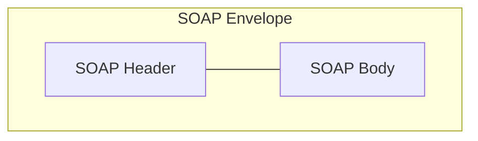
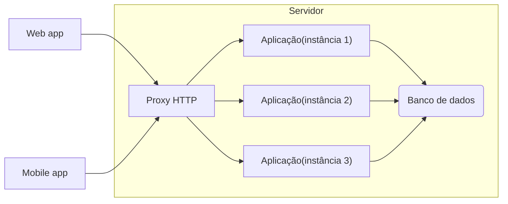
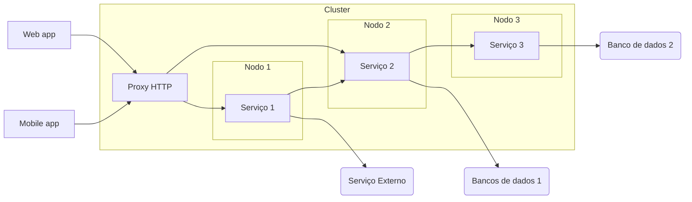
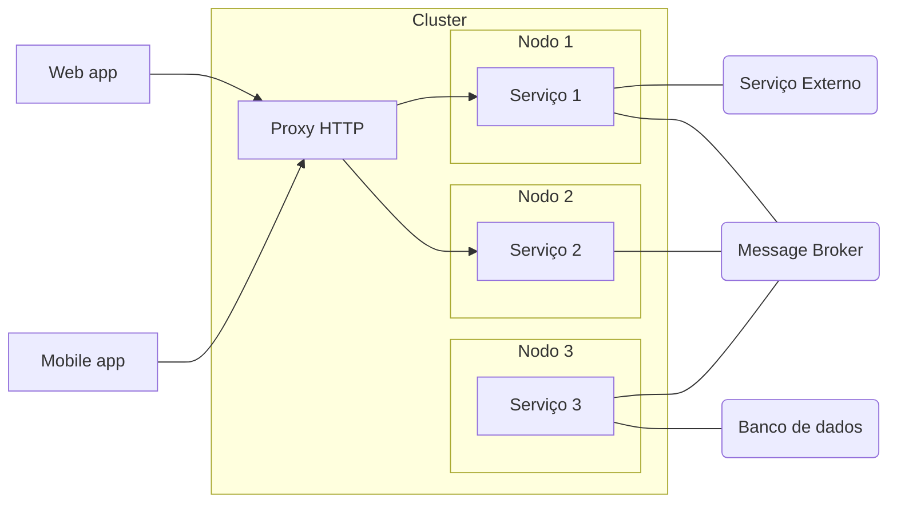
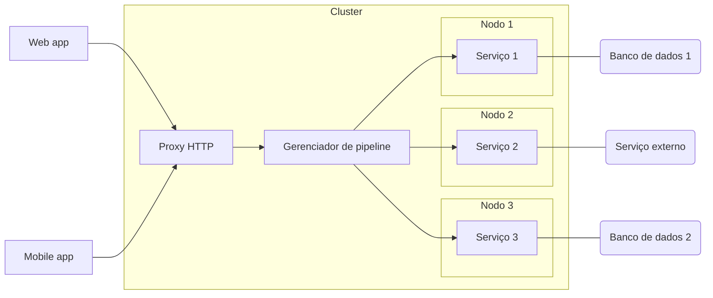
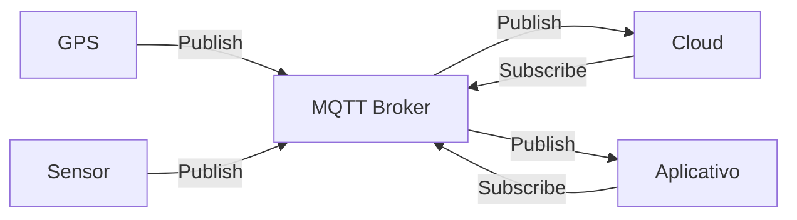
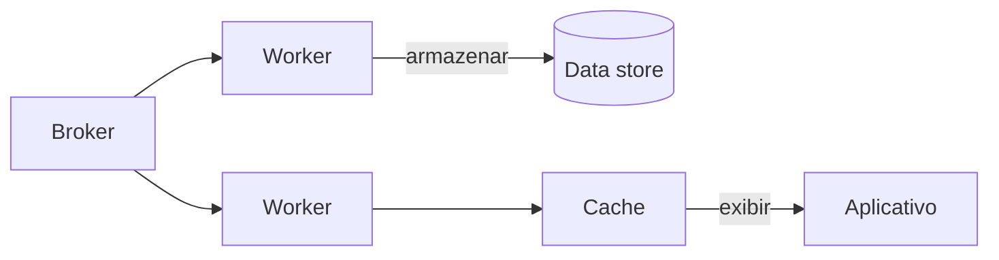

## Vantagens e desenvolvimento de Web Services

### O que são Web Services

Serviços Web ou Web Services são soluções para aplicações se comunicarem independente de linguagem, softwares e hardwares utilizados.
Inicialmente Serviços Web foram criados para troca de mensagens utilizando a linguagem XML (Extensible Markup Language) sobre o protocolo HTTP sendo identificado por URI (Uniform Resource Identifier).
Podemos dizer que Serviços Web são API's que se comunicam por meio de redes sobre o protocolo HTTP.
Vantagens: Linguagem comum; Integração; Reutilização de implementação; Segurança; Custos.
Principais Tecnologias: SOAP; REST; XML; JSON.

### Estrutura SOAP

SOAP - Simple Object Acess Protocol
É um **protocolo** baseado em XML para acessar serviços web principalmente por HTTP.
Pode-se dizer que SOAP é uma definição de como serviços web se comunicam.
Foi desenvolvido para facilitar integrações entre aplicações.
Vantagens:
Permite integrações, independente de linguagem, pois usa como linguagem comum o XML.
É independente de plataforma e software.
Meio de transporte genérico, ou seja, pode ser usado por outros protocolos além do HTTP.
XML - Extensible Markup Language.
É uma linguagem de marcação criada na década de 90 pela W3C.
Facilita a separação de conteúdo.
Não tem limitação de criação de tags.
Linguagem comum para integrações entre aplicações.
•Atributo dentro da tag, =“”
•Sempre com aspas duplas
O "SOAP Message" possui uma estrutura única que deve sempre ser seguida:



SOAP Envelope é o primeiro elemento do documento e é usado para encapsular toda a mensagem SOAP.
SOAP Header é o elemento onde possui informações de atributos e metadados da requisição.
SOAP Body é o elemento que contém os detalhes da mensagem

```xml
<soap:Envelope xmls:soap="http://www.w3c.org/2003/05/soap-envelope">
    <soap:Header>
    </soap:Header>
    <soap:Body>
        <m:MetodoEndereco xmls:m="http://www.example.org/endereco">
            <m:Cidade>Pitanga</m:Cidade>
        </m:Endereco>
    </soap:Body>
</soap:Envelope>
```

### Entendendo o que é WSDL e XSD

WSDL - Web Services Description Language
Usado para descrever Web Services, funciona como um contrato do serviço.
A descrição é feita em um documento XML, onde é descrito o serviço, especificações de acesso, operações e métodos.
http://soapclient.com/xml/soapresponder.wsdl
XSD - XML Schema Definition
É um esquema no formato XML usado para definir a estrutura de dados que será validada no XML.
O XSD funciona como uma documentação de como deve ser montado o SOAP Message (XML) que será enviado através de Web Service.
[SoapUI.org](https://soapui.org) é um sistema que ajuda a visualizar e ler aquivos WSDL e XSD.

### Aprenda o que são REST, API e JSON

REST - Representational State Transfer
É um **estilo de arquitetura** de software que define a implementação de um serviço web.
Pode trabalhar com os formatos XML, JSON ou outros.
Permite integrações entre aplicações e também entre cliente e servidor em páginas web e aplicações.
Utiliza dos métodos HTTP para definir a operação que está sendo efetuada.
Arquitetura de fácil compreensão.
API - Application Programming Interface
São conjuntos de rotinas documentados e disponibilizados por uma aplicação para que outras aplicações possam consumir suas funcionalidades.
Ficou popular com o aumento dos serviços web.
As maiores plataformas de tecnologia disponibilizam APIs para acessos de suas funcionalidades, algumas delas são: Facebook, Twitter, Telegram, WhatsApp, GitHub...
Principais métodos HTTP:
GET - solicita a representação de um recurso.
POST - Solicita a criação de um recurso.
DELETE - Solicita a exclusão de um recurso.
PUT - Solicita a atualização de um recurso.
JSON - JavaScript Object Notation.
Formatação leve utilizada para troca de mensagens entre sistemas.
Usa-se de uma estrutura de chave e valor e também de listas ordenadas.
Um dos formatos mais populares e mais utilizados para troca de mensagens entre sistemas.
•Tipos:
•Object{}
•String “”
•Number
•Boolean
Array \[ {}, {} \]

```json
{
    "nome": "Os vingadores",
    "ano_lancamento": "2019",
    "personagens":[
        {
            "nome": "Thanos"
        },
        {
            "nome": "Homem de ferro"
        }    
    ]
}
```

### Veja sobre integração com REST e métodos HTTP na prática

Código de estado: usado pelo servidor para avisar o cliente sobre o estado da operação solicitada.

| 1xx                                         | Informativo                                                                  |
|:-------------------------------------------:|:----------------------------------------------------------------------------:|
| 2xx                                         | Sucesso                                                                      |
| 3xx                                         | Redirecionamento                                                             |
| 4xx                                         | Erro do Cliente                                                              |
| 5xx                                         | Erro do Servidor                                                             |
| [Códigos de status de respostas HTTP - HTTP | MDN (mozilla.org)](https://developer.mozilla.org/pt-BR/docs/Web/HTTP/Status) |
| É possível testar o REST com o Postman      |                                                                              |

## Conceitos de arquitetura em aplicações para internet

### Introdução a arquitetura de sistemas

Monolito:



Microsserviços #1



Microsserviços #2



Message Broker: Permite identificar o motivo de um determinado serviço ter sido incapaz de responder no momento de uma requisição.

Microsserviços #3



### Comparando os modelos Monolito e Microsserviços

Monolito

| Prós                       | Contras                        |
|:--------------------------:|:------------------------------:|
| Baixa complexidade         | Stack única                    |
| Monitoramento simplificado | Compartilhamento de recursos   |
|                            | Acoplamento                    |
|                            | Mais complexo a escalabilidade |

Microsserviços #1

| Prós                   | Contras                       |
|:----------------------:|:-----------------------------:|
| Stack dinâmica         | Monitoramento mais complexo   |
| Simples escalabilidade | Provisionamento mais complexo |
|                        | Acoplamento                   |

Microsserviços #2

| Prós                   | Contras                       |
|:----------------------:|:-----------------------------:|
| Stack dinâmica         | Monitoramento mais complexo   |
| Simples escalabilidade | Provisionamento mais complexo |
| Desacoplamento         |                               |

Microsserviços #3

| Prós                   | Contras                                               |
|:----------------------:|:-----------------------------------------------------:|
| Stack dinâmica         | Provisionamento mais complexo                         |
| Simples escalabilidade | Plataforma inteira depende do gerenciador de pipeline |
| Desacoplamento         |                                                       |
| Menor complexidade     |                                                       |

### Gerenciamento de erros e volume de acesso

Onde é mais complexo:

- Processos assíncronos (Microsserviços 2)
- Pipeline

Solução:

- Dead letter queue
- Filas de re-tentativas
  
  ## A arquitetura de aplicações móveis e internet das coisas
  
  ### Conceito de internet das coisas
  
  Embutir sensores em objetos do dia-a-dia
  Coletar dados dos sensores
  Usar o dado para tomar decisão
  Things - Cloud - Intelligence
  Smart building - Smart Home - Wearables - Agriculture - Smart transportation - RFID Supply Chain (etiquetas inteligentes) - Energy Efficiency
  Computação ubíqua - Mark Weiser
  Desafios da Internet das Coisas:
1. Privacidade e segurança
2. Quantidade exponencial de dispositivos conectados na rede
3. Ser capaz de processar e armazenar uma enorma quantidade de informações
4. Gerar valor a partir dos dados coletados
   
   ### Arquitetura da internet das coisas e protocolos de comunicação
   
   Como conectar as coisas. Considere:
5. Baixo consumo de energia
6. Rede de dados limitada
7. Resiliência
8. Segurança
9. Customização
10. Baixo Custo

Arduino:

1. Plataforma de prototipagem
2. Com entradas/saídas
3. Desenvolvedor escreve em C/C++
4. Interface serial ou USB
5. Shields

Embarcados - MCUs

1. Microcontrolador de chip único
2. Sistema operacional real time
3. Embarcado
4. Uso industrial, médico, militar, transporte

Minicomputadores - Raspberry Pi

1. Computador completo
2. Hardware integrado em uma única placa
3. Roda SO Linux ou Windows
4. Uso doméstico e comercial

O protocolo de comunicação - MQTT

1. Base na pilha do TCP/IP
2. Protocolo de mensagem assíncrona (M2M)
3. Criado pela IBM para conectar sensores de pipelines de petróleo a satélites
4. Padrão OASIS suportado pelas linguagem de programação mais populares
   Modelo Publish/Subscribe
   


A flexibilidade dos tópicos

| mqtt://   | broker.io/ | a6g319/         | gps/   | position         |
|:---------:|:----------:|:---------------:| ------ | ---------------- |
| PROTOCOLO | BROKER     | USER IDENTIFIER | SENSOR | INFORMATION TYPE |

QoS 0

1. Nível mínimo de menor esforço
2. Sem garantia de entrega
3. Mensagem não é retransmitida

QoS 1

1. Garante que a mensagem foi entregue no mínimo uma vez ao receber
2. Mensagem pode ser retransmitida se não houver confirmação de entrega

QoS 2

1. Garante que a mensagem foi entregue no mínimo uma vez ao receber
2. Mensagem pode ser retransmitida se não houver confirmação de entrega
3. Dupla confirmação

Cloud


