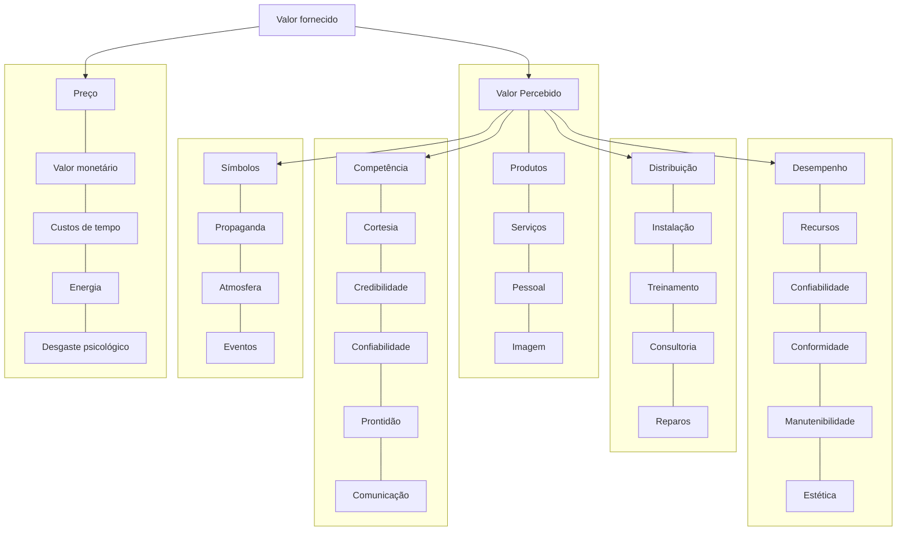

# Livro: Empreendedorismo - Paulo Sertek

## Estratégias de Globalização de Empresas

* Diversificação de produtos - verticalização - agregar ao negócio principal outros secundários - excessiva diversificação é problemática.
* Competitividade - estratégias de diferenciação.
* Três estratégias para competir:

1. Liderança em custos;
2. Diferenciação;
3. Foco;

## 1. Potencial empreendedor

* Capacidade da pessoa em desenvolver competências que enriqueçam o seu repertório de ações, para aproveitar oportunidades, a fim de satisfazer as necessidades dos clientes.
* Utilidade para o cliente - finalidade da empresa - marketing e inovação.
* Percepção dos consumidores - consumidor é o usuário final do produto ou serviço. Aspectos de avaliação dos clientes sobre o serviço:

1. Consistência;
2. Competência;
3. Velocidade de atendimento;
4. Atendimento/atmosfera;
5. Flexibilidade;
6. Credibilidade/segurança;
7. Acesso;
8. Tangíveis;
9. Custo.
   * Definição do negócio e objetivos - finalidade e missão devem ser traduzidas em objetivos. Os objetivos devem derivar de qual é o nosso negócio; devem ser operacionais; devem possibilitar a concentração de recursos e esforços; devem ser múltiplos; são necessários em todas as áreas.
   * Áreas-chave dos objetivos:
10. marketing; o posicionamento de mercado que se deve ter como alvo não é o máximo, mas sim o ótimo
11. inovação; no produto ou serviço, na localização de mercado e comportamento e valores de clientes e nas diversas habilidades e atividades para produzir os produtos e serviços e trazê\-los ao mercado.
12. organização do pessoal;
13. recursos financeiros;
14. recursos materiais e produtividade; indicadores e medições
15. responsabilidade social;
16. nível de lucro. mínima rentabilidade necessária

## 2. Criatividade e inovação

Competências criadoras e inovadoras
Liderança e criatividade

## 3. Identificando Oportunidades

* I. Identificar a oportunidade do negócio;
* II. Desenvolver o conceito do negócio;
* III. Implantar o empreendimento.
* Inovação de valor: fornecimento de maior valor aos consumidores com menor impacto possível nos custos. Estratégia do Oceano Azul.
* Fórmulas para identificar oportunidades:
* IV. Identificar necessidades;
* V. observar deficiências; aperfeiçoar o que já é bem sucedido.
* VI. observar as tendências;
* VII. derivar para algo similar à ocupação atual;
* VIII. procurar outras aplicações de um mesmo conceito;
* IX. benchmarking.
* Não se pode fazer pesquisa de mercado sobre uma coisa que não está no mercado.
* Métodos:
* X. Matriz de planejamento
* XI. Benchmarking - mensuração e padrão de referência. Não pode ser empregado isoladamente.

* XII. Exame das fronteiras de mercado - o não consumo - examine os setores alternativos - examine os grupos estratégicos dentro de um mesmo setor - examine a cadeia de compradores - examine as ofertas de produtos e serviços complementares - examine os apelos funcionais e emocionais dos compradores - examine o transcurso do tempo (novos paradigmas de consumo).
* XIII. Mapa de utilidade para o comprador

| Compra                                                   | Entrega                                                                                                            | Uso                                                                                                       | Suplementos                                                            | Manutenção                                                     | Descarte                                                            |
|:--------------------------------------------------------:|:------------------------------------------------------------------------------------------------------------------:|:---------------------------------------------------------------------------------------------------------:|:----------------------------------------------------------------------:|:--------------------------------------------------------------:|:-------------------------------------------------------------------:|
| Qual é a demora para encontrar o produto de que precisa? | Qual é a demora pra receber o produto?                                                                             | O produto exige treinamento ou assistência de especialistas?                                              | Precisa-se de outros produtos ou serviços para que o produto funcione? | O produto exige manutenção externa?                            | O uso do produto gera resíduos?                                     |
| O local da compra é atraente e acessível?                | Qual é o grau de dificuldade para desembalar e instalar o novo produto?                                            | É fácil guardar o produto quando não estiver em uso?                                                      | Em caso afirmativo, qual é o custo desses suplementos?                 | Qual é o grau de facilidade para manter e atualizar o produto? | Qual é o grau de facilidade para descartar o produto?               |
| Qual é o grau de segurança do ambiente de transações?    | Os próprios compradores devem providenciar a entrega? Em caso positivo, qual é o custo e a dificuldade da entrega? | Qual é o grau de eficácia dos itens e funções do produto?                                                 | Qual é a demora para obtê-los?                                         |                                                                | O descarte seguro do produto envolve questões legais ou ambientais? |
| Com que rapidez se completa a compra?                    |                                                                                                                    | O produto ou serviço fornece muito mais capacidade e opções do que as exigidas pela maioria dos usuários? | Qual é o grau de incômodo deles resultante?                            |                                                                | Qual é o custo do descarte?                                         |
|                                                          |                                                                                                                    | Será que ele está cheio de itens desnecessários?                                                          | Qual é o grau de facilidade para obtê-los?                             |                                                                |                                                                     |

## 4. Fatores a serem considerados na escolha do produto/serviço: primeira parte

Etapas da criação de um negócio próprio:

Desenvolver conceitos - definição de um a proposta de valor a ser oferecida ao cliente

|                      | Regras do jogo estáveis | Regras do jogo instáveis |
|:--------------------:|:-----------------------:|:------------------------:|
| **Competição alta**  | RESULTADOS              | INOVAÇÃO                 |
| **Competição baixa** | CUSTOS                  | PROCESSOS                |

* Inovação de valor - reduzir, aumentar, criar e eliminar .
* Elementos chave para a definição do conceito do negócio: as necessidades, o grupo de clientes a serem atendidos, o modo como se pretende atender.
    * Identificar Riscos: Sazonalidade, efeitos da situação econômica, controle governamental, dependência de elementos de disponibilidade e custo incerto, ciclo de vida do setor (expansão, estagnação ou retração), lucratividade, mudanças que estão ocorrendo no setor e efeitos das mudanças tecnológicas, grau de imunidade à concorrência e atração pessoal (intangíveis), formação de barreiras à entrada.
* Agregando valor ao cliente através dos serviços, das pessoas e da imagem;
* Procurar experiências similares e reduzir riscos.

## 5. Fatores a serem considerados na escolha do produto/serviço: segunda parte

Avaliação do potencial de lucro e crescimento
Características dos tipos de negócios:

| Categorias dos negócios->        | Medíocres     | Sucessos pessoais         | Sucessos passageiros     | Grandes sucessos            |
|:--------------------------------:|:-------------:|:-------------------------:|:------------------------:|:---------------------------:|
| **Características dos negócios** | **Medíocres** | **Sucessos pessoais**     | **Sucessos passageiros** | **Grandes sucessos**        |
| Potencial de lucro               | Subsistência  | Grande                    | Muito grande             | Muito grande                |
| Potencial de crescimento         | Limitado      | Limitado                  | Passageiro               | Grande                      |
| Barreiras à entrada              | Não há        | Há                        | Geralmente não há        | Há, de difícil transposição |
| Necessidade do conhecimento      | Não há        | Especializado             | Marketing                | Muito especializado         |
| Reputação do empreendedor        | Indiferente   | Estabelecida e respeitada | Indiferente              | Indiferente                 |
| Ligações com cliente             | Não há        | Forte                     | Não há                   | Forte                       |
| Liderança de mercado             | Não há        | Liderança                 | Passageira               | Forte                       |
| Grau de inovação                 | Não há        | Moderado                  | Radical                  | Acentuado                   |
| Necessidade de investimento      | Modesto       | Substancial               | Modesto                  | Substancial                 |
| Risco                            | Pequeno       | Grande                    | Muito grande             | Grande                      |
| Ciclo de vida                    | Longo         | Longo                     | Curto                    | Longo                       |
| Potencial de venda do negócio    | Não há        | Grande                    | Só para um incauto       | Muito grande                |

* Dinâmica dos negócios: oferta e demanda.
* Fases do ciclo de vida: introdução, expansão, turbulência, saturação, declínio.
* Efeito da experiência: quanto maior for o tempo em que um determinado produto é produzido, maiores serão as possibilidades de que seus custos de produção se reduzam e , num mercado competitivo, os preços também cairão.

## 6. Critérios decisórios

Foco em serviço:

| Segmento de mercado--> //////// Conceito de serviço/estratégia de operações | Estreito                 | Estreito                          | Amplo                    | Amplo                                    |
|:---------------------------------------------------------------------------:|:------------------------:|:---------------------------------:|:------------------------:|:----------------------------------------:|
| **Estreito (cardápio limitado)**                                            | Maior vantagem           | Foco externo                      | Maior vantagem           | Domínio do processo operacional          |
| **Estreito (cardápio limitado)**                                            | Maior problema potencial | Potencial insuficiente de mercado | Maior problema potencial | Diversificação do conceito de serviço    |
| **Amplo (cardápio variado)**                                                | Maior vantagem           | Domínio do consumidor             | Maior vantagem           | Grande potencial de mercado              |
| **Amplo (cardápio variado)**                                                | Maior problema potencial | Falta de foco operacional         | Maior problema potencial | Falta de foco "ser tudo para todo mundo" |

* Investimento fixo - bens físicos - ativo - não é consumido mas se desgasta e tem vida útil limitada.
* Investimento financeiro - capital de giro
* 5 pré-requisitos para decisões de negócio: o conceito do negócio, o conhecimento, os contatos, os recursos e as encomendas.

# Livro: A caminhada empreendedora - Elton Ivan Schneider & Henrique José Castelo Branco

## 1. O que é ser um empreendedor?

* Conhece seus limites, pessoa determinada, corre riscos.
* Empreendedor gestor: Ação; criatividade; otimismo; entusiasmo; perseverança; inovação; planejamento.
* Intraempreendedorismo \- empreendedores de negócios - empreendedores sociais
* Necessidade - criatividade; oportunidade - inovação.
* Tipos de empreendedor pelo contexto: artesão, tecnológico, oportunista e "estilo de vida".
* Competência = conhecimento + habilidades + atitudes.
* Triplo papel: empreendedor, administrador e técnico.

## 2. A criatividade e o empreendedorismo

Caçador de ideias (ter ideias); artista (melhorar ideias); juiz (escolher ideias) e guerreiro (tornar reais as ideias).

## 3. Oportunidades de negócios: da criatividade à inovação

* a. Que necessidade quero satisfazer?
* b. Quanto o cliente quer gastar?
* c. Quais as opções de produto ou serviço?
* d. Quem fornece o produto ou serviço?
* e. O que fornecem?
* f. Como geram valor ao cliente?

* Avaliação de oportunidades - oito erros que precisam ser evitados: paixão; paranoia; perfeccionismo; tempo; concorrência; preço baixo; impaciência; lucro rápido.
* Processo decisório: decisão; ideia; estudo; plano; ação.
* Atitudes do empreendedor: vontade de correr riscos; aprendizado; características pessoais;
* Planejamento e capacidade de julgamento: visão; oportunidades; contexto.
* Formas de empreender: montar um negócio; comprar um negócio já existente; associar-se para a criação de um novo negócio; associar-se em projetos mais sólidos e consolidados; abrir uma franquia.
Inovar é criar valor.

## 4. O desafio do empreendedorismo sustentável

* Desenvolvimento Local Sustentado - DLS - satisfaz as necessidades do presente, sem comprometer a capacidade de as futuras gerações satisfazerem suas próprias necessidades.
* Decidir - Criar - Inovar - Consciência DLS - Planejar - Agir.
* Empreendedorismo sustentável: Equidade social - Conservação ambiental - eficiência econômica

## 5. Planejando o negócio: a gestão empreendedora e o plano de negócios

* Planejando a abertura do negócio: conhecimento; planejamento; encontrar a melhor trilha; acreditar na própria capacidade.
* Desafios: trabalho árduo; vida pessoal X vida profissional; riqueza, independência e estabilidade financeira; realização e satisfação pelo dever cumprido.
* A pesquisa de mercado: gestão da informação (registro, classificação, análise e apresentação objetiva de dados).
* Objetivo da pesquisa - público-alvo da pesquisa - fontes de pesquisa - método de pesquisa - caracterizar a pesquisa - tabular a pesquisa - tomada de decisão.
* Personalidade dos compradores: inovadores, primeiros adeptos, maioria inicial, maioria tardia, retardatários.
* Tipos de pesquisa qualitativa: entrevista, cliente oculto, grupo focal, teste de produtos (degustação).
Planejar o negócio:

* O plano de negócios - Objetivos:
    ◌ Conhecer o negócio;
    ◌ Conhecer o mercado;
    ◌ Formas e tendências da indústria;
    ◌ Posição estratégica;
    ◌ Administração competente;
    ◌ Atrair e reter talentos;
    ◌ Controle financeiro.
* A estrutura do plano de negócios:
    ◌ Antecedentes e objetivos;
    ◌ Análise de mercado;
    ◌ Desenvolvimento e produção;
    ◌ Marketing;
    ◌ Dados financeiros;
    ◌ Organização e gestão;
    ◌ Plano de investimentos;
    ◌ Estrutura societária;
    ◌ Riscos e contingências;
    ◌ Resumo e conclusões.
* Componentes e apresentação do plano de negócios:
    ◌ Sumário executivo;
    ◌ Descrição da companhia;
    ◌ Descrição do produto/serviço;
    ◌ Análise e tendência do segmento;
    ◌ Definição do mercado-alvo;
    ◌ Análise dos concorrentes;
    ◌ Avaliação de riscos inerentes ao negócio;
    ◌ Plano de marketing;
    ◌ Operações;
    ◌ Plano para a utilização das novas tecnologias;
    ◌ Uso das novas tecnologias da informação e comunicação: os e-negócios;
    ◌ Estrutura de gestão do negócio;
    ◌ Desenvolvimento local sustentado (DLS);
    ◌ As formas de acompanhamento do que foi planejado;
    ◌ O planejamento financeiro do negócio.

## 6. Empresariando o negócio

* Buscando capital financeiro: próprio; empréstimo/financiamento; capitalista de risco; sócio operacional.
* Capital intangível: intelectual; humano; estrutural; organizacional; inovação.
* Empresariando com efetividade:
    * gestão de pessoas (saber recrutar, selecionar, treinar, motivar, controlar, premiar);
    * gestão operacional (entender de compras, estoques, logística, produção, qualidade);
    * gestão de marketing (saber ler o mercado, ter foco, compreender os mecanismos de propaganda, de vendas, de atendimento);
    * gestão de finanças (entender de financiamento, imobilização, fluxo de caixa, contabilidade, custos);
    * gestão do planejamento (estudar, perceber, estruturar, planejar, controlar).