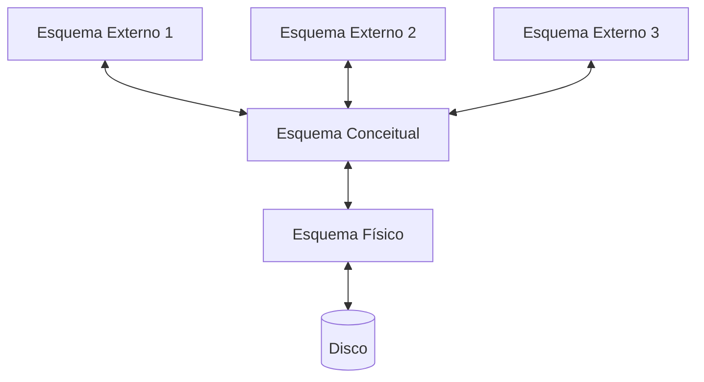
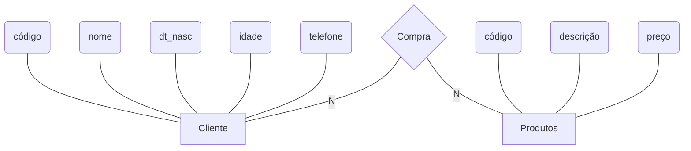

# 1 Conceitos Base de Banco de Dados

Medeiros (2013, p. 15) define “banco de dados (ou, abreviadamente, BD) como sendo um conjunto de dados com certa organização característica, com o objetivo de armazenamento persistente dos dados e dotado de mecanismos de manipulação para obtenção de informações e recuperação posterior, dentro de um sistema de informação”.

SGBD - Sistema Gerenciador de Banco de Dados

## Classificação dos Bancos de Dados

1. Modelo hierárquico: a busca de um registro deve sempre iniciar pela raiz;

2. Modelo relacional: dados organizados em tabelas, ou relações;

3. Modelo orientado a objetos: o modelo de dados de objeto define um banco de dados em termos de objetos, suas propriedades e operações. Os objetos com a mesma estrutura e comportamento pertencem a uma classe, e as classes são organizadas em hierarquias (ou grafos acíclicos). As operações de cada classe são especificadas com procedimentos predefinidos, chamados métodos;

4. Modelo em rede: semelhante ao hierárquico, mas permite um acesso mais direto aos dados.

* Dados à são fatos brutos, em sua forma primária. E muitas vezes os dados podem não fazer sentido sozinhos;

* Informações à consistem no agrupamento de dados de forma organizada para fazer sentido, gerar conhecimento.

## Sistema Gerenciador de Banco de Dados (SGBD)

Nos SGBDs é definida a estrutura de armazenamento e o mecanismo de manipulação dos dados, garantindo a segurança das informações. Os SGBDs controlam os dados que são armazenados nos bancos de dados.

Figura 10 – Níveis de abstração em um modelo de dados



Esquema conceitual: Descreve a estrutura do banco de dados. Concentra-se na descrição de entidades, tipos de dados, relacionamentos, operações do usuário e restrições. Ex: Alunos(cod_aluno: string, nome: string, login: string, idade: integer)

O processo de produzir um esquema conceitual é chamado de projeto conceitual de banco de dados.

Esquema físico: são detalhados os componentes da estrutura física do banco de dados, como Tabelas, Colunas, Tipos e tamanho dos dados e Índices.

Esquema externo: É a customização do acesso aos dados, no nível dos usuários individuais ou em grupos. Todos os bancos de dados têm apenas um esquema conceitual e um esquema físico, pois há apenas um conjunto de relações armazenadas, mas pode haver diversos esquemas externos, adaptados a grupos de usuários distintos.

## Aspectos de Modelagem de Dados

Análise de requisito - Modelo conceitual - Diagrama de entidade-relacionamento (DER)



# 2 Modelagem de Banco de Dados

## Modelo Entidade e Relacionamento

Uma entidade é o objeto básico representado no modelo ER.

   {: width="100" height="100" }

Os atributos descrevem as características de uma entidade.

   {: width="100" height="100" }

O relacionamento estabelece uma relação ou associação entre as entidades, com um significado específico do mundo real.

   {: width="100" height="100" }

| Cardinalidade | Descrição                                                    |
| ------------- | ------------------------------------------------------------ |
| 1:1           | Um elemento de uma entidade se relaciona com um elemento de outra entidade |
| 1:N ou N:1    | Um elemento de uma entidade pode se relacionar com mais de um elemento de outra entidade |
| N:N           | Vários elementos de uma entidade podem se relacionar com vários elementos de outra entidade e vice-versa |
| 0:1           | Um elemento de uma entidade pode se relacionar a nenhuma ou uma ocorrência de outra entidade |
| 0:N           | Um elemento de uma entidade pode se relacionar a nenhuma ou muitas ocorrências de outra entidade |

## Modelos: Lógico, Físico e Relacional

O modelo lógico de dados reflete as propriedades necessárias para a tradução do modelo conceitual, de maneira que seja possível a descrição dos elementos capazes de serem interpretados por um Sistema Gerenciador de Banco de Dados (SGBD), tais como o detalhamento dos atributos, chaves de acesso, integridade referencial e normalização.

O modelo físico é a etapa final do projeto de banco de dados, estando relacionado diretamente com o profissional do SGBD, podendo variar conforme o SGBD que está sendo utilizado. Já com a definição do SGBD, o modelo físico é criado e cada atributo é devidamente especificado, conforme os tipos de dados do SGBD escolhido.

O modelo ER é conveniente para representar um projeto de banco de dados inicial de alto nível. No modelo relacional, as entidades passam a ser tabelas e os atributos passam a ser colunas.

| Modelo ER                 | Modelo relacional                     |
| ------------------------- | ------------------------------------- |
| ENTIDADE                  | TABELA                                |
| ATRIBUTO SIMPLES          | COLUNA                                |
| ATRIBUTO DERIVADO         | COLUNA                                |
| ATRIBUTO IDENTIFICADOR    | CHAVE PRIMÁRIA (OU SECUNDÁRIA)        |
| ATRIBUTO MULTIVALORADO    | NOVA TABELA E CHAVE ESTRANGEIRA       |
| RELACIONAMENTO 1:1 OU 1:N | CHAVE ESTRANGEIRA                     |
| RELACIONAMENTO N:N        | NOVA TABELA COM 2 CHAVES ESTRANGEIRAS |
| CONJUNTO DE VALORES       | TIPO DE DADOS                         |

## As 12 Regras de Codd

Ao definir o modelo relacional, Codd estabeleceu 12 regras para determinação de um banco de dados relacional.

Estas regras são usadas, portanto para se verificar a fidelidade de um banco de dados ao modelo relacional. Na prática são poucos os gerenciadores de banco de dados que atendem a todas as 12 regras. Na maior parte dos casos são atendidas no máximo 10 regras.

1. Toda informação num banco de dados relacional é apresentada a nível lógico na forma de tabelas;

2. Todo dado em um banco de dados relacional tem a garantia de ser logicamente acessível, recorrendo-se a uma combinação do nome da tabela, um valor de chave e o nome da coluna;

3. Tratamento sistemático de valores nulos; (ausência de informação)

4. O dicionário de dados, catálogo, do banco de dados é baseado no modelo relacional;

5. Há uma linguagem não procedural para a definição, manipulação e controle dos dados;

6. Tratamento das atualizações de visões dos dados;

7. Tratamento de alto nível para inserção, atualização e eliminação de dados;

8. Independência física dos dados; (mudança na memória e no método de acesso, criação de um novo índice, criação de uma nova coluna)

9. Independência lógica dos dados; (mudança no tamanho de uma coluna)

10. Restrição de Integridade; (Identidade, Referencial e Domínio)

11. Independência de Distribuição dos dados;

12. Não subversão das regras de integridade ou restrições quando se usa uma linguagem hospedeira (Siqueira, S.d.).

  

# 3 Linguagem SQL e Comandos DDL

## Structured Query Language

Em 1982 foi lançada a primeira versão padronizada da linguagem SQL, que veio ganhando melhorias de acordo com sua evolução.

Em 1986 foi criado um padrão ANSI e, em 1987, foi criado um padrão ISO.

DDL à Data Definition Language

Finalidade

Definição e manutenção das estruturas do banco de dados, tais como a criação do próprio banco de dados e das tabelas que o compõem, além das relações entre as tabelas e os objetos do banco de dados.

- CREATE


Criação de estruturas de objetos do banco de dados.

```sql
CREATE DATABASE nome_banco

CREATE TABLE nome_tabela nome_coluna tipoDeDados, nome_coluna tipoDeDados
```

Após o tipo pode adicionar NOT NULL, tornando o preenchimento daquela coluna obrigatório. O comando PRIMARY KEY(nome_coluna) ao final define qual coluna será a chave primária. Também é possível usar AUTO_INCREMENT.

- ALTER


Alteração da estrutura de objetos do banco de dados.

```sql
ALTER TABLE nome_tabela // RENAME novo_nome // MODIFY novo_nome novo_tipo

ALTER TABLE nome_tabela ADD COLUMN novo_nome novo_tipo
```

- DROP


Eliminação das estruturas de objetos do banco de dados.

```sql
ALTER TABLE nome_tabela DROP COLUMN novo_nome novo_tipo

DROP TABLE nome_tabela

DROP DATABASE nome_banco
```

- TRUNCATE


Exclusão física de linhas de tabelas.

- RENAME


Renomeação de objetos do banco de dados.

- COMMENT


Inclusão de comentários aos objetos do banco de dados.

- SHOW


Exibe os objetos criados.

```sql
SHOW DATABASES
```

- USE


Marca um banco de dados para que todas as alterações subsequentes sejam feitas apenas nele.

```sql
USE nome_banco
```

- DESCRIBE


Exibe a estrutura da tabela, com nomes, tipos de dados e tamanhos.

```sql
DESCRIBE nome_tabela
```

* A coluna que recebe a chave primária não pode ser NULL;

* Cada tabela tem apenas uma chave primária;

* Tipos de dados mais utilizados para as chaves são INT e VARCHAR;

* O valor da chave primária é atribuído no momento que o registro é criado.

# 4 Comandos DML

DML à Data Manipulation Language

Finalidade

Consultas, inserções, exclusões e alterações em um ou mais registros, de uma ou mais tabelas, de maneira simultânea.

- INSERT


Inserção de dados.

```sql
INSERT INTO nome_tabela (coluna1, coluna2) values (valor1, valor2);
```

- UPDATE


Alteração de dados.

```sql
UPDATE tabela SET coluna='' WHERE condição;
```

- DELETE


Exclusão de dados.

```sql
DELETE FROM tabela;

DELETE FROM tabela WHERE condição;
```

- SELECT


Consulta de dados.

```sql
SELECT * FROM nome_tabela;

SELECT coluna1, coluna2 FROM nome_tabela;

SELECT coluna1, coluna2 FROM nome_tabela WHERE condição;

SELECT coluna1, coluna2 FROM nome_tabela WHERE coluna BETWEEN valor1 AND valor2 ;

SELECT coluna1, coluna2 FROM nome_tabela WHERE coluna LIKE '%a'; (% caractere coringa) 'a%'

SELECT coluna1, coluna2 FROM nome_tabela WHERE coluna LIKE '___'; (número de caracteres)

SELECT coluna1, coluna2 FROM nome_tabela WHERE coluna NOT LIKE '_a%';

SELECT * FROM nome_tabela ORDER BY coluna ASC; (ascendente)

SELECT * FROM nome_tabela ORDER BY coluna DESC; (descendente) // *todas as colunas

SELECT tabela1.coluna1, tabela2.coluna2 FROM tabela1 JOIN tabela2 ON tabela1.coluna3=tabela2.coluna1; // JOIN pode incluir RIGHT JOIN, LEFT JOIN, LEFTOUTER JOIN

SELECT tabela1.coluna1 AS 'apelido' //apelidar colunas, alias
```

- MERGE


Combinação das instruções INSERT, UPDATE e DELETE.

* A ordem de escrita das colunas no comando INSERT não precisa ser na ordem que eles aparecem na estrutura da tabela;

* Os dados que vão ser inseridos que forem do tipo texto são obrigados a usar aspas simples;

* Não é preciso informar todas as colunas da tabela no comando INSERT (somente os definidos como NOT NULL).

Outra prática para a execução do comando INSERT é omitir o nome das colunas.

Com a omissão das colunas no comando INSERT, deve-se prestar atenção a dois pontos importantes:

1. A ordem dos dados é exatamente a ordem em que as colunas estão definidas na tabela;

2. Todas as colunas da tabela devem estar informadas, ainda que o valor seja nulo.

O comando INSERT também permite que sejam inseridos vários registros, ao mesmo tempo (aproveitando o mesmo comando INSERT), em uma mesma tabela.

Operadores condicionais

| >   | maior          |
| ---- | -------------- |
| >=  | Maior ou igual |
| <    | menor          |
| <=   | Menor ou igual |
| =    | igual          |
| <>   | diferente      |

A cláusula WHERE pode conter mais de uma condição, e para isso utilizam-se os conectores lógicos (AND e/ou OR).

O UPDATE pode atualizar uma ou várias colunas no mesmo comando, desde que as colunas sejam separadas por vírgulas.

Também é possível executar um comando UPDATE sem colocar a condição WHERE.

* O DELETE não pode ser utilizado para apagar um dado em uma coluna específica.

* É utilizado para apagar um ou mais registros, dependendo da cláusula WHERE.

* Pode ser utilizado para apagar todos os dados da tabela, bastando para isso não informar condição.

   {: width="100" height="100" }

Algumas outras funções podem ser utilizadas com a instrução SELECT permitindo enxergar os dados de maneiras mais específicas, ajudando na tomada de decisão:

AVG(coluna) média

SUM(coluna) soma

MAX(coluna) máximo

MIN(coluna) mínimo

GROUP BY valor

SELECT COUNT(*) as 'apelido' FROM coluna

LIMIT 3 à retorna os 3 primeiros registros (número máximo);

LIMIT 10, 3 à retorna 3 registros após o 10º registro (11, 12 e 13 registros).

# 5 Comandos DCL e TCL - Join de Tabelas

DCL à Data Control Language

Finalidade

Controle de privilégios de usuários, de forma que o administrador do banco de dados possa determinar o nível de acesso de um usuário aos objetos do banco de dados, concedendo privilégios ou retirando esse acesso e revogando os privilégios.

- CREATE USER


Criar usuário.

```sql
CREATE USER 'novo_usuario' IDENTIFIED BY 'senha';
```

- GRANT


Atribuição de privilégios aos usuários do banco de dados.

```sql
GRANT *direitos ON *destino TO usuário
// *direitos: ALL PRIVILEGES, SELECT, INSERT, UPDATE, DELETE, CREATE, DROP.
// *destinos: nomeDaTabela, *.* global, db.* qualquer tabela, db.tb apenas a tabela tb do banco db
```

- REVOKE


Revogação de privilégios aos usuários do banco de dados.

```sql
REVOKE *direitos ON *destino FROM usuário
```

- DROP USER


Remove usuário.

```sql
DROP USER 'novo_usuario'
```

TCL à Transact Control Language

Uma transação primeiramente é realizada primeira em memória e só são transmitidas fisicamente para o banco de dados após a confirmação de que todas as instruções foram efetuadas com sucesso.

Finalidade

Controle de transações, consideradas o conjunto de uma ou mais operações DML realizadas no banco de dados.

- BEGIN


Indica o início de uma transação e todos os comandos da transação devem vir abaixo de Begin;

- COMMIT


Confirmação das manipulações.

```sql
BEGIN TRANSACTION; 
	UPDATE CONTA CORRENTE set saldoConta= saldoConta - @VaIor where numConta = @contaDe; 
	UPDATE CONTA CORRENTE set saldoConta= saldoConta + @Valor where numConta = @contaPara; 
COMMIT;
```

- ROLLBACK


Desistência das manipulações.

```sql
BEGIN TRANSACTION 'transferencia';
	INSERT INTO uf VALUES('pr'),('sc');
ROLLBACK TRANSACTION 'transferencia';
```

- SAVEPOINT


Criação de pontos para o controle das transações.

## Índices

Os índices são criados para facilitar e agilizar as consultas dos registros no banco de dados.

* Exame nas tabelas à a consulta percorre todos os registros de todas as páginas e seleciona apenas os que são verdadeiros segundo a cláusula WHERE;

* Usando índices à percorre a estrutura da árvore do índice, comparando e extraindo somente os registros que são verdadeiros segundo a cláusula WHERE.

Como foi visto, os índices são utilizados para melhorar as consultas nos registros, mas é preciso levar em conta que a criação da árvore de índice consome um grande espaço em disco, podendo se tornar um problema se o banco está armazenado em um storage.

* Não utilizar colunas que tenham uma grande quantidade de dados duplicados ou que tenham pouca variação, como a coluna sexo.

* O SGBD gasta recursos mantendo os índices sempre atualizados e associados.

CREATE INDEX 'nome do indice' ON tabela(coluna, coluna);

Para um melhor desempenho da criação dos índices, é sugerido criá-los nas seguintes colunas:

* Chaves primárias;

* Chaves estrangeiras;

* Colunas acessadas por intervalos (BETWEEN);

* Campos utilizados em GROUP BY ou ORDER BY.  

# 6 Procedimentos Armazenados

## Stored Procedures

Muitas aplicações que acessam um banco de dados executam rotinas de manipulação de dados a partir da linguagem ou ferramenta utilizada para criar as aplicações. Essas rotinas podem utilizar várias instruções SQLs em sequência. Se essa rotina executada possuir muitas consultas e atualizações no banco de dados, ela vai gerar um consumo maior dos recursos da aplicação. Caso a aplicação for web, o problema se torna um pouco maior, pois vai gerar maior tráfego de informações na rede e maiores requisições para o servidor.

Para tentar amenizar o consumo de recursos pela aplicação, é transferida parte do processamento (programação) para o banco de dados. Essas sub-rotinas que são programadas no banco de dados recebem o nome de stored procedure.

Pontos positivos:

* Simplificação da execução de instruções SQL pela aplicação;

* Transferência de parte da responsabilidade de processamento para o servidor.

* Facilidade na manutenção, reduzindo a quantidade de alterações na aplicação.

Pontos negativos:

* Necessidade de maior conhecimento da sintaxe do banco de dados para escrita de rotinas em SQL;

* As rotinas ficam mais facilmente acessíveis. Alguém que tenha acesso ao banco poderá visualizar e alterar o código.

Um comando que pode ser utilizado em stored procedures, functions e triggers é o DELIMITER. Ele é utilizado para trocar o caractere de finalização. O mysql tem como delimitador o ; (ponto e vírgula), ou seja, o mysql entende que ali o comando está encerrado e não há necessidade de continuidade.

```sql
CREATE PROCEDURE nome_procedure (parametros)
	declaracoes;
CALL nome_procedure (parametros);
DROP PROCEDURE nome_procedure;
```

Os parâmetros são classificados em três modos diferentes: IN, OUT ou INOUT.

* IN à é utilizado apenas para recebimento (entrada) de dados e não é utilizado para dar retorno;

* OUT à é um parâmetro de saída, não sendo informado um valor fixo (direto), apenas uma variável para o retorno;

* INOUT à esse modo de parâmetro pode ser utilizado como entrada ou saída, não podendo ser informado um valor fixo.

Os procedimentos armazenados não precisam ser escritos em SQL; eles podem ser escritos em qualquer linguagem hospedeira.

## Functions

As funções são muito semelhantes aos procedimentos, o que os difere, do ponto de vista estrutural, é a inclusão da cláusula RETURN. Nas funções, existe a obrigatoriedade de um retorno à rotina chamadora, que é feito por meio da cláusula RETURN.

```sql
CREATE FUNCTION nome_funcao (parametros)
RETURNS tipo_dados
codigo_da_funcao
RETURN retorno
SELECT nome_funcao (parametros)
DROP FUNCTION nome_funcao;
```

## Triggers

Algumas ações podem ser disparadas (executadas) em consequência ou resposta de uma ação. Esses disparos podem ser programados na aplicação ou diretamente no banco de dados. A utilização direta no banco de dados chama-se triggers.

Podem-se definir vários triggers em um banco de dados, mas cada comando pode disparar apenas um trigger.

Pontos positivos:

* Parte do processamento que seria executado na aplicação passa para o banco, poupando recursos da máquina cliente;

* Facilita a manutenção, sem que seja necessário alterar o código fonte da aplicação.

Pontos negativos:

* Alguém que tenha acesso não autorizado ao banco de dados poderá visualizar e alterar o processamento realizado pelos gatilhos;

* Requer maior conhecimento de manipulação do banco de dados (SQL) para realizar as operações internamente.

```sql
CREATE TRIGGER nome AFTER/BEFORE INSERT/UPDATE/DELETE 
	ON tabela 
	FOR EACH ROW 
	BEGIN 
	Instruções SQL 
	END
DROP TRIGGER nome;
```

* Não se pode chamar diretamente um TRIGGER com CALL, como se faz com um stored procedures;

* Não é permitido iniciar ou finalizar transações em meio à TRIGGERS;

* Não se pode criar um TRIGGERS para uma tabela temporária – TEMPORARY TABLE;

* TRIGGERS ainda não podem ser implementadas com a intenção de devolver para o usuário ou para uma aplicação mensagens de erros.

## Registros NEW e OLD

As palavras NEW e OLD são utilizadas para acessar os registros antes ou depois da execução. Como exemplo pode-se acessar os registros que serão enviados para uma tabela antes (BEFORE) ou depois (AFTER) de um UPDATE.

* INSERT: o operador NEW.nome_coluna, nos permite verificar o valor enviado para ser inserido em uma coluna de uma tabela. OLD.nome_coluna não está disponível.

* DELETE: o operador OLD.nome_coluna nos permite verificar o valor excluído ou a ser excluído. NEW.nome_coluna não está disponível.

* UPDATE: tanto OLD.nome_coluna quanto NEW.nome_coluna estão disponíveis, antes (BEFORE) ou depois (AFTER) da atualização de uma linha.

## Estruturas de programação

É possível que as stored procedures tenham incorporado dentro dos seus procedimentos algumas estruturas de programação como condicionais, laços de repetição, funções etc.

```sql
IF <condicao> THEN 
 comandos sql caso verdadeiro 
 ELSE 
 comandos sql caso falso 
END IF
WHILE <condicao> DO 
 comandos sql caso verdadeiro 
END WHILE
```
