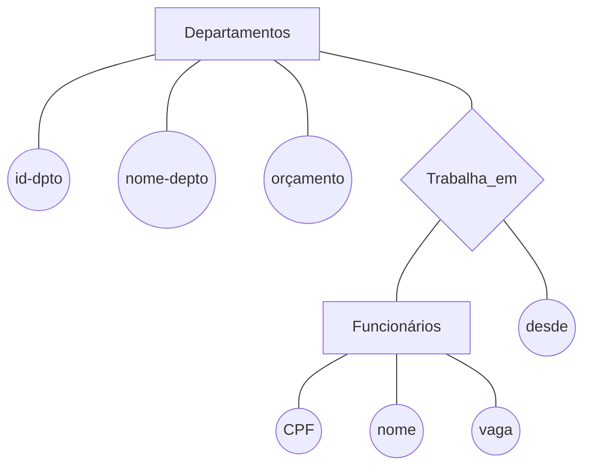
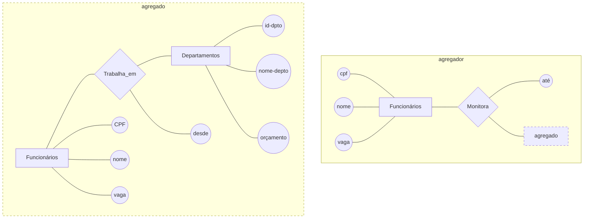

Baseado no livro: Sistemas de Gerenciamento de Banco de Dados (Ramakrishnan; Gehrke)

# 1 Visão Geral sobre Sistemas de Banco de Dados

Um banco de dados é uma coleção de dados que, tipicamente, descreve as atividades de uma ou mais organizações relacionadas.

Um sistema de gerenciamento de banco de dados, ou SGBD, é um software projetado para auxiliar a manutenção e utilização de vastos conjuntos de dados.

A emergência de diversos pacotes de planejamento de recurso empresarial (ERP — enterprise resource planning) e de planejamento de recurso de gerenciamento (MRP — management resource planning) acrescentaram uma camada substancial de recursos orientados a aplicativos acima de um SGBD.

## Vantagens de um SGBD

Independência de Dados, Acesso Eficiente aos Dados, Integridade e Segurança dos Dados, Administração de Dados, Acesso Concorrente e Recuperação de Falha, Tempo Reduzido de Desenvolvimento de Aplicativo.

Uma vantagem muito importante de usar um SGBD é a independência de dados que ele oferece. Ou seja, os programas de aplicativos são isolados das alterações no modo como o dado é estruturado e armazenado.

## Descrevendo e armazenando dados em um SGBD

Um modelo de dados é uma coleção de construtores de alto nível para descrição dos dados que ocultam vários detalhes de baixo nível do armazenamento. A maioria dos sistemas de gerenciamento de banco de dados atuais baseia-se no modelo de dados relacional.

Um modelo de dados semântico é um modelo de dados de alto nível, mais abstrato, que facilita a um usuário alcançar uma boa descrição inicial dos dados de uma empresa.

Um Exemplo de Projeto Ineficiente: O esquema relacional para Alunos ilustra uma escolha de projeto ineficiente; nunca se deve criar um campo tal como idade, cujo valor está constantemente sendo alterado. Uma escolha melhor seria DDN (Data Do Nascimento); a idade pode ser calculada com base nesse dado.

**O modelo relacional:** O construtor central para descrição de dados deste modelo é uma relação, que pode ser considerada um conjunto de registros.

Uma descrição de dados em termos de modelo de dados é chamada esquema (schema). No modelo relacional, o esquema de uma relação especifica seu nome, o nome de cada campo (ou atributo ou coluna), e o tipo de cada campo.

Ex: Alunos (_id-aluno_: string, _nome_: string, _login_: string, _idade_: integer, _média_: real)

Podemos tornar a descrição de um conjunto mais precisa especificando as restrições de integridade.

**Esquema conceitual**: O esquema conceitual (chamado também de esquema lógico) descreve os dados armazenados em termos do modelo de dados do SGBD. Em um SGBD relacional, o esquema conceitual descreve todas as relações que estão armazenadas no banco de dados.

O **esquema físico** especifica os detalhes adicionais de armazenamento. Essencialmente, o esquema físico resume como as relações descritas no esquema conceitual são realmente armazenadas em dispositivos de armazenamento secundário como discos e fitas.

**Esquemas externos**, que normalmente também são representados em termos do modelo de dado do SGBD, permitem que o acesso aos dados seja customizado (e autorizado) no nível dos usuários individuais ou em grupos. Qualquer banco de dados tem exatamente um esquema conceitual e um esquema físico porque ele tem apenas um conjunto de relações armazenadas, mas pode ter diversos esquemas externos, cada um adaptado a um grupo particular de usuários.

Cada esquema externo consiste em uma coleção de uma ou mais visões e relações do esquema conceitual.

## Consultas em um SGBD

Um recurso muito atrativo do modelo relacional é o suporte a linguagens de consulta poderosas. O cálculo relacional é uma linguagem de consulta formal baseada na lógica matemática, e as consultas nesta linguagem têm um significado intuitivo e preciso. A álgebra relacional é outra linguagem de consulta formal, baseada em uma coleção de operadores para manipular relações, que é equivalente em poder ao cálculo.

## Gerenciamento de transações

Uma transação é uma execução qualquer de um programa de usuário em um SGBD. Uma importante tarefa de um SGBD é planejar os acessos concorrentes aos dados de forma que cada usuário possa seguramente ignorar o fato de que há outros usuários acessando os dados concorrentemente.

Um protocolo de bloqueio é um conjunto de regras que devem ser seguidas por cada transação (e forçadas pelo SGBD) para assegurar que, mesmo que ações de diversas transações possam ser intercaladas, o efeito geral seja idêntico à execução de todas as transações em alguma ordem serial. Um bloqueio é um mecanismo utilizado para controlar o acesso aos objetos do banco de dados. Dois tipos de bloqueios são normalmente suportados por um SGBD: bloqueios compartilhados em um objeto podem ser mantidos por duas transações diferentes ao mesmo tempo, mas um bloqueio exclusivo em um objeto assegura que nenhuma outra transação mantenha nenhum bloqueio nesse objeto.

Um SGBD deve assegurar que as alterações realizadas por transações incompletas ou falhas do sistema sejam removidas do banco de dados. Para fazer isso, o SGBD mantém um log de todas as escritas no banco de dados. Uma propriedade crucial do log é a de que cada ação de escrita deve ser registrada no log (em disco) antes que a alteração correspondente seja refletida no banco de dados propriamente dito. Essa propriedade é chamada Write-Ahead Log (Gravação Antecipada do Log) ou WAL.

O tempo necessário para a recuperação de uma falha pode ser reduzido forçando periodicamente o registro de alguma informação no disco; esta operação periódica é chamada ponto de verificação (checkpoint).

## Estrutura de um SGBD

   {: width="100" height="100" }

Administrador de banco de dados (DBA — database administrator).

# 2 Introdução ao Projeto de Banco de Dados

Modelo de entidade-relacionamento (ER)

O processo de projeto de banco de dados pode ser dividido em seis etapas. O modelo ER é o mais relevante nas três primeiras etapas:

1. Análise de requisitos;

2. Projeto Conceitual do Banco de Dados (semântica);

3. Projeto Lógico de Banco de Dados;

4. Refinamento do Esquema;

5. Projeto Físico de Banco de Dados;

6. Projetos de Aplicativos e Segurança

Uma **entidade** é um objeto do mundo real distinguível de outros objetos. Normalmente, é útil identificar uma coleção de entidades semelhantes. Tal coleção é chamada **conjunto de entidades**. Observe que os conjuntos de entidades não precisam ser disjuntos. Uma entidade é descrita utilizando-se um conjunto de **atributos**. Todas as entidades em um determinado conjunto de entidades têm os mesmos atributos. Para cada atributo associado a um conjunto de entidades, devemos identificar um **domínio** de possíveis valores. Além disso, para cada conjunto de entidades, escolhemos uma **chave**, que consiste em um conjunto mínimo de atributos cujos valores identificam unicamente uma entidade do conjunto. Pode haver mais de uma chave candidata; se houver, designamos uma delas como a chave **primária**.

Um **relacionamento** é uma associação entre duas ou mais entidades. Como com as entidades, podemos desejar reunir um conjunto de relacionamentos semelhantes em um **conjunto de relacionamentos**. Um relacionamento também pode ter **atributos descritivos**.



Uma **instância** de um conjunto de relacionamentos é um conjunto de seus relacionamentos. Intuitivamente, uma instância pode ser considerada o ‘retrato’ do conjunto de relacionamentos em determinado momento.

## Recursos Adicionais do Modelo ER

**Restrições de chave:** um para um; muitos para muitos; um para muitos.

**Restrição de participação**: a participação do conjunto de entidades Departamentos no conjunto de relacionamentos Gerencia é considerada **total**. Uma participação que não é total é dita **parcial**. Como um exemplo, a participação do conjunto de entidades Funcionários em Gerencia é parcial, uma vez que nem todo funcionário gerencia um departamento.

**Conjunto de entidades fracas:** Uma entidade fraca pode ser univocamente identificada apenas se considerarmos alguns dos seus atributos em conjunto com a chave primária de uma outra entidade, que é chamada proprietária identificadora.

**Hierarquia de Classe:** A **especialização** é o processo de identificar subconjuntos de um conjunto de entidades (a superclasse) que compartilham algumas características distinguíveis. A **generalização** consiste em identificar algumas características comuns de uma coleção de conjuntos de entidades e criar um novo conjunto de entidades que contenha as entidades possuindo essas características comuns. As **restrições de sobreposição** determinam se duas subclasses podem conter a mesma entidade. As **restrições de cobertura** determinam se as entidades das subclasses incluem coletivamente todas as entidades da superclasse.

**Agregação** nos permite indicar que um conjunto de relacionamentos (identificado através de um quadro tracejado) participa de outro conjunto de relacionamentos.



## Projeto Conceitual com o Modelo ER

Entidade versus Atributo

Entidade versus Relacionamento

Relacionamentos Binários versus Relacionamentos Ternários

Agregação versus Relacionamentos Ternários

## Abordagem da linguagem de modelagem unificada (UML — Unified Modeling Language)

# 3 O Modelo Relacional

O modelo relacional é muito simples e elegante: um banco de dados é uma coleção de uma ou mais relações, em que cada relação é uma tabela com linhas e colunas. Essa representação tabular simples permite que até usuários iniciantes entendam o conteúdo de um banco de dados e possibilita o uso de linguagens de alto nível simples para consultar os dados. As principais vantagens do modelo relacional em relação aos modelos de dados mais antigos são sua representação de dados simples e a facilidade com que mesmo consultas complexas podem ser expressas.

O principal construtor para representar dados no modelo relacional é a relação. Uma **relação** consiste em um **esquema de relação** e em uma **instância de relação**. A instância de relação é uma tabela, e o esquema de relação descreve os cabeçalhos de coluna da tabela. Primeiro, descreveremos o esquema de relação e depois a instância de relação. O esquema especifica o nome da relação, o nome de cada **campo** (ou **coluna** ou **atributo**) e o **domínio** de cada campo. Um domínio é descrito em um esquema de relação pelo **nome de domínio** e tem um conjunto de **valores** associados.

Uma instância de uma relação é um conjunto de tuplas, também chamadas registros, no qual cada tupla tem o mesmo número de campos que o esquema de relação. Uma instância de relação pode ser considerada uma tabela na qual cada tupla é uma linha e todas as linhas têm o mesmo número de campos.

   {: width="100" height="100" }

* Essas restrições de domínio no esquema especificam uma condição importante que queremos que cada instância da relação satisfaça: os valores que aparecem em uma coluna devem ser extraídos do domínio associado a essa coluna. Assim, em termos de linguagem de programação, o domínio de um campo é basicamente o tipo desse campo e restringe os valores que podem aparecer no campo.

* O grau, também chamado aridade, de uma relação é o número de campos. A cardinalidade de uma instância de relação é o número de tuplas que ela contém. Na Figura 3.1, o grau da relação (o número de colunas) é cinco e a cardinalidade dessa instância é seis. Um banco de dados relacional é uma coleção de relações com nomes distintos. O esquema de banco de dados relacional é a coleção de esquemas das relações presentes no banco de dados.

* Um banco de dados é tão bom quanto as informações nele armazenadas e, portanto, um SGBD deve ajudar a evitar a entrada de informações incorretas. Uma restrição de integridade (RI) é uma condição especificada sobre um esquema de banco de dados e limita os dados que podem ser armazenados em uma instância do banco de dados. Se uma instância do banco de dados satisfaz todas as restrições de integridade especificadas em seu esquema, então ela é uma instância válida. Um SGBD impõe restrições de integridade, no sentido de que ele permite o armazenamento apenas de instâncias válidas no banco de dados.

* Uma restrição de chave é uma declaração de que certo subconjunto mínimo dos campos de uma relação é um identificador único para uma tupla. Um conjunto de campos que identifica uma tupla de acordo com uma restrição de chave é chamado chave candidata da relação; freqüentemente, abreviamos isso apenas como chave.

* Além de todas as chaves candidatas disponíveis, um projetista de banco de dados pode identificar uma chave primária. Intuitivamente, uma tupla pode ser referenciada em qualquer outra parte do banco de dados armazenando-se os valores de seus campos de chave primária.

* Às vezes, as informações armazenadas em uma relação estão ligadas às informações armazenadas em outra relação. Se uma das relações for modificada, a outra deverá ser verificada e, talvez, modificada, para manter os dados consistentes. Uma RI envolvendo as duas relações deverá ser especificada, caso um SGBD precise fazer tais verificações. A RI mais comum envolvendo duas relações é uma restrição de chave estrangeira.

```sql
CREATE TABLE Matriculado (
    id-aluno CHAR (20),
    id-curso CHAR (20),
    nota CHAR (10),
    PRIMARY KEY (id-aluno, id-curso), 
    FOREIGN KEY (id-aluno) REFERENCES Alunos
    )
```

* As restrições de domínio, de chave primária e de chave estrangeira são consideradas parte fundamental do modelo de dados relacional e recebem atenção especial na maioria dos sistemas comerciais. Às vezes, entretanto, é necessário especificar restrições mais gerais. Os sistemas de banco de dados relacionais atuais suportam essas restrições gerais na forma de restrições de tabela e assertivas. As restrições de tabela são associadas a uma única tabela e verificadas quando essa tabela é modificada. Em contraste, as assertivas envolvem várias tabelas e são verificadas quando qualquer uma dessas tabelas é modificada.

```sql
CREATE TABLE Matriculado (
    id-aluno CHAR (20),
    id-curso CHAR (20),
    nota CHAR (10),
    PRIMARY KEY (id-aluno, id-curso), 
    FOREIGN KEY (id-aluno) REFERENCES Alunos
    	ON DELETE CASCADE
    	ON UPDATE NO ACTION
    )
```

* A SQL permite que uma restrição esteja no modo DEFERRED ou IMMEDIATE

```sql
SET CONSTRAINT nome-restrição DEFERRED
```

Um conjunto de entidades é mapeado em uma relação de maneira direta: cada atributo do conjunto de entidades torna-se um atributo da tabela. Note que conhecemos os domínios de cada atributo e a chave (primária) de um conjunto de entidades.

Uma visão é uma tabela cujas linhas não são armazenadas explicitamente no banco de dados, mas são calculadas conforme for necessário, com base em uma definição de visão. O mecanismo de visão fornece o suporte para independência lógica de dados no modelo relacional. Ou seja, visões podem ser usadas para definir relações no esquema externo que mascaram para os aplicativos as alterações feitas no esquema conceitual do banco de dados. Por exemplo, se o esquema de uma relação armazenada é alterado, podemos definir uma visão com o esquema antigo e os aplicativos que esperam ver o esquema antigo podem agora usar essa visão. As visões também são valiosas no contexto da segurança: podemos definir visões que dêem a um grupo de usuários acesso apenas às informações que eles podem ver.