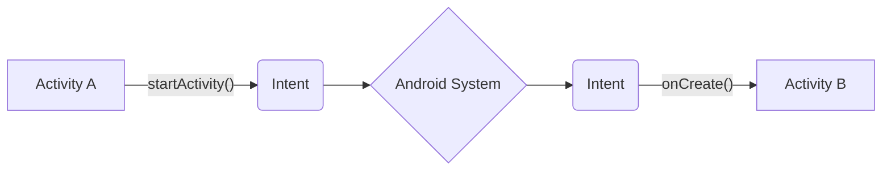
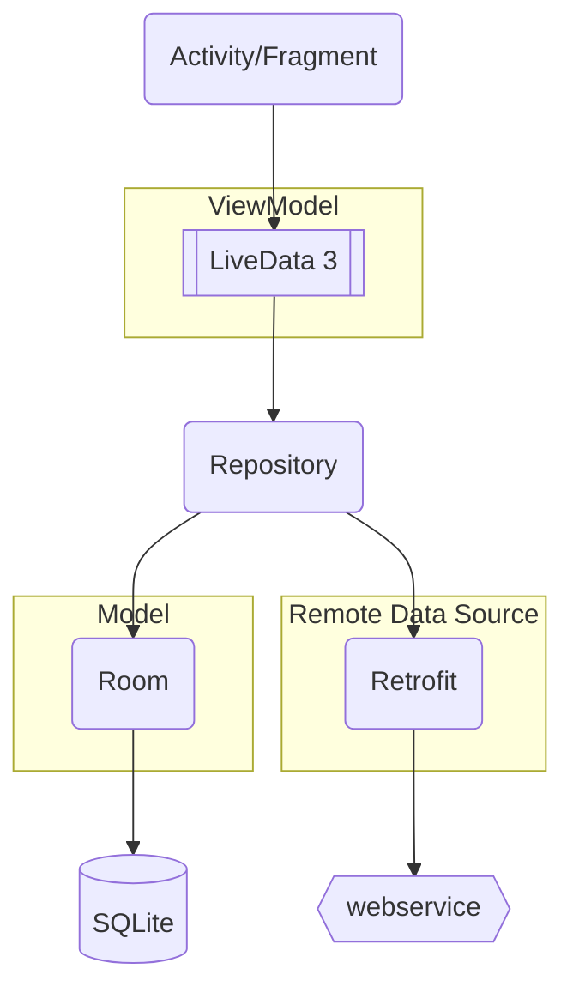
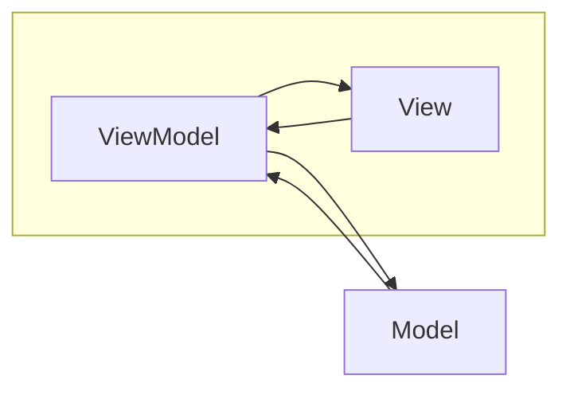
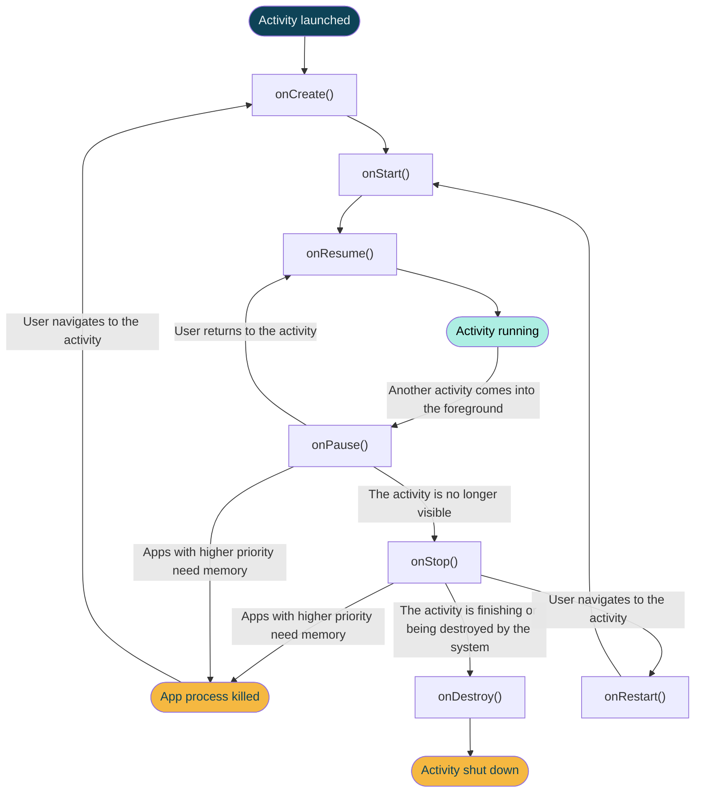
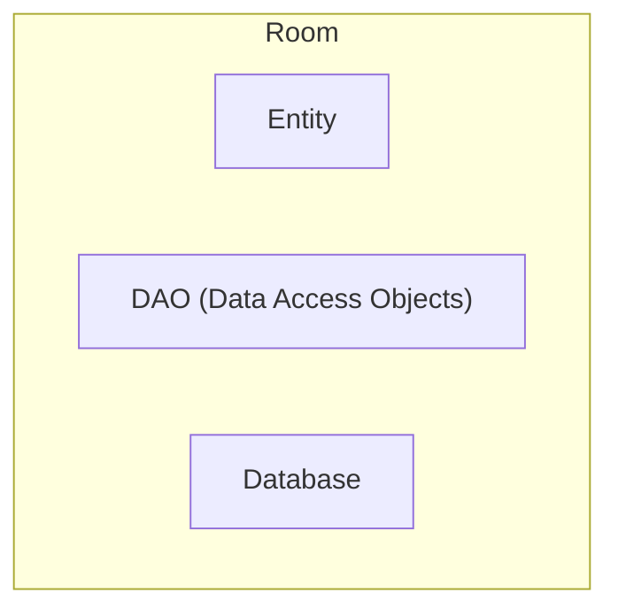
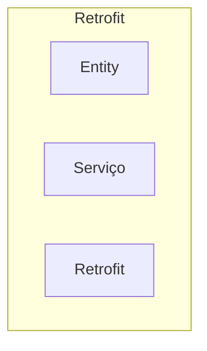

## Introdução

* Open-source software (OSS)
* Orientada a objetos e funcional
* 100% compatível com Java
* Statically Typed
* Concise
* Safe
* Interoperable (pode trabalhar em conjunto com código Java)
* Kotlin roda na JVM: Kotlin code (.kt) -> Kotlinc (compilador) -> Byte code (.class) -> JVM
* Não utiliza ponto e vírgula
* Não possui operador ternário tradicional
* Type safe e null safe
* Inferência de tipo
* Smart cast

# Configuração do Android Studio
#Kotlin
* Em Android SDK, além de baixar as versões que você quer utilizar, marque “show package details” e baixe as “Google APIs Intel x86 Atom System Image” e “Intel x86 Atom System Image” respectivas de cada versão do Android, para um emulador mais eficiente.
* Depois, na aba SDK Tools, marque “show package details” e selecione: 
	* a versão mais recente do “Android SDK Build-Tools”, 
	* “Android Emulator”, 
	* “Android SDK Platform-Tools”,
	* “Android SDK Tools”
	* “Google Play Services”, 
	* “Google USB Driver”, 
	* “Intel x86 Emulator Accelerator (HAXM installer)”.

* Em “Support Repository”, selecione a versão mais recente do “ConstraintLayout for Android” e do “Solver for Constraint Layout”, e marque também “Android Support Repository” e “Google Repository”. (não disponível em versão mais recente do Android Studio)
* Ativar a virtualização: Nos processadores AMD é chamado AMD-V (sempre habilitado). Nos processadores Intel é chamado VT-X (pode estar desabilitado). Nos Recursos do Windows, ativar Hyper-V ou Plataforma do Hipervisor do Windows.
* Na pasta do projeto “Gradle Scripts”, no arquivo Build.gradle (Module: ...), adicionar a plugins: 
	* id ‘kotlin-android-extensions’, para recursos estendidos do Kotlin

# Padrões de projeto e de código
#Kotlin 
## Motivação 
Convenções de código são um conjunto de recomendações para definir o estilo de codificação usado em métodos, variáveis, nome de classes, organização e nomenclatura de arquivos, comentários e outros recursos da linguagem. Convenciona-se para que a leitura seja mais fácil ao se deparar com um código desconhecido e também para que não haja diferentes estilos de programação dentro de um projeto, uma vez que frequentemente projetos são executados por diversas pessoas. 
As convenções descritas aqui estão no site oficial da linguagem Kotlin. 
## Ponto e vírgula 
A linguagem deixa como opcional o uso do ponto e vírgula e dessa maneira, como Kotlin preza pela limpeza do código, o uso do ponto e vírgula é desencorajado. Caso seja declarado na IDE, não haverá problema de compilação, mas haverá o aviso constante de que não é necessário. 
## Nomenclaturas de código 
● Uso de camelCase começando com letra minúscula e evitando underline para: 
○ variáveis 
○ métodos 
○ atributos de classe 
● Identação com espaços com o auxílio da própria IntelliJ IDEA ou Android Studio. 
● Variáveis privadas da classe se iniciam com m minúsculo seguido do nome da variável usando camelCase.
Para constantes, marcados com a palavra const ou declarações val fora de classes e funções, devem usar todas as letras maiúsculas separados com underline.
Métodos que façam sobrecarga são próximos uns dos outros.
## Classes 
Se um arquivo Kotlin possuir uma classe somente, o nome do arquivo deve ser o mesmo nome da classe com a extensão .kt. Se um arquivo contiver múltiplas classes, o ideal é que o nome do arquivo seja algo que descreva a responsabilidade da classe da melhor maneira e mais sucinta possível. 
Para a nomenclatura, usar o padrão CammelCase com a primeira letra sempre maiúscula. 
Já para os parâmetros definidos dentro das classes, caso sejam poucos, podem ser escritas em uma única linha. 
Classes com construtores mais longos devem ser formatadas para que cada propriedade fique em uma linha. Além disso, o parênteses para fechar o construtor deve ficar em uma nova linha.
Objects, companion objects, métodos que façam a sobrescrita da classe pai e construtores secundários ficam no início da classe.
## Chaves - {} 
Em if/else, while, for, do..while, try..catch, funções e classes sempre utilizar as chaves para abertura e fechamento do corpo das instruções.
## Unit (Void) 
O tipo Unit corresponde a nulo. Em funções que não há retorno, não há necessidade de declarar o retorno como Unit, basta deixar em branco. Caso a função possua retorno, então é necessário declarar o tipo.
## Activities e Layout 
Nomes de arquivos de layout devem ser prefixados com os elementos que representam:

| Componente |       Classe        |       Nome do Layout       |
| :--------: | :-----------------: | :------------------------: |
|  Activity  | UserProfileActivity | activity_user_profile.xml  |
|  Fragment  |   SignUpFragment    |    fragment_sign_up.xml    |
|   Dialog   | ChagePasswordDialog | dialog_change_password.xml |

## Arquivos XML 

Quando um elemento não tiver nenhum conteúdo dentro das tags, deve-se usar “self closing” tags.

## Identificadores de elementos 

Identificadores de elementos são escritos em minuscula_com_underline.

| Elemento  | Prefixo |
| :-------: | :-----: |
| TextView  |  text_  |
| EditView  |  edit_  |
|  Button   | button_ |
| ImageView | image_  |
|   Menu    |  menu_  |


## Estrutura principal

```kotlin
fun main() {
  
}
```

## Variáveis

```kotlin
var nome //variável mutável
lateinit var nome //lateinit indica que a variável será inicializada tardiamente
val pi = 3.14 //variável imutável
const val PI = 3.14 //constante cujo valor é atribuído durante a compilação
var caractere: Char = 'a'
var nome: String = "João"
var idade: Int = 10
var preco: Double = 10.50 //padrão da linguagem para números. Para float ou long adicione letra 3.5f 600L
var booleano: Bool = true
var nomes = arrayOf("nome1", "nome2", "nome3", 520)
var numeros = intArrayOf(10, 20, 30)
```

## Tipos

.MAX_VALUE

|  Int   | Boolean |
| :----: | :-----: |
|  Long  |  Char   |
| Float  |  Byte   |
| Double |  Short  |
| Array  |  Null   |

## Atribuição

```kotlin
val MaxValue = if (a>b) a else if (a<b) b else b
```

## Formatação de strings

```kotlin
fun main() {
    val frase = "Kotlin é uma linguagem"
    val caracteristica = "show"
    println(frase+caracteristica)
    println("Kotlin é uma linguagem" + caracteristica)
    println("Kotlin é uma linguagem $caracteristica")
    println("Kotlin é uma linguagem ${caracteristica.length}")
 
    val stg = "lskadlsadfj" +
            "alskdfjiweasdf" +
            "kldfgjsldkfgjlk"
    
    val stg = """lskadlsadfj
            alskdfjiweasdf
            kldfgjsldkfgjlk"""
    
}
```

|                **Capitalização**                 | .capitalize(), .toUpperCase(), .toLowerCase(), .decapitalize() |
| :----------------------------------------------: | :----------------------------------------------------------: |
| **Remoção de espaços ou caracteres inadequados** |              .trimEnd(), .trimStart(), .trim()               |
|          **Substituição de caracteres**          |                        .replace(x, y)                        |
|                  **Formatação**                  |                        .format(valor)                        |

## Empty x Blank

* Métodos de comparação;

* .isEmpty(), .isBlank(), .isNullOrBlank(), .isNullOrEmpty

* Se o tamanho da string for 0 está empty e blank

* Se o tamanho for >0 mas todos os caracteres são espaços em branco, está blank mas não empty.

## Funções

```kotlin
fun calculaBonus (a: Int, b: Int, c: String = “valor default”) : Int { 
//quando a função tem retorno, o tipo é indicado depois dos parâmetros. Quando há um valor default ele não precisa ser passado obrigatoriamente
    println("O bônus é: ${a+b}")
    return a+b
}
```

## N parâmetros

```kotlin
fun media (vararg notas: Float) { 
//vararg permite receber um numero variável de parâmetros
    if (notas.isNotEmpty()){
        var soma = 0f
        for (nota in notas) {
            soma += nota
        }
        println("A média é ${soma/notas.size}")
    }
}
 
fun <T> diversos (vararg valores: T) { //define um tipo genérico que aceita parâmetros de tipos diversos
    
}
```

## Funções de uma única linha

* Infere o tipo de retorno

```kotlin
fun calculaBonus (a: Int, b: Int, c: Int) = println("O bônus é: ${a+b*c}")
```

## Funções/extensões

* Prefixo fun Tipo.nomeDaFunção()

* Cria uma função que só pode ser chamada por um tipo específico, cujo valor pode ser referenciado dentro da função como this:

```kotlin
fun String.randomCapitalizedLetter() = this[(0..this.lenght-1).random()].toUpperCase()
```

## Função local
Função interna a outra função, não acessivel diretamente, quase como se fosse private. Acessivel pela função pai, que pode ser chamada.
## Funções infix
```kotlin
infix fun Int.isHalfOf (value: Int) = value / 2 == this

fun main (args: Array<Strings>) {
	10.isHalfOf(40)
	10 isHalfOf 30 //Infix só pode ser usada com 1 parâmetro
}
```
## Higher Order Functions
```kotlin
fun operator (x: Int, y: Int, op: (Int, Int) -> Int): Int {
	val ret = op(x,y)
	return ret
}

fun sum (x: Int, y:Int) = x+y

fun main (args: Array<String>) {
	val list = listOf(1, 2, 3, 4)
	list.forEach( {println(it)} ) //funções que recebem outras funções como parâmetro
	operator(1, 2, ::sum) //:: para indicar a função pelo nome sem assinatura
}
```
## Lambdas
```kotlin
fun operator (x: Int, y: Int, op: (Int, Int) -> Int): Int {
	val ret = op(x,y)
	return ret
}

fun main (args: Array<String>) {
	operator(10, 20, {a, b -> a+b})
	
	val l1 = {a: Int, b: Int -> a+b}//os lambdas conseguem executar apenas uma instrução
	val l2: (Int, Int) -> Int = {u, i -> u+i} //para executar mais de uma instrução é possível utilizar funções anonimas fun() {}
	operator(10, 20, l1)
	operator(10, 20, l2)
}
```

## Operadores Aritméticos

### unários

+=. ++, --, -=

a++ (postfix) / --a(prefix)

### infix binários

|       **Soma(+)**       | **a.plus(b)**  |
| :---------------------: | :------------: |
|     **Subtrair(-)**     | **a.minus(b)** |
|   **Multiplicar(\*)**   | **a.times(b)** |
|     **dividir(/)**      |  **a.div(b)**  |
| **%(resto da divisão)** |  **a.mod(b)**  |

## Operadores relacionais

Binários/infix

Resultado sempre booleano

|    **== (igual a)**     |    **a.equals(b)**    |
| :---------------------: | :-------------------: |
|   **!= (diferente)**    |  **!(a.equals(b))**   |
|    **> (Maior que)**    | **a.compareTo(b)>0**  |
|    **< (Menor que)**    | **a.compareTo(b)<0**  |
| **>= (Maior ou igual)** | **a.compareTo(b)>=0** |
| **<= (Menor ou igual)** | **a.compareTo(b)<=0** |

## Operadores lógicos

|      **&& (e)**      | **and** | **binário/infix** |
| :------------------: | :-----: | :---------------: |
|    **\|\| (Ou)**     | **or**  | **binário/infix** |
| **^ (ou exclusivo)** | **xor** | **binário/infix** |
|   **! (negação)**    | **not** | **unário/prefix** |

## Operadores in e range

| **in (contém) !in (não contém)** | **Se o valor está presente em uma lista ou uma faixa de valores** |
| :------------------------------: | :----------------------------------------------------------: |
|        **range(int.int)**        |            **Range cria um intervalo de valores**            |

## Operator Overloading

|  a + b  |     a.plus(b)      |    operator fun plus (b: TYPE): TYPE     |
| :-----: | :----------------: | :--------------------------------------: |
|  a - b  |    a. minus(b)     |    operator fun minus (b: TYPE): TYPE    |
|  a * b  |     a.times(b)     |    operator fun times (b: TYPE): TYPE    |
|  a / b  |      a.div(b)      |     operator fun div (b: TYPE): TYPE     |
|  a..b   |    a.rangeTo(b)    |   operator fun rangeTo (b: TYPE): TYPE   |
| a in b  |   b.contains(a)    | operator fun contains (b: TYPE): Boolean |
| a += b  |  a.plusAssign(b)   |  operator fun plusAssign (b:TYPE): Unit  |
| a - = b |  a.minusAssign(b)  | operator fun minusAssign (b:TYPE): Unit  |
| a *= b  |  a.timesAssign(b)  | operator fun timesAssign (b:TYPE): Unit  |
|  a/= b  |   a.divAssign(b)   |  operator fun divAssign (b:TYPE): Unit   |
|   a>b   | a.compareTo(b) >0  |   operator fun compareTo (b:Type): Int   |
|   a<b   |  a.compareTo(b)<0  |   operator fun compareTo(b:TYPE): Int    |
|  a>=b   | a.compareTo(b) >=0 |  operator fun compareTo (b: Type): Int   |
|  a<=b   | a.compareTo(b)<=0  |  operator fun compareTo (b: Type): Int   |

## Operador Elvis (?)

```kotlin
val test: Int? = null //permite atribulir valor null a variável
val num: Int = test ?: 100 //se test for null, atribua 100, para evitar erros
```

## Controle de fluxo if else

```kotlin
  if( idade <= 9 ){
  }
  else if( idade >= 10 && idade <= 18 ){
  }
  else{
  }
fun calculaIdade (idade: Int) : Boolean { //depois dos : indica o tipo de retorno da função
    return idade >=18
}
val str = if(valor==10) "sim" else "não" //é possível utilizar if else diretamente na atribuição de uma variável
```

## Controle de fluxo – When

```kotlin
when (c) {
  "soma" -> {
    return a+b
  }
  "subtração" -> {
    return a-b
  }
  else -> {
    println("Operação incorreta")
    return 0
  }
}
 
when (a) {
  in 0..100 -> { // o in e os dois pontos permitem criar um range, um intervalo de valores
    println("o número está entre 0 e 100")
  }
}
```

## Loops for e while

* Aceita os comandos in, range, until, downTo e step. forEach

```kotlin
  while( numero <= 5 ){
    
  }
  do{
    
  }while(var palavra in palavras);
  
for (i in 1..100 step 2) {
    print("$i ")
}
for (j in 100 downTo 0) {
    print("$j ")
}
```

## Conversão de valores

* A operação entre valores de tipo diferente gera um resultado do tipo de maior tamanho. A conversão de valores deve ser explicita.

|  Double   | **64** | **.toDouble()** |
| :-------: | :----: | :-------------: |
| **Float** | **32** | **.toFloat()**  |
| **Long**  | **64** |  **.toLong()**  |
|  **Int**  | **32** |  **.toInt()**   |
| **Short** | **16** | **.toShort()**  |
| **Byte**  | **8**  |  **.toByte()**  |
| **Char**  |        |  **.toChar()**  |

## Exceções

* Tratamento para evitar a quebra da execução

```kotlin
try {
    println("joão".toInt())
}
catch(e: NumberFormatException) { //exceção específica
    println("Erro na conversão de string para inteiro")
}
catch(e: Exception) { //coloque a exceção mais genérica por último, do contrátio o erro sempre cairá nela e não na específica
    println("Erro genérico")
}
finally { //sempre é executado, independentemente de erro
    //aqui poder incluir uma verificação, caso tenha havido erro, para encerrar o processo
}
```

## Null Safe

* O operador Elvis em Kotlin permite que variáveis assumam valor nulo, dando mais segurança ao evitar erros relacionados a null.

```kotlin
val str: String? = null
println(str?.length) //o operador elvis previne o erro
println(str!!.lenght) // o operador !! permite que o erro ocorra
```

## Pacotes

* Pacotes servem para separar códigos/usos, manter pacotes concisos e coesos

```kotlin
import basic.* //o asterisco indica que todos os recursos do pacote serão importados
```

## Classes e Objetos

```kotlin
class Casa { //padrão de nomenclatura, classes com primeira letra maiúscula
    var cor: String = ""
    fun abrirJanela(qtdJanelas: Int){ //padrão de nomenclatura, métodos e propriedades em camelCase
        println("Abrir janela total: $qtdJanelas ")
    }
    fun abrirPorta(){
        println("Abrir porta")
    }
    fun abrirCasa(){
        this.abrirJanela()
        this.abrirPorta()
    }
}
fun main(args: Array<String>) {
    val casa = Casa() //criação do objeto
    casa.cor = "Amarela"
    casa.abrirJanela( 10 )
    val casa2 = Casa()
    casa2.cor = "Vermelha"
    println(casa.cor)
    println(casa2.cor)
}
```

## Construtores

```kotlin
class Casa( var cor: String) { //construtor primário, definido na declaração da classe
    var cor: String
    var vagasGaragem: Int
    constructor( vagasGaragem: Int  ){ //construtor secundário, evitar utilizar ambos pedindo o mesmo parâmetro. Pode ser usado para pedir parâmetros adicionais, diferentes do construtor primário
        this.cor = cor
        this.vagasGaragem = vagasGaragem
    }
    init{ //inicializa as propriedades passadas para o construtor primário
        this.cor = cor
        this.vagasGaragem = vagasGaragem
    }
    fun detalhesCasa(){
        println("A casa tem a cor: $cor, vagas: $vagasGaragem ")
    }
}
fun main(args: Array<String>) {
    val casa = Casa("Amarela", 2)
    casa.detalhesCasa()
}
```

## Herança

```kotlin
open class Animal{ //no kotlin, por padrão, as classes não podem ser herdadas. Para fazer isso utilizar open
    open fun dormir(){ //o open aqui permite que o método seja sobrescrito pelas classes filhas
        println("Dormir")
    }
    fun correr(){
        println("Correr")
    }
}
class Cao : Animal() { //notação para indicar herança
    override fun dormir(){ //sobrescrita de método
        super.dormir() //chama o método original
        println("como um cao") //acrescenta a alteração sobrescrita
    }
    fun latir(){
        println("Latir")
    }
    fun latir(i: String){ //sobrecarga de método (overload). Método com mesmo nome, mas com parâmetros e implementação diferentes
        println("Latir como um $i")
    }
 
}
class Passaro: Animal() {}
fun main(args: Array<String>) {
    val cao = Cao()
    cao.dormir()
    cao.correr()
    cao.latir()
    val passaro = Passaro()
}
```

## Modificadores Static e Final

* Ao tornar o atributo estático, ele fica acessível sem a necessidade de instanciar a classe em um objeto.

* O objeto marcado como final não pode ser alterado/sobrescrito.

## Constantes e Variáveis estáticas

```kotlin
class Constantes {
    companion object NOME { //companion object armazena constantes, funções e variáveis estáticas. O nome é opcional
        val TABLE = "mesa" //notação de constantes em maiúsculas
        fun teste() [
            println("teste")
        ]
    }
    object VENDAS { //nome obrigatório. É possível criar objects dentro de objectes, criando hierarquias
        var OBJETO = "cadeira"
    }
}
fun main() {
    Constantes.TABLE
    Constantes.NOME.TABLE
    Constantes.VENDAS.OBJETO
}
```

## Getters e Setters

* O Kotlin cria getters e setters automaticamente, sem a necessidade de criação explicita (exceto quando você quer criar validações próprias, aí utilizar Field).

## Field

```kotlin
class Maquina (var marca: String) {
    var nucleos: Int =0
        get() {
            println("get for chamado")
            return field //a palavra field é utilizada para getters e setters para evitar chamadas recursivas
        }
        set(value) {
            println("set foi chamado")
            field = value
    	}
}
```

## Classes Enum
A clase enum pode ser utilizada como uma representação dos próprios objetos, sem instâncias.
```kotlin
enum class Prioridade1 { //As classes enum servem para listar possibilidades 
    BAIXA, MEDIA, ALTA
}
enum class Prioridade2 (val id: Int) { //classes enum também podem ser utilizadas como parâmetros de outras classes
    BAIXA(id:1) {
        override fun toString(): String{
            return "string de prioridade baixa"
        }
    }, MEDIA(id:5), ALTA(id:10)
    //é possível fazer override dos atributos de um enum para, por exemplo, convertê-los em tipos primitivos para permitir comparações e verificações.
}
fun main(args: Array<String>) {
    println(Prioridade1.BAIXA)
    println(Prioridade2.BAIXA.id)
    for (p in Prioridade2.values()) {
        println("$p - ${p.id} - ${p.ordinal}") //o atributo ordinal indica a posição do atributo no enum
    }        
}
```

## Data Class
Armazenar um estado imutavel em um objeto.

```kotlin
data class Pessoa (var nome: String, var telefone: Int) { //data class é utilizada para agregar dados/atributos, que podem ser passados para outras funções e classes com mais facilidade
}
fun cadastro (var pessoa: Pessoa) {
}
//ao comparar 2 objetos em uma expressão lógica, são comparadas as posições de memória, mas quando utilizamos data class, são utilizados os atributos para comparação. Permite verificar a função .hashcode() para comparar e também copiar todos os valores para uma nova instância (.copy()).
```

## Classes Abstratas

```kotlin
interface Presidenciavel { //interface marca uma classe como uma interface
//interface não pode ter valores, estados, variáveis
  abstract fun participarEleicao() //metodo abstrato sem corpo sem as chaves. As classes filhas são obrigadas a sobrescrever o método
}
abstract class Cidadao { //classe abstrata não pode ser instanciada, usada apenas para herança
  init{ //a funçõa init é sempre executada, independente de quantos objetos da classe são instanciados
    var cpf: String = 000.000.000-00
  }
  fun direitosDeveres(){ 
    println("Todo cidadão tem direitos e deveres");
  }
}
class Obama : Cidadao(), Presidenciavel() { //classe concreta instanciável
  @override
  fun participarEleicao(){
    println("Participar eleicão Estados Unidos");
  }
}
//a herança em kotlin é sempre simples. Ou seja, uma classe só pode herdar de outra, mas pode implementar diversas interfaces
```

## Interface

* Pode-se dizer, grosso modo, que uma interface é um contrato que quando assumido por uma classe deve ser implementado. Interface é utilizada pois podemos ter muitos objetos (classes) que podem possuir a mesma ação (métodos), porém, podem executá-las de maneiras diferentes.

* A interface também é utilizada pois o Kotlin não permite herança múltipla (extends).

* Veja no exemplo de código anterior.

## With

```kotlin
//Para chamar muitas funções de uma mesma classe ao mesmo tempo, pode-se usar with
fun main () {
    var m = Maquina(marca: "spto")
    with(m) {
        ligar()
        processar()
        desligar()
    }
}
```
## Nested Class
Classe interna
```kotlin
class Computer (val processador: String) {
	inner class Memory () { //classe interna
	}
}
fun main (args: Array<String>) {
	val m1: Computer.Memory = Computer().Memory()
}
```
## Sealed Class
Sealed Class limita o acesso da classe para herança ao mesmo aquivo onde ela está.
```kotlin
sealed class Computer (val processador: String) {
	
	}
```

# Modificadores de Acesso
* private -> Visível apenas dentro da classe
* protected -> Funciona como o "private", mas é visível em subclasses
* open -> Visível em todo lugar, caso não seja definido é o padrão.
* internal -> Lembra o Public, mas sua visibilidade é restringida ao módulo, sendo então visível dentro de um mesmo módulo.

#Kotlin 
```kotlin
open class Animal {
    internal var nome = "marley"
    fun dormir(){
        println("Dormir")
    }
}
class Cao : Animal() {
    fun exibeNome(){
        println( "Método exibe nome: $nome" )
    }
}
fun main(args: Array<String>) {
    val cao = Cao()
    cao.exibeNome()
    println( animal.nome )
}
```

## Coleções
O Kotlin não possui coleções próprias, ele utiliza as mesmas do Java.
```kotlin
package collections
fun main (args: Array<Strings>){
	//List, array, set, hashmap
	val l1 = listOf("Madrid", "São Paulo", "Berlin") //imutável
	val l2 = mutableListOf("Madrid", "São Paulo", "Berlin") //mutável
	val array = arrayListOf("Madrid", "São Paulo", "Berlin") //utiliza os métodos do Java
	val s1 = setOf("Madrid", "São Paulo", "Berlin") //não aceita elementos repetidos
	val s2 = mutableSetOf("Madrid", "São Paulo", "Berlin") //não aceita elementos repetidos
	val h1 = hashMapOf<String, String>(Pair("key", "value"), Pair("França", "Paris")) //hashmap
	val h2 = mapOf<String, String>(Pair("key", "value"), Pair("França", "Paris")) //igual hashmap
	val h3 = mutableMapOf<String, String>(Pair("key", "value"), Pair("França", "Paris")) //igual hashmap
}
```

```kotlin
package XIIIColecoes

data class Receita(val nome: String, val calorias: Int, val ingredientes: List<Ingredientes> = listOf())
data class Ingredientes(val nome: String, val quantidade: Int)

fun main() {

    // Cria lista de dados
    val data = listOf(
        Receita(
            "Lasanha", 1200,
            listOf(
                Ingredientes("Farinha", 1),
                Ingredientes("Presunto", 5),
                Ingredientes("Queijo", 10),
                Ingredientes("Molho de tomate", 2),
                Ingredientes("Manjerição", 3)
            )
        ),
        Receita("Panqueca", 500),
        Receita("Omelete", 200),
        Receita("Parmegiana", 700),
        Receita("Sopa de feijão", 300),
        Receita(
            "Hamburguer", 2000,
            listOf(
                Ingredientes("Pão", 1),
                Ingredientes("Hamburguer", 3),
                Ingredientes("Queijo", 1),
                Ingredientes("Catupiry", 1),
                Ingredientes("Bacon", 3),
                Ingredientes("Alface", 1),
                Ingredientes("Tomate", 1)
            )
        )
    )

    // Tenho receitas na lista?
    println("Tenho receitas? ${if (data.any()) "sim" else "não"}.")

    // Quantas receitas tenho na coleção?
    println("Tenho ${data.count()} receitas.")

    // Tenho alguma receita de Lasanha?
    println("Tenho receitas de Lasanha? ${if (data.any { it.nome.contains("Lasanha") }) "sim" else "não"}.")

    // Quantas receitas de Lasanha?
    println("Tenho ${data.count { it.nome.contains("Lasanha") }} receitas de Lasanha.")

    // Qual a primeira e última receita?
    println("A primeira receita é: ${data.first().nome}.")
    println("A última receita é: ${data.last().nome}.")

    // Qual a soma de calorias?
    val sumCalories = data.sumBy { it.calorias }
    println("A soma de calorias é: $sumCalories")

    // Me dê as duas primeiras receitas
    val firstTwo = data.take(2)
    for (x in firstTwo.withIndex()) {
        println("${x.index + 1} - ${x.value.nome}")
    }

    // Sei como fazer panqueca? E sushi?
    val knowPanqueke = data.filter { it.nome == "Panqueca" }.any()
    println("Sei fazer panqueca? ${if (knowPanqueke) "sim" else "não"}")

    val knowSushi = data.filter { it.nome == "Sushi" }.any()
    println("Sei fazer sushi? ${if (knowSushi) "sim" else "não"}")

    // Quais são as comidas com mais de 500 calorias?
    data.filter { it.calorias > 500 }.forEach { println(it.nome) }

    // Qual a receita mais calórica? E a menos calórica?
    val maisCal = data.maxBy { it.calorias }
    println("Mais calórica: ${maisCal?.nome}")

    val menosCal = data.minBy { it.calorias }
    println("Menos calórica: ${menosCal?.nome}")

    // Faça uma lista com o nome dos pratos
    data.map { it.nome }

    // Qual a média de calor de todas as receitas?
    val media = data.map { it.calorias }.average()
    println("A média de calorias é: $media.")

    // Lista de dados simples
    val listaInteiros = listOf(1, 2, 6, 67, 7, 3, 34, 56, 3, 3, 2, 5, 34, 2)
    println("Lista distinta: ${listaInteiros.distinct()}.")
    println("Máximo: ${listaInteiros.max()}.")
    println("Mínimo: ${listaInteiros.min()}.")

    // Eliminar receitas com mesmo nome
    println(data.distinctBy { it.nome })

    // Ordenar uma lista
    listaInteiros.sorted()
    listaInteiros.sortedDescending()

    // Inverter uma lista
    listaInteiros.reversed()

}
```
## Imagens

* Adicionar arquivos de imagem na pasta “res/drawable”.

* A classe R. armazena o id dos elementos de interface.

* Utilizar como unidade de tamanho “dp” para imagens e “sp” para textos, para melhor ajuste a diferentes telas.

## Botão

* Ao criar uma função que será ativada por botão na interface (onClick), essa função deverá receber como parâmetro uma view:

* Recuperar view por id:

* findViewbyID(R.id.nome_da_id) as tipodowidget

* ou

* Com o plugin Kotlin Android Extensions, você pode referenciar o id diretamente.

```kotlin
fun gerarFrase(view: View){
    val totalIntensArray = frases.size
    val numeroAleatorio = Random().nextInt( totalIntensArray )
    texto.setText( frases[ numeroAleatorio ] )
}
```

## Orientação padrão do app (em caso de rotação)

* Para definir uma orientação fixa acesse o arquivo AndroidManifest.xml na pasta manifests e adicione, após 

```xml
<activity android:name=".MainActivity">
	<android:screenOrientation=”portrait”>
```

# Banco de dados (SQLite)
Armazenamento de dados
Banco de dados relacional 
○ Estrutura de tabelas 
● Tipos de dados permitidos 
○ TEXT, REAL, INTEGER, NULL, BLOB

O SQLite é uma pequena biblioteca, implementada em C que oferece acesso a uma base de dados relacional SQL e suportando até 2 TB de dados. Seu armazenamento é feito em um arquivo de texto dentro do dispositivo, e não existe a necessidade de se estabelecer qualquer tipo de conexão JDBC ou ODBC por exemplo.

#Kotlin 
```kotlin
package com.example.convidados.service.repository

import android.content.ContentValues
import android.content.Context
import android.text.Selection
import com.example.convidados.service.constants.DataBaseConstants
import com.example.convidados.service.model.GuestModel
import java.lang.Exception
import java.util.ArrayList

class GuestRepository private constructor(context: Context) {

    // Acesso ao banco de dados
    private var mGuestDataBaseHelper: GuestDataBaseHelper = GuestDataBaseHelper(context)

    /**
     * Singleton
     */
    companion object {
        private lateinit var repository: GuestRepository

        fun getInstance(context: Context): GuestRepository {
            if (!::repository.isInitialized) {
                repository = GuestRepository(context)
            }
            return repository
        }
    }

    /**
     * Carrega convidado
     */
    fun get(id: Int): GuestModel? {

        var guest: GuestModel? = null
        return try {
            val db = mGuestDataBaseHelper.readableDatabase

            // Colunas que serão retornadas
            val projection = arrayOf(
                DataBaseConstants.GUEST.COLUMNS.NAME,
                DataBaseConstants.GUEST.COLUMNS.PRESENCE
            )

            // Filtro
            val selection = DataBaseConstants.GUEST.COLUMNS.ID + " = ?"
            val args = arrayOf(id.toString())

            val cursor = db.query(
                DataBaseConstants.GUEST.TABLE_NAME,
                projection,
                selection,
                args,
                null,
                null,
                null
            )

            // Verifica se existem dados no cursor
            if (cursor != null && cursor.count > 0) {
                cursor.moveToFirst()

                val name = cursor.getString(cursor.getColumnIndex(DataBaseConstants.GUEST.COLUMNS.NAME))
                val presence = (cursor.getInt(cursor.getColumnIndex(DataBaseConstants.GUEST.COLUMNS.PRESENCE)) == 1)

                guest = GuestModel(id, name, presence)
            }

            cursor?.close()
            guest
        } catch (e: Exception) {
            guest
        }
    }

    /**
     * Insere convidado
     */
    fun save(guest: GuestModel): Boolean {
        return try {

            // writableDatabase - Para fazer escrita de dados
            val db = mGuestDataBaseHelper.writableDatabase

            val contentValues = ContentValues()
            contentValues.put(DataBaseConstants.GUEST.COLUMNS.NAME, guest.name)
            contentValues.put(DataBaseConstants.GUEST.COLUMNS.PRESENCE, guest.presence)
            db.insert(DataBaseConstants.GUEST.TABLE_NAME, null, contentValues)
            true
        } catch (e: Exception) {
            false
        }
    }

    /**
     * Faz a listagem de todos os convidados
     */
    fun getAll(): List<GuestModel> {
        val list: MutableList<GuestModel> = ArrayList()
        return try {
            val db = mGuestDataBaseHelper.readableDatabase

            // Colunas que serão retornadas
            val projection = arrayOf(
                DataBaseConstants.GUEST.COLUMNS.ID,
                DataBaseConstants.GUEST.COLUMNS.NAME,
                DataBaseConstants.GUEST.COLUMNS.PRESENCE
            )

            // Linha única
            // Cursor cursor = db.rawQuery("select * from Guest", null);

            // Faz a seleção
            val cursor = db.query(
                DataBaseConstants.GUEST.TABLE_NAME,
                projection,
                null,
                null,
                null,
                null,
                null
            )

            if (cursor != null && cursor.count > 0) {
                while (cursor.moveToNext()) {

                    val id = cursor.getInt(cursor.getColumnIndex(DataBaseConstants.GUEST.COLUMNS.ID))
                    val name = cursor.getString(cursor.getColumnIndex(DataBaseConstants.GUEST.COLUMNS.NAME))
                    val presence = (cursor.getInt(cursor.getColumnIndex(DataBaseConstants.GUEST.COLUMNS.PRESENCE)) == 1)

                    val guest = GuestModel(id, name, presence)
                    list.add(guest)
                }

                // Como verificar se um valor é nulo
                // cursor.isNull(cursor.getInt(cursor.getColumnIndex(DataBaseConstants.GUEST.COLUMNS.PRESENCE))
            }

            cursor?.close()
            list
        } catch (e: Exception) {
            list
        }
    }

    /**
     * Faz a listagem de todos os convidados presentes
     */
    fun getPresent(): List<GuestModel> {
        val list: MutableList<GuestModel> = ArrayList()
        return try {
            val db = mGuestDataBaseHelper.readableDatabase

            val cursor = db.rawQuery("SELECT id, name, presence FROM Guest WHERE presence = 1", null)

            if (cursor != null && cursor.count > 0) {
                while (cursor.moveToNext()) {

                    val id = cursor.getInt(cursor.getColumnIndex(DataBaseConstants.GUEST.COLUMNS.ID))
                    val name = cursor.getString(cursor.getColumnIndex(DataBaseConstants.GUEST.COLUMNS.NAME))
                    val presence = (cursor.getInt(cursor.getColumnIndex(DataBaseConstants.GUEST.COLUMNS.PRESENCE)) == 1)

                    val guest = GuestModel(id, name, presence)
                    list.add(guest)
                }
            }

            cursor?.close()
            list
        } catch (e: Exception) {
            list
        }
    }

    /**
     * Faz a listagem de todos os convidados presentes
     */
    fun getAbsent(): List<GuestModel> {
        val list: MutableList<GuestModel> = ArrayList()
        return try {
            val db = mGuestDataBaseHelper.readableDatabase

            val cursor = db.rawQuery("SELECT id, name, presence FROM Guest WHERE presence = 0", null)

            if (cursor != null && cursor.count > 0) {
                while (cursor.moveToNext()) {

                    val id = cursor.getInt(cursor.getColumnIndex(DataBaseConstants.GUEST.COLUMNS.ID))
                    val name = cursor.getString(cursor.getColumnIndex(DataBaseConstants.GUEST.COLUMNS.NAME))
                    val presence = (cursor.getInt(cursor.getColumnIndex(DataBaseConstants.GUEST.COLUMNS.PRESENCE)) == 1)

                    val guest = GuestModel(id, name, presence)
                    list.add(guest)
                }
            }

            cursor?.close()
            list
        } catch (e: Exception) {
            list
        }
    }

    /**
     * Atualiza convidado
     */
    fun update(guest: GuestModel): Boolean {
        return try {
            val db = mGuestDataBaseHelper.writableDatabase

            val contentValues = ContentValues()
            contentValues.put(DataBaseConstants.GUEST.COLUMNS.NAME, guest.name)
            contentValues.put(DataBaseConstants.GUEST.COLUMNS.PRESENCE, guest.presence)

            // Critério de seleção
            val selection = DataBaseConstants.GUEST.COLUMNS.ID + " = ?"
            val args = arrayOf(guest.id.toString())

            db.update(DataBaseConstants.GUEST.TABLE_NAME, contentValues, selection, args)
            true
        } catch (e: Exception) {
            false
        }
    }

    /**
     * Remove convidado
     */
    fun delete(id: Int): Boolean {
        return try {
            val db = mGuestDataBaseHelper.writableDatabase
            val selection = DataBaseConstants.GUEST.COLUMNS.ID + " = ?"
            val args = arrayOf(id.toString())

            db.delete(DataBaseConstants.GUEST.TABLE_NAME, selection, args)

            true
        } catch (e: Exception) {
            false
        }
    }

}
```

Explorar banco de dados físico da aplicação: programa DB Browser for SQLite
No Device File Explorer do emulador que estiver rodando a aplicação, você encontra o DB em data\data\pasta do app\databases
```kotlin
package com.example.convidados.service.repository

import android.content.Context
import android.database.sqlite.SQLiteDatabase
import android.database.sqlite.SQLiteOpenHelper
import com.example.convidados.service.constants.DataBaseConstants

class GuestDataBaseHelper(context: Context) : SQLiteOpenHelper(context, NAME, null, VERSION) {

    /**
     * Método executado somente uma vez quando o acesso ao banco de dados é feito pela primeira vez
     */
    override fun onCreate(db: SQLiteDatabase) {
        db.execSQL(CREATE_TABLE_GUEST)
    }

    /**
     * Método executado quando a versão do DATABASE_VERSION é alterada
     * Dessa maneira, a aplicação sabe que o banco de dados foi alterado e é necessário rodar o script de update
     */
    override fun onUpgrade(db: SQLiteDatabase?, oldVersion: Int, newVersion: Int) {}

    companion object {
        private const val VERSION = 1
        private const val NAME = "Convidados.db"

        private const val CREATE_TABLE_GUEST =
            ("create table " + DataBaseConstants.GUEST.TABLE_NAME + " ("
                    + DataBaseConstants.GUEST.COLUMNS.ID + " integer primary key autoincrement, "
                    + DataBaseConstants.GUEST.COLUMNS.NAME + " text, "
                    + DataBaseConstants.GUEST.COLUMNS.PRESENCE + " integer);")
    }

}
```

# Adapters

Um adaptador é um objeto que cria uma ponte entre uma AdapterView e os dados para aquela View. O adaptador provê acesso aos dados e também é responsável por criar uma View para cada registro presente no conjunto de dados.

# Layout e Navegação
Interfaces são criadas em XML
View: Geralmente representam elementos na interface que o usuário possa interagir. Ex: Button, EditText, Switch, ImageView, CheckBox.
ViewGroup: Elementos de layout que definem o comportamento de outros elementos. Um agrupador de elementos de interface. Ex: LinearLayout, RelativeLayout, ConstraintLayout, RecyclerView.
A quantidade de elementos influencia no processamento e tempo de carregamento.
Quanto mais elementos e mais níveis, mais custo para processamento.
Usar as medidas recomendadas para largura e altura dos elementos.
Tamanho de fonte deve usar a medida "sp" (scale independent pixels)
Tamanho de elementos, margins, paddings, etc devem usar "dp" (Density Independent pixels)
Largura e altura também podem ser definidas relativas ao elemento pai ou ao próprio elemento
match_parent - Quando um elemento possui este valor no atributo largura ou altura (width ou height), seu tamanho será igual o tamanho do elemento pai (elemento exterior, nível acima)
wrap_content - Quando um elemento possui este valor no atributo largura ou altura (width ou height), seu tamanho será o suficiente para acomodar seu conteúdo
## Atributos de Layout
### Padding e Margin
```xml
<TextView
android:layout_marginStart= "8dp"
android:layout_marginEnd= "8dp"
android:padding="8dp"
android:paddingBottom= "8dp"
android:paddingTop="8dp"
android:paddingLeft="8dp"
android:paddingRight= "8dp"
android:layout_margin= "8dp"
android:layout_marginLeft= "8dp"
android:layout_marginRight= "8dp"
android:layout_marginTop= "16dp"
android:layout_marginBottom= "16dp" 
/>
```

### Gravity e LayoutGravity
Gravity: Alinhamento dentro do elemento.
android:gravity="center"
Opções: Center, right, left, bottom, top, center_horizontal, center_vertical
LayoutGravity: Alinhamento do elemento com relação ao pai.
android:layout_gravity= "center"
Opções: Center, right, left, bottom, top, center_horizontal, center_vertical
### Background e textColor
Background
android:background="#fff"
Aplicável para View e ViewGroup
textColor
android:textColor="#0AA37D"
## Estrutura de um projeto Android
Manifests: Configurações globais do app (icone do app, nome, tema, tela inicial activity main, permissões).
Java: classes e recursos Java.
res: Resources. Drawable para recursos gráficos; Layout; Mipmap para imagens e icones; Values (cores, strings e estilos).
## Constraint layout
Layouts ajustáveis a diferentes telas.
ScroolView permite criar um componente que cria uma barra de scrool se o componente ocupe uma região maior que a tela.
ScrollView e HorizontalScrollView
Você pode criar guidelines para ajustar os elementos no layout.
Chain: você pode selecionar vários elementos e criar uma corrente entre eles (create ... chain).
Primeira versão liberada juntamente com Android Studio 2.3 (meio 2018)
Criado com a intenção de deixar a hierarquia plana e melhorar a performance da aplicação
Melhorias significativas para que pudesse ser construído usando o Design do Android Studio além do XML
Disponível a partir da API 9
### Melhores práticas
Ao criar um novo elemento somente com width e height, o Android Studio notifica sobre as "constraints” do elemento
This view is not constrained, it only has designtime positions, so it will jump to (0,0) unless you add constraints.
Significa que o elemento não sabe como se comportar na tela. Assim, ao criar um elemento, é necessário dizer quais suas “constraints” que também pode ser chamada de “restrições” ou “constantes”
match_parent não é uma boa prática
Mesmo que muitas vezes tenha o funcionamento esperado, deve-se usar constraints left e right e atribuir 0dp

### Equivalência RelativeLayout e ConstraintLayout

   {: width="100" height="100" }


|             RelativeLayout              |                 ConstraintLayout                  |
| :-------------------------------------: | :-----------------------------------------------: |
|  android:layout_alignParentLeft="true"  |    app:layout_constraintLeft_toLeftOf="parent"    |
| android:layout_alignParentStart="true"  |   app:layout_constraintStart_toStartOf="parent"   |
| android:layout_alignParentRight="true"  |   app:layout_constraintRight_toRightOf="parent"   |
|  android:layout_alignParentEnd="true"   |     app:layout_constraintEnd_toEndOf="parent"     |
|  android:layout_alignParentTop="true"   |     app:layout_constraintTop_toTopOf="parent"     |
| android:layout_alignParentBottom="true" |  app:layout_constraintBottom_toBottomOf="parent"  |
|  android:layout_alignStart="@id/view"   |  app:layout_constraintStart_toStartOf="@id/view"  |
|   android:layout_alignLeft="@id/view"   |   app:layout_constraintLeft_toLeftOf="@id/view"   |
|   android:layout_alignEnd="@id/view"    |    app:layout_constraintEnd_toEndOf="@id/view"    |
|  android:layout_alignRight="@id/view"   |  app:layout_constraintRight_toRightOf="@id/view"  |
|   android:layout_alignTop="@id/view"    |    app:layout_constraintTop_toTopOf="@id/view"    |
|  android:layout_alignBottom="@id/view"  | app:layout_constraintBottom_toBottomOf="@id/view" |
|   android:layout_toStartOf="@id/view"   |   app:layout_constraintEnd_toStartOf="@id/view"   |
|   android:layout_toLeftOf="@id/view"    |  app:layout_constraintRight_toLeftOf="@id/view"   |
|    android:layout_toEndOf="@id/view"    |   app:layout_constraintStart_toEndOf="@id/view"   |
|   android:layout_toRightOf="@id/view"   |  app:layout_constraintLeft_toRightOf="@id/view"   |
|     android:layout_above="@id/view"     |  app:layout_constraintBottom_toTopOf="@id/view"   |
|     android:layout_below="@id/view"     |  app:layout_constraintTop_toBottomOf="@id/view"   |

## Layout Relativo e Layout Linear
Para substituir o constraint layout (padrão atual), editar o xml.
### RelativeLayout
Posições das Views relativas à elas ou relativas ao pai (VIewGroup)
Criado com a intenção de deixar a hierarquia mais simples e melhorar a performance da aplicação
Orientação da esquerda/topo para direita/inferior
layout_alignParentTop
Se marcado como “true”, o topo da View será alinhado ao topo do elemento pai
layout_alignParentBottom
Se marcado como “true”, o inferior da View será alinhado ao inferior do elemento pai
layout_alignParentLeft
Se marcado como “true”, a esquerda da View será alinhada à esquerda do elemento pai
layout_alignParentRight
Se marcado como “true”, a direita da View será alinhada à direita do elemento pai
layout_centerInParent
Se marcado como “true”, a View será horizontalmente alinhada com o pai
layout_centerVertical
Se marcado como “true”, a View será verticalmente alinhada com o pai
layout_above
Coloca o elemento acima de outra View
layout_below
Coloca o elemento abaixo de outra View
layout_toLeftOf
Coloca o elemento à esquerda de outro elemento referenciado pelo ID
layout_toRightOf
Coloca o elemento à direita de outro elemento referenciado pelo ID
layout_toStartOf
Coloca o elemento à esquerda de outro elemento referenciado pelo ID
layout_toEndOf
Coloca o elemento à direita de outro elemento referenciado pelo ID
### LinearLayout
Organiza os elementos de forma linear - Horizontal ou vertical.
Ambas orientações não adequam os elementos para que caibam na tela.
Caso sejam adicionados mais elementos do que a tela comporta, eles ficarão sobrepostos.
É possível dividir a tela em partes atribuindo peso aos elementos: android:layout_weight
Não é obrigatório que os pesos sejam os mesmo. É possível dividir a tela em partes com valores diferentes.

## Itent: transição para novas telas (activity)

Como criar uma nova Activity a partir de uma já existente? Realizamos essa operação criando um objeto de mensagem que será utilizado para solicitar uma ação a outro componente de aplicativo. Este objeto de mensagem é conhecido como Intent, e trabalha com três dos componentes de aplicativo.



Iniciamos uma nova Activity passando sua referência a uma Intent e então passando esta Intent ao método `startActivity()`. Nesse caso a Intent descreverá a atividade a iniciar e carregará todos os dados necessários. Caso você necessite obter um resultado quando a nova Activity finalizar, basta passar a Intent ao método `startActivityForResult()`. Assim, sua Activity estará apta a receber o resultado como um objeto Intent separado no retorno de chamada `onActivityResult()`.

```kotlin
button_contato.setOnClickListener {
	val intent = Intent(this, DetalheContatoActivity::class.java)
	startActivity(intent)
}
```

## Passando dados entre Activities
```kotlin
button_passar_dados.setOnClickListener {
	val intent = Intent(applicationContext, SegundaActivity::class.java)
	//Passar dados
	intent.putExtra(name:"nome", value:"João")
	intent.putExtra(name:"idade", value:"28")
	startActivity(intent)
}

//no activity que vai receber
val dados: Bundle = intent.extras
val nome = dados.getString(key:"nome")
val idade = dados.getInt(key:"idade")
text_nome.text = nome
text_idade.text = idade.toString()
```
### Destruir uma Activity que não será mais utilizada
```kotlin
finish()
```
## SharedPreferences
Usado para dados pequenos de uso rápido, não usar como banco de dados.

SharedPreferences e permite que tipos primitivos sejam salvos no formato “chave,valor”. Uma vez salvos, estes dados podem ser acessados de qualquer lugar de dentro de seu aplicativo, tanto para leitura quanto para escrita. No entanto, estes dados não poderão ser acessados a partir de outros aplicativos.

Seu uso é comum em situações onde você deve guardar alguma informação primitiva (ou seja, tipos simples) entre sessões de utilização de seu aplicativo. Por exemplo, você poderia guardar o nome do usuário, suas configurações desejadas ou até mesmo a maior pontuação atingida em um jogo.

Suas preferências podem ser salvas em um ou mais arquivos, dependendo de sua necessidade. Para preferências em nível de Activity, utiliza-se a chamada getPreferences(). Para preferências em nível de aplicação (ou seja, que podem ser acessadas de qualquer parte da aplicação utiliza-se a chamada getSharedPreferences().

O acesso aos dados armazenados é feito através da instância de um objeto SharedPreferences, e a partir daí utilizamos métodos get para recuperação do valor.

```kotlin
val shared = this.getSharedPreferences(name"motivation", Context.MODE_PRIVATE)
shared.edit().putString("key", "value").apply()
```
## Internacionalização
Na pasta res, criar um xml values-** com o código relativo a língua. ISO 639-1
Se o sistema estiver nessa língua, o idioma será setado automaticamente.
Para mudar o idioma na aplicação:
## TextView
Elemento de layout que possibilita mostrar um texto ao usuário
android:text
Texto usado no elemento
android:textColor
Cor do texto usado no elemento - Pode ser usado em hexadecimal
android:textSize
Tamanho do texto - Medida recomendada em “sp” (Scale independent pixels - Escala independente de pixels)
Medida usada em “sp” permite o recurso de acessibilidade do celular alterar o tamanho da fonte
android:textStyle
bold / italic / normal
android:fontFamily
Fonte usada no texto
android:textAllCaps
Define todo o texto maiúsculo ou não
## EditText
Elemento de layout que possibilita o usuário fornecer informações à aplicação
android:inputType=”OPÇÃO”
text: Texto livre
phone: Faz a troca do teclado para números
textPassword: Esconde o texto informado pelo usuário
textAutoCorrect: Faz sugestões de texto ao usuário
textCapSentences: Torna o texto informado maiúsculo
number: Faz a troca do teclado para números
textEmailAddress: Faz a troca do teclado com @ e caracteres usados no email
textMultiLine: Permite que usuário digite diversas linhas
android:imeOptions=”OPÇÃO”
actionSearch: Troca o botão inferior direito para uma lupa
actionNext: Troca o botão inferior direito para navegar para o próximo campo
android:hint=”SEU TEXTO”
Deixa um texto que funciona como sugestão para o usuário
É possível combinar opções. Não é necessário escolher somente uma entre as diversas disponíveis
android:inputType=”textAutoCorrect|textCapSentences
## ImageView
## Checkbox
# Arquitetura MVVM (Model-View-ViewModel)
Padrão arquitetural focado em separação de responsabilidades
● Padrão adotado pela Google
○ Recomendação de arquitetura para desenvolvimento de aplicação
● Uso do Android Architecture Components
○ Componentes desenvolvidos pela Google para ajudar a construir aplicações robustas
○ LiveData e ViewModel
■ Respeitam o ciclo de vida da aplicação

## Activity (View+ViewModel)

## Ciclo de vida de uma activity
Uma Activity representa uma tela com interface gráfica capaz de promover algum tipo de interação com o usuário. Uma aplicação Android pode ser composta de diversas activities para fornecer um conjunto de funcionalidades para o usuário.
Compreender o funcionamento e as transições é importante para o desenvolvimento e implementação da lógica da aplicação. Por exemplo, ao trabalhar com um aplicativo de vídeo, pode ser um requisito pausar o vídeo se o dispositivo receber uma ligação ou se outro aplicativo for aberto simultaneamente. Dentro do ciclo de vida da Activity, é possível declarar o comportamento quando o usuário deixa ou retorna a activity, de maneira a atingir esses requisitos.
A activity possui um ciclo de vida específico. Quando um usuário abre o aplicativo, troca de tela ou deixa o aplicativo em segundo plano, existe uma transição entre estados descritos abaixo. Em outras palavras, as transições no ciclo de vida permitem a execução de códigos e funcionalidades apropriados para cada estado da activity

### Callbacks no ciclo de vida 
Sempre que uma activity muda de estado, o Android faz a chamada de um método (callback) correspondente. 
#### onCreate() 
Quando um aplicativo é aberto, o Android sabe qual a página inicial que deve ser criada, uma vez que está definida no AndroidManifest.xml. Com isso, o método onCreate() da activity é invocado. 
O método onCreate, embora não seja obrigatório, é sempre implementado por padrão na criação do projeto ou na criação de outras Activities. É criado por padrão por ser o melhor local para definição do layout, identificação dos elementos e inicialização de variáveis que serão usadas durante para implementação. Além disso, popular uma lista, fazer uma chamada à API ou acesso ao banco de dados são exemplos do que pode ser feito dentro deste método. 
#### onStart() 
Esse método faz com que a activity seja visível para o usuário, enquanto o aplicativo prepara para a activity entrar em funcionamento e se tornar interativa. 
O método onStart() é executado rapidamente e não é recomendado para processamentos pesados. Assim que esse callback é terminado, a activity entra no modo resumido. 
#### onResume() 
Quando a activity entrar no estado resumido, ela entra em funcionamento e está pronta para interação com o usuário. Assim que o aplicativo entra nesse estado, permanecerá assim até que algo aconteça e tire o foco do aplicativo. Por exemplo, uma chamada telefônica, um alarme ou a tela do aplicativo sendo bloqueada ou desligada. 
Se a activity retorna ao estado Resumido, o sistema chama onResume() novamente e não onStart(), uma vez que ela já foi iniciada e já está em memória. Por esse motivo, é necessário implementar onResume() para reinicializar componentes descartados no onPause(). 
Este método é chamado todas as vezes que uma activity se torna visível para o usuário, inclusive a primeira vez após a chamada do método onCreate() e onStart()
#### onPause() 
Quando qualquer um dos eventos descritos no método onResume ocorre, o Android faz a chamada do callback onPause(). Esse método é chamado como o primeiro indicativo de que o usuário está saindo da activity. Este método deve ser usado para pausar animações e músicas que não devem continuar quando a tela está pausada. 
Por exemplo, se o aplicativo utiliza a câmera, o método onPause() é um ótimo local para desalocar o recurso da câmera para ser alocada posteriormente no método onResume(). 
A execução desse método é muito breve e não necessariamente dispõe de muito tempo para performar ações de salvar dados. Por esse motivo, esse método não deve ser usado para salvar dados da aplicação, chamadas a APIs ou banco de dados. Tais ações devem ser feitas no método onStop() descrito abaixo. 
#### onStop() 
Quando a activity não está mais visível para o usuário, porém ainda permanece alocada na memória o sistema invoca o callback onStop(). 
É neste método que todos os recursos alocados na criação devem ser descartados. O método também é recomendado quando se deseja realizar alguma operação que use relativamente a CPU, como por exemplo, salvar dados no banco de dados ou uma chamada a uma API. 
A partir deste estado, a activity volta a interagir com o usuário ou é finalizada e removida da memória. Se a activity voltar, o sistema invoca onRestart(). Se a activity terminar de ser executada, o sistema chamará onDestroy(). 
#### onDestroy() 
Método chamado antes da activity ser destruída. Esta é a chamada final que a Activity recebe. Este método libera todos os recursos alocados que não tenham sido descartados previamente durante os outros métodos.
## Room
Camada de abstração do banco de dados.
Parte do Architecture Components

Adicionar a dependência no gradle:
`apply plugin: 'kotlin-kapt'`
`implementation 'androidx.room:room-runtime:2.2.5'`
`kapt 'androidx.room:room-compiler:2.2.5'`
GuestModel.kt:
```kotlin
package com.example.convidados.service.model

import androidx.room.ColumnInfo
import androidx.room.Entity
import androidx.room.PrimaryKey

@Entity(tableName = "Guest")
class GuestModel {

    @PrimaryKey(autoGenerate = true)
    @ColumnInfo(name = "id")
    var id: Int = 0

    @ColumnInfo(name = "name")
    var name: String = ""

    @ColumnInfo(name = "presence")
    var presence: Boolean = false

}
```

GuestDAO:
```kotlin
package com.example.convidados.service.repository

import androidx.room.*
import com.example.convidados.service.model.GuestModel

@Dao
interface GuestDAO {

    @Insert
    fun save(guest: GuestModel): Long

    @Update
    fun update(guest: GuestModel): Int

    @Delete
    fun delete(guest: GuestModel)

    @Query("SELECT * FROM Guest WHERE id = :id")
    fun load(id: Int): GuestModel

    @Query("SELECT * FROM Guest")
    fun getInvited(): List<GuestModel>

    @Query("SELECT * FROM Guest WHERE presence = 1")
    fun getPresent(): List<GuestModel>

    @Query("SELECT * FROM Guest WHERE presence = 0")
    fun getAbsent(): List<GuestModel>
}
```

GuestDatabase:
```kotlin
package com.example.convidados.service.repository

import android.content.Context
import androidx.room.Database
import androidx.room.Room
import androidx.room.RoomDatabase
import androidx.room.migration.Migration
import androidx.sqlite.db.SupportSQLiteDatabase
import com.example.convidados.service.model.GuestModel

@Database(entities = [GuestModel::class], version = 1)
abstract class GuestDatabase : RoomDatabase() {

    abstract fun guestDAO(): GuestDAO

    companion object {
        private lateinit var INSTANCE: GuestDatabase

        fun getDatabase(context: Context): GuestDatabase {
            if (!::INSTANCE.isInitialized) {
                synchronized(GuestDatabase::class) {
                    INSTANCE = Room.databaseBuilder(context, GuestDatabase::class.java, "guestDB")
                        .addMigrations(MIGRATION_1_2)
                        .allowMainThreadQueries()
                        .build()
                }
            }
            return INSTANCE
        }

        /**
         * Atualização de versão de banco de dados
         */
        private val MIGRATION_1_2: Migration = object : Migration(1, 2) {
            override fun migrate(database: SupportSQLiteDatabase) {
                database.execSQL("DELETE FROM Guest")
            }
        }
    }
}
```

GuestRepository:
```kotlin
package com.example.convidados.service.repository

import android.content.ContentValues
import android.content.Context
import android.text.Selection
import com.example.convidados.service.constants.DataBaseConstants
import com.example.convidados.service.model.GuestModel
import java.lang.Exception
import java.util.ArrayList

class GuestRepository(context: Context) {

    // Acesso ao banco de dados
    private val mDataBase = GuestDatabase.getDatabase(context).guestDAO()

    /**
     * Carrega convidado
     */
    fun get(id: Int): GuestModel {
        return mDataBase.load(id)
    }

    /**
     * Insere convidado
     */
    fun save(guest: GuestModel): Boolean {
        return mDataBase.save(guest) > 0
    }

    /**
     * Faz a listagem de todos os convidados
     */
    fun getAll(): List<GuestModel> {
        return mDataBase.getInvited()
    }

    /**
     * Faz a listagem de todos os convidados presentes
     */
    fun getPresent(): List<GuestModel> {
        return mDataBase.getPresent()
    }

    /**
     * Faz a listagem de todos os convidados presentes
     */
    fun getAbsent(): List<GuestModel> {
        return mDataBase.getAbsent()
    }

    /**
     * Atualiza convidado
     */
    fun update(guest: GuestModel): Boolean {
        return mDataBase.update(guest) > 0
    }

    /**
     * Remove convidado
     */
    fun delete(guest: GuestModel) {
        mDataBase.delete(guest)
    }
}
```

# API - Conceitos teóricos e teste usando Postman
Application Programming Interface
Não se refere a Interface tratada em orientação a objetos
Fronteira que define a forma de comunicação entre duas partes
Computação
	Funcionalidades de um software expostas
		Confiabilidade
		Praticidade
		Agilidade
API Web
	Funcionalidades expostas através de conexões Web
		HTTP, HTTPS
		Respostas no formato XML ou JSON
Exemplos
	Login com redes sociais - Facebook, Gmail, Instagram, Twitter
	Uso para construção de aplicações mobile, desktop, web
RESTful X RPC
## Requisições
Uso do protocolo HTTP / HTTPs
Composta por 4 partes
	URL
	Method
	Body
	Header
### URL
Endereço web acessível https://jsonplaceholder.typicode.com/posts
É um endereço como um site comum, porém disponibiliza dados para consumo ao invés de páginas web de leitura.
### Method
Tambem chamado de verbo. 
Diz qual a maneira de interação com a API.
Quatro tipos mais utilizados
● POST (create)
● GET (read)
● PUT (update)
● DELETE (delete)
### Header
Contém detalhes a respeito da requisição. Geralmente configurações sobre a requisição. 
Por exemplo, cache, content-type, dispositivo. Em muitos casos, autenticação também é fornecida através do header.
### Body
Parâmetros da requisição. Por exemplo, se for uma requisição de inserção, o body contém os valores que deverão ser inseridos. 
Pode-se se pensar como os parâmetros de um método na programação.
## Resposta
### Código HTTP
Descrevem o status da requisição. Status são padronizados como exemplo abaixo:
● 1xx: Informações gerais;
● 2xx: Sucesso na requisição e na 
resposta;
● 3xx: Redirecionamento para outra 
URL;
● 4xx: Erro (por parte do cliente);
● 5xx: Erro (por parte do servidor).
### Header
Detalhes a respeito da requisição.
### Body
Contém a resposta da requisição. Pode ser uma lista de valores, valores únicos, depende do tipo de requisição e da informação requisitada.

# Retrofit
Abstração para chamadas a API
Parte do Architecture Components


# Fingerprint - autenticação biométrica
Gradle:
`implementation 'androidx.biometric:biometric:1.0.1'`

# Componentes
## Toast notification
Uma pequena pop-up que exibe uma mensagem de texto para o usuário.
```kotlin
Toast.makeText(applicationContext, "texto", Toast.LENGTH_LONG).show()
```
Permite formação de layout.
## Snackbar
Gradle:
`implementation 'com.google.android.meterial:material:1.1.0'`
```kotlin
Snackbar.make(linear_root, "texto", Snackbar.LENGTH_LONG).show()
```
Permite receber ação de clique.

## Spinner
Lista suspensa.

## SeekBar
Barra deslizante para selecionar valores de um range.

## Switch
Interruptor, on ou off.
## Checkbox

## RadioButton e RadioGroup

## DatePicker
Pode soprepor como uma janela de diálogo, ou ter uma visão de tela toda.

## Timepicker
Semelhante ao datepicker.

## ProgressBar

# AndroidX
Atualmente quando novas aplicações são criadas usando o Android Studio, ao entrar no arquivo gradle, percebe-se a presença de uma biblioteca chamada androidx. Em aplicações antigas (mas não tanto, 2018, 2019), ao entrar no arquivo gradle do projeto, é muito comum ver a seguinte dependência:
implementation 'com.android.support:appcompat-v7:28.0.0'
Atualmente, a biblioteca androidx aparece da seguinte maneira:
implementation 'androidx.appcompat:appcompat:1.1.0'
Em resumo, androidx é a mais nova atualização de funcionalidades Android que substitui completamente a antiga Support Library. Assim, em novos projetos, não existe mais referência a Support Library.

## Por que houve a troca de nome?
A motivação por trás da troca de nome é a melhor separação de funcionalidades entre bibliotecas do sistema operacional Android e bibliotecas de desenvolvimento. Bibliotecas de desenvolvimento ficarão no pacote androidx.
Uma motivação com um peso maior do que simplesmente organização é que como as bibliotecas de sistema e funcionalidade não estão mais juntas, elas podem ser atualizadas separadamente. Ou seja, seu projeto Android pode receber melhorias através da androidx sem a necessidade de atualizar as bibliotecas de sistema operacional. 
O pacote androidx traz dentro dele todas as bibliotecas de funcionalidades Android que são mais comumente chamadas de Android Jetpack.

## Android Jetpack
Android Jetpack é o nome dado as funcionalidades que são usadas para o desenvolvimento de aplicações Android. Por exemplo, Navigation, Preferences, Fragment, Layout, Room, ViewModel, Lifecycles, Notifications, Permissions e mais. As funcionalidades acima são usadas para realizar tarefas e implementações de maneira mais fácil. Não é necessário, por exemplo, escrever o código completo dizendo como o sistema operacional trata uma notificação, é necessário usar a funcionalidade de notificação já disponível.
Este é o conceito do Android Jetpack, disponibilizar implementações que facilitem a vida do desenvolvedor, de maneira que possa focar em criar as funcionalidades da aplicação que
possuem valor para o usuário.

## Androidx roda em sistemas operacionais antigos?
Sim. A nova atualização, assim como de costume, oferece retrocompatibilidade. Ou seja, é seguro usar a última versão da biblioteca, pois usuários de versões antigas não serão esquecidos