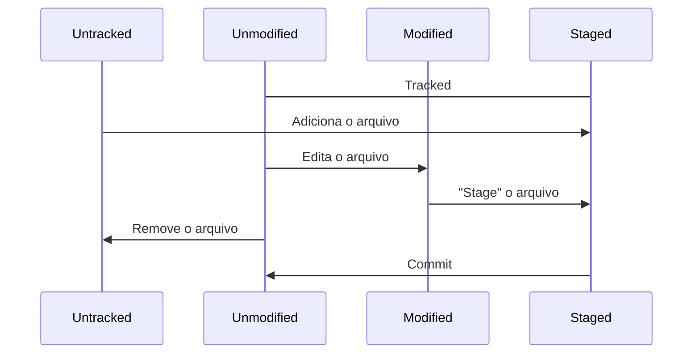

## Navegação via command line interface e instalação

| Windows   | Unix   |                            |                                                          |
| --------- | ------ | -------------------------- | -------------------------------------------------------- |
| cd        | cd     | change directory           | .. subir um nível de pasta                               |
| dir       | ls     | listar o conteúdo da pasta | -a exibe arquivos ocultos                                |
| mkdir     | mkdir  | criar pasta                |                                                          |
| del/rmdir | rm -rf | del para arquivos          |                                                          |
| cls       | clear  | clear screen               | <Ctrl> + L                                               |
| echo      | echo   | imprime texto no terminal  | >hello.txt retorna o resultado da função para um arquivo |
| mv        |        | mover arquivo              |                                                          |

Apertar tab autocompleta se houver um diretório com o nome que você está digitando.

## Entendendo como o Git funciona por baixo dos panos

SHA1 - A sigla SHA significa Secure Hash Algorithm, é um conjunto de funções hash criptográficas projetadas pela NSA. A encriptação gera conjunto de caracteres identificador de 40 dígitos. É uma forma curta de representar um arquivo.

Objetos do GIT

- Blobs: Os blobs armazenam os arquivos no git, contendo metadados (blob tamanho-do-arquivo \0 conteúdo) sobre os mesmos; hash diferente de um arquivo solitário.
- Trees: As trees armazenam blobs, com mais metadados do git (tree tamanho \0 blob sha arquivo) e um sha próprio.
- Commits: O commit armazena indicação de alterações, com metadados (commit tamanho tree sha parente sha autor mensagem timestamp) e um sha próprio.

## Ciclo de vida dos arquivos no Git

| git init                 | inicia o git em uma pasta, criando um repositório  |
| ------------------------ | -------------------------------------------------- |
| git add arquivo          | adiciona arquivos modificados no stage para commit |
| git commit -m "mensagem" | cria um commit                                     |
| git status               | apresenta o status atual do repositório            |
| git add *                | adiciona todos os arquivos                         |
| git -rm                  | remove arquivos do stage                           |
| git restore              | descarta alterações no repositório                 |

## Introdução ao GitHub

| git config --list              | acessa as configurações do git                        |
| ------------------------------ | ----------------------------------------------------- |
| git remote add origin endereço | Apontar um diretório local para um repositório remoto |
| git push origin master         | Empurra as alterações para o GitHub                   |
| git pull origin master         | Puxa alterações do GitHub para o repositório local    |
| git clone endereço             | Clonar repositório                                    |

É recomendável configurar o git com o mesmo email e username do GitHub