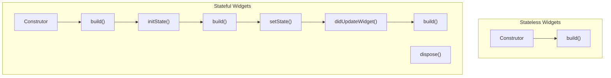

Flutter: SDK (Software Development Kit) que permite criar apps para Android e IOS; Open Source criado pela Google.

Uma ferramenta que permite construir aplicações nativas cross-platform (iOS, Android) usando um único código fonte/ linguagem de programação.

Framework/ widget library: componente de UI reutilizáveis, funções utilitárias, pacotes.

Dart: Linguagem de desenvolvimento criada pelo Google. Focada em frontend (aplicações mobile, web) e desenvolvimento de interface de usuário (UI).

Orientada a Objetos e Tipagem forte. Sintaxe é mistura de Java, Javascript, C#.

UI em código: Construir uma Árvore de Widget. Tudo é Widget. Sem Drag & Drop. Sem editor visual.

Suporta as diferenças entre plataformas (Android e iOS)

Única base de código

Flutter não usa Widgets Nativos, diferente do Reactive Native

Material é o sistema de design criado (e amplamente utilizado) pelo Google. Altamente personalizável (funciona no iOS também).

Material design é embutido no Flutter, mas também têm Widgets com estilo da Apple (Cupertino).

|                      Flutter                      |                      React Native                       |                       Ionic                       |
| :-----------------------------------------------: | :-----------------------------------------------------: | :-----------------------------------------------: |
|                  Dart + Flutter                   |                   Javascript/React.js                   |     Javascript (qualquer ou nenhum framework)     |
|               App Nativa Compilada                | App Nativa Parcialmente Compilada (Componentes Visuais) |             App dentro de uma WebView             |
| NÃO utiliza os componentes nativos do iOS/Android |      Utiliza os componentes nativos do iOS/Android      | NÃO utiliza os componentes nativos do iOS/Android |
|      Cross-Platform (Mobile, Web e Desktop)       |                     Foco em Mobile                      |      Cross-Platform (Mobile, Web e Desktop)       |
|             Desenvolvido pelo Google              |               Desenvolvido pelo Facebook                |              Desenvolvido pelo Ionic              |

## 1-5 Instalação do Flutter e criação de projeto

### Instalação do ambiente de desenvolvimento

Baixar o SDK do Flutter em [https://flutter.dev/docs/get-started/install/windows](https://flutter.dev/docs/get-started/install/windows)

Descompactar o conteúdo em C:\src\

Configurar as variáveis de ambiente (path) para apontar para C:\src\flutter\bin

Testar configuração no terminal com flutter -v

Executar no terminal flutter doctor para resolver dependências

Baixar o Android Studio em [https://developer.android.com/studio?hl=pt-br](https://developer.android.com/studio?hl=pt-br)

Pelo Android Studio baixe os SDKs e APIs relativas as versões do Android que quer utilizar

Instalar também o Intel HAXM

Configurar o SDK do Android no path das variáveis de sistema:

"D:\src\flutter\bin"

“D:\src\flutter\bin\cache\dart-sdk\bin”

"D:\src\gradle-6.7.1\bin"

"D:\src\flutter\"

"D:\src\Android"

"D:\src\Android\platforms"

"D:\src\Android\platform-tools"

Também pelo Android Studio, instalar os plugins "Dart" e "Flutter"

Na aba SDK Tools instalar "Android SDK Build-Tools", "Android Emulator", "Android SDK Platform-Tools", "Google Play Services", "Google USB Driver" e "Intel HAXM".

Crie dispositivos virtuais para emulação.

## 7 Aprenda Dart do zero

 Executando códigos online: [DartPad (dartlang.org)](https://dartpad.dartlang.org/?)

```dart
//comentários com barras duplas
/* comentários longos */
```

### Estrutura principal

```dart
void main() {

}
```

### Variáveis e constantes

```dart
var nome;
nome.runtimeType; //retorna o tipo da variável
const pi = 3.14; //const só pode ser usado quando o valor já é definido em tempo de compilação. Para constante em tempo de execução, usar final
String nome = "Jamilton";
double.parse(string); //converter string em número
numero.toString();// converter número em string
num numero = 10; // classe pai dos tipos numéricos, permite valores inteiros e de ponto flutuante
int idade = 10;
double preco = 10.50;
bool booleano = true;
dynamic verdadeiroFalso = true; // tipo dinâmico
var array = [valor1, valor2];
print( "o nome é: $nome ${nome} " + nome);
//notação ponto: a partir de valores literais é possível chamar funções
double nota = 6.99.roundToDouble();
```

### Interpolação

```dart
String frase1 = nome + " está " + status + " pq tirou nota " + nota.toString() + "!";
String frase2 = "$nome está $status pq tirou nota ${nota.toString()}";
```

### Atualização na entrada do usuário no Dart

Recentemente, foi lançada uma nova versão do Dart. Agora, ao salvar valores feitos via Input pelo usuário do código, é preciso usar uma interrogação na tipagem do dado. Por exemplo:

```dart
import 'dart:io';
 
main() {
	String? teste = stdin.readLineSync();
	print(teste);
}
```

Essa interrogação significa que o dado que vai vir pode não ser uma String, mas que será convertido assim que for recebido. Ou seja, você pode digitar números e mesmo assim eles serão tratados como String depois.

Caso você utilize tipagem dinâmica (ou seja, utilize 'var' ao invés do tipo exato de dado), é preciso fazer essa indicação no input mesmo, com uma '!' ao invés de uma '?'. Essa solução é válida também ao se utilizar a tipagem.

Dessa forma:

```dart
import 'dart:io';
 
main() {
	String teste = stdin.readLineSync()!;
	print(teste);
}
```

## Operadores Aritméticos

### unários

+=. ++, --, -=

a++ (postfix) / --a(prefix)

### infix binários

|       **Soma(+)**       | **a.plus(b)**  |
| :---------------------: | :------------: |
|     **Subtrair(-)**     | **a.minus(b)** |
|   **Multiplicar(\*)**   | **a.times(b)** |
|     **dividir(/)**      |  **a.div(b)**  |
| **%(resto da divisão)** |  **a.mod(b)**  |

## Operadores relacionais

Binários/infix

Resultado sempre booleano

|    **== (igual a)**     |    **a.equals(b)**    |
| :---------------------: | :-------------------: |
|   **!= (diferente)**    |  **!(a.equals(b))**   |
|    **> (Maior que)**    | **a.compareTo(b)>0**  |
|    **< (Menor que)**    | **a.compareTo(b)<0**  |
| **>= (Maior ou igual)** | **a.compareTo(b)>=0** |
| **<= (Menor ou igual)** | **a.compareTo(b)<=0** |

## Operadores lógicos

|      **&& (e)**      | **and** | **binário/infix** |
| :------------------: | :-----: | :---------------: |
|    **\|\| (Ou)**     | **or**  | **binário/infix** |
| **^ (ou exclusivo)** | **xor** | **binário/infix** |
|   **! (negação)**    | **not** | **unário/prefix** |

## Operadores in e range

| **in (contém) !in (não contém)** | **Se o valor está presente em uma lista ou uma faixa de valores** |
| :------------------------------: | :----------------------------------------------------------: |
|        **range(int.int)**        |            **Range cria um intervalo de valores**            |


### Operador Ternário

```dart
  String aprovado = nota > 7 ? "sim" : "não";
// condição ? se true isso : se false isso;
```

### Controle de fluxo if else - switch

```dart
if( idade <= 9 ){
  }
  else if( idade >= 10 && idade <= 18 ){
  }
  else{
  }

  switch( comando ){
    case "depositar" :
      print("Desposite um valor");
      break;
    case "sacar" :
      print("Sacar um valor");
      break;  
    default:
      print("Nenhuma opção escolhida");    
  }
```

### Loops for e while

```dart
while( numero <= 5 ){
    
  }
  do{
      
  }while(var palavra in palavras);
  for( int i=1; i <= 5; i++ ){
  }

```

### Entradas e saídas padrão

```dart
import 'dart:io';
stdin.readLineSync(); //entrada
print(); //impressão em linhas separadas
stdout.write(); //impressão na mesma linha
```

## 8 Dart Intermediário e Avançado

### Funções

```dart
void calcularBonus(){
  print("Bônus calculado");
}
```
funções podem ser armazenadas em variáveis também.
```dart
main() {
	int a = 2;
	int Function(int, int) soma1 = somaFn;
	print(soma1(2,3));
}

int somaFn(int a, int b) {
	return a+b;
}
```

### Forma simplificada de retornar de uma função com apenas uma instrução => arrow function

```dart
double calcular (double salario) =>
  salario-(salario*0.1);
```

### Parâmetros opcionais {tipo nome}

Sempre devem ser definidos ao final da declaração da função

```dart
String exibirDados(String nome, {int idade, double altura} ){
  int novaIdade = idade ?? 0;
  double novaAltura = altura ?? 0;
  print("Olá $nome sua idade: $novaIdade sua altura: $novaAltura ");
}
```

### Para passar parâmetros opcionais é preciso informar o nome do parâmetro:

```dart
exibirDados("João", idade:30 , altura:1.73)
```

### Operador de Nulo ?? se nulo, defina valor padrão

```dart
int novaIdade = idade ?? 0;
```

### Passar uma função como parâmetro

```dart
String exibirDados(String nome, Function funcao){
  print("Olá $nome");
  funcao();
}
```

### Função anônima

Para códigos muito customizados – utilizar em botões, por exemplo

```dart
void (){
  print("Olá $nome");
}
(){
  print("Olá $nome");
}
```

### Classes e objetos

```dart
class Casa{ //nome das classes em CamelCase
  String cor;
  void abrirJanela(){
    print("Janela aberta");
  }
  void abrirTudo(){
    this.abrirJanela(); //this referencia a própria classe
  }
}
void main() {
  Casa minhaCasa = new Casa(); //objeto casa
  minhaCasa.cor = "Amarela";
  minhaCasa.abrirJanela();
}
```

### Construtores

Método especial para dar uma configuração especial a um objeto criado. Por padrão, toda classe já tem um construtor, mas você pode definir um personalizado.

```dart
Casa() { //nome do construtor é sempre o mesmo nome da classe
  this.cor = "Azul";
}
```

Ou

```dart
Casa(this.cor) { //nome do construtor é sempre o mesmo nome da classe
}
void main(){
  Casa minhaCasa = new Casa("Azul");
}
```

### Named constructor

```dart
Casa.mansao(this.cor) { //construtor nomeado, definindo um objeto inicial diferente
  print("casa maior");
}
void main(){
  Casa minhaCasa2 = new Casa.mansao("Azul");
}
```

### Getter e Setter

Métodos especiais para manipular atributos protegidos dentro de classes/objetos. Permitem incluir validações. Getter-obter, Setter-configurar.

```dart
class Conta {
  double _saque = 0; //adicionar o _ (underline) indica que o atributo é privado e não deve ser acessado diretamente.
  double get saque { //getter
    //ValidaçÕes
    return this._saque;
  }
  set saque(double saque){ //setter
    if( saque > 0 && saque <= 500 ){
      this._saque = saque;
    }
  }
}
void main(){
  Conta conta = new Conta();
  conta.saque = 400; //chama o método set saque, e não o atributo _saque
  print(conta.saque) //chama o método get saque, e não o atributo _saque
}
```

### Herança

```dart
class Animal {
  String cor;
  void dormir(){
    print("Dormir");
  }
}
 
class Cao extends Animal {
  String corOrelha;
  void latir(){
    print("Latir");
  }
}
 
class Passaro extends Animal {
  String corBico;
  void voar(){
    print("Voar");
  }
}
```

### Sobrescrita de métodos

```dart
class Animal {
  String cor;
  Animal(this.cor); //construtor de Animal
  void dormir(){
    print("Dormir");
  }
  void correr(){
    print("Correr como um ");
  }
}
 
class Cao extends Animal {
  String corOrelha;
  Cao(String cor, this.corOrelha) : super(cor); //invocar o construtor pai de Animal para definir a cor
  void latir(){
    print("Latir");
  }
  @override //sobrescrever
  void correr(){
    super.correr(); //invocar a implementação do método pai antes de incluir alterações da sobrescrita
    print("cão");
  }
}
```

### Modificadores Static e Final

```dart
class Configuracoes {
  static String identificadorApp = "JLADS789789"; //ao tornar o atributo estático, ele fica acessível sem a necessidade de instanciar a classe em um objeto.
  static void configuracaoInicial(){ //ao tornar o método estático, ele fica acessível sem a necessidade de instanciar a classe em um objeto.
    print( "Executa configuracoes iniciais" );
  }
}
void main() {
  //Configuracoes config = new Configuracoes(); não é necessário instanciar para acessar elementos estáticos
  print(Configuracoes.identificadorApp);
  Configuracoes.configuracaoInicial().
}

class Conta {
  String nome;
}
void main() {
  final Conta conta = new Conta(); //o objeto marcado como final não pode ser alterado/sobrescrito.
  conta.nome = "João";
  //conta = new Conta(); erro, não é possível sobrescrever o objeto marcado como final
}
```

### Classes Abstratas

```dart
abstract class Presidenciavel { //classe abstrata não pode ser instanciada, usada apenas para herança
  void participarEleicao(); //método abstrato sem corpo (sem as chaves). As classes filhas são obrigadas a sobrescrever o método
}
class Cidadao { //classe concreta instanciável
  void direitosDeveres(){
    print("Todo cidadão tem direitos e deveres");
  }
}
class Obama extends Cidadao implements Presidenciavel { //implements marca uma classe como uma interface
  @override
  void participarEleicao(){
    print("Participar eleicão Estados Unidos");
  }
}
```

### Interface

Pode-se dizer, a grosso modo, que uma interface é um contrato que quando assumido por uma classe deve ser implementado. Interface é utilizada pois podemos ter muitos objetos (classes) que podem possuir a mesma ação (métodos), porém, podem executá-las de maneiras diferentes.

A interface também é utilizada pois o Dart não permite herança múltipla (extends).

Veja no exemplo de código anterior.

### Mixins

Mixins é uma maneira de utilizar códigos em múltiplas hierarquias de classes sem gerar heranças. Adiciona recursos sem obrigar (diferente da interface).

```dart
mixin Discurso {
  void discursar(){
    print("faz o discurso");
  }
}
class Obama extends Cidadao with Discurso { //with marca uma classe como um mixin
  //o método discursar estará disponível para este objeto
}
```

### Coleções - listas

Collection ou coleções são implementações de estruturas de dados, que são utilizadas para armazenar itens.

```dart
List<String> frutas = ["Morango", "Manga"];
frutas.add("Melancia");
frutas.insert(0, "Amora");
frutas.removeAt(1);
  
print( frutas.contains("amora") );
print( frutas.length );

class Usuario {
  String nome;
  int idade;
  Usuario(this.nome, this.idade);//construtor
}
List<Usuario> usuarios = List(); // lista de objetos do tipo usuario
 
usuarios.add( Usuario("Jamilton", 30) );
usuarios.add( Usuario("José", 45) );
usuarios.add( Usuario("Maria", 20) );
  
for( Usuario usuario in usuarios ){
  print( "Nome: ${usuario.nome} idade: ${usuario.idade}" );
}
```

### Coleções – mapas

```dart
  //Chave -> valor, permite criar índices customizados
  Map<String, String> estados = Map();
  estados["SP"] = "São Paulo";
  estados["MG"] = "Minas Gerais";
  estados["RJ"] = "Rio Janeiro";
  
  print( estados );
  print(estados.keys);
  print(estados.values);
  print(estados.length);
  estados.forEach(
          (chave, valor) => print("$chave - $valor")
  );

  Map<String, dynamic> usuários = Map(); //valores com tipos dinâmicos
```

### Coleções – Set

```dart
//As coleções tipo Set não são indexadas, utilizadas quando a ordem dos elementos não importa. o Set não aceita repetição, diferente da lista.
var times2 = {"Vasco", "Flamengo", "Fortaleza", "São Paulo"};
//se no momento da criação do set, houver só um tipo de dados, o set ficará marcado para apenas esse tipo
Set times = {"Vasco", "Flamengo", "Fortaleza", "São Paulo"};
print(times is Set);
print(times.first);
print(times.last);
```

### Função Filter

```dart
var notasBoas = notas.where(função); //onde a função possui a condição de filtro. O where envia cada elemento da lista notas para a função, que retorna um boolean.
```

## 10 Componentes de interface

Catálogo de widgets está disponível na documentação do Flutter.

Ao criar um projeto zerado e limpar o conteúdo de “main.dart”, pode ser necessário excluir um arquivo da pasta “test”.

   {: width="100" height="100" }

   {: width="100" height="100" }

   {: width="100" height="100" }

   {: width="100" height="100" }

   {: width="100" height="100" }

   {: width="100" height="100" }

|                Widget Tree                 |                         Element Tree                         |                     Render Tree                     |
| :----------------------------------------: | :----------------------------------------------------------: | :-------------------------------------------------: |
|                  Imutável                  |                       Estrutura Lógica                       |                O que você vê na tela                |
| Configuração (Reconstruído Frequentemente) | Liga Widget com o Objeto Renderizado (Raramente Reconstruído) | Objeto Renderizado na Tela (Raramente Reconstruído) |

### Ciclo de Vida dos Widgets



### Ciclo de Vida da APP 

| Nome Ciclo de Vida |                  Quando isso acontece?                  |
| :----------------: | :-----------------------------------------------------: |
|      inativo       | App está inativa, nenhuma entrada do usuário é recebida |
|       paused       |        App não visível, executando em background        |
|      resumed       |     App novamente visível e respondendo ao usuário      |
|     suspending     |                App será suspensa (sair)                 |

### Column & Row

   {: width="100" height="100" }

```dart
import 'package:flutter/material.dart';
void main(){
  runApp(MaterialApp(
    title: "Frases do dia",
    home: Row(children: <Widget>[
      Text(" t1 "),
      Text(" t2 "),
      Text(" t3 ")
    ],) ,
    Column(children: <Widget>[
      Text(" t1 "),
      Text(" t2 "),
      Text(" t3 ")
    ],) ,
    Container(color: Colors.white,),
  ));
}
```

### Container vc Column/Row

Use combinado!

|                          Container                          |                          Column/Row                          |
| :---------------------------------------------------------: | :----------------------------------------------------------: |
|           Aceita exatamente um Widget como filho            |           Aceita uma lista de Widgets como filhos            |
|           Alinhamento Flexível & Opções de Estilo           |             Alinhamento, mas sem opção de estilo             |
| Largura flexível (ex. largura do filho, largura disponível) | Sempre ocupa toda a altura (Column)/ Sempre ocupa toda largura (Row) |
|      Perfeito para alinhamento e estilo personalizado       | Usado quando os Widgets estiverem próximos ou acima um do outro |

### Formatação de textos

```dart
import 'package:flutter/material.dart';
void main(){
  runApp(MaterialApp(
    title: "Frases do dia",
    home: Container(
      color: Colors.white,
      child: Column( //filho único. O container delimita o conteúdo para que não ultrapasse o limite da tema
        children: <Widget>[ //mais de um filho
          Text(
              "Lorem ipsum ",
            style: TextStyle(
              fontSize: 50,
              fontStyle: FontStyle.normal,
              fontWeight: FontWeight.normal,
              letterSpacing: 0,
              wordSpacing: 0,
              decoration: TextDecoration.underline,
              decorationColor: Colors.greenAccent,
              decorationStyle: TextDecorationStyle.solid,
              color: Colors.black
            ),)],),),));
}
```

### Botões

```dart
import 'package:flutter/material.dart';
void main(){
  runApp(MaterialApp(
    title: "Frases do dia",
    home: Container(
      color: Colors.white,
      child: Column(
        children: <Widget>[
          FlatButton(
              onPressed: (){
                print("Botão pressionado!");
              },
              child: Text(
                  "Clique aqui",
                style: TextStyle(
                  fontSize: 20,
                  color: Colors.black,
                  decoration: TextDecoration.none
                ),))],,),));
}
```

### Espaçamentos

```dart
import 'package:flutter/material.dart';
void main(){
  runApp(MaterialApp(
    debugShowCheckedModeBanner: false,//remove o sinal de debug da aplicação
    title: "Frases do dia",
    home: Container(
      color: Colors.white,
      padding: EdgeInsets.fromLTRB(0, 0, 0, 0), //Left, Top, Right, Botton
      margin: EdgeInsets.all(30),
      margin: EdgeInsets.only(top: 50, left: 50),
      margin: EdgeInsets.fromLTRB(10, 60, 30, 40), //Left, Top, Right, Botton
      decoration: BoxDecoration(
        border: Border.all(width: 3, color: Colors.black)
      ),
      child: Row(
        children: <Widget>[
          Text("t1"),
          Padding(
            padding: EdgeInsets.all(30),
            child: Text("t2"),
          ),
          Text("t3"),
          Text(
              "Lorem ipsum dolor sit amet, consectetur adipiscing elit. Vestibulum posuere rhoncus velit, eget commodo",
              textAlign: TextAlign.justify,
          )],),),));
}
```

### Alinhamentos

```dart
import 'package:flutter/material.dart';
void main(){
  runApp(MaterialApp(
    //debugShowCheckedModeBanner: false,
    title: "Frases do dia",
    home: Container(
      margin: EdgeInsets.only(top: 40),
      decoration: BoxDecoration(
        border: Border.all(width: 3, color: Colors.white)
      ),
      child: Row(
        mainAxisAlignment: MainAxisAlignment.spaceBetween, //start/end/center/spaceBetween/spaceEvenly/spaceAround
        crossAxisAlignment: CrossAxisAlignment.center, //start/end/center/stretch/baseline
        children: <Widget>[
          Text("T1"),
          Text("T2"),
          Text("T3"),
        ],
      ),
    ),
  ));
}
```

   {: width="100" height="100" }

   {: width="100" height="100" }

### Imagens

Para adicionar imagens ao projeto, crie uma pasta e depois edite o arquivo pubspec.yaml, acrescentando assets com os caminhos, nomes e extensões das imagens utilizadas. Depois de editar clique em “Packages get”.

```dart
import 'package:flutter/material.dart';
void main(){
  runApp(MaterialApp(
    //debugShowCheckedModeBanner: false,
    title: "Frases do dia",
    home: Container(
      margin: EdgeInsets.only(top: 40),
      decoration: BoxDecoration(
        border: Border.all(width: 3, color: Colors.white)
      ),
      child: Image.asset(
        "images/mesa.jpg",
        fit: BoxFit.scaleDown,//contain, cover, fill, fitHeight, fitWidth, none, scaleDown
      ) ,
    ),
  ));
}
```

### Layout base com Scaffold

```dart
import 'package:flutter/material.dart';
void main(){
  runApp(MaterialApp(
    debugShowCheckedModeBanner: false,
    home: Scaffold( //classe de layout base scaffold
      appBar: AppBar(
        title: Text("Instagram"),
        backgroundColor: Colors.green,
      ),
      body: Padding(
        padding: EdgeInsets.all(16),
        child: Text("Conteúdo principal"),
      ),
      bottomNavigationBar: BottomAppBar(
        color: Colors.lightGreen,
        child: Padding(
          padding: EdgeInsets.all(16),
          child: Row(
            children: <Widget>[
              Text("Texto 1"),
              Text("Texto 1"),
            ],),),),),));
}
```

### Widgets – Stateless e Stateful

Stateless -> Widgets que não podem ser alterados (contantes)

Stateful -> Widgets que podem ser alterados (variáveis)

```dart
import 'package:flutter/material.dart';
void main(){
  runApp(MaterialApp(
    debugShowCheckedModeBanner: false,
    home: HomeStateful(),
  ));
}

class HomeStateful extends StatefulWidget { //widget stateful
  @override
  _HomeStatefulState createState() => _HomeStatefulState();
}
class _HomeStatefulState extends State<HomeStateful> {
  var _texto = "Jamilton Damasceno";
  @override
  Widget build(BuildContext context) { // o método build constrói o widget
    print("Build chamado");
    return Scaffold( //retorna um container por padrão, que pode ser alterado
      appBar: AppBar(
        title: Text( "Instagram" ),
        backgroundColor: Colors.green,
      ),
      body: Container(
        child: Column(
          children: <Widget>[
            RaisedButton(
              onPressed: (){
                
                setState(() { //é necessário criar uma função setState para alterar o widget que já foi construído
                  _texto = "Curso Flutter";  
                });
              },
              child: Text("Clique aqui"),
            ),
            Text("Nome: $_texto ")
          ],),),);}
}

class Home extends StatelessWidget { //widget stateless
  @override
  Widget build(BuildContext context) {
    var _titulo = "Instagram";
    return Scaffold(
      appBar: AppBar(
        title: Text( _titulo ),
        backgroundColor: Colors.green,
      ),
      body: Padding(
        padding: EdgeInsets.all(16),
        child: Text("Conteúdo principal"),
      ),
      bottomNavigationBar: BottomAppBar(
        color: Colors.lightGreen,
        child: Padding(
          padding: EdgeInsets.all(16),
          child: Row(
            children: <Widget>[
              Text("Texto 1"),
              Text("Texto 1"),
            ],),),),);}
}
```

### Gesture Detector

```dart
GestureDetector(
  onTap: (){print("Imagen Clicada")}, //onDoubleTap, onLongPress
  child: Image.asset("caminhdo da imagen"),
),
```

### Scroll View

```dart
SingleChildScrollView(
  padding: EdgeInsets.all(32),
  child: 
)
```
### ListView

   {: width="100" height="100" }

```dart
  List _itens = [];
  void _carregarItens(){
    _itens = [];
    for(int i=0; i<=10; i++){

      Map<String, dynamic> item = Map();
      item["titulo"] = "Título ${i} Lorem ipsum dolor sit amet.";
      item["descricao"] = "Descrição ${i} ipsum dolor sit amet.";
      _itens.add( item );
    }
  }
        child: ListView.builder(
            itemCount: _itens.length,
            itemBuilder: (context, indice){

              //Map<String, dynamic> item = _itens[indice];
              //print("item ${ _itens[indice]["titulo"] }");

              return ListTile(
                title: Text( _itens[indice]["titulo"] ),
                subtitle: Text( _itens[indice]["descricao"] ),
              );
            }
        )
```

### Eventos de clique e AlertDialog

```dart
child: ListView.builder(
    itemCount: _itens.length,
    itemBuilder: (context, indice){
      //Map<String, dynamic> item = _itens[indice];
      //print("item ${ _itens[indice]["titulo"] }");
      return ListTile(
        onTap: (){
          //print("clique com onTap ${indice}");
          showDialog(
              context: context,
            builder: (context){ 
                return AlertDialog(
                  title: Text( _itens[indice]["titulo"] ),
                  titlePadding: EdgeInsets.all(20),
                  titleTextStyle: TextStyle(
                    fontSize: 20,
                    color: Colors.orange
                  ),
                  content: Text( _itens[indice]["descricao"] ),
                  actions: <Widget>[
                    FlatButton(
                        onPressed: (){
                          print("Selecionado sim");
                          Navigator.pop(context);
                        },
                        child: Text("Sim")
                    ),
                    FlatButton(
                        onPressed: (){
                          print("Selecionado nao");
                          Navigator.pop(context);
                        },
                        child: Text("Não")
                    )
                  ],
                  //backgroundColor: Colors.orange,
                );
            }
          );
        },
        /*onLongPress: (){
          print("clique com onLongPress");
        },*/
        title: Text( _itens[indice]["titulo"] ),
        subtitle: Text( _itens[indice]["descricao"] ),
      );
    }
),
```

### Widget Expanded

### BottonNavigationBar

```dart
bottomNavigationBar: BottomAppBar(
  //shape: CircularNotchedRectangle(),
  child: Row(
    children: <Widget>[
      IconButton(
        onPressed: (){},
        icon: Icon(Icons.add),
      )
    ],
  ),
),
```

### Floating Action button

```dart
floatingActionButtonLocation:
FloatingActionButtonLocation.centerDocked,
//floatingActionButton: FloatingActionButton(
floatingActionButton: FloatingActionButton.extended(
  backgroundColor: Colors.purple,
  foregroundColor: Colors.white,
  elevation: 6,
  icon: Icon(Icons.add_shopping_cart),
  label: Text("Adicionar"),
  /*shape: BeveledRectangleBorder(
    borderRadius: BorderRadius.circular(50)
  ),*/
  //mini: true,
  /*child: Icon(Icons.add),
    onPressed: (){
      print("Resultado: botao pressionado!");
    }*/
),
```

### Dismissible widget

```dart
Widget build(BuildContext context) {
  return Scaffold(
    appBar: AppBar(title: Text("widgets"),),
    body: Column(
      children: <Widget>[
        Expanded(
          child: ListView.builder(
              itemCount: _lista.length,
              itemBuilder: (context, index){
                final item = _lista[index];
                return Dismissible(
                  background: Container(
                    color: Colors.green,
                    padding: EdgeInsets.all(16),
                    child: Row(
                      mainAxisAlignment: MainAxisAlignment.start,
                      children: <Widget>[
                        Icon(
                          Icons.edit,
                          color: Colors.white,
                        )
                      ],
                    ),
                  ),
                  secondaryBackground: Container(
                    color: Colors.red,
                    padding: EdgeInsets.all(16),
                    child: Row(
                      mainAxisAlignment: MainAxisAlignment.end,
                      children: <Widget>[
                        Icon(
                          Icons.delete,
                          color: Colors.white,
                        )
                      ],
                    ),
                  ),
                  //direction: DismissDirection.horizontal,
                  onDismissed: (direction){
                    if( direction == DismissDirection.endToStart ){
                      print("direcao: endToStart " );
                    }else if( direction == DismissDirection.startToEnd ){
                      print("direcao: startToEnd " );
                    }
                    setState(() {
                      _lista.removeAt(index);
                    });
                  },
                    key: Key( item ),
                    child: ListTile(
                      title: Text( item ),
                    )
                );
                
              }
          ),
        )
      ],
    ),
  );
}
```

### Snackbar

```dart
final snackbar = SnackBar(
	//backgroundColor: Colors.green,
    duration: Duration(seconds: 5),
    content: Text("Tarefa removida!!"),
   	action: SnackBarAction(
    	label: "Desfazer",
        onPressed: (){
			//Insere novamente item removido na lista
            setState(() {
            _listaTarefas.insert(index, _ultimaTarefaRemovida);
            });
            _salvarArquivo();
        }
    ),
);
```

## Componentes de entrada de dados

### Caixas de texto

```dart
TextEditingController _textEditinController = TextEditingController(); //controller para capturar o texto do campo

TextField(
  keyboardType: TextInputType.text, //number, emailAdress, datetime
  decoration: InputDecoration(
    labelText: "digite um valor",
    enabled: true,
    maxLength: 10,
    maxLengthEnforced:5,
    style: TextStyle(),
    obscureText: true, //campos de senha
    onChanged: (String e) {
      print("valor digitado capturado:" + e);
    },
    onSubmitted: (String texto) {
      print("valor digitado capturado:" + e);
    },
    controller: _textEditingController,
  ),
);
RaisedButton(
  child: Text("Salvar"),
  color: Colors.lightGreen,
  onPressed: (){
    print("valor digitado:" + _textEditingController.text);
  }
 ),
```

### Checkbox

```dart
CheckboxListTile(
  title: Text("Comida Brasileira"),
  subtitle: Text("A melhor comida do mundo!!"),
  activeColor: Colors.red,
  selected: true,
  secondary: Icon(Icons.add_box),
  value: _comidaBrasileira,
  onChanged: (bool valor){
    setState(() {
    _comidaBrasileira = valor;
    });
  }
),
CheckboxListTile(
  title: Text("Comida Mexicana"),
  subtitle: Text("A melhor comida do mundo!!"),
  activeColor: Colors.red,
  selected: true,
  secondary: Icon(Icons.add_box),
  value: _comidaMexicana,
  onChanged: (bool valor){
    setState(() {
        _comidaMexicana = valor;
    });
  }
),
  Text("Comida Brasileira"),
  Checkbox(
    value: _estaSelecionado,
    onChanged: (bool valor){
      setState(() {
        _estaSelecionado = valor;
      });
    print("Checkbox: " + valor.toString() );
  },
)
```

### RadioButton

```dart
RadioListTile(
  title: Text("Masculino") ,
    value: 1,
    groupValue: _escolhaUsuario,
    onChanged: (int escolha){
      setState(() {
        _escolhaUsuario = escolha;
      });
    }
),
Text("Masculino"),
Radio(
    value: "m",
    groupValue: _escolhaUsuario,
    onChanged: (String escolha){
      setState(() {
        _escolhaUsuario = escolha;
      });
      print("resultado: " + escolha);
    }
)
```

### Switch

```dart
            SwitchListTile( //criar uma coluna com uma lista de switch
              title: Text("Receber notificações?"),
                value: _escolhaUsuario,
                onChanged: (bool valor){
                  setState(() {
                    _escolhaUsuario = valor;
                  });
                }
            ),
            Switch(
                value: _escolhaUsuario,
                onChanged: (bool valor){
                  setState(() {
                    _escolhaUsuario = valor;
                  });
                }
            ),
            Text("Receber notificações?")
```

### Slider

```dart
Slider(
    value: valor,
    min: 0,
    max: 10,
    label: label,
    divisions: 5,
    activeColor: Colors.red,
    inactiveColor: Colors.black26,
    onChanged: (double novoValor){
      setState(() {
        valor = novoValor;
        label = novoValor.toString() ;
      });
      //print("Valor selecionado: " + novoValor.toString() );
    }
),
```

## Navegação

### Navegando entre telas

Novas telas sobrepõem as telas anteriores.

```dart
Navigator.push(
	context,
	MaterialPageRoute(
		builder: (context) => TelaSecundaria()
	)
 );
```

### Passando dados entre telas

Passagem de parâmetros para o construtor da segunda tela.

Para recuperar o valor `widget.valor`

### Nomeando rotas

```dart
void main(){
  runApp(MaterialApp(
    initialRoute: "/",
    routes: {
      "/secundaria" : (context) => TelaSecundaria(),
    },
    home: TelaPrincipal(),
  ));
}

onPressed: (){
	Navigator.pushNamed(context, "/secundária");
}
```

## Consumo de serviços web - webservice

Em pubspec.yaml incluir nas dependências `http: ^0.12.0+1`  e clicar em Packages get

Você pode definiar um alias para usar uma biblioteca:

`import 'package:http/http.dart' as http;`

`import 'dart:convert';`

`import 'dart:async';`

```dart
_recuperarCep() async {

    String url = "https://viacep.com.br/ws/04005020/json/";
    http.Response response;

    response = await http.get(url);
    Map<String, dynamic> retorno = json.decode( response.body ); //importar biblioteca decode
    String logradouro = retorno["logradouro"];
    String complemento = retorno["complemento"];
    String bairro = retorno["bairro"];
    String localidade = retorno["localidade"];

    print(
      "Resposta logradouro: ${logradouro} complemento: ${complemento} bairro: ${bairro} "
    );

    //print("resposta: " + response.statusCode.toString() );
    //print("resposta: " + response.body );


  }
```

### Future

Maneira melhorada de trabalhar com consumo de serviços web.

```dart
  Future<Map> _recuperarPreco() async {
    String url = "https://blockchain.info/ticker";
    http.Response response = await http.get(url);
    return json.decode( response.body );
  }

  @override
  Widget build(BuildContext context) {
    return FutureBuilder<Map>(
      future: _recuperarPreco(),
      builder: (context, snapshot){

        String resultado;
        switch( snapshot.connectionState ){
          case ConnectionState.none :
          case ConnectionState.waiting :
            print("conexao waiting");
            resultado = "Carregando...";
            break;
          case ConnectionState.active :
          case ConnectionState.done :
            print("conexao done");
            if( snapshot.hasError ){
              resultado = "Erro ao carregar os dados.";
            }else {

              double valor = snapshot.data["BRL"]["buy"];
              resultado = "Preço do bitcoin: ${valor.toString()} ";

            }
            break;
        }

        return Center(
          child: Text( resultado ),
        );

      },
    );
  }
```

## Manipulando dados

### Preferências

Associadas ao app, perdidas ao desinstalar.

Para gravar dados nas preferências do aplicativo

https://pub.dartlang.org    -> biblioteca shared_preferences

### Salvando dados em arquivo

Utilizar biblioteca para gerenciar o caminho dos arquivos do aplicativo em ios e android: path_provider

```dart
import 'package:flutter/material.dart';
import 'package:path_provider/path_provider.dart';
import 'dart:io';
import 'dart:async';
import 'dart:convert';

class Home extends StatefulWidget {
  @override
  _HomeState createState() => _HomeState();
}

class _HomeState extends State<Home> {
  List _listaTarefas = [];
  Future<File> _getFile() async {
    final diretorio = await getApplicationDocumentsDirectory();
    return File( "${diretorio.path}/dados.json" );
  }

  _salvarArquivo() async {
    var arquivo = await _getFile();
    //Criar dados
    Map<String, dynamic> tarefa = Map();
    tarefa["titulo"] = "Ir ao mercado";
    tarefa["realizada"] = false;
    _listaTarefas.add( tarefa );
    String dados = json.encode( _listaTarefas );
    arquivo.writeAsString( dados );
    //print("Caminho: " + diretorio.path );
  }

  _lerArquivo() async {
    try{
      final arquivo = await _getFile();
      return arquivo.readAsString();
    }catch(e){
      return null;
    }
  }

  @override
  void initState() {
    super.initState();
    _lerArquivo().then( (dados){
      setState(() {
        _listaTarefas = json.decode(dados);
      });
    } );
  }
```

### Banco de dados

Banco de dados utilizado: SQLite

Plugin: sqflite

#### Criando o banco

```dart
import 'package:flutter/material.dart';
import 'package:sqflite/sqflite.dart';
import 'package:path/path.dart';

void main() => runApp(
  MaterialApp(
    home: Home(),
  )
);

class Home extends StatefulWidget {
  @override
  _HomeState createState() => _HomeState();
}

class _HomeState extends State<Home> {
  _recuperarBancoDados() async {
    final caminhoBancoDados = await getDatabasesPath();
    final localBancoDados = join(caminhoBancoDados, "banco.db");
    var retorno = await openDatabase(
      localBancoDados,
      version: 1,
      onCreate: (db, dbVersaoRecente){
        String sql = "CREATE TABLE usuarios (id INTEGER PRIMARY KEY AUTOINCREMENT, nome VARCHAR, idade INTEGER) ";
        db.execute(sql);
      }
    );
    print("aberto: " + retorno.isOpen.toString() );
  }
}
```

#### Salvando dados

```dart
_salvar() async {
  Database bd = await _recuperarBancoDados();
  Map<String, dynamic> dadosUsuario = {
    "nome" : "Maria Silva",
    "idade" : 58
  };
  int id = await bd.insert("usuarios", dadosUsuario);
  print("Salvo: $id " );
}
```

## MobX

É uma biblioteca para gerenciamento de estados, podendo ser estados locais ou globais

Se baseia em:

* Actions (Ações)

* Observables (Observáveis)

* Reactions (Reações)

Não é exclusivo do Flutter
