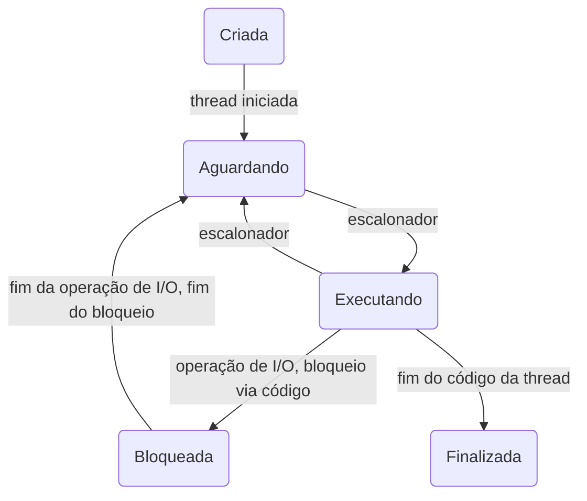

> Baseado nos cursos da Softblue

# Processos e Threads

{: width="100" height="100" }

## Threads

* Threads são consideradas processos leves

* Um processo pode ter uma ou mais threads em execução “simultânea”

* As threads de um processo compartilham o heap do processo

– Área de memória onde ficam armazenados os objetos

* Muitas aplicações são multithread

– Ex: editor de texto

### Escalonamento de Threads

* Um núcleo (core) de um processador só pode executar uma tarefa por vez

* O escalonador divide o tempo do processador entre as threads (time slice)

* Isto dá a falsa impressão de que as tarefas são executadas simultaneamente

* Na presença de múltiplos processadores ou processadores multi-core, é possível a execução verdadeiramente simultânea

### Estados de Uma Thread



### Criando Threads

* Uma thread pode ser criada através da extensão da classe `Thread`

```java
public class MinhaThread extends Thread {
	public void run () {
		//código da thread
	}
}

MinhaThread t = new MinhaThread();
t.start();
```

* Outra alternativa é através da implementação da interface `Runnable`

```java
public class MinhaThread implements Runnable {
	public void run () {
		//código da thread
	}
}

Thread t = new Thread(new MinhaThread());
t.start();
```

### Executando Threads

* Independente da forma como é criada, o código que será executado pela thread deve ser implementado dentro do método `run()`

* Quando o método `run()` termina, a thread também termina

### Prioridades em Threads

* Threads podem ter prioridades

– Não existe garantia de que as prioridades serão seguidas

* Constantes

– MIN_PRIORITY (1)

– NORM_PRIORITY (5)

– MAX_PRIORITY (10)

* O método `yield()` pode ajudar outras threads de mesma prioridade a executar

### Compartilhamento de Dados

* Threads compartilham o heap do processo

	{: width="100" height="100" }

### Sincronização de Threads

* Muitas vezes é necessário que várias threads acessem o mesmo objeto

– Race Conditions

* Sincronizar as threads é necessário para evitar acesso simultâneo às regiões críticas (critical sections)

* A sincronização de threads em Java é feita através do uso de monitores

* Monitor é um objeto Java qualquer que cuida de uma região crítica

* Só é permitida a execução de uma thread por vez

* As outras threads ficam aguardando

* É possível sincronizar o método todo (método `synchronized`)

```java
public synchronized void metodo() {
	//código sincronizado
}

```

* É possível sincronizar apenas um bloco (bloco `synchronized`)

```java
synchronized(monitor) {
	//código sincronizado
}

```

### Thread-Safe

* Um recurso é thread-safe quando existe a garantia de que ele funcionará adequadamente na presença de várias threads

– Algumas coleções antigas do Java eram thread-safe

– Variáveis locais são sempre thread-safe

### Comunicação Entre Threads

* Às vezes a atividade de uma thread depende da atividade de outra

– Comunicação é necessária

* Métodos

| **Método**     | **Descrição**                                                                                                     |
|:--------------:|:-----------------------------------------------------------------------------------------------------------------:|
| `wait()`       | Faz a thread esperar até que outra thread a notifique ou que  determinado tempo tenha passado                     |
| `notify()`     |  Notifica uma thread que está aguardando                                                                          |
| `notifyAll()`  |  Notifica todas as threads que estão aguardando (uma delas  acessa a região crítica e as outras voltam a esperar) |

### Problemas de Sincronização

* Starvation

– Uma thread nunca consegue executar

* Deadlock

– Duas ou mais threads estão paradas aguardando por algo que nunca vai acontecer

– Travamento do sistema

* Problemas Clássicos

- “Produtor e Consumidor”

- “Leitor e Escritor”

- “Jantar dos Filósofos”

- “Barbeiro Adormecido”

### Considerações Finais

* Quando o assunto é thread, muito pouco é garantido

* Cuidado com o sincronismo dos dados

* Encontrar problemas de sincronismo é bastante difícil

* Quando for programar multithread, tome bastante cuidado e saiba o que você está fazendo