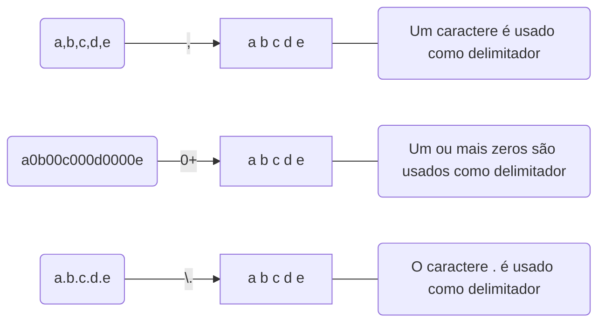

> Baseado nos cursos da Softblue

# Introdução

* Expressões regulares também são chamadas de regex

* Utilizadas para encontrar padrões dentro de um conjunto de informações

* Regras gerais

– A busca por padrões é feita da esquerda para direita

– Caracteres não são consumidos mais de uma vez

# Metacaracteres

* Permitem que a busca seja feita de forma mais dinâmica, ao invés de buscar um caractere específico

| **Metacaracter** | ** Descrição**                                   |
|:----------------:|:------------------------------------------------:|
| \d               | Dígito (0 a 9)                                   |
| \s               | Espaço em branco                                 |
| \w               | Caracteres alfanuméricos (dígitos, letras e “_”) |
| .                | Qualquer caractere                               |

* Consulte o Javadoc da classe `Pattern` para conhecer outros metacaracteres

Exemplo de uso:

{: width="100" height="100" }

* O uso dos colchetes (“[“ e “]”) define um grupo “ou” de caracteres

```
[abc] -> Caractere a ou b ou c
[?1%] -> Caractere ? ou 1 ou %
```

* Combinado com o hífen (“-”), indica uma faixa (range)

```
[a-f]    -> Caracteres de a a f
[a-f0-9] -> Caracteres de a a f ou 0 a 9
```

## Metacaracteres e Strings

* Muitas vezes os padrões de procura (que podem usar metacaracteres) são definidos em objetos `String`

* O problema é que “\” é utilizado como caractere de escape em strings

– \n = quebra de linha

– \t = tabulação

* Para que um caractere "\" possa ser adicionado numa string, ele precisa ser precedido por outro caractere "\"

```java
String p = "\d"; //Não compila
String p = "\\d"; //OK

String p = "\w\d"; //Não compila
String p = "\\w\\d"; //OK
```

# Quantificadores

* Os quantificadores permitem especificar padrões baseados em sequência

– Ex: zero ou mais dígitos, uma ou mais letras, um ou nenhum espaço em branco, etc.

| **Quantificador** | **Significado**           |
|:-----------------:|:-------------------------:|
| *                 |  Zero ou mais ocorrências |
| +                 | Uma ou mais ocorrências   |
| ?                 | Nenhuma ou uma ocorrência |

Exemplo de uso:

* Expressão regular para representar um CEP nos seguintes formatos: – 34509-390, 34509 390, 34509390

{: width="100" height="100" }

Os parênteses indicam os dados associados ao quantificador

* Expressão regular para representar uma string composta por uma ou mais letras (maiúsculas ou minúsculas), um hífen e um ou mais números

```
([A-Za-z])+-([0-9])+
```

# As Classes Pattern e Matcher

* A classe `Pattern` representa uma expressão regular, que será utilizada na identificação de algum texto

* A classe `Matcher` é quem executa o processo de busca pelo padrão nos dados fornecidos

```java
Pattern p = Pattern.compile("ab+"); //Pattern utilizado
Matcher m = p.matcher("aabbccab"); //Texto para a busca

while (m.find()) { //Encontra o padrão
	int start = m.start(); //Posição inicial
	String group = m.group(); //String encontrada
	System.out.println(start + " => " + group);
}
```

Resultado

```
1 => abb
6 => ab
```

## Substituição de Padrões

* A classe Matcher, além de encontrar padrões, é capaz de realizar substituições no texto

```java
Pattern p = Pattern.compile("bc");
Matcher m = p.matcher("abcabcabcab");
StringBuffer sb = new StringBuffer();

while (m.find()) {
	m.appendReplacement(sb, "XX"); //Vai escrevendo o texto substituído em sb
}
m.appendTail(sb); //Adiciona à sb o restante do texto
```

Resultado: aXXaXXaXXab

* Os métodos `replaceFirst()` e `replaceAll()` da classe `String` também são bastante utilizados para substituição com base em padrões

```java
String s = "abc0def1ghi2";

s.replaceFirst("\\d", "-"); //abc-def1ghi2

s.replaceAll("\\d", "-"); //abc-def-ghi-
```

# Tokenização

* É o processo de dividir uma grande quantidade de dados em pedaços menores, chamados tokens

* Um delimitador é utilizado para indicar como os tokens serão divididos

– Expressões regulares podem ser utilizadas como delimitadores



## O Método `split()`

*  A classe `String` possui o método `split()`, utilizado para dividir um texto em tokens

- O método `split()` retorna um `String[]`

```java
String texto = "a<>b<>c<>d";
String[] tokens = texto.split("<>");
```

## A Classe Scanner

* A classe Scanner é excelente para trabalhar com tokenização

* Vantagens

– Os dados de entrada podem estar em arquivos, streams ou strings

– Controle no processo de tokenização, que é feito em loop

– Conversão automática para tipos primitivos

```java
String registro = "1; Produto 1; 3; 29,90";

Scanner scanner = new Scanner(registro);
scanner.useDelimiter("; ");
scanner.useLocale(new Locale("pt", "BR"));

long id = scanner.nextLong();
String nome = scanner.next();
int qtde = scanner.nextInt();
double valor = scanner.nextDouble(); //Extrai os tokens já convertidos
```

```java
List<Integer> numeros = new ArrayList<Integer>();
String texto = "1,2,3,4,5";

Scanner scanner = new Scanner(texto);
scanner.useDelimiter(",");

while (scanner.hasNext()) {
	numeros.add(scanner.nextInt()); //Fica em loop enquanto houver tokens
}
```
