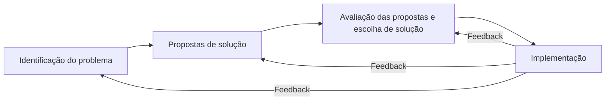
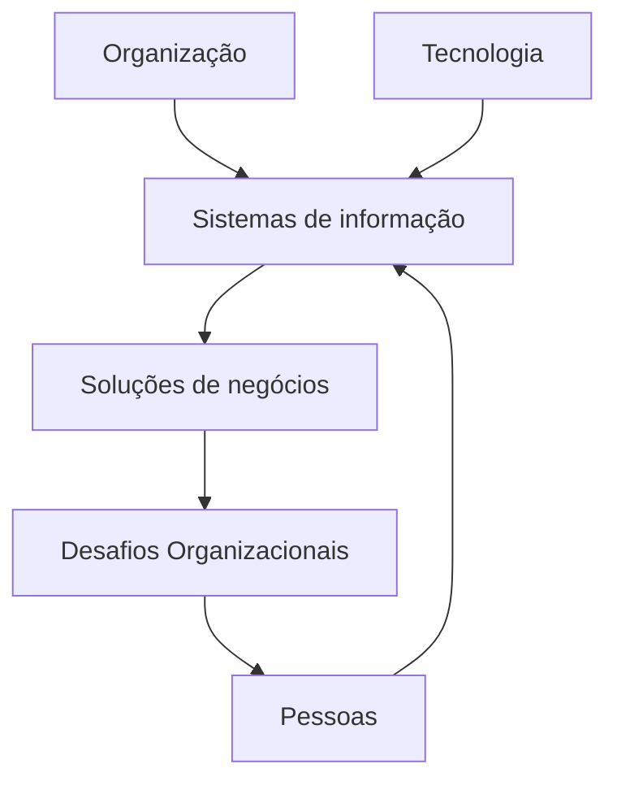
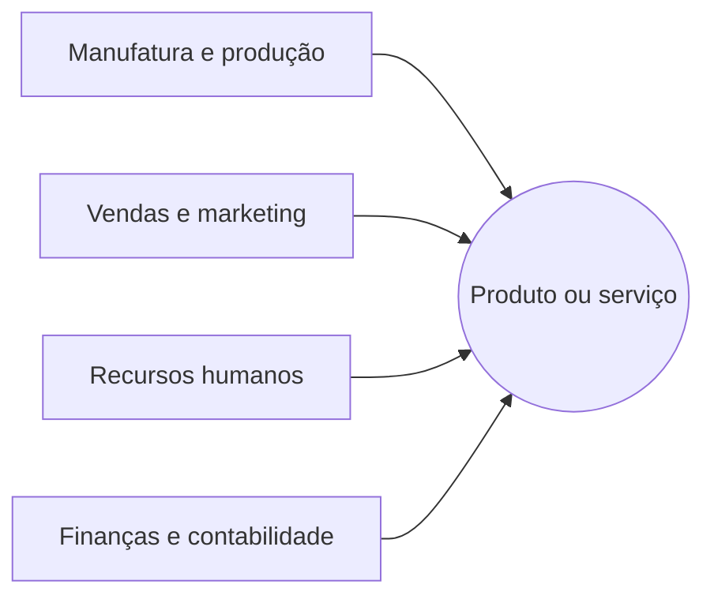
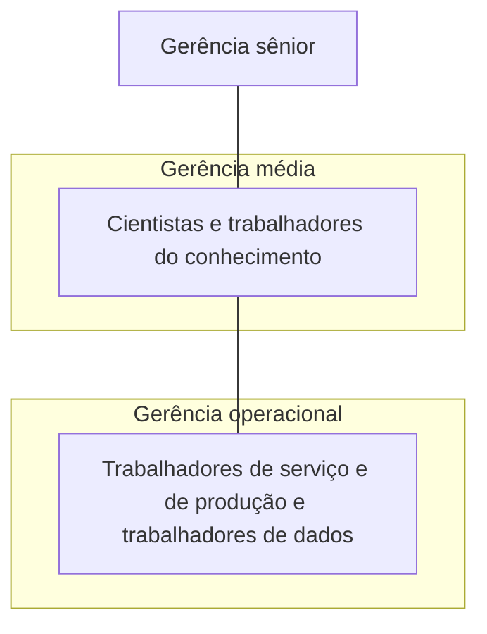
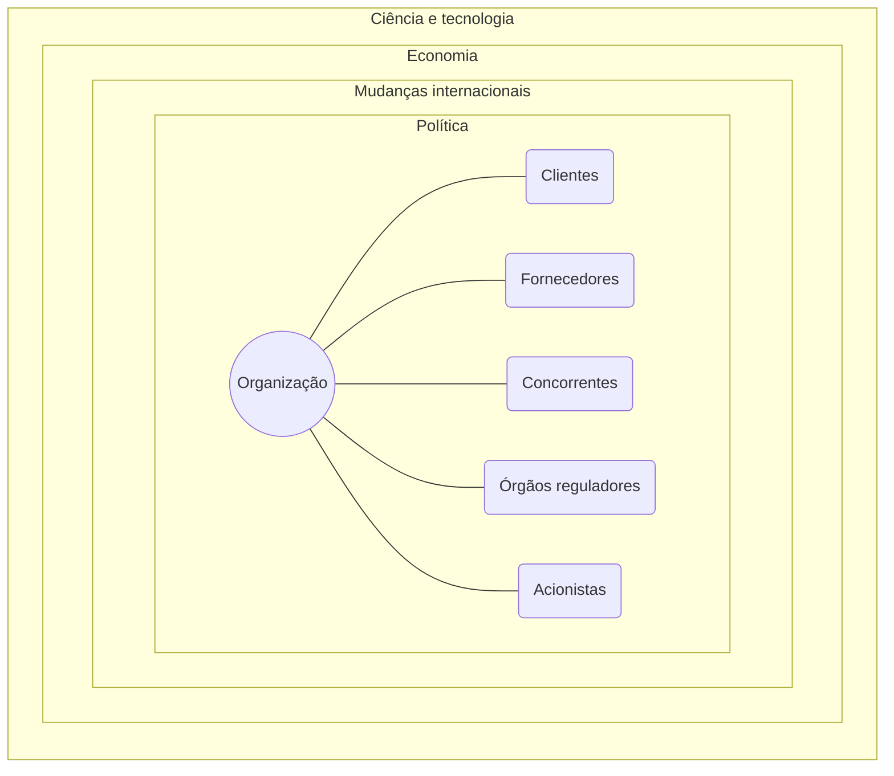

Baseado no livro: LAUDON, K. C.; LAUDON, J. P. Sistemas de Informação Gerenciais. 11ª edição. São Paulo: Pearson Education do Brasil, 2014.

## Parte I - Sistemas de informação na era digital

### Capítulo 1 - Os sistemas de informação empresariais na sua carreira

Três mudanças na área de tecnologia: a plataforma digital móvel, o uso crescente de "big data" nos negócios e o crescimento da computação em nuvem.

Objetivos organizacionais dos sistemas de informação: excelência operacional; novos produtos, serviços e modelos de negócio; relacionamento mais estreito com clientes e fornecedores; melhor tomada de decisões; vantagem competitiva; sobrevivência.

Tecnologia de informação (TI): todo o hardware e software de que uma empresa necessita para atingir seus objetivos organizacionais.

Sistema de informação (SI): conjunto de componentes inter-relacionados que coletam (ou recuperam), processam, armazenam e distribuem informações destinadas a apoiar a tomada de decisões, a coordenação e o controle em uma organização. Além disso também auxiliam os gerentes e trabalhadores a analisar problemas, visualizar assuntos complexos e criar novos produtos.

Dados - Entrada - processamento - saída - feedback - informação

Ambiente: organizações, tecnologia e pessoas.

Abordagem de resolução de problemas.

Resolução de problemas: um processo, não um evento.

### Capítulo 2 - E-business global e colaboração

Uma empresa é uma organização formal cujo objetivo é produzir produtos ou prestar serviços a fim de gerar lucro.

As quatro funções básicas de uma empresa

Processos de negócio: tarefas e passos concretos que descrevem como o trabalho é organizado em uma empresa.

Níveis de uma empresa

O ambiente de negócios

Tipos de sistemas de informação empresariais: Sistemas de processamento de transações (SPTs); Sistemas de inteligência empresarial (BI); Sistemas de informação gerenciais (SIG); Sistemas de apoio à decisão (SADs); sistemas de apoio ao executivo (SAE); sistemas integrativos (ERP); sistemas de gestão da cadeia de suprimentos (SCM); sistemas de gestão do relacionamento com o cliente (CRM); sistemas de gestão do conhecimento (SGCs).
   {: width="100" height="100" }

Programadores: especialistas técnicos altamente treinados que elaboram as instruções dos softwares de computadores.

Analistas de sistemas: sua tarefa é traduzir os problemas e as necessidades da empresa em requisitos de informações e sistemas.

### Capítulo 3 - Conquistando vantagem competitiva com os sistemas de informação
   {: width="100" height="100" }

Estratégias de sistemas de informação para lidar com as forças competitivas:

· Estratégia básica: alinhe a TI com os objetivos do negócio;

· Liderança em custos;

· Diferenciação de produto;

· Foco em nichos de mercado;

· Maior intimidade com cliente e o fornecedor;

| Força competitiva                                            | Impacto da Internet                                          |
| ------------------------------------------------------------ | ------------------------------------------------------------ |
| Produtos ou serviços substitutos                             | Permite que novos substitutos surjam com novas abordagens para atender necessidades e executar funções. |
| Poder de barganha dos clientes                               | A disponibilidade de informações globais sobre preços e produtos leva o poder de barganha para o consumidor. |
| Poder de barganha dos fornecedores                           | A internet tende a aumentar o poder de barganha sobre os fornecedores na aquisição de produtos e serviços; entretanto, os fornecedores também podem se beneficiar das barreiras reduzidas à entrada e da eliminação de distribuidores e de outros intermediários entre eles e sua clientela. |
| Ameaças de novos entrantes                                   | A internet reduz as barreiras à entrada nos mercados, bem como a necessidade de uma força de vendas, acesso a canais e estrutura física. Ela oferece tecnologia direcionadora do processo de negócio que torna as demais tarefas mais fáceis. |
| Posicionamento e rivalidade entre os concorrentes existentes | Amplia a abrangência geográfica do mercado, aumenta o número de concorrentes e reduz as diferenças entre eles, tornando mais difícil manter as vantagens operacionais, aumentando a competição por preço. |

Impacto da Internet nas forças competitivas e na estrutura do setor.
   {: width="100" height="100" }

Benchmarking: processo de comparar a eficiência e efetividade dos próprios processos de negócios com determinados padrões.

### Capítulo 4 - Questões éticas e sociais nos sistemas de informação

As cinco dimensões morais da era da informação:

· Direitos e deveres sobre a informação. Que direitos sobre a informação relativa a si própria os indivíduos e as organizações possuem? O que podem proteger?

· Direitos e deveres sobre a propriedade. Como os tradicionais direitos de propriedade intelectual serão protegidos em uma sociedade digital na qual identificar e prestar contas da propriedade é difícil, mas ignorar os direitos sobre ela é tão fácil?

· Prestação de contas e controle. Quem deverá prestar contas e ser responsabilizado por danos causados aos direitos individuais e coletivos sobre a informação e a propriedade?

· Qualidade do sistema. Que padrões de qualidade de dados e sistemas devem ser exigidos para proteger os direitos individuais e a segurança da sociedade?

· Qualidade de vida. Que valores devem ser preservados em uma sociedade baseada na informação e no conhecimento? Quais instituições devem ser protegidas contra a violação? Que valores e práticas culturais são apoiados pela nova tecnologia de informação?

Responsabilidade: significa que você aceita os custos, os deveres e as obrigações potenciais pelas decisões que toma.

Prestação de contas (accountability): significa que existem mecanismos a postos para determinar quem realizou a ação responsável.

Obrigação de indenizar (liability): amplia o conceito de responsabilidade para a área das leis; é uma característica de sistemas políticos nos quais há um conjunto de leis que permite que os indivíduos reparem os danos causados a eles por outros agentes, sistemas ou organizações.

Análise ética:

· Identifique e descreva claramento os fatos;

· Defina os conflitos ou dilema e identifique os valores de ordem mais elevada envolvidos;

· Identifique os interessados;

· Identifique as alternativas razoáveis a adotar;

· Identifique as potenciais consequências das suas opções.

Princípios éticos eletivos:

· Faça aos outros o que gostaria que fizessem a você (a regra de ouro).

· Se uma ação não é correta para todos, então não é correta para ninguém (imperativo categórico de Immanuel Kant).

· Se uma ação não puder ser realizada repetidamente, então não deve ser realizada nunca (regra da mudança de Descartes).

· Realize a ação que produza o valor mais alto ou maior (o princípio utilitário).

· Realize a ação que cause o menor dano ou que tenha o menor custo potencial (princípio da aversão ao risco).

· Pressuponha que praticamente todos os objetos tangíveis e intangíveis pertençam a alguém, salvo declaração em contrário (essa é a regra ética "não existe almoço grátis").

As dimensões morais dos sistemas de informação: privacidade, liberdade e propriedade intelectual.

Direitos sobre a propriedade: segredos comerciais; direito autoral; patentes.

Crime e abuso digital. Exclusão digital.

Riscos para a saúde: LER, STC e tecnoestresse.

## Parte II - Infraestrutura da tecnologia da informação

### Capítulo 5 - Infraestrutura de TI: hardware e software

Componentes da infraestrutura de TI: Hardware; Software; Gerenciamento de dados; Redes; Serviços.

Tendências de software: software de código aberto; ferramentas e serviços baseados em nuvem;.

Planejamento de capacidade e escalabilidade.

Custo total de propriedade de ativos tecnológicos (TCO).

Utilização de provedores de serviços tecnológicos. Terceirização.

### Capítulo 6 - Fundamentos da inteligência de negócios: gestão da informação e de banco de dados

Um banco de dados é um conjunto de arquivos relacionados entre si com registros sobre pessoas, lugares ou coisas. Entidades e atributos.

Os bancos de dados relacionais organizam os dados em tabelas bidimensionais (denominadas relações) com colunas e linhas (entidades e seus atributos). As linhas também são chamadas de registros ou tuplas. Todas as tabelas possuem um campo-chave, um identificador exclusivo chamado de chave primária. A relação entre tabelas é esclarecida por diagramas entidade/relacionamento (DER). Sistema de gestão de banco de dados (DBMS).

Big Data; Data warehouse; Data mart; Hadoop (processamento de big data); Computação em memória (in-memory computing); Plataformas analíticas.

Ferramentas analíticas: Processamento analítico on-line (Olap); Data mining; Text mining; Web mining.

### Capítulo 7 - Telecomunicações, Internet e tecnologia sem fio

Sistema operacional de rede (NOS). Hubs são dispositivos muito simples que conectam os componentes de rede, enviando um pacote de dados para todos os outros dispositivos conectados. O switch é mais inteligente do que um hub, pois pode filtrar e encaminhar dados para um destinatário específico na rede. Um roteador é um processador de comunicações usado para encaminhar pacotes de dados por diferentes redes, assegurando que a mensagem enviada chegue ao endereço correto. Rede definida por software (SDN).

Principais tecnologias de rede digital: computação cliente-servidor; comutação de pacotes; TCP/IP e conectividade.

### Capítulo 8 - Segurança em sistemas de informação

O termo segurança abarca as políticas, os procedimentos e as medidas técnicas usadas para impedir acesso não autorizado, alteração, roubo ou danos físicos a sistemas de informação.

Os controles, por sua vez, consistem em todos os métodos, as políticas e os procedimentos organizacionais que garantem a segurança dos ativos da organização, a precisão e a confiabilidade de seus registros contábeis e a aderência operacional aos padrões administrativos.
   {: width="100" height="100" }

Hackers e crimes de informática: spoofing (disfarce); sniffing (farejador); ataque de recusa de serviço (DoS); ataque distribuído de recusa de serviço (DDoS); roubo de identidade; phishing; pharming; fraude do clique.

Política de segurança e Plano de recuperação de desastres.

Uma auditoria de sistemas de informação avalia o sistema geral de segurança da empresa e identifica todos os controles que governam sistemas individuais de informação.

Tecnologias e ferramentas para garantir a segurança dos recursos de informação: gestão de identidade e autenticação; firewalls, sistemas de detecção de intrusão e softwares antivírus; criptografia e infraestrutura de chave pública; certificados digitais.

Como assegurar a disponibilidade do sistema: sistemas de computação tolerantes a falhas; computação orientada a recuperação; inspeção profunda de pacotes (DPI).

Downtime refere-se a períodos em que um sistema não está operante.

## Parte III – Principais aplicações de sistemas para a era digital

### Capítulo 9 – Conquistando excelência operacional e intimidade com o cliente: aplicações integradas

Software integrado baseia-se em uma suíte de módulos de software integrados e um banco de dados comum central que coleta e fornece dados para diversas aplicações que podem suportar quase todas as atividades de negócios internas da empresa. Quando novas informações são fornecidas por um processo, elas são disponibilizadas imediatamente para outros processos de negócio. Sistemas integrados ajudam na centralização organizacional, pois aplicam processos de negócios e padrões de dados uniformizados em toda a empresa, além de utilizar uma única plataforma tecnológica. Válidos para toda a empresa, os dados gerados pelos sistemas integrados ajudam os gestores a avaliar o desempenho organizacional.

Os sistemas de gestão da cadeia de suprimentos automatizam o fluxo de informações entre os membros da cadeia de suprimentos; com isso, esses membros podem usar essas informações para tomar decisões mais acertadas sobre quando e quanto comprar, produzir ou expedir. As informações mais precisas proporcionadas pelos sistemas de gestão da cadeia de suprimentos reduzem a incerteza e o impacto do efeito chicote. Os softwares de gestão de cadeia de suprimentos dividem-se em software de planejamento e software de execução da cadeia de suprimentos. A tecnologia da Internet facilita a gestão de cadeias de suprimentos globais, pois permite que organizações de diferentes países se conectem e compartilhem informações. A melhor comunicação entre os membros da cadeia também facilita a resposta eficiente ao cliente e a transição para um modelo orientado pela demanda.
   {: width="100" height="100" }

Sistemas de gestão do relacionamento com o cliente (CRM) integram e automatizam muitos processos voltados ao cliente nas áreas de vendas, marketing e atendimento, proporcionando uma visão válida para toda a empresa. As organizações podem usar esse conhecimento sobre o cliente quando interagem com ele para oferecer melhores serviços ou vender novos produtos e serviços. Esses sistemas também identificam clientes lucrativos ou não lucrativos, bem como oportunidades para reduzir a taxa de cancelamento (churn rate). Os principais pacotes de software de gestão do relacionamento com o cliente oferecem recursos tanto para o CRM operacional quanto para o CRM analítico. Muitas vezes, incluem módulos para gerenciar o relacionamento com parceiros de venda (gestão do relacionamento com parceiro) e para a gestão de relacionamento com o funcionário.

É difícil implementar aplicações integradas. Elas exigem profundas mudanças organizacionais, pesados investimentos em novos softwares e cuidadosa avaliação sobre como esses sistemas melhorarão o desempenho organizacional. As aplicações integradas não podem agregar valor se forem implementadas sobre processos falhos ou se as empresas não souberem como usar esses sistemas para avaliar as melhorias no desempenho. Os funcionários precisam ser preparados para os novos procedimentos e papéis. A gestão de dados também merece atenção especial.

As aplicações integradas são agora mais flexíveis, disponíveis na Web e podem ser integradas com outros sistemas, usando serviços Web e arquitetura orientada a serviços (SOA). Elas também têm código aberto e versões sob demanda capazes de serem executadas em infraestruturas de nuvem ou em plataformas móveis. O software CRM acrescentou recursos de redes sociais para aumentar a colaboração interna, aprofundar as interações com os clientes e utilizar dados das redes sociais. Versões de código aberto, para plataformas móveis e em nuvem de alguns desses produtos estão se tornando disponíveis.

### Capítulo 10 – Comércio eletrônico: mercados digitais, mercadorias digitais

O comércio eletrônico envolve transações comerciais realizadas digitalmente entre uma organização e outra ou entre uma organização e um indivíduo. As características distintivas da tecnologia de comércio eletrônico incluem ubiquidade, alcance global, padrões universais de tecnologia, riqueza, interatividade, densidade da informação, recursos para personalização e customização, além de tecnologia social. O comércio eletrônico tem se tornado cada vez mais social, móvel e local.

Mercados digitais são considerados mais "transparentes" do que os tradicionais. A assimetria de informação, os custos de transação, busca e menu e a possibilidade de alterar os preços dinamicamente conforme as condições de mercado são reduzidos. Mercadorias digitais, como música, vídeos, software e livros, podem ser entregues por meio de uma rede digital. Uma vez que um produto digital tenha sido produzido, o custo de entregar esse produto digitalmente é extremamente baixo.

Os principais 2 modelos de negócios no comércio eletrônico são lojas virtuais (e-tailers), corretoras de transações, criadores de mercado, provedores de conteúdo, provedores de comunidade virtual, provedores de serviços e portais. Os principais modelos de receita são propaganda, vendas, assinatura, free/freemium, taxa por transação e afiliação.

A Internet oferece novas formas de identificação e comunicação com milhões de clientes potenciais a custos infinitamente mais baixos do que os praticados na mídia tradicional. Técnicas de crowdsourcing utilizando a "sabedoria das massas" ajudam as empresas a aprender mais sobre seus consumidores de modo a aprimorar a oferta de produtos e aumentar o valor do consumidor. Técnicas de alvo comportamental aumentam a eficiência de anúncios em forma de banners, mídia rica e vídeos. O comércio social usa redes sociais e sites de redes sociais para melhorar o direcionamento de produtos e serviços.

O comércio eletrônico B2B gera eficiência, pois permite que as empresas localizem fornecedores, solicitem cotações, façam pedidos e rastreiem encomendas em trânsito eletronicamente. Os e-marketplaces oferecem um marketplace único e digital para um grande número de compradores e vendedores. Redes setoriais privadas conectam uma empresa aos seus fornecedores e a outros parceiros de negócios estratégicos, com o objetivo de desenvolver cadeias de suprimento altamente eficientes e responder com rapidez às demandas do consumidor.

O m-commerce é especialmente adequado a aplicativos baseados em localização, tais como encontrar hotéis e restaurantes locais, monitorar o tráfego local e as condições climáticas e fazer um marketing personalizado, de acordo com a localização. Celulares e computadores de mão estão sendo usados para pagamento móvel de contas, transações bancárias e acionárias, atualizações na programação de meios de transporte e downloads de conteúdo digital, como músicas, jogos e videoclipes. O m-commerce demanda a existência de portais e sistemas de pagamentos digitais que possam lidar com microtransações. Os recursos de GPS dos smartphones possibilitam os serviços geossociais, de geopublicidade e de geoinformação.

A construção bem-sucedida de uma presença no comércio eletrônico requer uma compreensão clara sobre os objetivos de negócios a serem alcançados e a escolha das plataformas, atividades e cronograma adequados para atingir esses objetivos. Uma presença no comércio eletrônico inclui não apenas um site corporativo, mas também uma presença no Facebook, Twitter e em outros sites de redes sociais e apps de smartphones.

### Capítulo 11 – Aprimorando a tomada de decisão e a gestão do conhecimento

As decisões podem ser estruturadas, semiestruturadas ou não estruturadas. As decisões estruturadas são mais frequentes no nível operacional da organização, e as não estruturadas, no nível estratégico. Elas podem ser tomadas por indivíduos ou grupos, por funcionários ou gerentes operacionais, de nível médio e seniores. Existem quatro estágios na tomada de decisão: inteligência, concepção, seleção e implementação.

A inteligência e a análise empresarial prometem entregar informações corretas, quase em tempo real aos profissionais que tomam decisão, e as ferramentas analíticas podem ajudá-los a compreender rapidamente as informações e a tomarem a ação. Um ambiente de inteligência empresarial consiste em dados do ambiente empresarial, na infraestrutura de inteligência empresarial, em um conjunto de ferramentas de BA (Business Analytics), nos usuários e métodos gerenciais, em uma plataforma de entrega de inteligência empresarial (SIG, SAD, ou SAE) e na interface do usuário. Há seis funcionalidades analíticas que os sistemas de inteligência empresarial entregam para atingir esses fins: relatórios de produção predefinidos, relatórios parametrizados, painéis e scorecards, consultas e buscas específicas, a capacidade de drill-down para obter visualizações detalhadas dos dados, bem como a capacidade de modelar cenários e criar previsões. A análise de inteligência empresarial está começando a lidar com o Big Data. A análise preditiva e a análise de localização são recursos analíticos importantes.

Sistemas de informações gerenciais (SIG) que produzem relatórios de produção pré-embalados são normalmente utilizados para apoiar a gerência operacional e de nível médio, cuja tomada de decisão é bastante estruturada. Para a tomada de decisões não estruturadas, analistas e "super usuários" empregam sistemas de apoio à decisão (SAD), com poderosas ferramentas de análise e de modelagem, incluindo planilhas e tabelas dinâmicas. Executivos seniores que tomam decisões não estruturadas usam painéis e interfaces visuais de exibição de indicadores-chave de desempenho que afetam a rentabilidade global, o sucesso e a estratégia da empresa. O balanced scorecard (estrutura de operacionalização do plano estratégico de uma empresa, focando os resultados mensuráveis em quatro dimensões do desempenho da empresa: financeiro, processos de negócios, clientes e aprendizado e crescimento) e a gestão do desempenho empresarial são duas metodologias utilizadas no projeto de sistemas de apoio ao executivo (SAE).

Sistemas de apoio à decisão em grupo (SADG) ajudam as pessoas a se reunir em grupo e a tomar decisões de forma mais eficiente. O SADG apresenta recursos especiais de sala de conferências na qual os participantes contribuem com suas ideias utilizando computadores em rede e ferramentas de software para organização de ideias, coleta de informações, classificação e definição de prioridades, bem como documentação das reuniões.

Sistemas especialistas capturam o conhecimento tácito proveniente de domínio limitado de perícia humana e expressam esse conhecimento na forma de regras. A estratégia para pesquisar a base de conhecimento é chamada de mecanismo de inferência. O raciocínio baseado em casos representa o conhecimento organizacional na forma de um banco de dados de casos que pode ser continuamente expandido e refinado.

A lógica difusa é uma tecnologia de software para expressar o conhecimento na forma de regras usando valores subjetivos ou aproximados. Redes neurais consistem em um conjunto de software e hardware que tenta imitar os processos de raciocínio do cérebro humano. Elas são famosas por sua capacidade de aprender sem programação e de reconhecer padrões em quantidades gigantescas de dados.

Algoritmos genéticos desenvolvem soluções para problemas particulares usando processos geneticamente fundamentados, tais como adaptação, recombinação e mutação. Agentes inteligentes são programas de software com bases de conhecimento embutidas ou aprendidas que realizam tarefas específicas, repetitivas e previsíveis para um usuário individual, um processo de negócio ou uma aplicação de software.

Sistemas integrados de gestão do conteúdo fornecem bancos de dados e ferramentas para organizar e armazenar documentos estruturados e conhecimento semiestruturado, tal como e-mail ou mídia rica. Sistemas de rede de conhecimento oferecem listas e ferramentas para localizar os funcionários da empresa com conhecimentos especializados e que são fontes importantes de conhecimento tácito. Muitas vezes, tais sistemas incluem ferramentas de colaboração em grupo, portais para simplificar o acesso à informação, ferramentas de busca e para classificar as informações com base em uma taxonomia apropriada à organização. Sistemas de gestão do aprendizado oferecem ferramentas para gestão, disponibilização, controle e avaliação de vários tipos de treinamento e aprendizado dos funcionários.

Sistemas de trabalhadores do conhecimento apoiam a criação de novos conhecimentos e sua integração à organização. Exigem fácil acesso a bases de conhecimentos externas; um hardware poderoso, capaz de comportar software com potentes recursos gráficos, de análise, gestão de documentos e comunicações; e uma interface amigável ao usuário.

## Parte IV – Como desenvolver e gerenciar sistemas

### Capítulo 12 – Como desenvolver sistemas de informação e gerenciar projetos

Os principais passos de resolução de problemas para o desenvolvimento de novos sistemas de informação são: (I) definir e compreender o problema; (2) desenvolver soluções alternativas; (3) avaliar e escolher a solução; e (4) implementar a solução. O terceiro passo abrange a avaliação da viabilidade técnica, financeira e organizacional de cada alternativa. O quarto passo abarca a finalização das especificações de projeto, a aquisição de hardware e software, testes, a oferta de treinamento e documentação, a conversão e a avaliação da solução de sistema uma vez que ela entre em produção.

O ciclo de vida de sistemas exige que eles sejam desenvolvidos em estágios formais, que devem evoluir em sequência e ter resultados definidos; cada um precisa ser formalmente aprovado antes que o próximo se inicie. O ciclo de vida de sistemas é rígido e dispendioso, mas adequado para grandes projetos.

A prototipagem consiste em desenvolver um sistema experimental de maneira rápida e barata, para que os usuários finais interajam com ele e o avaliem. O protótipo é refinado e aperfeiçoado até que os usuários sintam que ele atende a todas as suas necessidades, podendo ser usado como modelo para criar o sistema final. Os sistemas desenvolvidos pelo usuário final podem ser criados de modo rápido e informal utilizando ferramentas de software de quarta geração. O desenvolvimento pelo usuário final pode melhorar a determinação de requisitos e reduzir o acúmulo de tarefas da aplicação.

Pacotes de software aplicativo eliminam a necessidade de escrever programas durante o desenvolvimento do sistema de informação. Esses pacotes são úteis se a empresa não conta com uma equipe de sistemas de informação ou com recursos financeiros suficientes para desenvolver um sistema sob medida.

O outsourcing (terceirização) consiste em usar um fornecedor externo para desenvolver (ou operar) esses sistemas de informação. Se for adequadamente gerenciado, o outsourcing pode poupar custos de desenvolvimento de aplicações ou permitir que as organizações desenvolvam aplicações sem uma equipe interna de sistemas de informação.

Desenvolvimento rápido de aplicações, projeto conjunto de aplicações (JAD), plataformas baseadas em nuvem e componentes de software reutilizáveis (incluindo serviços da Web) podem ser usados para acelerar o processo de desenvolvimento de sistemas. O desenvolvimento de aplicativos móveis deve considerar múltiplas plataformas, tamanhos menores de tela e a necessidade de preservar os recursos.

As duas principais metodologias para modelagem e projeto de sistemas de informação são as metodologias estruturadas e o desenvolvimento orientado a objetos. As metodologias estruturadas enfocam separadamente os dados e processos de modelagem. O diagrama de fluxo de dados é a principal ferramenta para a análise estruturada, enquanto o diagrama de estrutura é a principal ferramenta para representar o projeto de software estruturado. No desenvolvimento orientado a objetos, um sistema é um conjunto de objetos que combinam processos e dados.

Para determinar se um sistema de informação é um bom investimento para a empresa, é preciso calcular seus custos e benefícios. Os benefícios tangíveis são quantificáveis, e os intangíveis não podem ser imediatamente quantificados, mas podem proporcionar vantagens quantificáveis no futuro. Benefícios que superem os custos devem, então, ser analisados por meio de métodos de orçamento de capital para se ter certeza de que representam um bom retorno sobre o capital investido da empresa. As organizações devem desenvolver planos de sistemas de informação que descrevam como a tecnologia de informação apoia o plano de negócios e a estratégia global da empresa. Análise de carteira (portfólio) e modelos de pontuação (scoring) podem ser usados para avaliar projetos e sistemas de informação alternativos.

Os projetos de sistemas de informação, bem como todo o processo de implementação, devem ser gerenciados como uma mudança organizacional planejada com base na análise de impacto organizacional. Suporte e controle gerenciais do processo de implementação são essenciais, assim como mecanismos para tratamento do nível de risco em cada novo projeto de sistema. Os riscos sofrem influência do tamanho do projeto, de sua estrutura e do nível de conhecimento técnico das equipes de sistemas de informação e projetos. Planejamento formal e ferramentas de controle (dentre elas, gráficos de Gantt e PERT) controlam a alocação de recursos e as atividades específicas do projeto. Os usuários podem ser encorajados a assumir papéis ativos no desenvolvimento de sistemas e a se envolver nas fases de instalação e treinamento. Projetos de sistemas de informações globais devem envolver unidades locais no processo de planejamento sem ceder o controle do projeto a interesses limitados.