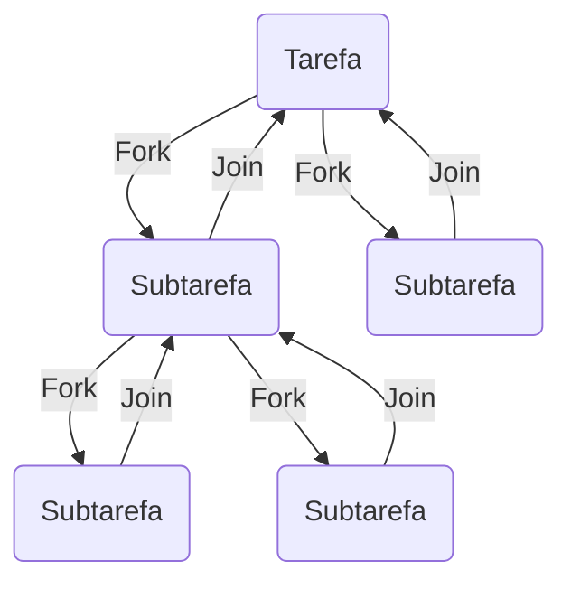
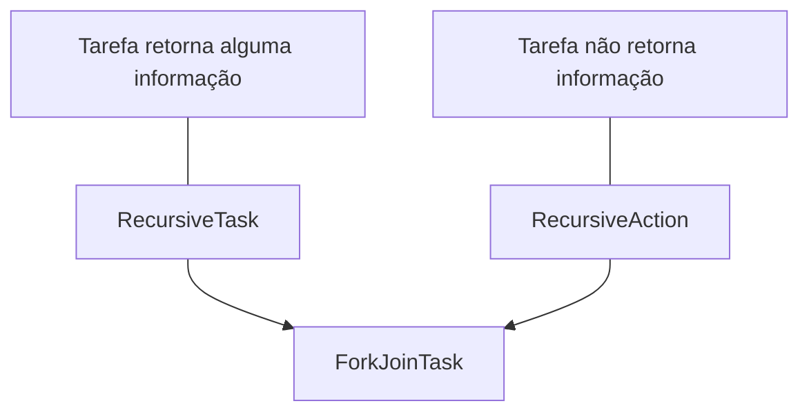

> Baseado nos cursos da Softblue

# Introdução

* Mecanismos para trabalhar com programação concorrente

– Classe `Thread`

– Interface `Runnable`

– Modificador `synchronized`

– Métodos `wait()`, `notify()` e `notifyAll()`

* A partir da versão 5 do Java foi introduzido o pacote `java.util.concurrent`, que criou novos mecanismos para trabalhar com programação concorrente

* Além do pacote `java.util.concurrent`, existem também outros dois novos pacotes:

– `java.util.concurrent.locks`

– `java.util.concurrent.atomic`

* Estes três pacotes incorporam novas funcionalidades para trabalhar com threads:

– Executores de tarefas

– Coleções que suportam concorrência

– Pool de threads

– Operações atômicas com variáveis

– Comunicação entre threads com uso de condições

– etc.

## Threads

* “Processos Leves”

* Uma thread representa uma linha de execução em um processo

* Um processo pode ter uma ou mais threads executando simultaneamente

* As threads compartilham recursos do processo

# Interfaces Runnable e Callable

## Runnable

*  Esta interface é implementada por classes que desejam ter seu código executado em uma thread separada

* A classe deve implementar o método `run()`

```java
public class Localizador implements Runnable {
	public void run() {
		//código da thread
	}
}
```

* A interface Runnable tem dois problemas

– O método `run()` não pode retornar dados

– O método `run()` não pode lançar checked exceptions

## Callable

* Criada para resolver os problemas da interface `Runnable`

```java
public class Localizador implements Callable<String> {//O tipo de retorno do método call() é parametrizado
	public String call() throws Exception {//O método pode lançar exceções
		//código da thread
	}
}
```

# Criando e executando threads

* Usando o novo pacote `java.util.concurrent` você não precisa mais lançar mão da classe Thread para criar e executar threads

* A criação e execução das threads fica a cargo dos executores (executors)

* Trabalhando com uma thread:

```java
public class Handler implements Runnable {
	public void run() {
		//código da thread
	}
}

ExecutorService e = Executors.newSingleThreadExecutor();//Cria um executor para uma thread
e.execute(new Handler());//Recebe um Runnable como parâmetro e o executa
e.shutdown();
```

* Trabalhando com um pool de threads fixo:

```java
public class Handler implements Runnable {
	public void run() {
		//código da thread
	}
}

ExecutorService e = Executors.newFixedThreadPool(5);//Cria um executor baseado num pool de threads de tamanho fixo
e.execute(new Handler());//Recebe um Runnable como parâmetro e o executa
e.shutdown();
```

# Sincronização

* Existem porções de código que não podem ser executadas por duas threads ao mesmo tempo

– Região crítica

* O Java trabalha com o conceito de monitor, que garante esta sincronização

– Um monitor pode ser qualquer objeto

– Cada monitor possui um lock, que é entregado à thread que acessa a região crítica

– O modificador `synchronized` é usado para delimitar a região crítica

– Threads sem lock aguardam

* Com a chegada do pacote `java.util.concurrent.locks`, não é mais necessário usar o modificador synchronized

* Um novo conceito de lock é usado no lugar:

– `ReentrantLock`

– `ReentrantReadWriteLock`

## ReentrantLock

* Quando a thread chama o método `lock()` no objeto, ela possui acesso exclusivo, até que chame o método `unlock()`

* Se outra thread tentar chamar o método `lock()` neste meio tempo, ficará aguardando

```java
ReentrantLock l = new ReentrantLock();

l.lock();//Garante acesso exclusivo ao código
try {
	//região crítica
} finally {
	l.unlock();//Libera o acesso para outras threads
}
```

## ReentrantReadWriteLock

* Possui um par de locks: um para leitura e outro para escrita

* O lock de leitura pode ser obtido por múltiplas threads simultaneamente

* Na hora em que uma thread possui o lock de escrita, ela tem acesso exclusivo (nenhuma outra thread pode estar lendo ou escrevendo)

```java
ReentrantReadWriteLock rwl = new ReentrantReadWriteLock();
Lock r = rwl.readLock();
Lock w = rwl.writeLock();
```

Os métodos lock() e unlock() são invocados para obter e liberar os locks

# Comunicação entre threads

* Na forma "clássica", a comunicação entre threads era feita usando três métodos

– wait()

– notify()

– notifyAll()

* No pacote `java.util.concurrent.locks`, são usadas as condições (conditions)

```java
ReentrantLock l = new ReentrantLock();
Condition c = l.newCondition();//Cria uma condição

l.lock();

try {
	while (count < 10) {
		c.await();//Faz a thread dormir até que ela seja avisada de que pode acordar
	}
	c.signal();//Acorda uma thread que estava aguardando
} finally {
	l.unlock();
}
```

| **Forma Clássica** | **Usando Condições** |
|:------------------:|:--------------------:|
| wait()             | await()              |
| notify()           | signal()             |
| notifyAll()        | signalAll()          |

# Tarefas futuras

* Às vezes você precisa iniciar uma thread para realizar um processamento assíncrono e esta thread vai retornar um valor no futuro

* O pacote `java.util.concurrent` tem a classe `FutureTask` que serve para este propósito

```java
public class Somador implements Callable<Integer> {
	private int x;
	private int y;
	
	public Somador(int x, int y) {
		this.x = x;
		this.y = y;
	}
	
	public Integer call() throws Exception {
		return x + y;
	}
}

ExecutorService e = Executors.newSingleThreadExecutor();
Somador s = new Somador(10, 5);
FutureTask<Integer> task = new FutureTask<Integer>(s);//Uma FutureTask usa um Callable para realizar a tarefa
e.execute(task);
int soma = task.get();//O método get() retorna o resultado vindo do Callable.
e.shutdown();
```

O método `get()` bloqueia até que o resultado esteja disponível

# Operações atômicas

*  Em um ambiente multithread às vezes é necessário sincronizar o acesso a uma variável para garantir a consistência do seu valor

* O pacote `java.util.concurrent.atomic` possui classes que fazem operações de forma atômica em variáveis sem o uso de locks

* Existem diversas classes que suportam este tipo de operação atômica

– AtomicInteger

– AtomicIntegerArray

– AtomicBoolean

– AtomicBooleanArray

– etc.

* Todas elas funcionam de forma semelhante

```java
AtomicInteger i = new AtomicInteger(10);//Representa o 10
int valor = i.incrementAndGet();//Incrementa o valor e retorna o novo valor (operação atômica)

AtomicIntegerArray a = new AtomicIntegerArray(new int[]{1, 2, 3});//Representa um array
int valor = a.getAndDecrement(1);//Retorna o valor do índice 1 do array e decrementa o valor (operação atômica) 
```

# Programação paralela com a API Fork & Join

* Executar tarefas ao mesmo tempo buscando um objetivo comum

* O Java sempre deu suporte à programação concorrente

* A partir do Java 7, a linguagem passa a ter suporte à programação paralela

– Fork & Join API

* Por que programação paralela?

– Computadores e dispositivos multicore

– Divisão de uma tarefa "pesada" em tarefas mais "leves"

* Soma de valores de um array

{: width="100" height="100" }

* A Fork & Join API permite o uso de programação paralela

* Ela é baseada na divisão de um problema em problemas menores, dividindo a tarefa entre os processadores

* Baseada em duas operações

– Fork: cria uma subtarefa para ser executada de forma assíncrona

– Join: aguarda até que a subtarefa seja completada



## Criando tarefas

* Uma tarefa deve ser uma classe que herde de `RecursiveTask` ou `RecursiveAction`



```java
public class SumArray extends RecursiveTask<Long> {
	public Long compute() {
		SumArray subTask = new SumArray();
		subTask.fork();//Submete uma subtarefa para execução
		// Faz o processamento necessário...
		Long result = subTask.join();//Aguarda a subtarefa terminar
	}
}
```

* O início da execução da tarefa é feito através do método `invoke()` da classe `ForkJoinPool`

```java
SumArray task = new SumArray();
ForkJoinPool pool = new ForkJoinPool();//Cria um pool de threads
Long result = pool.invoke(task);//Executa a tarefa e fica aguardando o resultado
```

# Usar ou não usar paralelismo?

* A programação paralela só pode ser usada quando

– Uma tarefa pode ser dividida em subtarefas

– Uma subtarefa não depende do resultado de outras subtarefas

* Testes são necessários para encontrar o grau de paralelismo que vai trazer o maior ganho de performance

– Em alguns casos o uso do paralelismo pode deixar o código mais lento
