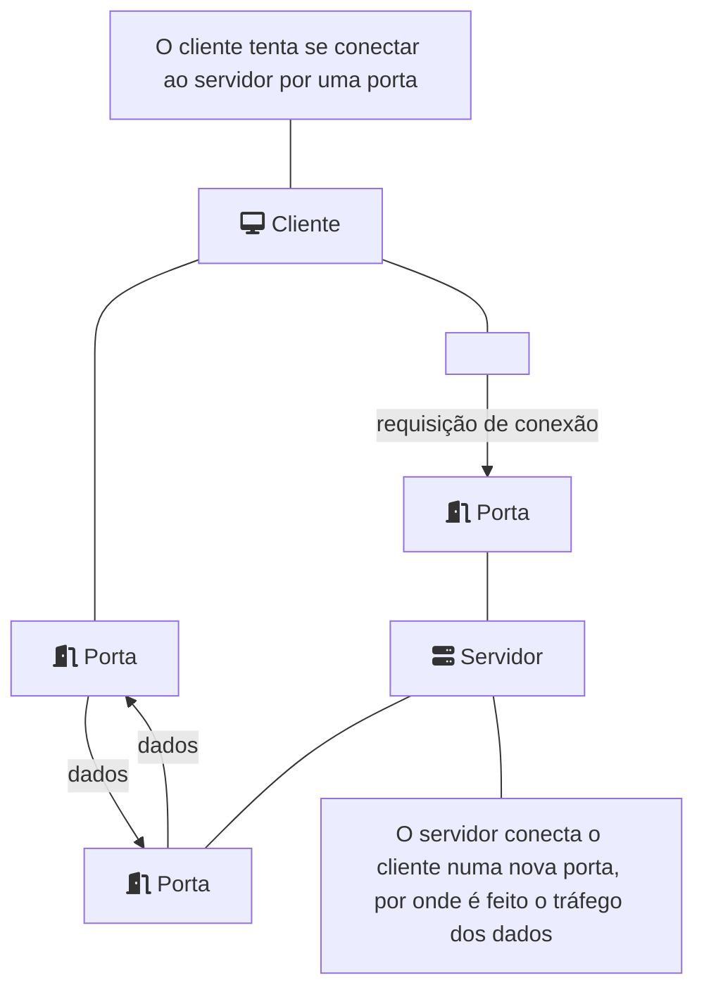
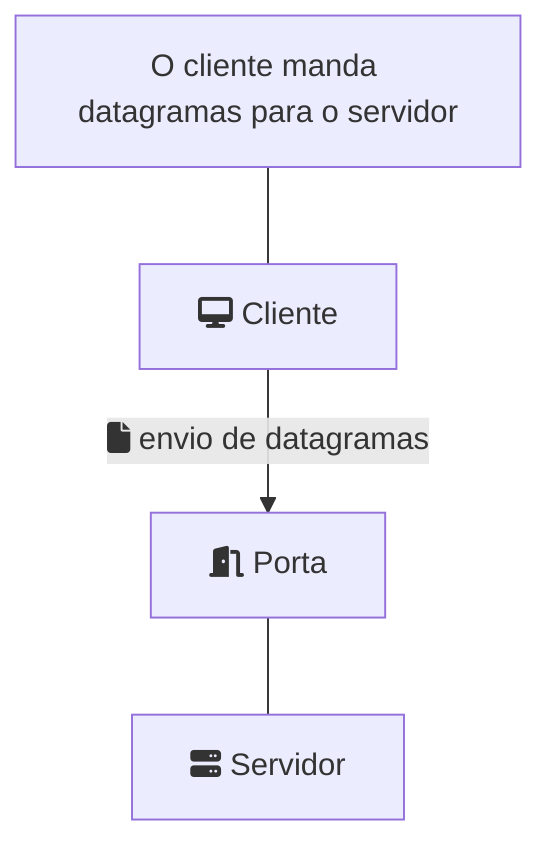
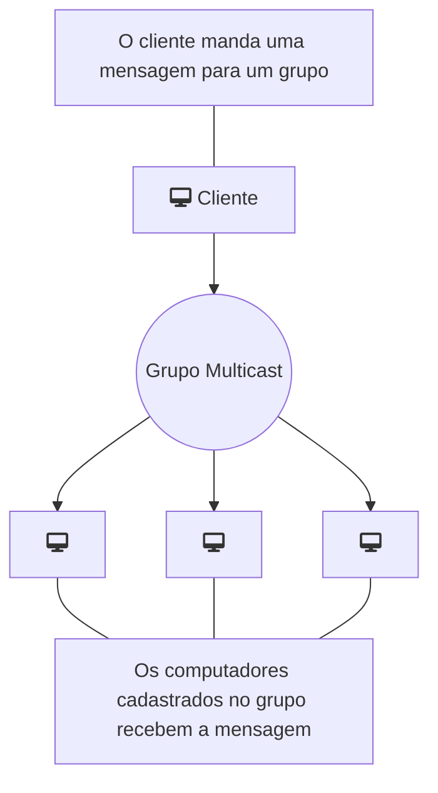

> Baseado nos cursos da Softblue

# O que são sockets

* Mecanismo de comunicação entre dois programas que funcionam na mesma rede

* Modelo cliente/servidor

– Uma aplicação servidor é executada numa determinada máquina e tem um socket ligado a uma porta específica dessa máquina

– O servidor espera que um cliente faça um pedido de ligação através desse socket

# Sockets TCP/IP

* Existe uma conexão entre o cliente e o servidor

– Permite utilização de fluxos de dados (streams)

* A comunicação é confiável

– Sem perda de dados

– Sem inversão de ordem dos pacotes

# Sockets UDP/IP

* Não existe uma conexão entre o cliente e o servidor

– Envio de datagramas (remetente, receptor, conteúdo)

* A comunicação não é confiável

– Dados podem ser perdidos

– Datagramas podem chegar fora de ordem

* Muito mais veloz que sockets TCP/IP

# Multicast

* Envio de datagramas para um grupo de destinatários

* Utiliza protocolo UDP

* Grupos multicast (IPs classe “D”)

– de 224.0.0.0 a 239.255.255.255

