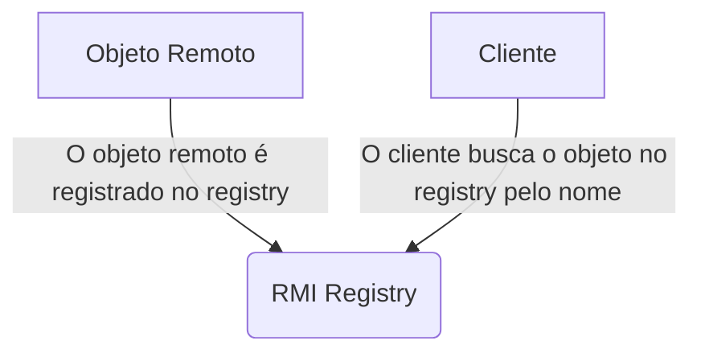
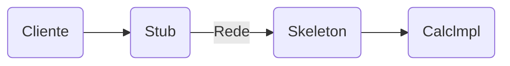
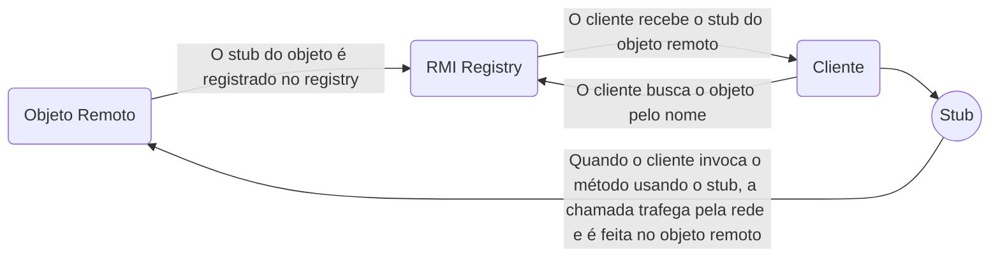

> Baseado nos cursos da Softblue

# Introdução ao RMI

* Remote Method Invocation

* Permite chamar métodos em objetos que podem estar espalhados ela rede

* Baseado numa arquitetura cliente/servidor

# RMI registry

* É um repositório de objetos remotos

* Permite a localização de objetos por nome

* Deve ser executado em algum computador da rede e seu endereço deve ser conhecido



# Trabalhando com objetos remotos

## A interface do objeto remoto

```java
public interface Calc extends Remote {//A interface deve estender java.rmi.Remote
    public int somar(int x, int y) throws RemoteException;//Os métodos declarados serão acessíveis remotamente
    public int subtrair(int x, int y) throws RemoteException;//Todos os métodos devem lançar java.rmi.RemoteException
}
```

## Implementando os métodos

```java
public class CalcImpl
    extends UnicastRemoteObject implements Calc {//Tipicamente extende UnicastRemoteObject, classe que implementa a interface Calc
    public CalcImpl() throws RemoteException {
    }
    @Override//Implementação dos métodos da interface

    public int somar(int x, int y) {
        return x + y;
    }
    @Override
    public int subtrair(int x, int y) {
        return x - y;
    }
}
```

## Registrando o objeto

```java
Calc c = new CalcImpl();//Cria o objeto
Registry registry = LocateRegistry.createRegistry(1099);//Inicia o RMI registry na porta 1099
registry.rebind("calc", c);//Registra o objeto no registry com o nome calc
```

# Implementando um cliente

```java
String url = "rmi://localhost:1099/calc";//Constrói a URL usada na busca do objeto
Calc calc = (Calc) Naming.lookup(url);//Procura o objeto no registry e recebe a sua referência
int r = calc.somar(10, 20));//Invoca o método no objeto remoto
```

# Stubs e skeletons



* O stub é um representante do objeto remoto no cliente. É implementado pelo Java.

* O skeleton recebe as informações pela rede e invoca o objeto real. É implementado pelo Java.

* Objetos das classes que trafegam pela rede devem implementar `Serializable`

## RMI registry e os stubs


