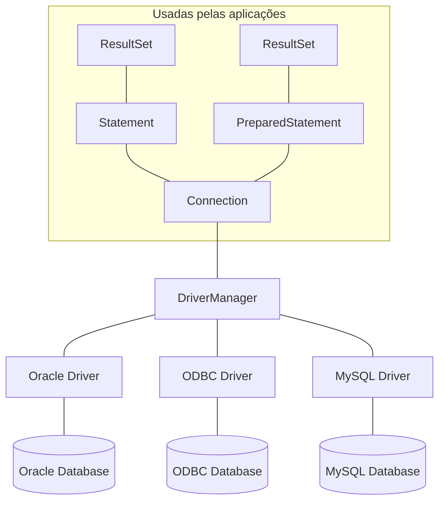

> Baseado nos cursos da Softblue

# Introdução ao JDBC

* Aplicações podem se conectar a diversos tipos de bancos de dados

* Alteração de código quando o banco de dados fosse alterado

* JDBC – Java Database Connectivity

* Surgiu para flexibilizar aplicações

* É uma camada intermediária entre a aplicação Java e os bancos de dados

* Possibilita alteração de banco de dados sem alteração no código

– Desde que sejam utilizadas apenas chamadas SQL padronizadas

* Livra o programador da responsabilidade de entender e programar a comunicação com o banco de dados

# Arquitetura



Todas as classes e interfaces fazem parte do pacote `java.sql`

| Classe            | Descrição                                                           |
|-------------------|---------------------------------------------------------------------|
| DriverManager     | Gerencia o driver e cria uma conexão com o banco  de dados          |
| Connection        | Representa a conexão com o banco de dados                           |
| Statement         | Controla e executa uma instrução SQL                                |
| PreparedStatement | Controla e executa uma instrução SQL já preparada no banco de dados |
| ResultSet         | Contém o conjunto de dados retornado por uma  consulta SQL          |
| ResultsetMetaData | Trata dos metadados dos dados retornados do banco de  dados         |
| DatabaseMetaData  | Trata dos metadados do banco de dados                               |

# Abrindo uma conexão

* Carregamento do driver

```java
Class.forName("org.postgresql.Driver");
```

* Abertura de conexão

```java
Connection conn = DriverManager.getConnection("jdbc:postgresql://localhost:5432/nomedb", "user", "pwd");
```

# As interfaces Statement e PreparedStatement

## A interface Statement

* Usada para executar comandos no banco de dados

| Método          | Descrição                                                                                              |
|-----------------|--------------------------------------------------------------------------------------------------------|
| executeQuery()  | - Executa queries do tipo SELECT - Retorna os resultados em um ResultSet                               |
| executeUpdate() | - Executa queries do tipo INSERT, UPDATE ou DELETE - Retorna o número de registros afetados pela query |

* O objeto da interface `Statement` é obtido através da interface `Connection`

```java
String sql = "INSERT INTO cliente VALUES (1, 'Cliente 1')";
Statement stmt = conn.createStatement();
stmt.executeUpdate(sql);
stmt.close();
```

* É recomendado o uso do mesmo `Statement` para executar diversas instruções no banco de dados

* O `Statement` deve ser fechado após a última vez que for usado, através do método `close()`

## A interface PreparedStatement

* A interface `PreparedStatement` é capaz de pré-compilar comandos a serem executados no banco de dados

– Aumento significativo de performance

* Possibilita facilidades na passagem de parâmetros ao comando SQL

```java
String sql = "INSERT INTO cliente VALUES (?, ?)";
PreparedStatement stmt = conn.prepareStatement(sql);
stmt.setInt(1, 1);
stmt.setString(2, 'Cliente 1');
stmt.executeUpdate();
stmt.close();
```

# A interface ResultSet

* Contém os dados retornados pelo banco de dados após a execução de um comando SELECT

* Possui o método `next()`, que permite iterar sobre todos os dados retornados pelo banco de dados

```java
String sql = "SELECT id, nome FROM cliente";
Statement stmt = conn.createStatement();
ResultSet rs = stmt.executeQuery(sql);

while(rs.next()) {
  int id = rs.getInt("id");
  String nome = rs.getString("nome");
}
stmt.close();
```

* A interface `ResultSet` possui métodos que já fazem a conversão do dado para os tipos de dados do Java

– `getInt()`, `getString()`, `getDouble()`, etc.

* É possível obter o valor de um campo através do seu nome, alias ou posição no `ResultSet`

# Trabalhando com metadados

* Interface `DatabaseMetaData`

– Possibilita obter informações a respeito do servidor de banco de dados, como bancos de dados disponíveis, esquemas criados, tabelas, etc.

– É obtido através do método `getMetaData()` da interface `Connection`

* Interface `ResultSetMetaData`

– Possibilita obter informações relativas aos dados de um `ResultSet`, como número de colunas, tipo de dado das colunas, etc.

– É obtido através do método `getMetaData()` da interface `ResultSet`

# Transações

* O assunto transações é abrangente e complexo

* É importante saber que transações devem ser atômicas

– Tudo executa ou nada executa

* JDBC permite trabalhar com transações em banco de dados

* Para iniciar uma transação, o `auto-commit` da conexão deve ser mudado para false, para possibilitar o controle manual da 
transação

* Os métodos `commit()` e `rollback()` devem ser usados ao término da transação

```java
try {
  conn.setAutoCommit(false);
  //execução das queries Dentro da transação
  conn.commit();
} catch(SQLException e) {
  conn.rollback();
}
```

# Conhecendo a SQLException

* Praticamente todos os métodos do JDBC lançam exceções do tipo `SQLException`

* A classe `SQLException` possui métodos importantes

| Método              | Descrição                                              |
|---------------------|--------------------------------------------------------|
| getMessage()        | Retorna a mensagem de erro                             |
| getSQLState()       | Retorna um dos códigos de estado do padrão ANSI-92 SQL |
| getErrorCode()      | Retorna o código de erro específico do fornecedor      |
| getNextException()  | Retorna a exceção aninhada, se houver                  |


# Atualizações em lote

* JDBC permite agrupar comandos de atualização no banco de dados e mandá-los todos de uma só vez, ao invés de mandá-los um a um (batch)

* Grande melhora de performance quando da necessidade da atualização de muitos dados

```java
String sql = "INSERT INTO cliente VALUES (?, ?)";
Statement stmt = conn.prepareStatement(sql);
stmt.setInt(1, 1);
stmt.setString(2, 'Cliente 1');
stmt.addBatch();
stmt.setInt(1, 2);
stmt.setString(2, 'Cliente 2');
stmt.addBatch();
stmt.executeBatch();
stmt.close();
```

# Conclusões sobre performance

* Prefira sempre os `PreparedStatements` aos `Statements`

* Se precisar inserir, atualizar ou excluir dados em lote, use a facilidade de batching do JDBC

* Mesmo trazendo facilidades, JDBC é complicado por expor a linguagem SQL ao programador

* Como a linguagem SQL usada nem sempre é padrão entre todos os bancos de dados, às vezes é preciso mudar o código ao mudar o banco de dados

* Para tentar facilitar, foram criados frameworks ORM (Object-RelationalMapping)

* O objetivo é que o programador trabalhe apenas com objetos, e não se preocupe com a organização dos dados em tabelas do banco de dados ou linguagem SQL

* O maior e melhor framework representante desta categoria é o Hibernate 
 
– http://www.hibernate.org

* O sucesso do Hibernate inspirou a criação da JPA (Java Persistence API) pela Oracle
