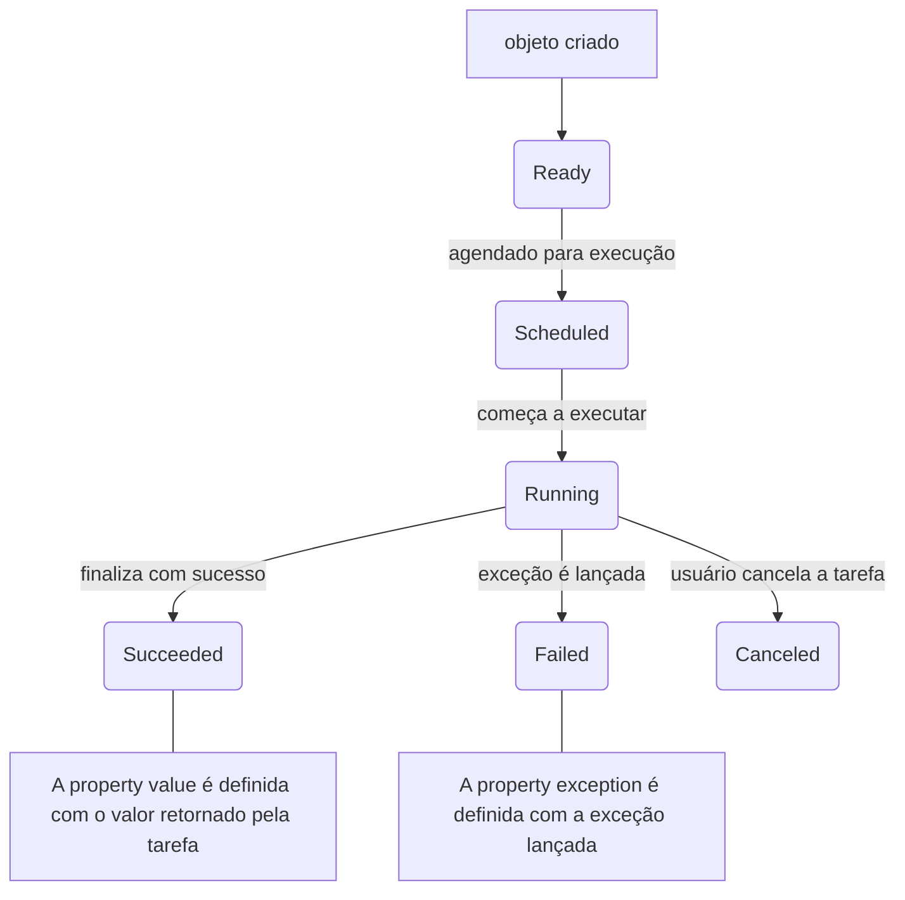

> Baseado nos cursos da Softblue

# FXML

*  Existem duas formas de criar interfaces gráficas em JavaFX

| Programação                                              | FXML                                                            |
|----------------------------------------------------------|-----------------------------------------------------------------|
| O desenho da interface fica  misturado com o código Java | A interface é definida em formato  XML, separada do código Java |
|                                                          | Facilita a manutenção                                           |
|                                                          | Não há necessidade de recompilar  o código                      |
|                                                          | Designers não precisam ter  experiência em Java                 |
|                                                          | Forma preferida  para criar interfaces                          |

Comparando:

* Via programação

```java
BorderPane root = new BorderPane();
MenuBar menuBar = new MenuBar();
menuBar.getMenus().add(new Menu("Arquivo"));
root.setTop(menuBar);
TextArea textArea = new TextArea();
root.setCenter(textArea);
Button btnCancel = new Button("Cancelar");
Button btnSave = new Button("Salvar");
HBox buttonBox = new HBox();
buttonBox.setAlignment(Pos.CENTER_RIGHT);
buttonBox.setPadding(new Insets(5, 0, 5, 0));
HBox.setMargin(btnSave, new Insets(0, 0, 0, 5));
buttonBox.getChildren().add(btnCancel);
buttonBox.getChildren().add(btnSave);
root.setBottom(buttonBox);
```

* Via FXML

```xml
<?import javafx.scene.layout.BorderPane?>
<?import javafx.scene.control.Button?>
<?import javafx.scene.control.MenuBar?>
<?import javafx.scene.control.Menu?>
<?import javafx.scene.control.TextArea?>
<?import javafx.scene.layout.HBox?>
<?import javafx.geometry.Insets?>
<BorderPane xmlns:fx="http://javafx.com/fxml/1">
  <top>
    <MenuBar><Menu text="Arquivo" /></MenuBar>
  </top>
  <center><TextArea /></center>
  <bottom>
    <HBox alignment="CENTER_RIGHT">
      <padding>
        <Insets top="5" left="0" bottom="5" right="0" />
      </padding>
      <Button text="Cancelar" />
      <Button text="Salvar">
        <HBox.margin>
          <Insets top="0" bottom="0" right="0" left="5" />
        </HBox.margin>
      </Button>
    </HBox>
  </bottom>
</BorderPane>
```

## Criando os layouts FXML

* Os arquivos FXML são baseados no padrão XML

* Podem ser criados de duas formas

– Manualmente, usando um editor de textos ou editor de arquivos XML

– Através de ferramentas específicas, onde a construção do layout é feita de forma visual

*  O Scene Builder é uma ferramenta gratuita da Oracle que permite a criação de arquivos FXML

*  Layouts criados em FXML podem ser facilmente importados para dentro do JavaFX

```java
Pane root = FXMLLoader.load(getClass().getResource("/Layout.fxml"));
```

# Controller

* O controller é uma classe Java que trabalha em conjunto com a estrutura definida no arquivo FXML

```java
package joaonogueira.javafx;
public class LayoutController {
  //...
}
```

```xml
<BorderPane xmlns:fx="http://javafx.com/fxml/1" fx:controller="joaonogueira.javafx.LayoutController">
  ...
</BorderPane>
```

* O controller pode ter acesso aos controles definidos no arquivo FXML

* Também trata os eventos

```xml
...
<TextArea fx:id="textArea" />
...
<Button text="Cancelar" onAction="#cancel" />
<Button text="Salvar" onAction="#save">
...
```

```java
public class LayoutController {
  @FXML//@FXML faz a ligação dos elementos do arquivo FXML com o código Java
  private TextArea textArea;
  public void initialize() { }//initialize() é utilizado na inicialização do controller
  @FXML
  public void save() { }
  @FXML
  public void cancel(ActionEvent event) { }//O parâmetro ActionEventé opcional
}
```

# Aplicando estilos com CSS

* O Cascading Style Sheets (CSS) é comumente usado em páginas web

* Também é aplicado para alterar o comportamento visual dos painéis e controles do JavaFX

-styles.css

```css
.text-field {
  -fx-font: 16px "Serif";
  -fx-font-weight: bold;
  -fx-background-color: #CCFF99;
}
#meutexto {
  -fx-font-size: 30;
}
.warning {
  -fx-background-color: "yellow";
}
```

-Layoult.fxml

```xml
<TextField text="Estou aprendendo JavaFX!" />
<Label text="Meu texto" fx:id="meutexto" />
<Label text="Atenção!" styleClass="warning" />
```

-App.java

```java
TextField textField = new TextField("Estou aprendendo JavaFX!");
Label label1 = new Label("Meu texto");
label1.setId("meutexto");
Label label2 = new Label("Atenção!");
label2.getStyleClass().add("warning");
```

* Usar um arquivo CSS não é obrigatório

-Layoult.fxml

```xml
<Label 
  text="Texto em negrito"
  style="-fx-font-weight: bold"
/>
```

-App.java

```java
Label label3 = new Label("Negrito");
label3.setStyle("-fx-font-weight: bold");
```

* Um arquivo CSS deve ser associado à uma cena para que os estilos sejam reconhecidos

```java
Scene scene = new Scene(root, 800, 600);
scene.getStylesheets().add("styles.css");
```

# Properties & Binding

* Uma property é uma característica de um objeto

– Uma espécie de “atributo mais inteligente”

* O binding permite ligar properties com objetivo de sincronização

```java
a.propA.bind(b.propB)
```

* Uma property pode ser vista como um atributo, mas tem mais recursos

* Tipos de properties

– StringProperty

– IntegerProperty

– DoubleProperty

– BooleanProperty

– ObjectProperty

```java
public class Pessoa {//Os controles do JavaFX também usam properties
  private StringProperty nome = new SimpleStringProperty();//nome e idade são properties do JavaFX
  private IntegerProperty idade = new SimpleIntegerProperty();
  ...
}
```

## Convenções no uso de properties

```java
public class Pessoa {
  private StringProperty nome = new SimpleStringProperty();
  private IntegerProperty idade = new SimpleIntegerProperty();
  public String getNome() {//Getters e setters manipulam as properties
    return nome.get();
  }
  public void setNome(String nome) {
    this.nome.set(nome);
  }
  public int getIdade() {
    return idade.get();
  }
  public void setIdade(int idade) {
    this.idade.set(idade);
  }
  public StringProperty nomeProperty() {//Métodos xxxProperty() retornam as properties
    return nome;
  }
  public IntegerProperty idadeProperty() {
    return idade;
  }
}
```

# O Modelo JavaBean

* Um JavaBean é uma classe que segue algumas convenções

– Construtor padrão, sem parâmetros

– Métodos getters e setters

```java
public class Pessoa {
  private String nome;
  private int idade;
  public String getNome() {
    return nome;
  }
  public void setNome(String nome) {
    this.nome = nome;
  }
  public int getIdade() {
    return idade;
  }
  public void setIdade(int idade) {
    this.idade = idade;
  }
}
```

Os nomes dos métodos getters e setters seguem uma convenção bem definida

# Adicionando listeners a properties

*  Quando uma property é alterada, ela notifica listeners registrados

```java
pessoa.nomeProperty().addListener(new ChangeListener<String>() {
  @Override
  public void changed(ObservableValue<? extends String> observable,
    String oldValue, String newValue) {
    ...
  }
});

pessoa.nomeProperty().addListener((observable, oldValue, newValue) -> {//Expressão lambda
  ...
});
```

As classes de properties implementam a interface `ObservableValue<T>`

# Bindings

* Property -> ObservableValue<T>

```java
public class LayoutController {
  @FXML
  TextField txtNome;
  public void initialize() {
    Pessoa pessoa = ...
    txtNome.textProperty().bind(pessoa.nomeProperty());//O texto TextField vai ficar sincronizado com o nome definido no objeto
  }
}
```

## Tipos de bindings

* Unidirecional

```java
txtNome.textProperty().bind(pessoa.nomeProperty());
```

* Bidirecional

```java
txtNome.textProperty().bindBidirectional(pessoa.nomeProperty());//Apenas entre properties
```

# JavaFX e as threads

* O JavaFX possui uma thread principal

– JavaFX Application thread

– UI thread

* Esta thread tem uma série de atribuições: Renderizar Tela, Processar Eventos, ...

Se esta thread demorar para executar, a aplicação vai parecer lenta

Solução: realizar o processamento “pesado” em outra thread

*  Uma nova thread pode ser criada utilizando qualquer técnica já conhecida

```java
new Thread(new Runnable() {
  public void run() {
    //...
  }
}).start();

ExecutorService exec = Executors.newSingleThreadExecutor();
exec.submit(new Callable<Void>() {
  public Void call() throws Exception {
    //...
    return null;
  }
});
```

# A classe Task

* O JavaFX define uma classe `Task`, que deve ser estendida

* Representa uma tarefa a ser executada em segundo plano

```java
public class MyTask extends Task<Integer> {//O tipo parametrizado define o tipo de retorno de call()
  @Override
  protected Integer call() throws Exception {
    //...
  }
}
```

* Ciclo de vida de um objeto `Task`:



## Métodos da classe Task

* Métodos que podem ser sobrescritos

– `done()`

– `failed()`

– `cancelled()`

– `running()`

– `scheduled()`

– `succeeded()`

* Métodos de atualização da tarefa

– `updateProgress()`

– `updateMessage()`

– `updateTitle()`

Os métodos updateXXX() atualizam o valor das properties do objeto Task

## Cancelamento de tarefas

* O método `cancel()` deve ser chamado na task

```java
task.cancel();
```

* A tarefa deve verificar periodicamente se ela foi cancelada

```java
while(...) {
  if (isCancelled()) {
    //...
    break;
  }
}
```

# A classe Service

* É utilizada para executar uma `Task`

```java
public class MyService extends Service<Integer> {
  @Override
  protected Task<Integer> createTask() {//Cria a Task que será executada
    return new Task<Integer>() {
      //...
    };
  }
}
```

* Execução do service

```java
MyService service = new MyService();
service.setOnSucceeded((event) -> ...);
service.setOnFailed((event) -> ...);//Adiciona listeners ao service, para serem executados pela UI thread
service.start();//Inicia execução em segundo plano
```

# Comunicação entre threads

* Apenas a UI thread pode manipular elementos da interface gráfica

```java
Platform.runLater(new Runnable() {
  @Override
  public void run() {
    //...
  }
});
```

Mudanças feitas em properties públicas de uma task são executadas sempre pela UI thread
