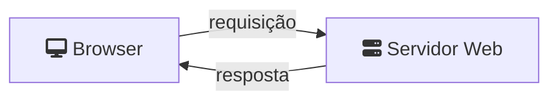
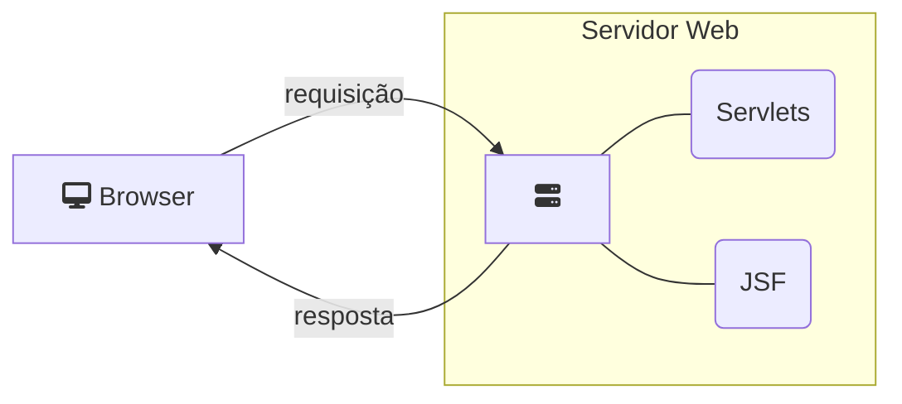

> Baseado nos cursos da Softblue

# Modelo Cliente/Servidor



O usuário solicita a abertura de uma página HTML

A requisição trafega pela rede através do protocolo HTTP

O servidor analisa a requisição e escolhe uma página

O servidor envia a página como resposta, usando também o protocolo HTTP

O browser interpreta a página que está definida em linguagem HTML

# HTTP

* Hypertext Transfer Protocol

* É um protocolo de rede, responsável pela transferência de conteúdo pela internet

* Definido pela RFC 2616 (IETF)

| HTTP | Específico para conteúdo web                |
|------|---------------------------------------------|
| TCP  | Transporta os dados de forma confiável      |
| IP   | Move os pacotes de um computador para outro |
| Rede | Rede física (cabeada ou sem fio)            |

## HTTP Request

```
GET /site HTTP/1.1
Host: www.joaonogueira.dev
Connection: close
User-Agent: Mozilla/5.0 (Windows; U; Windows NT 6.0; pt-BR; rv:1.9.2.3) Gecko/20100401
Accept-Charset: ISO-8859-1,UTF-8;q=0.7,*;q=0.7
Cache-Control: no
Accept-Language: de,en;q=0.7,en-us;q=0.3
```

## HTTP Response

```
HTTP/1.1 200 OK
Date: Fri, 02 Abr 2023 00:04:34 GMT
Server: Apache
X-Powered-By: PHP/5.2.9
Set-Cookie: PHPSESSID=9709ee059903f6747abf7fa7bd8f7910; path=/
Expires: Fri, 02 Abr 2021 08:52:00 GMT
Cache-Control: no-store, no-cache, must-revalidate, post-check=0, pre-check=0
Pragma: no-cache
Connection: close
Transfer-Encoding: chunked
Content-Type:text/html
```

# HTML

* Hypertext Markup Language

* É uma linguagem composta de instruções sobre como formatar uma página web

* Os documentos HTML são entregues ao cliente através do protocolo HTTP

- O conteúdo HTML é enviado logo após o response header

- É possível também transportar outros tipos de dados

# Anatomia de uma URL

* Uniform Resource Locator

* Especificam um recurso na web

| Protocol | Server           | Port | Path   | Resource   |
|----------|------------------|------|--------|------------|
| http://  | joaonogueira.dev | :80/ | posts/ | post1.html |

# Requisições: GET x POST

* GET

– O objetivo principal é requisitar dados do servidor

– Pode ser usada para enviar alguns dados ao servidor

– Os dados são enviados diretamente na URL

* POST

– O objetivo principal é enviar dados ao servidor

– Os dados são enviados no corpo do protocolo HTTP

## A Requisição GET

```html
<HTML>
<BODY>
<FORM method="GET" action="sucesso.html"><!-- Indica que os dados do formulário serão enviados por uma requisição do tipo GET -->
Nome: <INPUT type="text" name="nome" size="20">
<BR>
E-mail: <INPUT type="text" name="email" size="20">
<BR>
<INPUT type="submit" value="Cadastrar"><!-- Botão para submeter os dados -->
</FORM>
</BODY>
</HTML>
```

```
GET /public/html/sucesso.html?nome=João&email=a%40a.com HTTP/1.1
Host: www.joaonogueira.dev
User-Agent: Mozilla/5.0 (Windows; U; Windows NT 6.0; pt-BR; rv:1.9.2.3) 
Gecko/20100401 Firefox/3.6.3 (.NET CLR 3.5.30729)
Accept: text/html,application/xhtml+xml,application/xml;q=0.9,*/*;q=0.8
Accept-Language: pt-br,pt;q=0.8,en-us;q=0.5,en;q=0.3
Accept-Encoding: gzip,deflate
Accept-Charset: ISO-8859-1,utf-8;q=0.7,*;q=0.7
Keep-Alive: 115
Connection: keep-alive
Referer: http://www.joaonogueira.dev/test/cadastro.html
```

## A Requisição POST

```html
<HTML>
<BODY>
<FORM method="POST" action="sucesso.html"><!-- Indica que os dados do formulário serão enviados por uma requisição do tipo POST -->
Nome: <INPUT type="text" name="nome" size="20">
<BR>
E-mail: <INPUT type="text" name="email" size="20">
<BR>
<INPUT type="submit" value="Cadastrar"><!-- Botão para submeter os dados -->
</FORM>
</BODY>
</HTML>
```

```
POST /public/html/sucesso.html HTTP/1.1
Host: www.joaonogueira.dev
User-Agent: Mozilla/5.0 (Windows; U; Windows NT 6.0; pt-BR; rv:1.9.2.3) 
Gecko/20100401 Firefox/3.6.3 (.NET CLR 3.5.30729)
Accept: text/html,application/xhtml+xml,application/xml;q=0.9,*/*;q=0.8
Accept-Language: pt-br,pt;q=0.8,en-us;q=0.5,en;q=0.3
Keep-Alive: 115
Connection: keep-alive
Referer: http://www.joaonogueira.dev/test/cadastro.html
Content-Type: application/x-www-form-urlencoded
Content-Length: 27
nome=João&email=a%40a.co
```

## Qual requisição usar?

* GET

-Formulário de pesquisa

- Requisição de página através de um hiperlink

- Navegação  geral em páginas de um site

* POST

- Formulário de cadastro

- Envio de usuário e senha ao servidor

- Upload de arquivo

- Muitos dados a serem enviados ao servidor

# Existem outras operações HTTP

* HEAD

* PUT

* DELETE

* CONNECT

* OPTIONS

* TRACE

* PATCH

# Conteúdo Estático e Dinâmico

* Servidores web podem entregar apenas conteúdo estático (arquivos já existentes)

* Para gerar conteúdo dinâmico, é preciso mais do que um web server



A resposta é montada dinamicamente, mas o browser continua a receber conteúdo HTML
