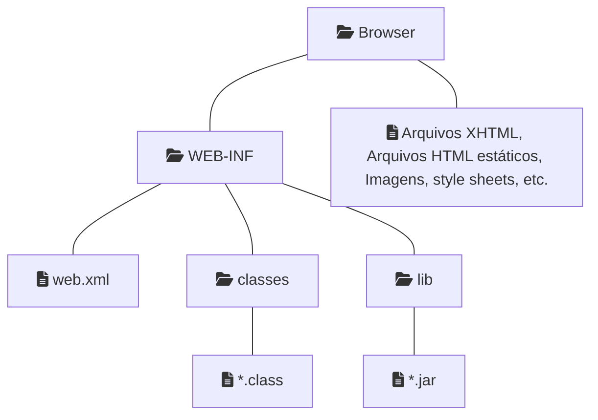
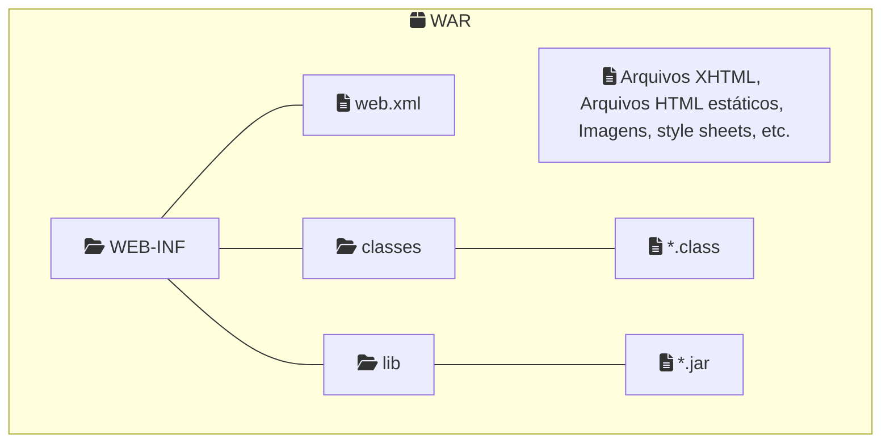

> Baseado nos cursos da Softblue e na documentação da Oracle

# Ramificações do Java

• Java SE (Standard Edition)

– Base do Java

– Ambiente de execução e bibliotecas comuns

• Java ME (Micro Edition)

– Dispositivos móveis

• Java EE (Enterprise Edition)

– Aplicações corporativas e internet

# O Java EE

• Java Enterprise Edition

– Chamado antigamente de J2EE

• Em 2019, a Oracle entregou o Java EE para a comunidade open source

– Eclipse Foundation

– Mudança de nome: Jakarta EE

## Especificação do Java EE

• É uma especificação escrita pela Oracle

– Existe a participação de uma comunidade, que dá sugestões

– Participam desta comunidade diversas pessoas e empresas

• É um documento aberto

– Qualquer empresa pode implementar o seu servidor compatível com Java EE

• A padronização permite que a mesma aplicação execute em servidores de diferentes empresas

## Separação em Camadas

{: width="100" height="100" }

## Componentes Java EE

{: width="100" height="100" }

## Containers Java EE

{: width="100" height="100" }

## Estrutura de Diretórios

## Configuração de Aplicações

• Até o Java EE 5, usar arquivo web.xml era utilizado na configuração

– Agora o web.xml é opcional

• Grande parte das configurações é feita através de annotations

## Empacotamento de Aplicações

• Uma aplicação web pode ser empacotada em apenas um arquivo

– Facilita a distribuição

– Facilita a instalação

• Este arquivo é um WAR

– Web ARchive

Servidor Java EE gratuito - WildFly
