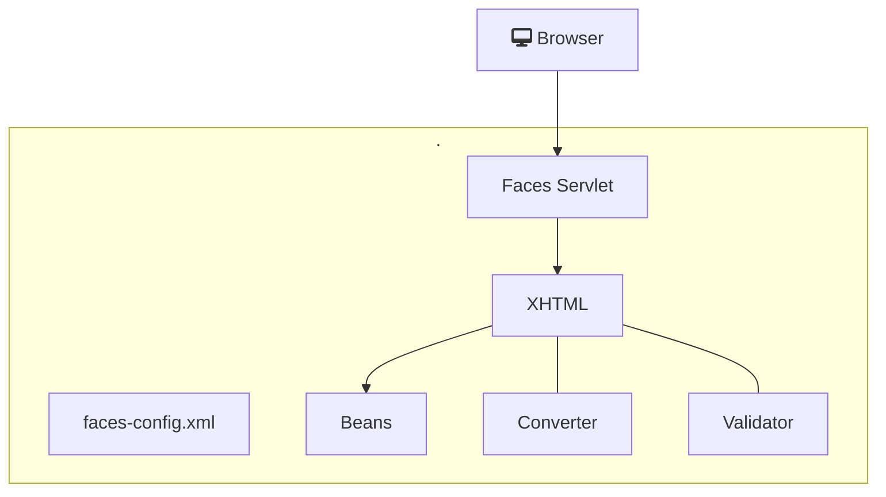

> Baseado nos cursos da Softblue e na documentação da Oracle

# JSF

* JavaServer Faces

* Framework utilizado na geração de páginas web dinâmicas

* As páginas são criadas utilizando componentes, que respondem a eventos

* É uma especificação padronizada pela Oracle

– Podem existir várias implementações

* Mojarra (Oracle)

* MyFaces (Apache)

# Evolução das Páginas Web em Java

* HTML

- Conteúdo estático

- A página é renderizada sempre da mesma forma

* Servlet/JSP

- Páginas dinâmicas

- Falta de recursos nativos

- Surgimento de frameworks para suprir as necessidades

* JSF

- As páginas são montadas utilizando componentes

- Estes componentes podem ser nativos ou de terceiros

- Semelhante à criação de interfaces gráficas em aplicações desktop

# Funcionamento do JSF

# O formato XHTML

* É um formato para definição de páginas web

* Baseado em XML

* Mais rígido que o HTML quanto ao conteúdo
