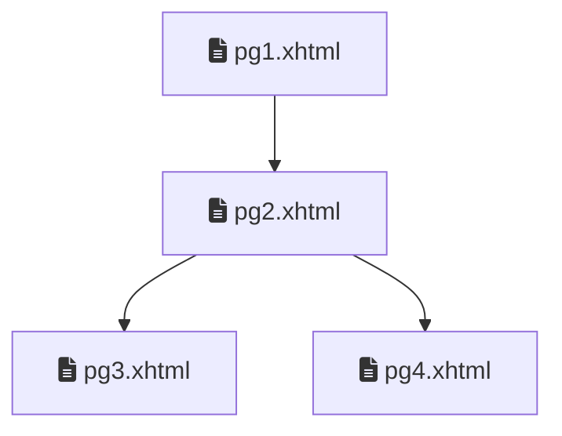
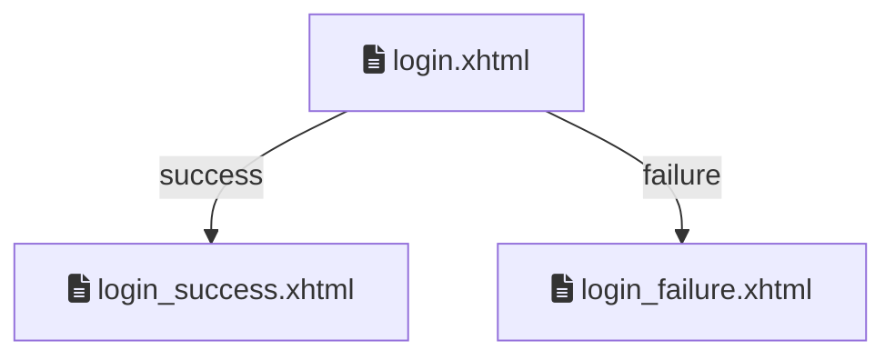
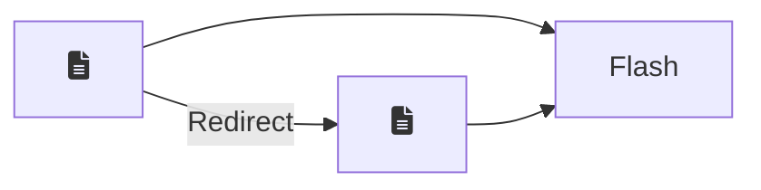

> Baseado nos cursos da Softblue e na documentação da Oracle

# A Importância da Navegação

* Aplicações normalmente são compostas por diversas telas



# Conceitos de Navegação

* A navegação em JSF é baseada em dois conceitos importantes

– View ID

* Nome do arquivo que representa a página JSF

* Ex: form.xhtml, produtos.xhtml

– Outcome

* String que identifica um local para navegação

* Um outcome é mapeado para um view ID

* Ex: lista_pedidos, confirmar

# Navegação Estática

* Utilizada quando a navegação de uma página para outra é sempre igual

page1.xhtml

```xhtml
<h:commandButton value="Próxima página" action="page2" />
```

* Um outcome pode ser mapeado a um view ID 

* Se isto não ocorrer, ele é transformado em um view ID

# Navegação Dinâmica

* Utilizada quando a navegação depende de ações do usuário, portanto pode variar

* Neste caso, o outcome é o resultado de um processamento, feito pelo bean

```xhtml
<h:commandButton value="Login" action="#{bean.login}" /> <!-- O método login() é 
invocado no bean>
```

```java
public String login() {//O método pode retornar um objeto de qualquer tipo (menos void).
  if ("abc".equals(name) && "123".equals(password)) {
    return "login_success";//O método faz o processamento e retorna o outcome

  }
  return "login_failure";
}
```

Se o método retornar null, a mesma página é exibida novamente

# Regras de Navegação

* Outcomes podem ser mapeados para viewIDs via arquivo de configuração

* Estas regras de navegação (navigation rules) são especificadas no arquivo faces-config.xml



```xml
<navigation-rule>
  <from-view-id>/login.xhtml</from-view-id>
  <navigation-case>
    <from-outcome>success</from-outcome>
    <to-view-id>/login_success.xhtml</to-view-id>
  </navigation-case>
  <navigation-case>
    <from-outcome>failure</from-outcome>
    <to-view-id>/login_failure.xhtml</to-view-id>
  </navigation-case>
</navigation-rule>
```

# Navegação com Curingas

* Se a tag from-view-id for omitida, o outcome pode ser utilizado em qualquer página

```xml
<navigation-rule>
  <navigation-case>
    <from-outcome>logout</from-outcome>
    <to-view-id>/logout.xhtml</to-view-id>
  </navigation-case>
</navigation-rule>
```

* A utilização de curingas também é permitida

```xml
<navigation-rule>
  <from-view-id>/admin/*</from-view-id>
  <navigation-case>
    ...
  </navigation-case>
</navigation-rule>
```

# Navegação com Base em Ações

* A tag `from-action` pode ser utilizada quando ações diferentes usam o mesmo outcome

```xml
<navigation-rule>
  <navigation-case>
    <from-action>#{bean.listarClientes}</from-action>
    <from-outcome>listar</from-outcome>
    <to-view-id>/listar_clientes.xhtml</to-view-id>
  </navigation-case>
  <navigation-case>
    <from-action>#{bean.listarProdutos}</from-action>
    <from-outcome>listar</from-outcome>
    <to-view-id>/listar_produtos.xhtml</to-view-id>
  </navigation-case>
</navigation-rule>
```

# Navegação Condicional

* Ao utilizar a tag `if`, a navegação ocorre apenas se a condição for verdadeira

```xml
<navigation-rule>
  <navigation-case>
    <from-outcome>listar</from-outcome>
    <if>#{bean.canList == true}</if>
    <to-view-id>/listar_clientes.xhtml</to-view-id>
  </navigation-case>
</navigation-rule>
```

# Mesclagem na Navegação

* É possível mesclar o mapeamento de outcomes via arquivo de configuração com a navegação sem o mapeamento

* A configuração feita no arquivo tem precedência em caso de conflito

# Forward x Redirect

* Existem duas formas de fazer o direcionamento de uma página para outra

– Forward

* Feito internamente pelo próprio contêiner

* Olhando para a URL, não é possível saber para onde ocorreu o direcionamento

* Mantém os dados no escopo request

– Redirect

* Feito pelo navegador, a pedido do contêiner

* Olhando para a URL, é possível saber para onde ocorreu o direcionamento

* Os dados no escopo request são perdidos

## Redirect no JSF

* O padrão do JSF é utilizar sempre o forward

* O redirect deve ser explícito

Mudança de URL

```xhtml
<h:commandButton value="Logout" action="logout_success?faces-redirect=true" />
```

* O redirect também pode ser configurado na regra de navegação no `faces-config.xml`

```xml
<navigation-case>
  <from-outcome>logout</from-outcome>
  <to-view-id>/logout_success.xhtml</to-view-id>
  <redirect />
</navigation-case>
```

### Uso do Flash com Redirect

* Após um redirect, todas as informações do escopo request são perdidas

* No entanto, algumas vezes é necessário passar parâmetros para a tela de destino

* Isto pode ser feito com o conceito de flash



Bean

```java
FacesContext fc = FacesContext.getCurrentInstance();
ExternalContext ec = fc.getExternalContext();
Flash flash = ec.getFlash();
flash.put("param", value);//O flash é um map
```

Página JSF

```xhtml
#{flash.param} <!-- Referencia a chave do map>
```

Quando o redirect é finalizado, os dados do flash são removidos automaticamente

# Forward ou Redirect?

* O que normalmente ocorre na prática é que o redirect é utilizado após alguma operação que salva, atualiza ou exclui dados da aplicação

– O redirect evita que o cliente atualize a tela e o processo seja executado de novo

* Nas outras situações, normalmente o forward é utilizado

– Se o cliente atualizar a tela o processo é executado de novo, mas isto não traz problemas

# Requisições GET e POST

* Requisições feitas ao servidor utilizando o protocolo HTTP são normalmente dos tipos GET ou POST

– GET

* O objetivo principal é requisitar dados do servidor

* Os dados são enviados diretamente na URL

– POST

* O objetivo principal é enviar dados ao servidor

* Os dados são enviados no corpo do protocolo HTTP

Requisições GET devem ser idempotentes: se executadas uma ou várias vezes, o resultado final será o mesmo

## Requisições GET e o JSF

* O JSF suporta a utilização de requisições GET através de duas tags

– `h:button`

– `h:link`

```xhtml
<h:button value="Pesquisar" outcome="pesquisar">
  <f:param name="p" value="softblue" />
</h:button>
```

### Lendo Parâmetros GET em uma View

* Quando uma página JSF recebe parâmetros GET, os mesmos precisam ser transferidos para um bean

```xml
<f:metadata>
  <f:viewParam name="p" value="#{bean.texto}" /> <!-- O parâmetro p da request será copiado para a propriedade texto do bean /-->
</f:metadata>
```
