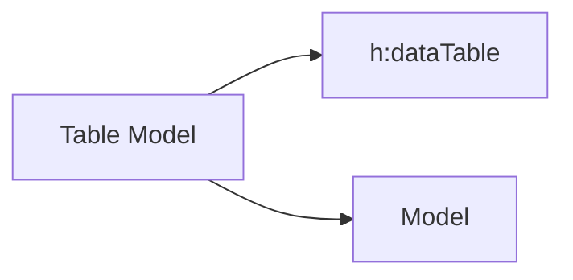

> Baseado nos cursos da Softblue

# A Tag `h:dataTable`

* Permite renderizar tabelas utilizando informações dinâmicas

```xml
<h:dataTable value="#{table.contatos}" var="c">
  <h:column>
    #{c.nome}
  </h:column>
  <h:column>
    #{c.email}
  </h:column>
  <h:column>
  #{c.telefone}
    </h:column>
  </h:dataTable>
```

```java
@Named("table")
@RequestScoped
public class TableBean implements Serializable {
  private List<Contato> contatos = new ArrayList<>();
  public TableBean() {
    contatos.add(new Contato(1, "José", "jose@abc.com", "555-3421"));
    contatos.add(new Contato(2, "João", "joao@abc.com", "555-8794"));
  }
  public List<Contato> getContatos() {
    return contatos;
  }
```

# A Tag `f:facet`

* Permite atribuir informações ao cabeçalho e rodapé das colunas e título da tabela

```xml
<h:dataTable value="#{table.contatos}" var="c">
  <f:facet name="caption">
    Lista de Contatos
  </f:facet>
  <h:column>
    <f:facet name="header">
      Nome
    </f:facet>
    #{c.nome}
  </h:column>
  ...
</h:dataTable>
```

Os valores podem ser caption, header ou footer

# Estilo das tabelas

* O estilo das tabelas pode ser definido através de CSS
* A tag h:dataTable possui atributos que permitem definir os estilos

– styleClass: para a tabela

– headerClass: para o cabeçalho

– footerClass: para o rodapé

– columnClasses: para cada coluna

– rowClasses: para cada linha

# Componentes JSF e Tabelas

* Além de textos, tabelas também podem ter componentes em suas linhas e colunas

```xml
...
<h:column>
  <h:inputText value="#{c.nome}" />
</h:column>
...
```

# Table Models

* Um table model faz a ponte entre dados a serem exibidos na tabela e a própria tabela



* O próprio JSF encapsula os dados em um table model se o programador não o faz

* Os table models mais utilizados são

– ArrayDataModel: usado com arrays de dados

– ListDataModel: usado com listas de dados

## Benefícios de um Table Model

* Utilizar um table model explicitamente traz algumas facilidades a mais no momento de renderizar tabelas

– Exibir o número de cada linha renderizada

– Fazer algum pré-processamento de informações antes que elas sejam exibidas

* Para criar um table model customizado, basta criar uma classe que herda de DataModel

# A Tag `ui:repeat`

* Alternativa ao uso da tag `h:dataTable`

* Permite renderizar o corpo da tag de forma repetida

```xml
<table>
  <ui:repeat value="#{table.contatos}" var="c">
    <tr>
      <td>#{c.nome}</td>
      <td>#{c.email}</td>
      <td>#{c.telefone}</td>
    </tr>
  </ui:repeat>
</table>
```

## Informações sobre a Iteração

* Com a tag ui:repeat, é possível ter acesso a informações relacionadas à iteração

```xml
<table>
  <ui:repeat value="#{table.contatos}" var="c" varStatus="st">
    <h:panelGroup rendered="#{st.even}">
      <tr>
        <td bgcolor="#FFFFFF">#{st.index + 1}</td>
        <td bgcolor="#FFFFFF">#{c.nome}</td>
      </tr>
    </h:panelGroup>
    <h:panelGroup rendered="#{st.odd}">
      <tr>
        <td bgcolor="#CCCCCC">#{st.index + 1}</td>
        <td bgcolor="#CCCCCC">#{c.nome}</td>
      </tr>
    </h:panelGroup>
  </ui:repeat>
</table>
```
