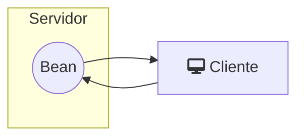
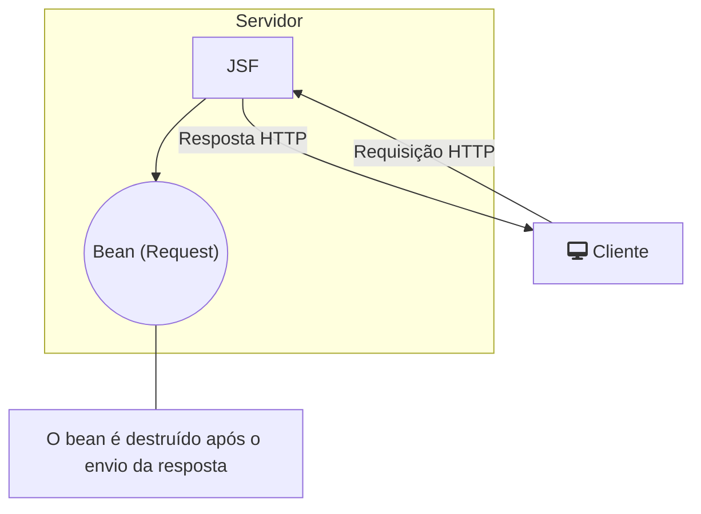
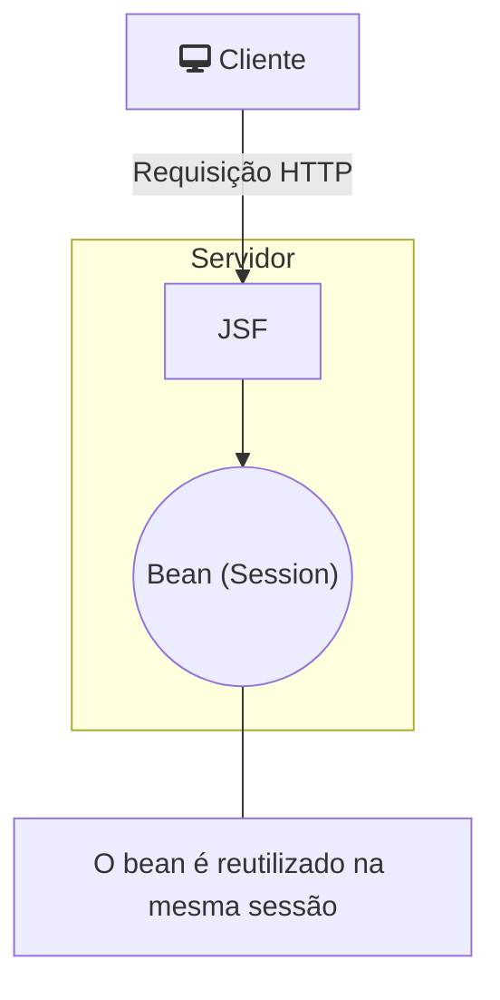

> Baseado nos cursos da Softblue

# O que são Beans

* São classes Java que seguem algumas convenções

– Possuem um construtor público sem parâmetros

– Possuem atributos

* Num bean, um atributo é chamado de propriedade

– Possuem métodos getters/setters para o acesso aos atributos

| Atributo |  Método Getter         | Método Setter |
|----------|------------------------|---------------|
| nome     | getNome()              |  setNome()    |
| idade    | getIdade()             | setIdade()    |
| homem    | getHomem() / isHomem() | setHomem()    |

# Beans e Páginas JSF



- Receber os dados de páginas JSF
  
- Enviar dados para páginas JSF

- Processar os eventos de páginas JSF

- Gerenciar a navegação entre as telas 

Value expressions, definidas em EL (Expression Language)

```xml
<h:inputText value="#{user.name}" />
<h:inputSecret value="#{user.password}" />
<h:commandButton action="#{user.login}" />
```

```java
@Named("user")
public class UserBean implements Serializable {
  private String name;
  private String password;
  public String login() {
    // Lógica para o login
  }
  // Métodos getters e setters...
}
```

# CDI Beans

* Contexts and Dependency Injection

* Permite que o próprio contêiner resolva as dependências entre objetos

– O programador apenas declara a variável, e o contêiner cria os objetos e gerencia o ciclo de vida

## Criando CDI Beans

* A criação de um CDI bean é feita anotando a classe do bean com @Named

* Um CDI bean deve implementar a interface Serializable

```java
@Named
public class UserBean implements Serializable {
  //...
}
```

Se o escopo do bean for request, não é necessário implementar Serializable

## Nome de um CDI Bean

* Todo CDI bean tem um nome

* O nome deve ser conhecido, pois páginas JSF utilizam o nome do bean para referenciá-lo

* O nome do CDI bean é fornecido como value da anotação @Named

```java
@Named("user")
public class UserBean implements Serializable {
  //...
}
```

* Se o nome for omitido, é assumido o nome da classe, mas com a inicial minúscula

```java
@Named
public class UserBean implements Serializable {//O nome do bean será userBean
  //...
}
```

# Managed Beans

* Como o CDI foi criado apenas a partir do Java EE 6, em versões anteriores do JSF eram utilizados os managed beans

* São mais limitados em termos de recursos

* São suportados no JSF 2.x, mas a preferência deve ser dada aos CDI beans

– A partir do JSF 2.3, os managed beans do JSF foram marcados como deprecated

* Como eu identifico se estou usando os managed beans do JSF:

– Annotations do pacote javax.faces.bean

* @ManagedBean

* @RequestScoped

* @SessionScoped

* etc.

# Backing Beans

* Beans com propriedades que representam componentes de páginas JSF

```xml
<h:inputText binding="#{user.nameTxt}" />
```

Especifica a propriedade do beanque referencia o componente

```java
@Named("user")
public class UserBean implements Serializable {
  private UIInput nameTxt;//Representa o componente da página

  // Métodos getters e setters
}
```

# Escopos de um Bean

* O tempo de vida de um bean é definido pelo seu escopo

* O CDI define quatro escopos

– Request, Application, Session, Conversation

* Podem ser utilizadas anotações nas classes dos beans

– Package: javax.enterprise.context

* Procure sempre utilizar o escopo de acordo com a necessidade

## Escopo Request

* O bean é criado quando uma requisição HTTP ocorre

* É destruído assim que a resposta da requisição é enviada ao cliente

* Este escopo é utilizado quando as informações precisam existir por pouco tempo, apenas para determinada requisição

```java
@RequestScoped
public class MyBean implements Serializable {
  //...
}
```



## Escopo Application

* O bean é compartilhado entre todos os clientes que acessam a aplicação

* Permanece ativo enquanto a aplicação estiver executando

```java
@ApplicationScoped
public class MyBean implements Serializable {
  //...
}
```

## Escopo Session

* O bean existe enquanto durar a sessão do usuário

– Múltiplas requisições do mesmo cliente

– A sessão termina quando o navegador é fechado ou via programação

```java
@SessionScoped
public class MyBean implements Serializable {
  //...
}
```



## Escopo Conversation

* O bean existe durante um período de conversação, definido pelo programador

– Este escopo é diferente da sessão

– A sessão de um usuário pode ter mais de uma conversação

```java
@ConversationScoped
public class MyBean implements Serializable {
  @Inject
  private Conversation conversation;//Objeto que gerencia a conversação
}
```

Os métodos begin() e end() delimitam a conversação

# Sincronismo no Acesso

* O escopo request é o único thread-safe

– Não é necessário sincronizar o acesso aos métodos

* Métodos de beans em outros escopos podem, eventualmente, ser acessados simultaneamente, gerando problema de concorrência

– É necessário utilizar mecanismos de controle, como métodos sincronizados (synchronized)

# Injeção de Beans

* Algumas vezes um bean precisa referenciar outro bean

* Esta referência é feita através de injeção de beans

– O contêiner provê as referências necessárias

```java
@Named
public class MyBean1 implements Serializable {
  @Inject private MyBean2 bean2;//A anotação @Inject injeta a dependência
  @Inject private MyBean3 bean3;
}
```

# `@PostConstruct` e `@PreDestroy`

* São anotações que podem ser utilizadas em métodos de um bean

* Os métodos anotados são invocados automaticamente pelo contêiner

– `@PostConstruct`: assim que o bean é criado

– `@PreDestroy`: quando o bean está prestes a ser destruído
