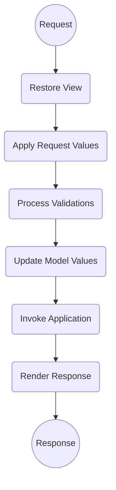
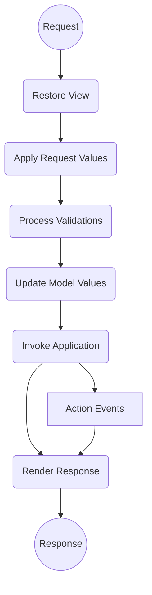
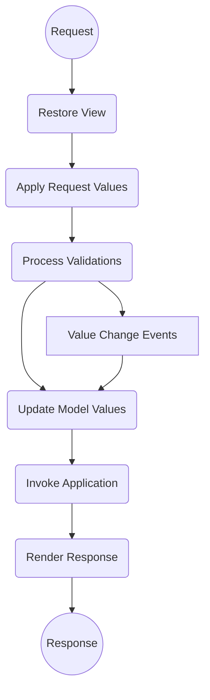
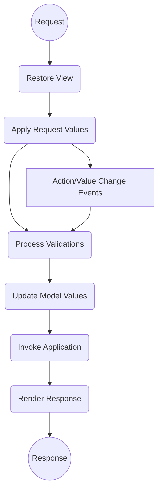

> Baseado nos cursos da Softblue

# Ciclo de Vida de Requisições



# Eventos e Tipos de Eventos

• Eventos em JSF podem ser disparados

– Em resposta a ações de usuários

– Pelo próprio JSF

• Eventos são processados no servidor

• Existem 4 tipos de eventos

– Action Events

– Value Change Events

– Phase Events

– System Events

## Action Events

• Eventos disparados quando ocorre um clique em um componente que gera uma ação, como `h:commandLink` ou `h:commandButton`

```xml
<h:commandButton value="OK" actionListener="#{bean.botaoClicado}" />
```

```java
public void botaoClicado(ActionEvent event) {
  //...
}
```

• Outra opção é criar um listener

```java
public class MyListener implements ActionListener {
  public void processAction(ActionEvent event)
    throws AbortProcessingException {
  //...
}
```

• A tag `f:actionListener` é utilizada para referenciar o listener criado

```xml
<h:commandButton value="OK">
  <f:actionListener type="app.MyListener" />
</h:commandButton>
```

### Action Events no Ciclo de Vida



## Value Change Events

• Eventos disparados quando ocorre uma mudança de valor em algum componente, como `h:inputText`, `h:selectOneMenu`, etc.

```xml
<h:selectOneMenu value="#{bean.valor}" onchange="submit();" valueChangeListener="#{bean.mudouValor}">
```

```java
public void mudouValor(ValueChangeEvent event) {
  //...
}
```

• Outra opção é criar um listener

```java
public class MyListener implements ValueChangeListener {
  public void processValueChange(ValueChangeEvent event)
    throws AbortProcessingException {
  //...
  }
}
```

• A tag `f:valueChangeListener` é utilizada para referenciar o listener criado

```xml
<h:selectOneMenu value="#{bean.valor}" onchange="submit();">
  <f:valueChangeListener type="app.MyListener" />
  ...
</h:selectOneMenu>
```

### Value Change Events no Ciclo de Vida



## Vantagens de Utilizar Listeners

• Action e value change events permitem utilizar listeners

• O uso de listeners tem algumas vantagens

– Reaproveitamento do listener em vários componentes da aplicação

– Possibilidade de executar mais de um listener por evento disparado

## O Atributo `immediate`

• Utilizado em ocasiões onde o processo de validação precisa ser ignorado

• Quando um componente define o atributo immediate com o valor true, os eventos (action e value change) são disparados 
antes da validação

– Após a fase `Apply Request Values`

### Immediate e o Ciclo de Vida



## Ignorando a Validação

• Para um value change event ignorar a validação, duas coisas devem acontecer

– O `immediate` deve ser habilitado no componente

– O código do evento deve forçar a ida para a fase `Render Response`

```xml
<h:selectOneMenu onchange="submit();" valueChangeListener="#{bean.mudouValor}" immediate="true">
  ...
</h:selectOneMenu>
```

```java
public void mudouValor(ValueChangeEvent event) {
  //...
  FacesContext context = FacesContext.getCurrentInstance();
  context.renderResponse();
}
```

• Para um action event, basta habilitar o atributo `immediate` no componente que gera a ação

– Não é preciso chamar a fase `Render Response`, pois isto é feito automaticamente

## Phase Events

• Gerados pelo JSF quando ocorrem mudanças de uma fase para outra

• São gerados dois eventos por fase

– O primeiro logo antes de iniciar a fase

– O segundo logo após o término da fase

• Este tipo de evento está associado a uma view, e não a um componente

### Listeners para Phase Events

• Um listener deve implementar `PhaseListener`

• Pode ser configurado de várias formas

Em uma view específica

```xml
<f:phaseListener type="app.MyPhaseListener" />
```

Globalmente, para todas as views

```xml
<faces-config>
  <lifecycle>
    <phase-listener type="app.MyListener" />
  </lifecycle>
</faces-config>
```

### Criando um PhaseListener

```java
public class MyPhaseListener implements PhaseListener {
  public void beforePhase(PhaseEvent event) {
    //...
  }
  public void afterPhase(PhaseEvent event) {
    //...
  }
  public PhaseId getPhaseId() {
    return PhaseId.ANY_PHASE;//fase de interesse
  }
}
```

## System Events

• Eventos de diversos tipos gerados pelo JSF e que podem ser interceptados pelas aplicações

• Estes eventos podem estar associados normalmente a:

– Application

– UIComponent

– UIViewRoot

### Início e Término da Aplicação

• Dois system events indicam quando a aplicação foi inicializada e quando ela está prestes a ser terminada

– `PostConstructApplicationEvent`

– `PreDestroyApplicationEvent`

• Estes eventos estão associados à aplicação como um todo

```java
public class MySystemEventListener implements SystemEventListener {
  public boolean isListenerForSource(Object source) {
    return source instanceof Application;
  }
  public void processEvent(SystemEvent event)
    throws AbortProcessingException {
    ...
  }
}
```

• A configuração de um system event associado à aplicação (Application) é feita no arquivo `faces-config.xml`

```xml
<application>
  <system-event-listener>
    <system-event-listener-class>
      app.MySystemEventListener
    </system-event-listener-class>
    <system-event-class>
      javax.faces.event.PostConstructApplicationEvent
    </system-event-class>
  </system-event-listener>
</application>
```

### Pré-Renderização da View

• O JSF gera um system event momentos antes de uma view ser renderizada

– `PreRenderViewEvent`

• Este evento está associado a `UIViewRoot`

• Bastante útil na prática

– Verificar acesso à página

– Carregar informações para serem exibidas na `view`

– etc.

• A tag `f:event` é utilizada na view

```xml
<f:event type="preRenderView" listener="#{bean.carregarDados}" />
```

• O método é implementado no bean

```java
public void carregarDados(ComponentSystemEvent event) {
  //...
}
```

### Pós-Renderização da View

• O JSF também dispara um evento assim que a view é renderizada

– `PostRenderViewEvent`

• A tag `f:event` é utilizada na view

```xml
<f:event type="postRenderView" listener="#{bean.processarDados}" />
```

• O método é implementado no bean

```java
public void processarDados(ComponentSystemEvent event) {
  //...
}
```
