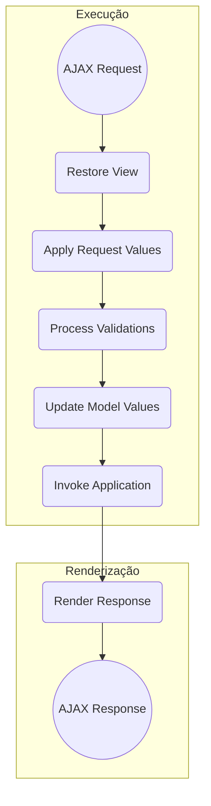

> Baseado nos cursos da Softblue

# AJAX

* Asynchronous JavaScript and XML

* Permite fazer uma requisição parcial ao servidor e obter uma resposta

– Dados são enviados ao servidor sem que a página precise ser completamente atualizada

* Sistemas modernos têm adotado o AJAX, pois ele possibilita uma melhor experiência de navegação aos usuários

# AJAX e o JSF

* Uma página JSF é composta por componentes

* Em uma requisição HTTP normal

– Todos os componentes da página são processados no servidor

– Todos os componentes são renderizados para serem exibidos na tela

* Em uma requisição AJAX é diferente

– Na requisição, apenas alguns componentes são processados

– Ao receber a resposta, alguns componentes são renderizados

## Ciclo de Vida de Requisições AJAX



## A Tag `f:ajax`

* Utilizada para adicionar requisições AJAX a uma página JSF

```xml
<h:panelGrid columns="3">
  Número:
  <h:inputText id="num" value="#{bean.num}">
    <f:ajax event="keyup" execute="@this" render="error" />
  </h:inputText>
  <h:message id="error" for="num" style="color: red" />
</h:panelGrid>
```

| Atributo | Descrição                                                                  |
|----------|----------------------------------------------------------------------------|
| event    | Evento que dispara a requisição AJAX (keyup, keydown, blur, change,  etc.) |
| execute  | Componentes a serem processados no servidor                                |
| render   | Componentes da tela a serem renderizados na resposta                       |

```xml
<f:ajax event="keyup" execute="@this" render="error" />

<h:message id="error" for="num" />
```

## Atributo event

* Identifica o evento que vai disparar a requisição AJAX

| blur     | focus    | mousedown  | mouseup     |
|----------|----------|------------|-------------|
| change   |  keydown |  mousemove | select      |
| click    | keypress | mouseout   |  action     |
| dblclick | keyup    | mouseover  | valueChange |

* Eventos de componentes

– action

  * Botões e links

– valueChange

  * Componentes de entrada de dados

## Atributo execute

* Define os componentes que serão executados (processados) no servidor

* Para mais de um componente, os IDs devem ser separados por espaços em branco

* Palavras-chave permitidas:

| @this | Componente onde a tag f:ajax foi inserida |
|-------|-------------------------------------------|
| @form | Todos os componentes do formulário        |
| @all  | Todos os componentes da página            |
| @none | Nenhum componente                         |

## Atributo render

* Define os componentes que serão renderizados na resposta da requisição

* Para mais de um componente, os IDs devem ser separados por espaços em branco

* Palavras-chave permitidas:

| @this | Componente onde a tag f:ajax foi inserida |
|-------|-------------------------------------------|
| @form | Todos os componentes do formulário        |
| @all  | Todos os componentes da página            |
| @none | Nenhum componente                         |

## Grupos de Componentes AJAX

* A tag `f:ajax` também pode ser utilizada para criar um grupo de componentes AJAX

```xml
<f:ajax event="blur" render="@form">
  <h:form>
    ...
    <h:inputText id="num1" value="#{bean.num1}" />
    ...
    <h:inputText id="num2" value="#{bean.num2}" />
    ...
  </h:form>
</f:ajax>
```

# AJAX, JSF e JavaScript

* A tag `f:ajax` possui dois parâmetros que podem referenciar funções JavaScript

– `onevent`

– `onerror`

## O Atributo `onevent`

* A função definida em `onevent` é chamada três vezes para cada requisição AJAX

– No início da requisição (begin)

– Quando a requisição é processada (complete)

– Quando a resposta está prestes a ser renderizada (success)

```xml
<f:ajax event="blur" onevent="process">
```

```html
<script>
function process(data) {
  ...
}
</script>
```

| Atributo     | Descrição                                           |
|--------------|-----------------------------------------------------|
| status       | Status da requisição AJAX: begin, complete, success |
| source       | Componente que originou o evento                    |
| responseXML  | Resposta da requisição AJAX (XML)                   |
| responseText | Resposta da requisição AJAX (texto)                 |
| responseCode | Código de resposta HTTP para a requisição           |

## O Atributo `onerror`

* A função definida em onerror é chamada quando algum erro acontece no processamento da requisição

* A função recebe um objeto data, semelhante à função usada em onvent

* Possui um atributo extra status

| Valor         | Descrição                                         |
|---------------|---------------------------------------------------|
| httpError     | Código de retorno do HTTP inválido ou inexistente |
| emptyResponse | Servidor não enviou resposta para a requisição    |
| malformedXML  | A resposta não é um XML válido                    |
| serverError   | Ocorreu algum problema no servidor                |

# Biblioteca JavaScript do JSF

* O JSF possui uma biblioteca JavaScript própria

```xml
<h:outputScript library="javax.faces" name="jsf.js" />
```

* Esta biblioteca possui diversas funções para quem deseja trabalhar diretamente com JavaScript

* Maiores informações sobre esta API podem ser encontradas na especificação do JSF
