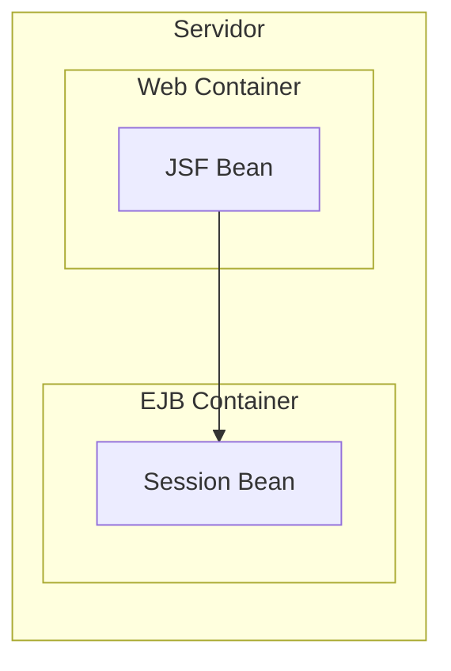
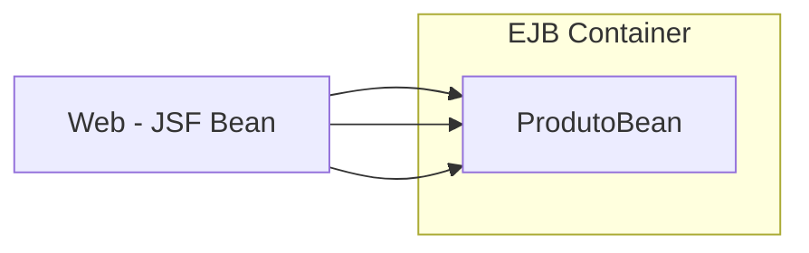
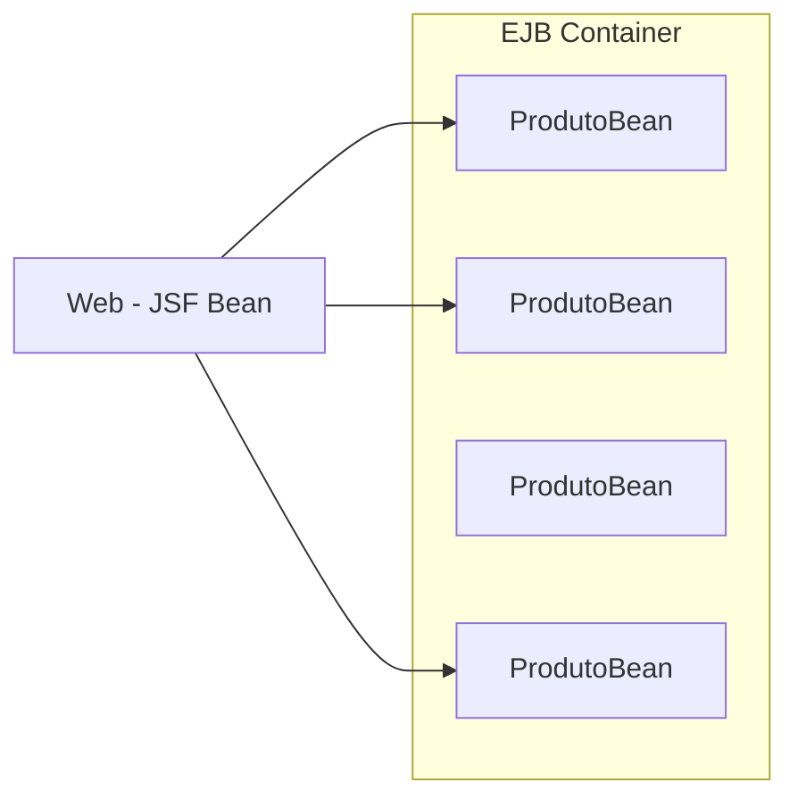
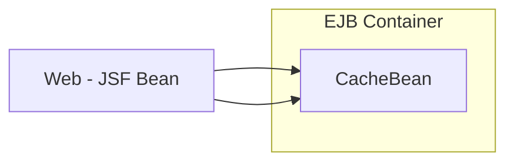
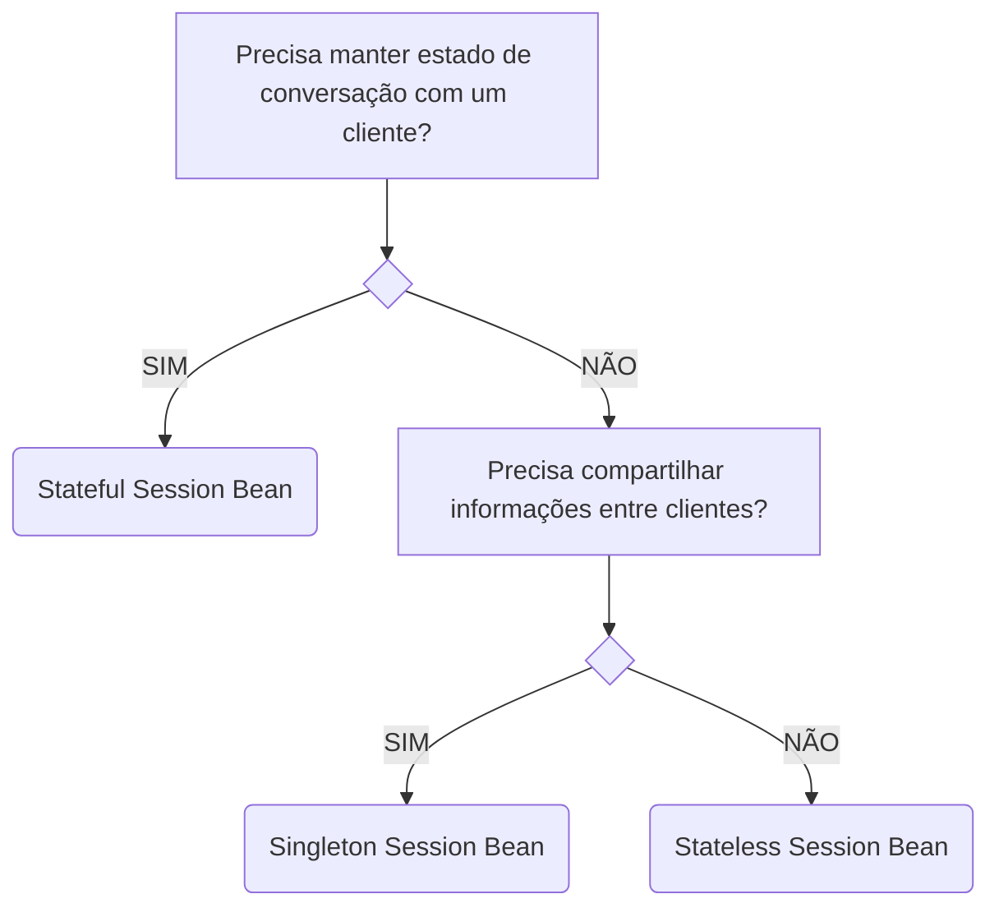
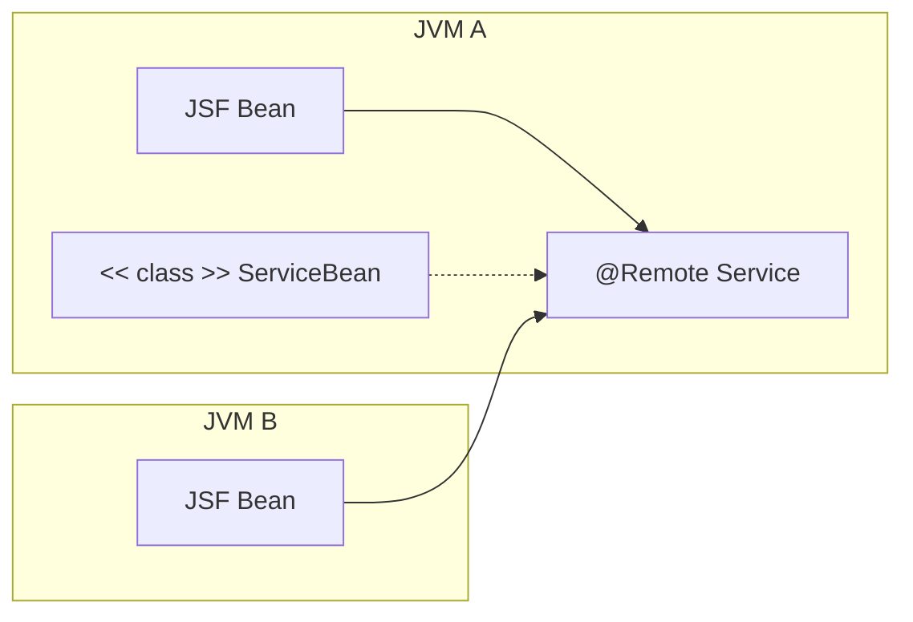
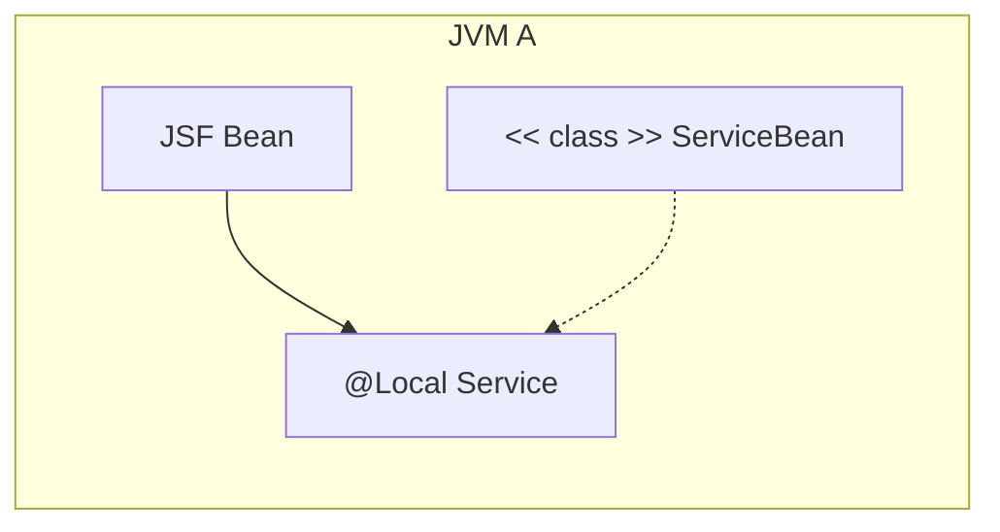
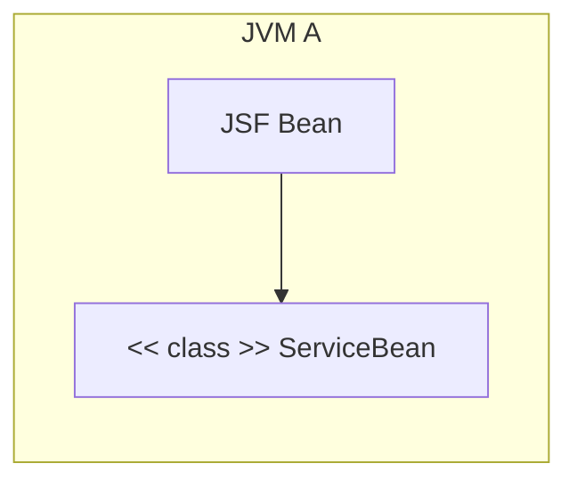
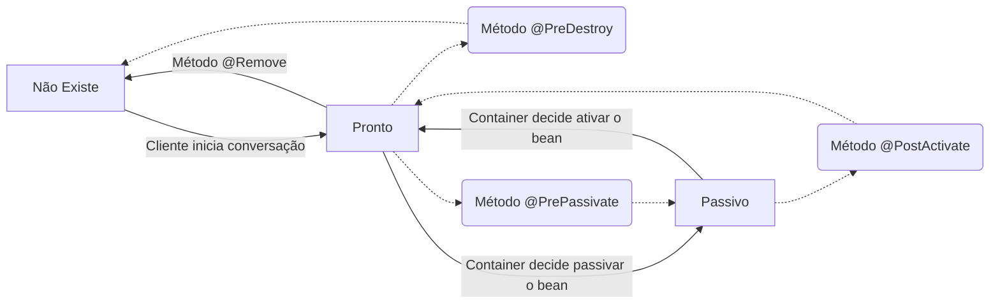
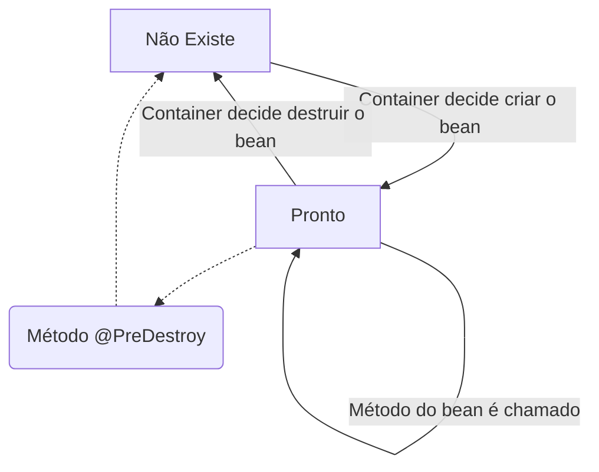

> Baseado nos cursos da Softblue

# Enterprise Java Beans

• Chamados também de EJBs

• Componentes da plataforma Java EE que implementam a lógica de negócio da aplicação

• O uso de EJBs favorece a escalabilidade

– Os EJBs podem ser distribuídos em diferentes servidores

• O container fornece diversos serviços aos EJBs, como segurança e transações

– O foco do desenvolvedor pode ficar 100% na implementação da lógica de negócio

• Os EJBs foram introduzidos na plataforma J2EE

• Tinham uma série de limitações

• Configuração complicada

• Muitos artefatos

• Nas últimas versões do Java EE os EJBs sofreram uma melhora significativa

Os EJBs são executados por um container específico

## Tipos de EJBs

• Existem 2 tipos de EJBs

  – Session Beans

    • Stateful

    • Stateless

    • Singleton

  – Message-Driven Beans

### Session Beans

• Um session bean possui métodos que podem ser invocados por um cliente

Normalmente o session bean é um cliente da aplicação web



### Stateful Session Bean

• Está atrelado a um cliente específico

A mesma instância de ProdutoBean é usada pra atender o cliente



• Mantém estado conversacional

– O cliente interage com o mesmo bean

• Como o bean não é compartilhado, é possível armazenar dados nos seus atributos

• É preciso que exista um objeto pra cada cliente acessando a aplicação

– Isso pode causar problemas em aplicações que demandam uma grande quantidade de acessos simultâneos

### Stateless Session Bean

• Não está atrelado a um cliente específico

– Pode atender vários clientes

Qualquer instância de ProcessarBean pode ser usada pra atender o cliente



• Não mantém estado conversacional

– Diferentes instâncias do bean podem ser designadas pra atender os clientes

• Como o bean é compartilhado, não é possível armazenar dados nos seus atributos

• Poucas instâncias de beans podem atender muitos clientes

– Essa é uma característica interessante em cenários onde a escalabilidade é desejada

### Singleton Session Bean

• Existe apenas uma instância do bean

– Ela é compartilhada entre todos os clientes

A mesma instância de CacheBean é usada pra atender todos os clientes



• A instância é única durante todo o tempo de vida da aplicação

– Ela é compartilhada entre todos os clientes, que podem acessá-la simultaneamente

## Qual tipo de Session Bean escolher?



## Elementos de um Session Bean

• Um EJB é composto por:

  – Classe do bean

    • Obrigatória

  – Business interface (interface do bean)

    • Opcional

• Se um EJB possuir uma business interface, ela pode ser:

  – Local

    • O cliente do EJB e o EJB precisam estar executando na mesma JVM

  – Remota

    • O cliente do EJB e o EJB podem estar executando em JVMs diferentes

• Bean com interface remota



• Bean com interface local



• Bean sem interface

É como se tivesse uma interface local



## Criando um Session Bean: Classe

• A classe do EJB é uma classe comum, anotada com o tipo do bean (@Stateless, @Stateful ou @Singleton)

```java
@Stateless//Stateless Session Bean sem interface
public class TemperatureConverterBean {
  public double celsiusToFarenheit(double tc) {
    // lógica de negócio
  }
}
```

## Criando um Session Bean: Interface

• A interface do EJB é anotada com @Local ou @Remote

```java
@Local// interface local
public interface TemperatureConverter {
  public double celsiusToFarenheit(double tc);
}

@Stateless
public class TemperatureConverterBean implements TemperatureConverter {
  public double celsiusToFarenheit(double tc) {
    // lógica de negócio
  }
}
```

• Outra opção é anotar apenas a classe

```java
public interface TemperatureConverter {
  public double celsiusToFarenheit(double tc);
}

@Stateless
@Remote(TemperatureConverter.class)
public class TemperatureConverterBean implements TemperatureConverter {
  public double celsiusToFarenheit(double tc) {
    // lógica de negócio
  }
}
```

## Referenciando um Session Bean

• A referência a um EJB pode ser injetada via CDI

JSF Bean
```java
@Named("form")
@RequestScoped
public class FormBean implements Serializable {
  @EJB
  private TemperatureConverter temperatureConverter;//interface
}
```

JSF Bean
```java
@EJB
private TemperatureConverterBean temperatureConverter;//classe do bean
```

## Chamadas Assíncronas

• Os Session Beans suportam métodos assíncronos

– O retorno ocorre antes mesmo do método terminar de executar

• A annotation `@Asynchronous` é utilizada

• O método deve retornar

  – void

  – Future<?>

```java
@Asynchronous
public void m1() {
  // lógica de negócio
}

@Asynchronous
public Future<String> m1() {//O objeto Future<?> possui métodos para checar se a execução terminou e pegar o resultado
  // lógica de negócio
  return new AsyncResult<String>("ABC");
}
```

## Ciclo de Vida: Stateful Session Bean

1. Criação da instância (new)
2. Injeção de dependências
3. Método @PostConstruct
4. Método @Init



## Ciclo de Vida: Stateless Session Bean

1. Criação da instância (new)
2. Injeção de dependências
3. Método @PostConstruct



## Ciclo de Vida: Singleton Session Bean

1. Criação da instância (new)
2. Injeção de dependências
3. Método @PostConstruct


Se o bean estiver anotado com @Startup, ele é criado assim que a aplicação é iniciada
