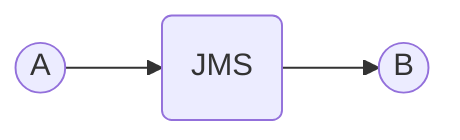
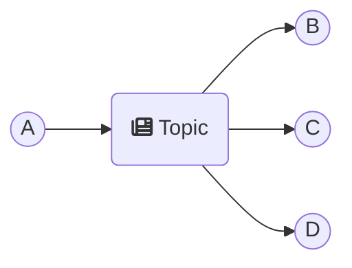
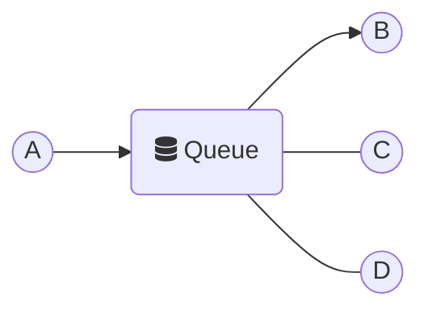
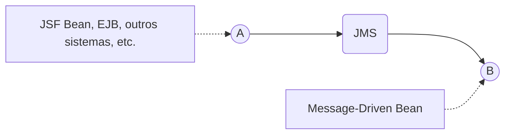
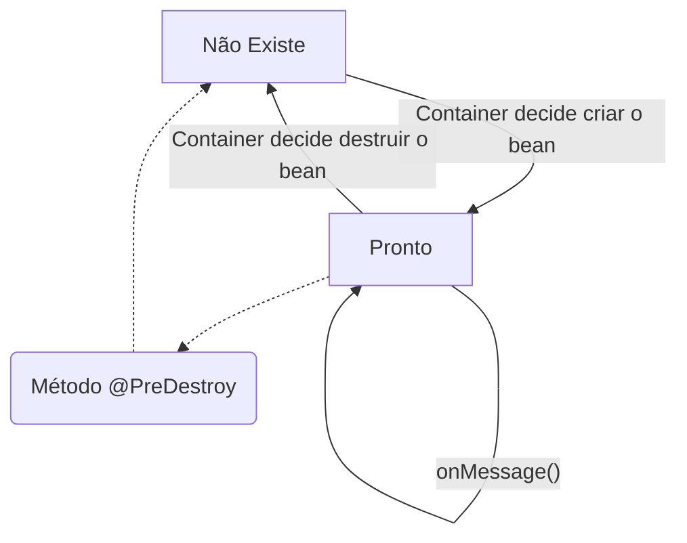

> Baseado nos cursos da Softblue

# JMS

• Java Messaging Service

• Serviço de comunicação via troca de mensagens

O JMS gerencia e garante a entrega das mensagens

A e B estão desacoplados

A comunicação é assíncrona



## Os Modelos de Entrega de Mensagens

B e C e D recebem a mensagem



B ou C ou D recebem a mensagem



## Java EE & JMS

• EJBs do tipo Message-Driven Beans são usados para consumir mensagens enviadas via JMS



O MDB pode receber mensagens de topics ou queues

### Configurando o JMS

• Todo servidor de aplicações que suporta o JavaEE deve ter suporte ao JMS

• Cada servidor de aplicação tem sua própria forma de configurar o JMS

### Características dos Message-Driven Beans

• Não são acessados diretamente via programação

– Eles respondem a mensagens enviadas a um topic ou queue

• Não possuem interfaces como os Session Beans

• São stateless

– Não armazenam estado de conversação com um cliente específico

– O container normalmente usa um pool de instâncias pra atender múltiplos clientes simultaneamente

• De forma semelhante ao que acontece com os Stateless Session Beans

• São chamados de forma assíncrona

### Criando Message-Driven Beans

```java
@MessageDriven(activationConfig = { //@MessageDriven define que a classe é um MDB
  @ActivationConfigProperty(//Propriedades que conectam o bean a um topic ou queue
    propertyName = "destinationType", propertyValue = "javax.jms.Topic"),
  @ActivationConfigProperty(
    propertyName = "destination", propertyValue = "java:/jms/topic/SoftTopic"),
})
public class TopicReceiverBean implements MessageListener {//Interface opcional
  public void onMessage(Message message) {
    // Processa a mensagem - Chamado quando chega uma mensagem
  }
}
```

Tipos de mensagens: TextMessage, StreamMessage, BytesMessage, ObjectMessage, MapMessage

### Ciclo de vida

1. Criação da instância (new)
2. Injeção de dependências
3. Método @PostConstruct


