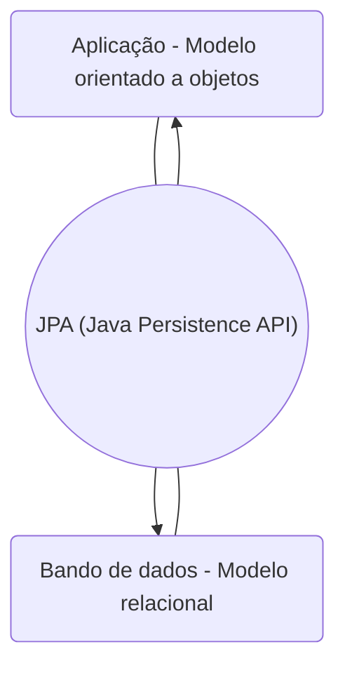
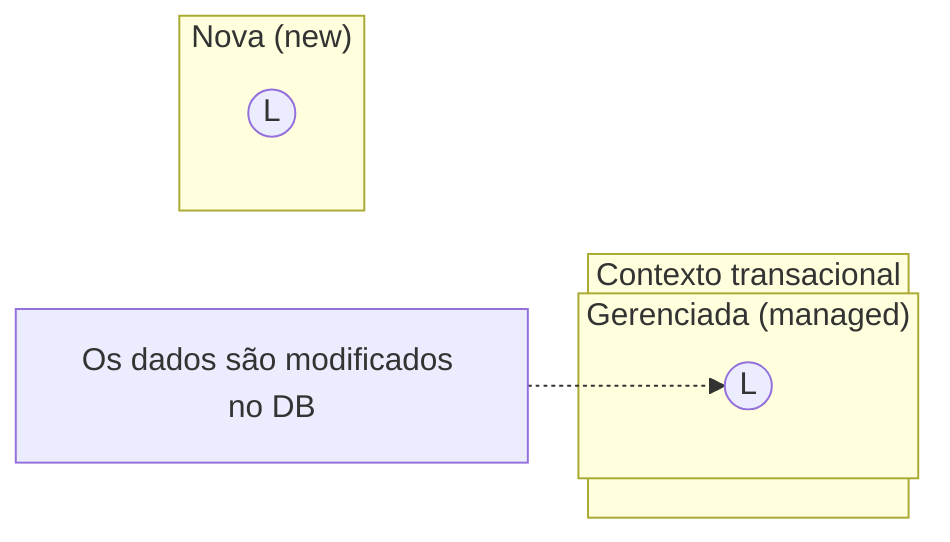
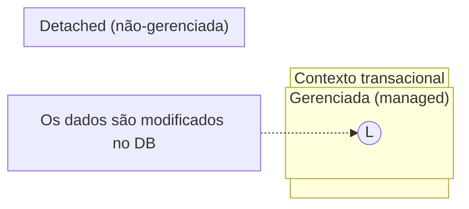
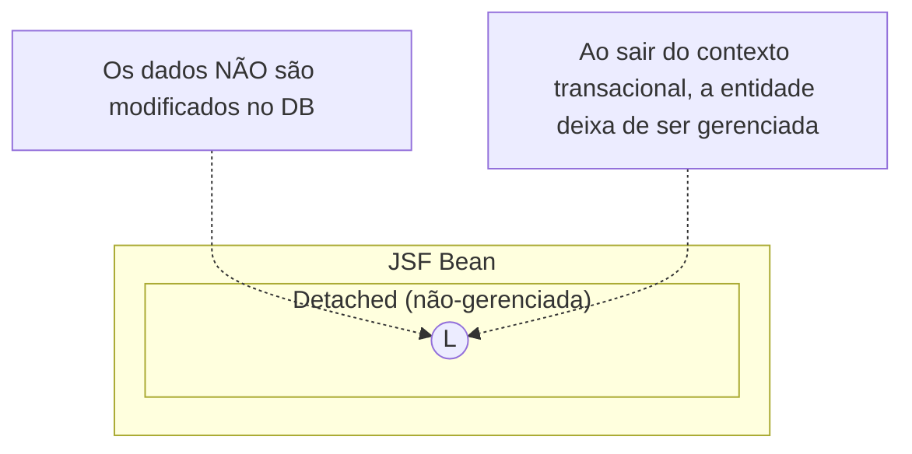
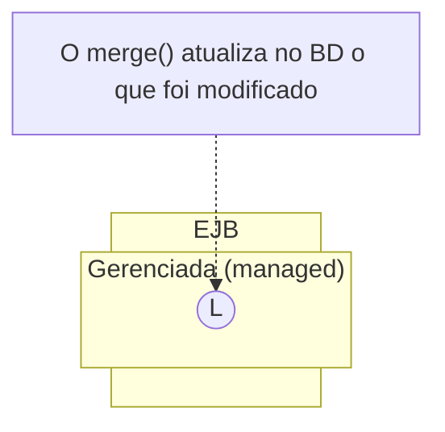
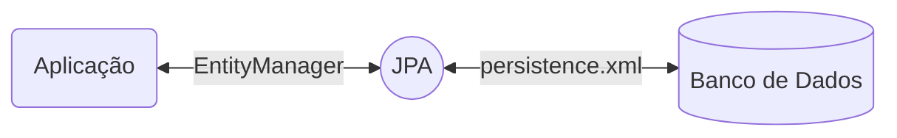
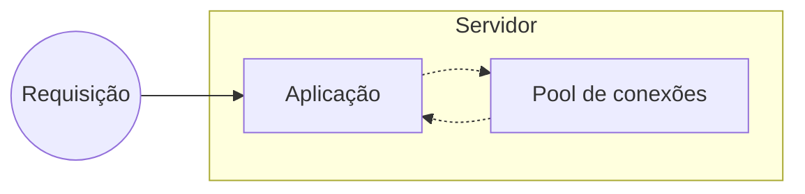
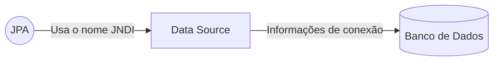

> Baseado nos cursos da Softblue

# JPA – Java Persistence API

• A integração entre aplicações e bancos de dados relacionais é muito comum

• O problema é que aplicações e bancos de dados “falam línguas diferentes”



# A especificação Java EE e o ORM 

• Nas primeiras versões do Java EE (chamado de J2EE), a persistência de dados era feita pelos componentes denominados entity beans – Os entity beans eram complexos e limitados

• Em paralelo, surgiu o Hibernate – Permitia usar todas as facilidades da orientação a objetos a favor do ORM

– Open source

• A JPA foi criada com base no Hibernate e foi incorporada na plataforma a partir do Java EE 5

# Especificação da JPA

• A JPA é uma especificação – É apenas um documento com diretrizes para implementação da JPA

• As implementações da JPA são chamadas de persistence providers 

– EclipseLink (implementação de referência) 

– Hibernate

• Todas as implementações que seguem a especificação da JPA funcionam da mesma forma

## Entidades

• Em orientação a objetos, chamamos as instâncias de classes de objetos

• No mundo ORM, os objetos que representam dados persistidos em tabelas do banco de dados são chamados de entidades (entities)

{: width="100" height="100" }

### Criando Entidades

• Exemplo de implementação de uma entidade

```java
@Entity //@Entity define a classe como sendo uma entidade
public class ContaCorrente {
  @Id//@Id define o ID da entidade
  @GeneratedValue//@GeneratedValue determina que o ID deve ser gerado automaticamente
  private Integer id;
  private String titularConta;
  private String numConta;
  private Integer numAgencia;
  private Double limite;
  // getters & setters...
}
```

### Regras Para Uma Entidade

• Classe anotada com @Entity 

• Construtor sem parâmetros (public ou protected)

• Deve implementar Serializable 

– Se for usada por interfaces remotas de EJBs 

– For usada em um JSF Bean com escopo de sessão

• Os atributos não podem ser públicos 

– Podem ser acessados externamente apenas através de getters e setters

• Deve ter um ID (chave primária)

### Tipos de Persistência

• Persistent fields 
– As annotations são realizadas nos atributos

```java
@Entity
public class ContaCorrente {
  @Id
  private Integer id;
}
```

• Persistent properties 
– As annotations são realizadas nos métodos getters

```java
@Entity
public class ContaCorrente {
  @Id
  public Integer getId() {
    return id;
  }
}
```

### Chaves Primárias em Entidades

• Toda entidade precisa ter um identificador único

– Assim a entidade pode ser encontrada

• A chave pode ser simples ou composta

– Simples

• Annotation @Id

– Composta

• Classe específica pra representar a chave

• Annotations @IdClass e @Id

#### Classe de Chave Primária Composta

• A classe deve ter um construtor público sem parâmetros

• Deve implementar Serializable

• Deve implementar os métodos hashCode() e equals()

```java
public class LivroPK implements Serializable { 
  private String titulo; 
  private String autor;
  public LivroPK() { }
  public boolean equals(Object o) { }
  public int hashCode() { }
  // getters & setters...
}
```

### Definindo os IDs

```java
@Entity
@IdClass(LivroPK.class)//@IdClass define o nome da classe da chave composta
public class Livro implements Serializable {
  @Id
  private String titulo;
  @Id
  private String autor;//Cada uma das chaves recebe a anotação @Id
```

### Embeddable Classes

• Existem situações onde você pode desejar agrupar em uma classe, mas sem criar uma tabela no BD pra isso

• Para estes casos você pode usar as Embeddable Classes

```java
@Embeddable //Substitui a annotation @Entity
public class Endereco implements Serializable {
  private String rua;
  private Integer numero;
  // getters & setters...
}
```

• Embeddable classes podem ser definidas como propriedades de entidades

```java
@Entity
public class Cadastro implements Serializable {
  @Id
  private Integer id;
  private String nome;
  @Embedded//O @Embedded indica uma embeddable class
  private Endereco endereco;
  // getters & setters...
}
```

#### Mapeamento em Embeddable Classes

Embeddable classes são mapeadas para a mesma tabela da entidade

{: width="100" height="100" }

### EntityManager

• A interface EntityManager é o ponto de entrada para o uso da JPA pelo programador

• Possui os métodos para interagir com entidades

| Método         | Descrição                                                         |
|----------------|-------------------------------------------------------------------|
| persist()      | Cria uma entidade                                                 |
| merge()        | Atualiza uma entidade                                             |
| remove()       | Exclui uma entidade                                               |
| find()         | Busca uma entidade com base no seu ID                             |
| createQuery()  | Permite procurar entidades de acordos com  os critérios desejados |

• A instância de um EntityManager pode ser injetada em componentes do Java EE via CDI

```java
@Stateless
public class MyBean {
  @PersistenceContext//@PersistenceContext injeta uma instância de EntityManager
  private EntityManager em;
//...
}
```

### Ciclo de Vida de Uma Entidade

• Uma entidade pode assumir diversos estados durante o seu ciclo de vida

– new (nova)

– managed (gerenciada)

– detached (não-gerenciada)

• Quando a entidade está no estado gerenciada, qualquer alteração nela é refletida no banco de dados

```java
Livro l = new Livro();
l.setTitulo("Java");
l.setAutor("José Silva");
entityManager.persist(l);
l.setTitulo("Java EE"); 
```



```java
Livro l = entityManager.find(Livro.class, 123);
l.setTitulo("Java Web");
entityManager.remove(l);
```



```java
public void m() {
  Livro l = ejb.load(123);
  l.setAutor("Maria P.");
  ejb.update(l); 
}
```



```java
public Livro load(int id) {
  Livro l = entityManager.find(id);
  return l;
}

public void update(Livro l) {
  entityManager.merge(l);
}
```



### O arquivo persistence.xml

• A JPA tem a responsabilidade de se comunicar com o banco de dados e fazer o gerenciamento das entidades



• O arquivo persistence.xml define como a JPA se comunica com o banco de dados

– Normalmente é utilizada uma data source

```xml
<persistence>
  <persistence-unit name="appPU">
    <jta-data-source>jdbc/appds</jta-data-source>
  </persistence-unit>
</persistence>
```

### Conexões com o Banco de Dados

• Em aplicações web, conexões com o banco de dados são normalmente gerenciadas pelo próprio servidor

– Abrir conexões é um processo considerado caro computacionalmente

– Existe um limite de conexões simultâneas que podem ficar ativas no banco de dados

#### Pool de Conexões

O pool garante um limite de conexões simultâneas e evita o “abre e fecha” de conexões



• A configuração do pool de conexões varia de um servidor para outro

– Wildfly, GlassFish, etc.

• É necessário consultar a documentação do servidor utilizado

### Data Source

• A data source é uma fonte de dados

– É configurada no servidor

– Tem um pool de conexões associado

– Tem um nome JNDI, que a identifica

• Ex: jdbc/appds


