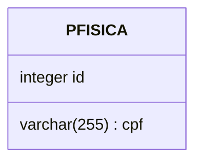
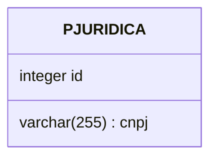
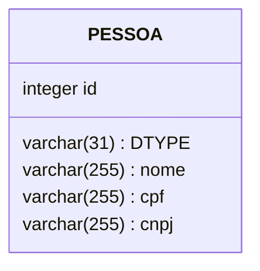
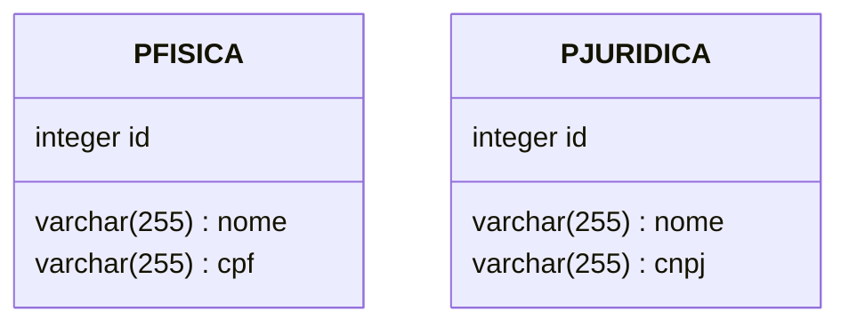
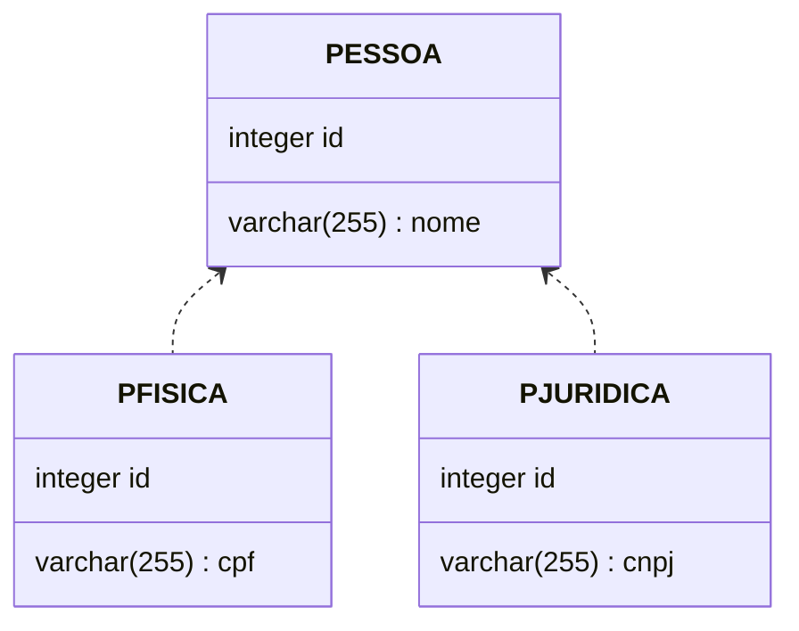

> Baseado nos cursos da Softblue

# @MappedSuperclass

• Uma entidade pode herdar propriedades de uma superclasse

– Ela deve ser anotada com `@MappedSuperclass`

```java
@MappedSuperclass//Não é gerada uma tabela Pessoa
public class Pessoa {
  @Id
  private Integer id;
  // getters & setters...
}
```

```java
@Entity(name = "PFISICA")
public class PessoaFisica extends Pessoa {
  private String cpf;
  // getters & setters...
}
```



```java
@Entity(name = "PJURIDICA")
public class PessoaJuririca extends Pessoa {
  private String cnpj;
  // getters & setters...
}
```



# Herança de Uma Classe “Normal”

• Uma entidade pode herdar de uma classe “normal”

– Que não é uma entidade

– Que é não é uma @MappedSuperclass

• Neste caso, as propriedades que não pertencem à entidade não poderão ser persistidas

```java
public class Pessoa {
  private String nome;//O atributo nome não é mapeado para o BD
}

@Entity(name = "PFISICA")
public class PessoaFisica extends Pessoa {
  @Id
  private Integer id;
  private String cpf;
}
@Entity(name = "PJURIDICA")
public class PessoaJuririca extends Pessoa {
  @Id
  private Integer id;
  private String cnpj;
}
```

# Herança Entre Entidades

• Uma entidade pode herdar de outra

• No BD, o mapeamento da herança pode seguir uma das seguintes estratégias

– Uma tabela por hierarquia de classes

– Uma tabela por entidade

– Uma tabela por subclasse (com possibilidade de realizar um join entre tabelas)

• Uma tabela por hierarquia de classes

```java
@Entity
@Inheritance(strategy = InheritanceType.SINGLE_TABLE)//@Inheritance define a estratégia
public abstract class Pessoa {
  @Id
  @GeneratedValue
  private Integer id;
  private String nome;
}
```

Se @Inheritance não for especificada, SINGLE_TABLE é usada por padrão

```java
@Entity
public class PessoaFisica extends Pessoa {
  private String cpf;
}
@Entity
public class PessoaJuridica extends Pessoa {
  private String cnpj;
}
```

DTYPE Indica o tipo da entidade (PessoaFisica ou PessoaJuridica)



• Uma tabela por entidade

```java
@Entity
@Inheritance(strategy = InheritanceType.TABLE_PER_CLASS)
public abstract class Pessoa {
  //...
}
```

As colunas se repetem em cada tabela

Dependendo do persistence provider que você use, esta estratégia pode não estar disponível



• Uma tabela por subclasse

```java
@Entity
@Inheritance(strategy = InheritanceType.JOINED)
public abstract class Pessoa {
  //...
}
```

As tabela das subclasses referenciam a tabela da superclasse



## Configurando a Coluna DTYPE

```java
@Entity
@Inheritance(strategy = InheritanceType.SINGLE_TABLE)
@DiscriminatorColumn(
  name = "TIPO",//Nome da coluna
  discriminatorType = DiscriminatorType.INTEGER,//Tipo do discriminador (STRING, INTEGER, CHAR)
  length = 5)//Tamanho do campo
public abstract class Pessoa {
  //...
}

@Entity
@DiscriminatorValue("1")//Define o valor a ser usado no discriminador
public class PessoaFisica extends Pessoa {
  //...
}
```
