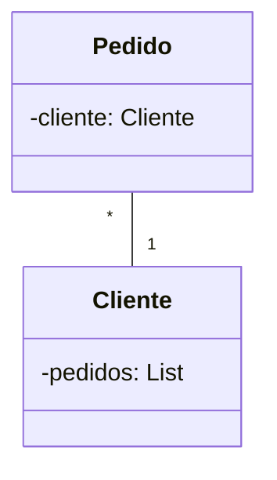

> Baseado nos cursos da Softblue

# JPQL

• Java Persistence Query Language

• Linguagem para busca de entidades

– Bastante semelhança com o SQL, usado em bancos de dados relacionais

• A JPQL referencia apenas entidades

– Não referencia tabelas ou colunas presentes no banco de dados

• Buscar todas as contas correntes

```sql
SELECT c FROM ContaCorrente c
```

• Buscar contas correntes com limite superior a 1000

```sql
SELECT c FROM ContaCorrente c WHERE c.limite > 1000
```

• Buscar os nomes dos titulares de contas da agência 3456

```sql
SELECT c.titularConta FROM ContaCorrente c WHERE c.numAgencia = 3456
```

• Buscar a quantidade de contas do titular José Silva

```sql
SELECT COUNT(c) FROM ContaCorrente c WHERE c.titularConta = 'José Silva'
```

• Buscar a soma dos saldos das contas correntes, agrupada por agência

```sql
SELECT c.numAgencia, SUM(c.saldo) FROM ContaCorrente c
  GROUP BY c.numAgencia
  ORDER BY c.numAgencia
```

## Relacionamentos e a JPQL

• A linguagem JPQL também suporta relacionamentos

• Os relacionamentos podem ser expressos de duas formas

– Usando o ".", como acontece com qualquer propriedade de uma entidade

• Possível em relacionamentos um-para-um e muitos-para-um

– Usando o conceito de join, similar ao aplicado na linguagem SQL

• [INNER] JOIN

• LEFT [OUTER] JOIN

• RIGHT [OUTER] JOIN



```sql
SELECT p FROM Pedido p WHERE p.cliente.nome = 'Pedro'

SELECT p FROM Pedido p INNER JOIN p.cliente c WHERE c.nome = 'Pedro'

SELECT p FROM Cliente c INNER JOIN c.pedidos p WHERE c.nome = 'Pedro'
```

## EAGER na JPQL

• Através da linguagem JPQL, é possível fazer com que relacionamentos definidos como LAZY se comportem como EAGER

```sql
SELECT c FROM Cliente c INNER JOIN c.pedidos p
WHERE c.nome = 'Pedro' /*Relacionamento LAZY*/

SELECT c FROM Cliente c INNER JOIN FETCH c.pedidos p
WHERE c.nome = 'Pedro' /*O uso do FETCH força o carregamento das entidades (modo EAGER)*/
```

## Buscando Entidades

• O EntityManager possui o método createQuery(), que permite o uso da JPQL

```java
Query q = em.createQuery("SELECT p FROM Pedido p"); //@SuppressWarnings("unchecked")
List<Pedido> pedidos = q.getResultList();

TypedQuery<Pedido> q = em.createQuery("SELECT p FROM Pedido p", Pedido.class);
List<Pedido> pedidos = q.getResultList();
```

• Se você souber que o resultado da query retorna 1 resultado, você pode simplificar

```java
TypedQuery<Pedido> q = em.createQuery("SELECT p FROM Pedido p", Pedido.class);
Pedido pedido = q.getSingleResult();
```

## Parâmetros em Queries JPQL

• A JPQL suporta o uso de parâmetros

```java
TypedQuery<Integer> q = em.createQuery(
  "SELECT p.id FROM Pedido p WHERE p.valor > :valor", Integer.class)
  .setParameter("valor", 1000)//Parâmetros nomeados
  .setMaxResults(5);
List<Integer> ids = q.getResultList();

TypedQuery<Integer> q = em.createQuery(
  "SELECT p.id FROM Pedido p WHERE p.valor > ?1 and p.pais LIKE ?2", Integer.class)//Parâmetros posicionais
  .setParameter(1, 500)
  .setParameter(2, "B%");
List<Integer> ids = q.getResultList();
```

## Named Queries

• A JPA suporta o uso de queries nomeadas

• Devem ser declaradas em uma entidade

```java
@NamedQuery(name = "All", query = "SELECT p FROM Pedido p")
public class Pedido { }

@NamedQueries({ 
  @NamedQuery(name = "All", query = "SELECT p FROM Pedido p"),
  @NamedQuery(name = "Free", query = "SELECT p FROM Pedido p WHERE p.valor = 0")
})
public class Pedido { }
```

• A execução de uma named query é parecida com a de qualquer query JPQL

```java
TypedQuery<Pedido> q = em.createNamedQuery("All", Pedido.class);
List<Pedido> pedidos = q.getResultList();
```

## Update & Delete com JPQL

• A JPQL suporta a atualização e exclusão de registros em lote, de acordo com os critérios desejados

```java
Query q = em.createQuery(
  "UPDATE Pedido p SET p.valor = 100 WHERE p.valor = 50");
q.executeUpdate();

Query q = em.createQuery(
  "DELETE FROM Pedido p WHERE p.valor = 20");
q.executeUpdate();
```

# Criteria API

• É uma API que permite que você busque dados, de forma semelhante à JPQL

• É baseada em uma objetos e métodos, e não em Strings como a JPQL

– Esta é uma vantagem, pois a query já é checada durante a compilação

• A Criteria API é mais verbosa

## Passos Para Usar a Criteria API

• Exemplo de query

– Listar os números de contas bancárias cujo saldo seja inferior a R$ 5000, e ordená-las por ordem decrescente de saldo

• Em JPQL:

```sql
SELECT c.numero
FROM ContaBancaria c
WHERE c.saldo < 5000
ORDER BY c.saldo DESC
```

• Usando a Criteria API:

1. Obter um CriteriaBuilder

```java
CriteriaBuilder cb = em.getCriteriaBuilder();
```

2. Criar um CriteriaQuery

```java
CriteriaQuery<String> cq = cb.createQuery(String.class);
```

3. Definir o FROM

```java
Root<ContaBancaria> contaBancaria = cq.from(ContaBancaria.class);
```

4. Definir o SELECT

```java
cq.select(contaBancaria.get(ContaBancaria_.numero));
```

5. Definir o WHERE

```java
cq.where(cb.lessThan(contaBancaria.get(ContaBancaria_.saldo), 5000.0));
```

6. Definir o ORDER BY

```java
cq.orderBy(cb.desc(contaBancaria.get(ContaBancaria_.saldo)));
```

7. Executar a query

```java
TypedQuery<String> q = em.createQuery(cq);
List<String> result = q.getResultList();
```

## Exemplo usando JOIN

JPQL
```sql
SELECT cc.saldo
FROM ContaBancaria cc INNER JOIN cc.cliente c
WHERE c.nome = 'Carlos' 
ORDER BY cc.saldo ASC
```

Criteria API
```java
CriteriaBuilder cb = em.getCriteriaBuilder();
CriteriaQuery<Double> cq = cb.createQuery(Double.class);
Root<ContaBancaria> contaBancaria = cq.from(ContaBancaria.class);
Join<ContaBancaria, Cliente> cliente = contaBancaria.join(ContaBancaria_.cliente);
cq.select(contaBancaria.get(ContaBancaria_.saldo));
cq.where(cb.equal(cliente.get(Cliente_.nome), "Carlos"));
cq.orderBy(cb.asc(contaBancaria.get(ContaBancaria_.saldo)));
TypedQuery<Double> q = em.createQuery(cq);
List<Double> result = q.getResultList();
```

## Métodos de CriteriaBuilder

• Métodos condicionais

| Método                 |  Descrição                                                                           |
|------------------------|--------------------------------------------------------------------------------------|
| equal()                | Testa se duas expressões são iguais                                                  |
| notEqual()             | Testa se duas expressões são diferentes                                              |
| greaterThan()          | Testa se a primeira expressão numérica é maior do  que a segunda expressão numérica  |
| greaterThanOrEqualTo() | Testa se a primeira expressão numérica é maior ou igual à segunda expressão numérica |
| lessThan()             | Testa se a primeira expressão numérica é menor do  que a segunda expressão numérica  |
| lessThanOrEqualTo()    | Testa se a primeira expressão numérica é menor ou igual à segunda expressão numérica |
| between()              | Testa se a primeira expressão está entre dois valores                                |
| like()                 | Testa se a expressão possui determinado padrão                                       |

• Métodos de composição de predicados

| Método |  Descrição                                      |
|--------|-------------------------------------------------|
| and()  | Aplica o operador E em duas expressões lógicas  |
| or()   | Aplica o operador OU em duas expressões lógicas |
| not()  | Nega uma expressão lógica                       |

## Metamodel API

• Possibilita o acesso às propriedades das entidades com verificação durante a compilação

```java
Join<ContaBancaria, Cliente> cliente = contaBancaria.join("cliente");
cq.select(contaBancaria.get("saldo"));
cq.where(cb.equal(cliente.get("nome"), "Carlos"));
cq.orderBy(cb.asc(contaBancaria.get("saldo")));//Problema de execução se alguma propriedade mudar de nome

Join<ContaBancaria, Cliente> cliente = contaBancaria.join(ContaBancaria_.cliente);
cq.select(contaBancaria.get(ContaBancaria_.saldo));
cq.where(cb.equal(cliente.get(Cliente_.nome), "Carlos"));
cq.orderBy(cb.asc(contaBancaria.get(ContaBancaria_.saldo)));//Se alguma propriedade mudar de nome, o erro ocorre na compilação
```

### Classes de Metamodel

• É comum que a IDE gere as classes de Metamodel relacionadas às entidades

```java
@Entity
public class ContaBancaria {
  @Id
  private Integer id;
  private String numero;
  private String agencia;
  private Double saldo;
  @ManyToOne
  private Cliente cliente;
  // getters & setters
}

@Generated
@StaticMetamodel(ContaBancaria.class)
public class ContaBancaria_ {
  public static SingularAttribute<ContaBancaria, String> numero;
  public static SingularAttribute<ContaBancaria, Integer> id;
  public static SingularAttribute<ContaBancaria, String> agencia;
  public static SingularAttribute<ContaBancaria, Cliente> cliente;
  public static SingularAttribute<ContaBancaria, Double> saldo;
}
```
