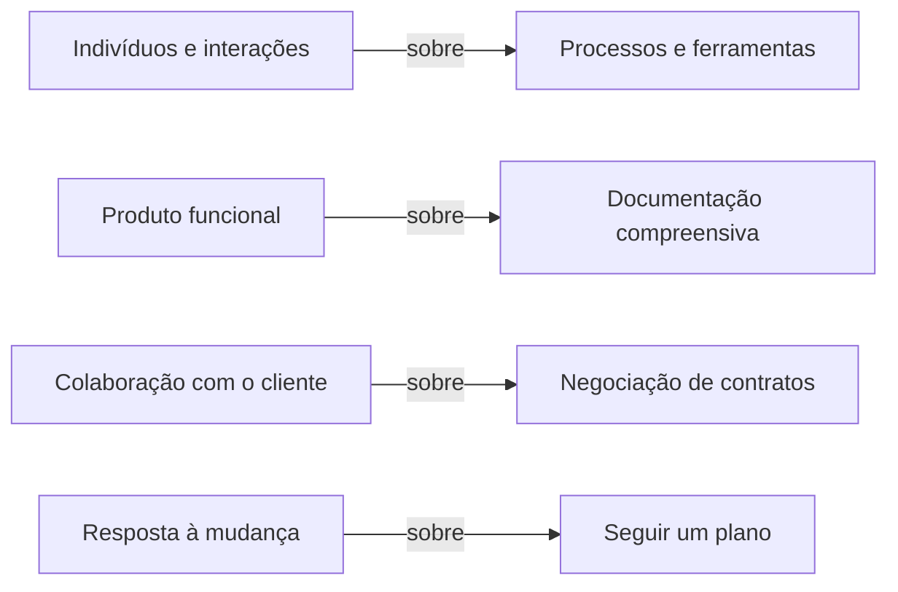

# Agile - Scrum

## Estimativa e Planejamento com Agile

●Planejamento é essencial; planos são inúteis. 

●Tempo e orçamento (pessoas) são constantes. Escopo é negociável. 

●O plano fica mais preciso com o tempo porque ele é constantemente revisado para refletir a performance real do time. 

●A única medida de sucesso é o valor de negócio entregue aos clientes. 

● Escopo é flexível e mudanças de qualquer tipo são bem-vindas a qualquer momento. 

● Não é possível controlar através de um plano; libertar o time na segurança de Agile a direcioná-lo é minha única forma de controle. 

●O produto funcionando é a única medida de progresso e de valor entregue.

### Manifesto ágil:

●Princípios Ágeis:

1. Nossa maior prioridade é satisfazer o cliente através da entrega contínua e adiantada de software com valor agregado. 

2. Mudanças nos requisitos são bem-vindas, mesmo tardiamente no desenvolvimento. Processos ágeis tiram vantagem das mudanças visando vantagem competitiva para o cliente. 

3. Entregar frequentemente software funcionando, de poucas semanas a poucos meses, com preferência à menor escala de tempo. 

4. Pessoas de negócio e desenvolvedores devem trabalhar diariamente em conjunto por todo o projeto. 

5. Construa projetos em torno de indivíduos motivados. Dê a eles o ambiente e o suporte necessário e confie neles para fazer o trabalho. 

6. O método mais eficiente e eficaz de transmitir informações para e entre uma equipe de desenvolvimento é através de conversa face a face.

7. Software funcionando é a medida primária de progresso. 

8. Os processos ágeis promovem desenvolvimento sustentável. Os patrocinadores, desenvolvedores e usuários devem ser capazes de manter um ritmo constante indefinidamente. 

9. Contínua atenção à excelência técnica e bom design aumentam a agilidade. 

10. Simplicidade -a arte de maximizar a quantidade de trabalho não realizado- é essencial. 

11. As melhores arquiteturas, requisitos e designs emergem de equipes auto- organizáveis. 

12. Em intervalos regulares, a equipe reflete sobre como se tornar mais eficaz e então refina e ajusta seu comportamento de acordo.

## Pilares do Scrum:

●Transparência

Visibilidade para todos envolvidos no processo produtivo 

● Inspeção 

● — Insight: o que está acontecendo? 

● Adaptação 

● — Refletir e melhorar

## Elementos do Scrum

Planejamento: Sprint Planning e Daily Scrum

## Scrum Framework

### Arquitetura do Scrum

Iron triangle: tempo, custo e escopo. Qualidade não é negociável.

### Release Planning:

●Sprint Planning:

● Responsabilidades: 

● — Trazer o PBL (product backlog) priorizado 

● — Explicar os itens de alta prioridades para o time 

● Participantes: PO (product owner), SM (scrum master), Time de Desenvolvimento. 

● Consiste de duas partes: 

● — Na primeira parte é decidido o que será feito no Sprint e estabelecida uma meta. 

● — Na segunda parte é decidido como atingir a meta. 

 Podemos entregar essa quantidade nesse Sprint?

●Daily Scrum:

●A participação do PO é opcional. Por que você participaria? O que você diria ao time? 

●Melhora a comunicação e promove a transparência entre os envolvidos no processo produtivo (o Time de Desenvolvimento). 

● Promove a tomada rápida de decisão. 

●  Promove o compartilhamento do conhecimento.

●Histórias de usuário é metodologia Agile, não Scrum especificamente.

### Papeis e responsabilidades

 ●Product Owner:

●Representante da área de Negócios; 

●PO não é um Comitê; 

●Define as funcionalidades do software (Product Backlog); 

●Prioriza as funcionalidades de acordo com o valor do negócio; 

● Garante que o time de desenvolvimento entenda os itens do Backlog no nível necessário.

●SCRUM Master:

●Garantir o uso correto do SCRUM; 

●Scrum Master não é Gerente de Projetos; 

●Age como facilitador; 

●Auxilia o Product Owner no planejamento e estimativas do backlog; 

●Auxilia a equipe a remover impedimentos; 

●Treina o time em autogerenciamento e interdisciplinaridade.

●Time de desenvolvimento:

●Possui habilidades suficientes para desenvolver, testar, criar e desenhar, ou seja, tudo que for necessário para entregar o software funcionando.

## Como estimar com a Equipe

### Os níveis de planejamento:

| Nível   | Frequência de realização | Quem participa                          | Foco do encontro                                  |
| ------- | ------------------------ | --------------------------------------- | ------------------------------------------------- |
| Produto | 1-2 vezes por ano        | Product Owner e executivos              | Estratégia de lançamento do produto               |
| Roadmap | 3-4 vezes por ano        | Product Owner e executivos              | Evolução do produto no tempo                      |
| Release | 6-8 vezes por ano        | Product Owner e Time de Desenvolvimento | Tradeoffs entre funcionalidade e datas de entrega |
| Sprint  | Cada 1-4 semanas         | Product Owner e Time de Desenvolvimento | Que funcionalidades podem ser entregues no Sprint |
| Diário  | Todo dia                 | Time de Desenvolvimento                 | Como completar funcionalidades                    |

### Estimando tamanho em cada nível:

| Nível   | Frequência de realização | Unidade de medida de tamanho     |
| ------- | ------------------------ | -------------------------------- |
| Produto | 1-2 vezes por ano        | T-Shirt Sizing                   |
| Roadmap | 3-4 vezes por ano        | Story Points e/ou T-Shirt Sizing |
| Release | 6-8 vezes por ano        | Story Points                     |
| Sprint  | Cada 1-4 semanas         | Story Points e horas             |
| Diário  | Todo dia                 | Horas                            |

●Comparação relativa: O tamanho de um item é dado calculando-se o esforço de se implementar o item. Fatores determinantes do esforço: complexidade, tempo, habilidade, riscos.

●T-Shirt Sizing:

●Seleciona-se uma história como referência e assinala- se um tamanho. 

●Se a próxima história for maior, classifica-se à direita da referência.

●Se a próxima história for menor, classifica- se à esquerda da referência.

●Story Points:

●Adicionam uma camada de comparação relativa para facilitar o processo de estimativa.

●• Usados para estimar o esforço de uma história.

●• Estimativa relativa; 2 story points requer mais esforço que I story point e 8 sp requer muito mais esforço que I sp.

●• Usa-se um subconjunto da série de Fibonacci.

●Story Points nos falam a diferença proporcional de tamanho. T-Shirt Sizes nos falam apenas quem é maior ou menor, sem proporcionalidade.

●Estimando com o time;

●O processo de estimativa em Scrum sempre ocorre com a equipe: knowledge of crowds! 

●Todos devem conhecer a perspectiva de cada um na equipe multifuncional 

●Planning poker 

●Vantagens em estimar com a equipe 

●— O processo de estimativa em equipe promove o compartilhamento do conhecimento 

●— Diminui os riscos do projeto 

●— Aumenta a qualidade do produto em desenvolvimento 

●— Promove responsabilidade e comprometimento

●Velocidade: quantidade de story points que uma equipe entrega por Sprint.

### Calculando Velocidade e Esforço

●Deixando a equipe encontrar sua velocidade

●O objetivo de um processo empírico com o Scrum;

●Falhar faz parte do aprendizado: punição e pressão advindas de erros de estimativas de duração, limitam a criatividade e performance;

●Executivos precisam entender que travando escopo, tempo e orçamento, não existe metodologia de gerenciamento de projetos que funcione;

●Calculando a velocidade

Útil quando o time nunca trabalhou junto, ou sua composição mudou significativamente

●Observe a velocidade por pelo menos um Sprint 

#### • Use a tabela abaixo para antecipar a velocidade futura (Cohn, 2005)

Exemplo:

| Sprints Completados | Multiplicador inicial | Multiplicador final |
|:-------------------:|:---------------------:|:-------------------:|
| 1                   | 0.6                   | 1.60                |
| 2                   | 0.8                   | 1.25                |
| 3                   | 0.85                  | 1.15                |
| 4 ou mais           | 0.9                   | 1.10                |

| Velocidade observada | Sprints Completados | Low End | High End |
|:--------------------:|:-------------------:|:-------:|:--------:|
| 29                   | 1                   | 17      | 46       |
| 29                   | 2                   | 23      | 36       |
| 29                   | 3                   | 24      | 33       |
| >> 29                | 4                   | 26      | 31       |

●Observações de velocidade

1. Velocidades observadas: 20, 25, 28, 26, 16, 20, 26, 26 

2. Descarte dados de Sprint com anomalias 

3. Crie uma lista em ordem crescente: 16, 20, 20, 25, 26, 26, 28 

4. Use a tabela abaixo para determinar a velocidade com 90% de confiança:

| Número de observações | Enésima velocidade | Intervalo de velocidade  | Velocidade mediana |
| --------------------- | ------------------ | ------------------------ | ------------------ |
| 8                     | 2                  | 20 (n menor)-26(n maior) | (20+26)/2 = 23     |

●Pattern: Manter seus times estáveis aumenta a previsibilidade 

●Colete velocidade por tantos Sprints quantos forem possíveis. Com cinco ou mais Sprints, pode-se criar uma predição de alta confiança 

●Use a enésima observação mais baixa e a enésima observação mais alta em uma lista de velocidades para obter um intervalo com 90% de confiança

| Número de observações | Enésima velocidade | Número de observações | Enésima velocidade |
| --------------------- | ------------------ | --------------------- | ------------------ |
| 5                     | 1                  | 16                    | 5                  |
| 8                     | 2                  | 18                    | 6                  |
| 11                    | 3                  | 21                    | 7                  |
| 13                    | 4                  | 23                    | 8                  |

●Métricas:

●Uma métrica é um padrão para medir ou avaliar alguma coisa. 

●Medida é uma quantidade, uma proporção, ou uma comparação qualitativa. 

●Quantidade: "Existem 25 bugs a corrigir na aplicação hoje." 

●Proporção: "Essa semana existem 10% menos bugs que na semana passada." 

●Comparação qualitativa: A nova versão do software é mais fácil de usar que a antiga."

●Três tipos de métricas:

●Informacional - diz o que está acontecendo 

• Diagnóstico - identifica áreas de melhoria 

●Motivacional - influencia o comportamento 

●Uma métrica pode funcionar em várias categorias. 

●Exemplo: oferecendo um alto valor para os clientes (informacional) pode aumentar o moral da equipe (motivação). 

●Cuidado com os efeitos colaterais indesejados: efeito Hawthorne 

●Exemplo: recompensar as pessoas por consertar erros podem resultar em aumento dos erros, pois as pessoas criam oportunidades para ganhar as recompensas.

●Medir resultado, não atividade.

●Medir tudo necessário e nada mais.

●Velocidade:

●Princípio: Nossa maior prioridade é satisfazer o cliente através da entrega antecipada e contínua de software de valor. 

●O que é: observação empírica da capacidade da equipe para o trabalho; útil para projetar a provável data de conclusão de uma determinada quantidade de escopo; útil para estimar a quantidade de escopo que pode ser entregue em uma determinada data. 

●Diagnóstico: Padrões em tendências na evolução da velocidade pode indicar vários problemas, fornece uma base para os esforços de melhoria contínua 

●Motivação: Os membros da equipe tem orgulho em conseguir alta velocidade e mantê-la estável.