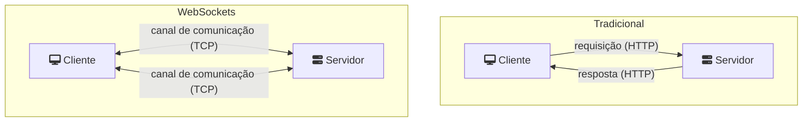
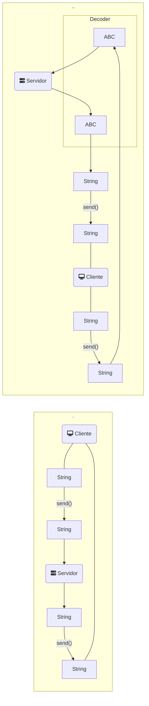

> Baseado nos cursos da Softblue

# WebSockets

• Habilitam a comunicação de duas vias entre o cliente e o servidor



# Servidor: Endpoint

• No Java EE, o servidor de um WebSocket é definido com a anotação @ServerEndpoint

• Métodos devem ser anotados e são chamados automaticamente durante o ciclo de vida da sessão do usuário

– @OnOpen

– @OnClose

– @OnError

– @OnMessage

```java
@ServerEndpoint("/server")//URI
public class MyEndpoint {
  @OnOpen
  public void onOpen(Session session, EndpointConfig conf) { }
  @OnClose
  public void onClose(Session session, CloseReason reason) { }
  @OnError
  public void onError(Session session, Throwable t) { }
  @OnMessage
  public void onMessage(Session session, String message) { }
}
```

Os métodos podem ter qualquer nome

Existe uma instância do endpoint para cada sessão

## Servidor: Enviando Mensagens

• O endpoint se comunica com o cliente através do objeto Session

```java
@OnMessage
public void messageReceived(Session session, String message) {
  session.getBasicRemote().sendText("Alguma mensagem");
}
```

## Servidor: Mensagens Binárias

• Além de mensagens de texto, é possível enviar mensagens binárias também

```java
session.getBasicRemote().sendBinary(buffer);//ByteBuffer

@OnMessage
public void bytesMessage(Session session, ByteBuffer buffer) {
  ...
}
```

# Path Parameters

• Permitem o uso de padrões de URI de WebSockets que podem sofrer variação

```java
@ServerEndpoint("/server/{some-id}")
public class MyEndpoint {
  ...
}
//ws://localhost:8080/App/server/xyz
@OnOpen
public void open(Session session, EndpointConfig c, 
  @PathParam("some-id") String id) {//O valor xyz é passado como parâmetro
  ...
}
```

## A Anotação @PathParam

• A anotação @PathParam suporta

– Classe String

– Tipos primitivos

– Classes wrappers

• Métodos que suportam o uso da anotação @PathParam

– @OnOpen

– @OnClose

– @OnMessage

# Servidor: Encoders & Decoders

• Permitem converter os dados automaticamente quando chegam ou saem do servidor



## Servidor: Decoder

```java
public class MessageDecoder implements Decoder.Text<Message> {//tipo customizado
  public void init(EndpointConfig ec) { }
  public void destroy() { }
  public Message decode(String string) throws DecodeException {//Converte para o tipo customizado
    ...
  }
  public boolean willDecode(String string) {
    ...
  }
}
```

## Servidor: Encoder

```java
public class MessageEncoder implements Encoder.Text<Message> {//tipo customizado
  public void init(EndpointConfig ec) { }
  public void destroy() { }
  public String encode(Message msg) throws EncodeException {//Converte para String
    ...
  }
}
```

## Servidor: Configurando Encoders & Decoders

• Os encoders e decoders são configurados na anotação @ServerEndpoint

```java
@ServerEndpoint(
  value = "/server",
  encoders = { MessageEncoder.class },
  decoders = { MessageDecoder.class }
)
```

• O método que recebe as mensagens deve ter a assinatura correspondente

```java
@OnMessage
  public void onMessage(Session session, Message message) {//Quando o método for chamado, o decoder já entrou em áção
    ...
}
```

• O envio de mensagens é feito através do método sendObject()

```java
Message msg = new Message();
...
session.getBasicRemote().sendObject(msg);
```

# Servidor: Informações de Usuário

• Uma sessão pode armazenar informações específicas do usuário

```java
session.getUserProperties().put("nome", "João");//Map<String, Object>

String nome = (String) session.getUserProperties().get("nome");
```

# Cliente: JavaScript API

• Aplicações web podem usar a API do JavaScript de cliente de WebSocket

– Navegadores modernos com suporte à HTML5

```javascript
var websocket = new WebSocket("ws://localhost:8080/app/server");//Inicia a conexão
websocket.onopen = function(event) {//Conexão estabelecida
  ...
};
websocket.onmessage = function(event) {//Mensagem recebida
  ...
};
websocket.onerror = function(event) {//Ocorreu um erro
  ...
};
```

## Cliente: Enviando Mensagens

• O cliente pode enviar uma mensagem ao servidor

```javascript
websocket.send("Minha mensagem");
```
