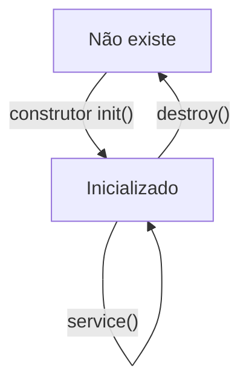

# Introdução aos Servlets

• Componente Java EE

• Seu objetivo é atender requisições

• Reside no servidor, dentro do web container

• É controlado pelo container

• O objeto do servlet é único na aplicação

• Para atender requisições simultâneas, são usadas threads

– Tomar cuidado, pois o mesmo objeto de servlet é compartilhado entre várias threads

• Quando uma requisição ao servlet é feita, ele já foi previamente inicializado

## Ciclo de vida de um Servlet



Os servlets são instanciados pelo container, na primeira vez que são acessados.

Após iniciados, os servlets podem atender requisições.

O container decide a hora de destruir os servlets.

## Criando Servlets


```java
public class MyServlet extends HttpServlet {
  public void init(ServletConfig config) throws ServletException {
    //inicialização do servlet
  }
  public void destroy() {
    //destruição do servlet
  }
  public void doGet(HttpServletRequest request, HttpServletResponse response) throws ServletException, IOException {
    //atendimento de requisição do tipo GET
  }
  public void doPost(HttpServletRequest request, HttpServletResponse response) throws ServletException, IOException {
    //atendimento de requisição do tipo POST
  }
}
```

### Tratando GET e POST igualmente

```java
public class MyServlet extends HttpServlet {
  public void doGet(HttpServletRequest request, HttpServletResponse response) throws ServletException, IOException {
    doIt(request, response);
  }
  public void doPost(HttpServletRequest request, HttpServletResponse response) throws ServletException, IOException {
    doIt(request, response);
  }
  private void doIt(HttpServletRequest request, HttpServletResponse response) throws ServletException, IOException {
    //atendimento de requisição GET ou POST
  }
}
```

### Outros tipos de requisições HTTP

• Além de GET e POST, existem outros tipos, mas são menos usados

| HTTP Method | Servlet Method |
|-------------|----------------|
| HEAD        | doHead()       |
| TRACE       | doTrace()      |
| PUT         | doPut()        |
| DELETE      | doDelete()     |
| OPTIONS     | doOptions()    |
| CONNECT     | -              |

## A Interface HttpServletRequest

• Representa a requisição feita pelo usuário

• Alguns métodos importantes

– Obter dados do HTTP request header

• getHeaderNames()

• getHeader(String)
– Obtém informações submetidas de um formulário HTML (por GET ou por POST)

• getParameter(String)

## A Interface HttpServletResponse

• Representa a resposta que será enviada de volta ao cliente

• Alguns métodos importantes

– Colocar dados no HTTP response header

• addHeader(String, String)

– Definir o tipo de resposta

• setContentType(String)

– Obter referência ao canal de saída dos dados

• getWriter()

• getOutputStream()

## Configurando um Servlet

• O arquivo web.xml é utilizado para configurar um servlet

```xml
<web-app>
  <servlet>
    <servlet-name>Comprar</servlet-name>
    <servlet-class>loja.servlet.ComprarServlet</servlet-class>
  </servlet>
  <servlet-mapping>
    <servlet-name>Comprar</servlet-name>
    <url-pattern>/ComprarServlet</url-pattern>
  </servlet-mapping>
</web-app>
```

### Como funciona o mapeamento

| Mapeamento      | Classe                       |
|-----------------|------------------------------|
| /ComprarServlet |  loja.servlet.ComprarServlet |

## Inicialização automática

• É possível definir que servlets devem ser inicializados junto com a aplicação

• Ao ser inicializado, o init() é chamado

```xml
<web-app>
  <servlet>
    <servlet-name>Comprar</servlet-name>
    <servlet-class>loja.servlet.ComprarServlet</servlet-class>
    <load-on-startup>1</load-on-startup>
  </servlet>
</web-app>
```

• A tag load-on-startup permite ordenar a inicialização dos servlets

```xml
<servlet>
  <servlet-name>Comprar</servlet-name>
  <servlet-class>loja.servlet.ComprarServlet</servlet-class>
  <load-on-startup>1</load-on-startup>
</servlet>

<servlet>
  <servlet-name>Listar</servlet-name>
  <servlet-class>loja.servlet.ListarServlet</servlet-class>
  <load-on-startup>2</load-on-startup>
</servlet>

<servlet>
  <servlet-name>Cadastrar</servlet-name>
  <servlet-class>loja.servlet.CadastrarServlet</servlet-class>
  <load-on-startup>3</load-on-startup>
</servlet>
```

## Passando parâmetros para Servlets

• Ao inicializar os servlets, é possível passar parâmetros a eles através do arquivo web.xml

```xml
<servlet>
  <servlet-name>Comprar</servlet-name>
  <servlet-class>loja.servlet.ComprarServlet</servlet-class>
  <init-param>
    <param-name>moeda</param-name>
    <param-value>R$</param-value>
  </init-param>
</servlet>
```

• É possível fornecer mais de uma parâmetro usando a tag init-param várias vezes

## Recuperando os parâmetros

• A recuperação dos parâmetros pode ser feita no código do servlet

```java
ServletConfig config = getServletConfig();
String moeda = config.getInitParameter("moeda");
String moeda = getInitParameter("moeda");
```

• Caso o init() seja sobrescrito, é precisoinvocar o método da superclasse

```java
public void init(ServletConfig config) throws ServletException {
  super.init(config);
  //...
}
```

• O método getInitParameterNames() permite ler todos os parâmetros do servlet

```java
ServletConfig config = getServletConfig();
Enumeration<String> e = config.getInitParameterNames();
while(e.hasMoreElements()) {
  String param = e.nextElement();
}
```

# Servlets e annotations

• Servlets podem ser configurados também via annotations

```java
@WebServlet("/Comprar")//@WebServlet define que a classe é um servlet
public class ComprarServlet extends HttpServlet {
  protected void doGet(HttpServletRequest request, 
    HttpServletResponse response) 
    throws ServletException, IOException {
    //código do servlet
  }
}
```

• O atributo loadOnStartup define a inicialização automática

```java
@WebServlet(value = "/Comprar", loadOnStartup = 1)
public class ComprarServlet extends HttpServlet {
  //...
}
```

• O atributo initParams permite definir parâmetros de inicialização para o servlet

• Ele define um array de parâmetros, onde cada elemento é do tipo @WebInitParam

```java
@WebServlet(value = "/ComprarServlet", initParams = { 
  @WebInitParam(name = "moeda", value = "R$"),
  @WebInitParam(name = "pais", value = "Brasil")
})
public class ComprarServlet extends HttpServlet {
  //...
}
```

# Enviando uma resposta ao cliente

• Depois que uma requisição é feita, o cliente (browser) aguarda uma resposta

• Depois de processar a requisição, uma das opções é que o servlet gere a resposta

• Como deve ser a resposta?

– Normalmente é em formato HTML

– Pode ser também qualquer outro tipo de formato, seja ele binário ou texto

## Produzindo uma resposta

• O servlet acessa o canal de envio da resposta através do objeto HttpServletResponse

```java
//Resposta em formato texto
PrintWriter out = response.getWriter();//out.print() é usado para enviar dados

//Resposta em formato binário
OutputStream out = response.getOutputStream();//out.write() é usado para enviar dados
```

### Definindo um content-type

• É preciso avisar ao cliente (browser) sobre o tipo de resposta que está sendo enviado

• Isto é feito através do content-type, definido no HTTP response header

```java
response.setContentType("text/html");
```

| Content Type     | Extensão Típica | Formato                            |
|------------------|-----------------|------------------------------------|
| text/html        | .htm .html      | HTML                               |
| text/plain       | .txt            | Texto sem formatação               |
| image/gif        | .gif            | Imagem GIF                         |
| image/jpeg       | .jpg            | Imagem JPEG                        |
| image/x-png      | .png            | Imagem PNG                         |
| application/pdf  | .pdf            | Documento PDF                      |
| application/zip  | .zip            | Conteúdo compactado no formato ZIP |

### Exemplo de Reposta HTML

```java
public void doGet(HttpServletRequest request, HttpServletResponse response) throws ServletException, IOException {
  response.setContentType("text/html");
  PrintWriter out = null;
  try {
    out = response.getWriter();
    out.print("<HTML>");
    out.print("<HEAD>");
    out.print("<META http-equiv=\"Content-Type\" " + 
      "content=\"text/html; charset=ISO-8859-1\" />");
    out.print("</HEAD><BODY>");
    out.print("<H1>Seja bem vindo!</H1>");
    out.print("</BODY></HTML>");
  } finally {
    if (out != null) {
      out.close();
    }
  }
}
```

### Exemplo de Resposta Binária

```java
public void doGet(HttpServletRequest request, HttpServletResponse response) throws ServletException, IOException {
  response.setContentType("application/zip");
  OutputStream out = null;
  InputStream in = null;
  try {
    out = response.getOutputStream();
    in = new FileInputStream("C:/Temp/java.zip");
    byte[] buffer = new byte[1024];
    int numBytes;
    while((numBytes = in.read(buffer, 0, buffer.length)) > -1) {
    out.write(buffer, 0, numBytes);
  }
  } finally {
    if (in != null) {
      in.close();
    }
    if (out != null) {
      out.close();
    }
  }
}
```

> Baseado nos cursos da Softblue