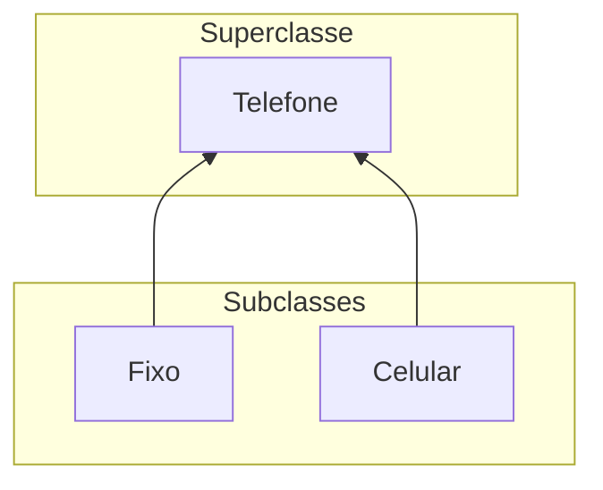
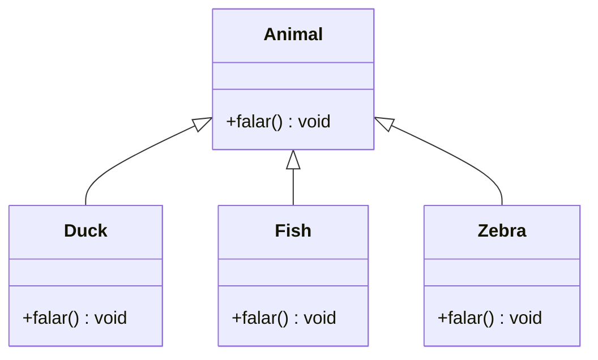

> Baseadas na documentação e nos cursos da Softblue

# Introdução

JVM - Java Virtual Machine - Isolamento total da aplicação - é possível obter métricas e trabalhar com otimização - Garbage collection

A JVM é uma especificação - outras empresas podem fazer suas implementações - é possível trocar a JVM sem recompilar os códigos

Princípio WORA "Write Once, Run Anywhere"

Código-fonte (arquivo.java) --javac-> bytecode (arquivo.class) -> JVM

Performance: HotSpot (JVM identifica código bastante executado) e JIT (Just In Time Compiler dos HotSpots)

JRE - Java Runtime Environment - JVM + bibliotecas

Nomes de projeto em letra minúscula - nomes de classe com letra maiúscula - convenção do java

New Gradle Project

Todos os códigos precisam estar dentro de classes

Todo código começa a executar pelo método main

Para rodar o modo debug no eclipse é preciso marcar um break point, na lateral da linha de código

funções -> em Orientação a Objetos é métodos. Nomes de método em camelCase

Comando Source no Eclipse corrige a identação.

JDK + ItelliJ/Eclipse + Maven + Gradle + Wrappers

## Wrappers

Para evitar incompatibilidade de versão entre as ferramentas de build de diferentes desenvolvedores.

É uma forma de estabelecer controle de versões das ferramentas entre todos os membros da equipe.

## Spring initializer

https://start.spring.io

## Comentários

```java
//uma linha
/* em bloco*/
```

> Bibliotecas Checkstyle e PMD verificam boas práticas de código.

# Conceitos Iniciais

Variáveis fortemente tipadas e operadores (no java todas as variáveis devem possuir um tipo e um nome)

Nomes de variáveis devem começar com letra minúscula

O Java não inicializa as variáveis automaticamente, então você sempre deve atribuir um valor antes de usar a variável.

int idade; (4bytes)

byte // short // float // long

double nota; (casas decimais com ponto)

boolean ligado;

char (apenas valores positivos, indica um caractere, representado entre aspas simples 'a')

String nome; (não é um tipo primitivo. colocar valor entre aspas duplas)

var x; (tipo de variável genérica, ela vai assumir o primeiro tipo baseado no valor que receber, e não pode mudar depois)

Array: double[] notas = new double [número de posições];

double[] notas2 = {8.5, 9.0, 7.5}

Escopo de variáveis: uma variável criada dentro de um bloco (como repetição, por exemplo, só existe dentro desse bloco).

&& E

|| OU

## Operadores de incremento e decremento ++ --

Int x = 10; ---> x=11 pré-fixado

Int y = ++x; y=11

Int x = 10; ---> x=11 pós-fixado

Int y = x++; y=10

## Casting

Atribuir uma variável/valor de um tipo a uma variável de outro tipo

Implícito: o java faz a conversão do tipo de dado automaticamente (no limite do tamanho do tipo: byte-short-int-long-float-double) double x = 10 (int)

Explicito: a conversão deve ser feita pelo programador double d = 100.0; int i = (int) d;

Cuidado, o casting explicito pode gerar inconsistência entre os valores.

## Comandos de decisão

if(condição) {}

else if(condição) {}

else{}

switch(valor int ou convertido para int, enum ou String){case 0: ...break; default:}

case 0 -> {} //a seta dispensa break e permite atribuir o resultado de switch a uma variável

## Operador ternário substitui if else

test ? doThisIfTrue : elseDoThis

## Comandos de repetição

for(inicialização; condição; incremento) {}

for(elemento in array) {}

while(condição) {}

do {} while(condição)

## Comandos de controle

break interrompe repetição

continue interrompe a execução atual da repetição mas permite a continuação do laço desde o início

## Prioridades em operadores

Aritmético > raiz e potenciação - multiplicação e divisão - soma e subtração

Relacional > Lógico - não - e - ou

## Criar métodos

No Java os parâmetros são sempre copiados, nunca passados por referência.

Um parâmetro é usado ao declarar a função. Um argumento é usado ao chamar uma função.

static void nomeDoMetodo(parâmetros separados por vírgula) { }

static int[] nomeDoMetodo( ) { }

É possível criar métodos com o mesmo nome, mas eles precisam se diferenciar em parâmetros (tipo, quantidade ou ambos).

Método main: public static void main(String\[\] args){}

## Classes/Métodos do sistema

System.out.println(nota); //println pula uma linha

System.out.print();

Math.sqrt()

Math.pow(,)

## Jshell

Incluso no jdk (pasta bin, executar com parâmetro -v), permite criar e testar códigos simples.

# Classes e Objetos

Uma classe representa um tipo de dados, é uma estrutura. Um modelo para construir/instanciar objetos.

```java
public class Livro { //Um arquivo .java pode ter apenas uma classe declarada como pública dentro dele.
String isbn; //O java inicializa os atributos automaticamente.
int numPaginas;
void emprestar () {} //método
}
```

Assinatura de um método: tipoDeRetorno[double, void etc] nome (parâmetros, zero ou mais, e todo o parâmetro deve ter um tipo definido)

Sobrecarga de métodos: criar métodos com mesmo nome mas com assinatura diferente. Apesar do nome, são métodos completamente diferentes.

Criar objeto: NomeDaClasse variável = new NomeDaClasse() //acesso dos atributos/métodos com objeto.atributo

Cada objeto criado com o new é único.

Uma variável cujo tipo é uma classe não guarda o objeto diretamente, mas uma referência a memória (ponteiro ao heap) onde o objeto foi criado.

As variáveis declaradas em métodos (locais) são criadas na memória stack (tipo pilha). Toda vez que um método termina, tudo é removido da stack.

Os objetos são criados numa área de memória heap. String é objeto também, não tipo primitivo.

Duas variáveis que apontam para o mesmo objeto no heap não geram duplicatas, ambas trabalham no mesmo objeto.

No java não há passagem de parâmetros por referência, apenas por cópia. Quanto se trata de ponteiro/referencia a um objeto, a referência é copiada. Como as variáveis na stack são apagadas após o fim do método, para que o conteúdo não seja perdido (se é o que você deseja) ou você instrui o método a retornar o valor (return) ou utiliza como parâmetro uma variável que armazena um ponteiro (referencia) a um objeto do heap, e não uma variável com tipo primitivo.

Garbage Collector: serviço da JVM que remove objetos do heap que não são mais utilizados pela aplicação (variavel=null remove a referência ao heap, mas não destrói o objeto, por isso o garbage collector existe, e é independente e incontrolável, rodando em segundo plano).

Operador this: não é obrigatório, é utilizado para diferenciar um atributo do objeto de um argumento do método, ou, para fornecer a referência do próprio objeto para outro método.

# Modificadores de acesso, Construtores e elementos estáticos

## Modificadores de acesso

private: atributo ou método visível apenas para a classe que o declara. Usar para métodos auxiliares dentro da mesma classe, sem necessidade de chamada externa.

public: visível para todas as classes.

Se não definir um dos dois modificadores, o padrão é package, ou seja, visibilidade apenas dentro do pacote.

Normalmente atributos são private e métodos public, mas não é regra. O ideal é que os objetos colaborem através da troca de mensagem (chamadas de métodos) e não acessando atributos diretamente.

Classes quase sempre são declaradas como public, e no Java apenas pode haver uma classe public por arquivo. Nome do arquivo igual ao nome da classe.

Classes não declaradas como public são inner classes.

## Princípio do encapsulamento

Encapsular é esconder detalhes de funcionamento do programa, sendo fundamental para permitir que o programa seja suscetível a mudanças.

## Métodos getters e setters

Usados para acessar e alterar atributos marcados como private. Protegem os atributos, pois permitem a validação do acesso ou alteração. Também evitam a mudança de código em vários lugares. Não utilize getter e setters quando não for necessário.

Getters: métodos para expor valores dos atributos.

Setters: métodos para alterar valores dos atributos.

atributo: nome // método getter: getNome() // método setter: setNome()

Para atributos booleanos o nome do método getter pode ser isNome()

## Construtores

O construtor de uma classe é chamado toda a vez que um objeto da classe é instanciado. O construtor possui o mesmo nome da classe. Não possui tipo de retorno, o que diferencia dos métodos:

```java
public class SalaDeAula { //classe
public SalaDeAula () {} //construtor
}
```

Invocar o construtor: SalaDeAula s = new SalaDeAula();

Quando o construtor não é fornecido, o Java fornece um construtor padrão (sem parâmetros). Toda classe deve possuir um.

Um construtor com parâmetros podem ser utilizados para setar valores inicias para o objeto.

Os construtores também podem ser sobrecarregados. this() dentro de um construtor pode ser utilizado para invocar outro construtor da mesma classe (neste caso o this() deve obrigatoriamente ser a primeira instrução do bloco.

## Atributos e métodos estáticos

Algumas vezes, atributos e métodos podem não estar atrelados a um objeto específico, mas sim à classe. Atributos ou métodos da classe são assim definidos através do modificador static. Os valores dos atributos estáticos são compartilhados entre todas as instâncias da classe.

Métodos estáticos só podem acessar atributos ou outros métodos que também sejam estáticos. O acesso é feito utilizando diretamente a classe, não é necessário criar um objeto. Os atributos estáticos são uma forma bastante usada para criar constantes no Java. O modificador final pode ser usado para marcar o valor da constante como fixo. Por convenção, nomes de constantes são escritos em maiúsculas, com espaços usando \_.

## O bloco static

Uma classe pode ter um, apenas um, bloco static. static {}

Esse bloco é executado quando a classe é referenciada pela primeira vez, iniciando atributos estáticos e executando código antes que a classe seja utilizada. É executado apenas uma vez.

## O tipo de dado *record*

Algumas vezes criar classes gera muito código desnecessário. O record armazena e transporta atributos, dispensando a criação de classe tradicional.

Os atributos definidos no record não podem ser alterados. O record também disponibiliza automaticamente o construtor e os métodos getter para os atributos.

```java
public record Quadrado (atributos) {
	public double calcularArea() {
		return lado * lado;
	}
}
```

## A classe System

Métodos estáticos úteis:

System.in //entrada padrão

System.out // saída padrão

System.exit(int) // termina a JVM

System.currentTimeMillis() // retorna o tempo atual em ms

## Método main

public static void main (String\[\] args) {}

# Herança e Polimorfismo

## Herança

• A herança é um mecanismo que permite que uma classe possa herdar o comportamento de outra classe, ao mesmo tempo em que novos comportamentos podem ser estabelecidos 

• A vantagem da herança é agrupar coisas comuns para poder reaproveitar código



• Toda classe em Java herda de apenas uma superclasse.

Se uma superclasse não for definida, o Java faz a classe herdar de Object

• Atributos e métodos declarados com o modificador protected podem ser acessados pelas suas subclasses

O atributo é declarado como protected na superclasse

Métodos da subclasse possuem acesso ao atributo declarado na superclasse

```java
public class Celular extends Telefone {
    protected String numero;
    ...
}
public class Fixo extends Telefone {
	public void adicionarDDD (String ddd) {
		String n = ddd + this.numero;
	}
    ...
}
```

## Sobrescrita de métodos

• Técnica também conhecida como overriding 

• Quando uma classe herda de outra, ela pode redefinir métodos da superclasse, isto é, sobrescrever métodos – Os métodos sobrescritos substituem os métodos da superclasse – A assinatura do método sobrescrito deve ser a mesma do método original.

```java
public class Celular extends Telefone {
    public void telefonar(){
	...
	}
}
public class Fixo extends Telefone {
    public void telefonar(){
	...
	}
}
```

O método que foi sobrescrito pode ser acessado pelo método que o sobrescreveu através da palavra-chave super

```java
public class Fixo extends Telefone {
    public void telefonar(){
		super.telefonar();
	}
}
```

### Sobrescrevendo métodos de Object

• Método toString() 

– As classes podem sobrescrever este método para mostrarem uma mensagem que as representem 

– O método System.out.println(), por exemplo, utiliza este método 

• Método equals(Object) 

– É a forma que o Java tem de comparar objetos pelo seu conteúdo ao invés de comparar as referências (como acontece ao usarmos "==")

## Polimorfismo

• É a capacidade que um método tem de agir de diferentes formas, dependendo do objeto sobre o qual está sendo chamado 

• Quando ocorre a chamada de um método, a JVM decide qual método invocar dependendo do objeto instanciado na memória



Cada animal implementa o método falar() do seu modo

O método invocado é determinado pelo tipo do objeto que está armazenado na memória

A forma como objeto é referenciado não influencia na decisão sobre qual método será invocado

O tipo pelo qual o objeto é referenciado determina quais métodos e/ou atributos podem ser invocados

### O operador instanceOf

Utilizado para verificar se um objeto pertence à determinada classe

Normalmente é utilizado antes de realizar um cast, para garantir que a operação é válida

```java
Animal a = new Cachorro();
a instanceOf Cachorro; //true
a instanceOf Animal; //true
```

# Classes abstratas e Interfaces

## Classes abstratas

* Usadas quando não faz sentido termos instâncias de determinadas classes

* Manter a consistência do programa

*  Utilizar o modificador abstract na declaração da classe

```java
public abstract class Animal{
}
```

* Não é permitida a existência de objetos da classe se ela for abstrata.

* É permitido criar referências à classe:

```java
Animal a = new Cachorro();
```

## Métodos abstratos

* Utilizados quando não faz sentido termos a implementação do método em determinada classe 

* Para declarar um método abstrato, basta utilizar o modificador abstract na declaração do método

```java
public abstract class Animal{
	public abstract void falar();
}
```

* Todas as classes não-abstratas que herdam de uma classe abstrata são obrigadas a implementar os métodos abstratos

* Os métodos chamados correspondem aos métodos implementados nas subclasses

* Classes abstratas não precisam obrigatoriamente ter métodos abstratos

* Métodos abstratos só podem existir em classes abstratas

## Interfaces

* A interface define métodos, mas não os implementa – Com exceção de métodos que usam os modificadores default, static e private 

* A implementação é de responsabilidade de quem implementa a interface

* O foco é no que o objeto faz, e não em como ele faz 

* Interfaces possibilitam mudanças de implementação muito mais facilmente, pois quem chama o método não conhece a sua implementação

* Interfaces não possuem atributos (só constantes)

```java
public interface AreaCalculavel{
	public double calcularArea();
}

public class Quadrado implements AreaCalculavel {
	private double lado;
	public double calcularArea() {
		return lado * lado;
	}
}
```

* Interfaces podem estender outras interfaces 

* Classes podem estender outra classe, mas apenas podem implementar interfaces 

* Uma classe pode implementar uma ou mais interfaces

### Métodos Default

* Uma interface pode definir métodos com o modificador default 

* Neste caso, o método é implementado diretamente na interface 

* Este recurso surgiu no Java 8, a fim de permitir o suporte à expressões lambda em interfaces que já faziam parte da linguagem

```java
public interface Calculator {
	double calculate();
	default double calculatePow(double x, int y) {
		return Math.pow(x, y);
	}
}
```

### Métodos Estáticos

* Interfaces também podem implementar métodos definidos com o modificador static 

* O método é acessível diretamente pela interface, sem precisar que ocorra a criação de objetos

```java
public interface Calculator {
	double calculate();
	static double calculatePow(double x, int y) {
		return Math.pow(x, y);
	}
}
```

### Métodos Privados

* A versão 8 do Java introduziu os métodos default e static em interfaces 

* Isso trouxe um problema – Onde agrupar a lógica comum desses métodos? 

* A solução foi introduzir, a partir do Java 9, métodos private em interfaces

```java
public interface Logging {
	default void logInfo(String msg) {
		log("INFO: " + msg);
}
default void logError(String msg) {
	log("ERROR: " + msg);
}
private void log(String msg) { //Implementa a lógica comum entre os métodos
	// Conecta no BD
	// Grava o log
	// Fecha a conexão
	}
}
```

## Classes Abstratas ou Interfaces?

* A escolha entre classes abstratas ou interfaces tem dois aspectos 

	* Conceitual 

		* Classes abstratas são classes que não podem ter instâncias 

		* Interfaces determinam como um objeto será exposto 

	* Prático

		* Uma classe pode implementar mais de uma interface 

		* Uma classe abstrata pode conter atributos

* Classes abstratas e interfaces têm o objetivo comum de favorecer o uso do polimorfismo

# Tratamento de Exceções
## Avisando Sobre Falhas em Métodos

• Você precisa avisar quem chamou o método e informar que o método não executou como deveria. Como fazer?

– As abordagens mais comuns são

• Usar booleanos

• Usar magic numbers

* Problema de Usar Booleanos

	* E se o retorno não for tratado?

	* O que falhou?

* Problema de Usar Magic Numbers

	* E se o retorno não for tratado?

	* Como entender este código sem uma tabela de códigos de erro?

## Exceções

* Exceções representam algo estranho ao sistema que normalmente não ocorre 

* Em Java, o tratamento de exceções é feito por um código diferente do código executado quando não ocorre a exceção

### Classes Que Representam Exceções

* Exceções são representadas por classes

* As classes devem herdar direta ou indiretamente de Exception 

* O Java tem classes que representam diversos tipos de exceção, mas o programador pode criar exceções específicas de acordo com a necessidade

### Checked Exceptions

• Herdam direta ou indiretamente de Exception

* Só não podem herdar de RuntimeException

### Unchecked Exceptions

* Também chamadas de runtime exceptions 

* Herdam direta ou indiretamente de RuntimeException

### Lançando Exceções

* O lançamento de exceções é feito através do throw

```java
public void fazerAlgo() throws Exception { //O throws indica que o método pode lançar a exceção
	throw new Exception(); //O throw é usado para lançar a exceção
}
```

* É possível também lançar subclasses da exceção declarada pelo throws

```java
public void fazerAlgo() throws Exception { //A declaração throws Exception está de acordo com a exceção lançada pelo método
	throw new IOException(); //IOException é uma subclasse de Exception
}
```

### Tratando Exceções

* Exceções podem ser tratadas através do uso do bloco try/catch 

	* Determinado código tenta (try) executar um método e, caso alguma exceção aconteça, ele pega (catch) a exceção ocorrida e faz o que deseja

* Após uma exceção ter alcançado o bloco catch, o código volta o seu fluxo normal de execução

```java
public void m1() throws IOException, SQLException {
	...
}
public void m2() { //Dependendo da exceção, o bloco catch correspondente é executado
	try {
		m1();
	} catch (IOException e) { //No máximo um bloco catch é executado
		...
	} catch (SQLException e) {
		...
	}
	...
}
```

* É possível fazer o catch de mais de uma exceção ao mesmo tempo (Multi-catch)

```java
try {
	m();
} catch (MyException1 | MyException2 | MyException3 e) {
	...
}
```

### Lançando Unchecked Exceptions

* Estas exceções normalmente são provocadas por problemas de programação, não devendo ser tratadas

* Por este motivo, o Java não obriga o programador a tratar as unchecked exceptions

* Se uma exceção for lançada pelo método main(), a JVM termina

* Exceções muito genéricas dificultam no entendimento do problema

## Assertions

* Garantir qualidade do código, executando testes que permitem validar a lógica e as suposições sobre o programa 

* São usadas em tempo de desenvolvimento e desabilitadas em produção

* Se a assertion falhar, a JVM lançará um AssertionError

```java
public void metodo(int arg) { 
	assert arg > 0;
	... 
}

public void metodo(int arg) { 
	assert arg > 0 : "arg menor que 0"; //Funciona como o exemplo anterior, mas a string fornecida será passada no construtor do AssertionError
	... 
}
```

* Por padrão, as assertions ficam desabilitadas 

* Para habilitá-las, é preciso passar o parâmetro –ea ao iniciar a JVM

`java -ea MinhaClasse`

* Não use assertions para validar parâmetros de métodos públicos 

	* Métodos públicos têm um comportamento bem definido sobre o que ocorre na passagem de parâmetros

	* Este comportamento deve ser o mesmo, havendo assertions ou não

* Não escreva assertions que interfiram na execução da aplicação 

	* Estando a assertion habilitada ou não, a aplicação deve funcionar da mesma forma

# Strings, Datas e Números

## Strings

* Armazenam conjuntos de caracteres

* As strings são objetos, logo podem ser construídas como qualquer outro objeto

   {: width="100" height="100" }

   {: width="100" height="100" }

   {: width="100" height="100" }

*  Depois de criada, uma string nunca tem seu valor alterado

```java
String s = "abc";
s.toUpperCase(); //s deixa de ser "abc" e referencia uma nova string, "ABC"
String s = "abc";
s.concat("def"); //s deixa de ser "abc" e referencia uma nova string, "abcdef"
```

* O operador "+" pode ser utilizado na concatenação de strings

* Para comparar strings, o método equals() deve ser utilizado

* O equals() compara o conteúdo ao invés de comparar endereços de memória

### Métodos da Classe String

| Método                | Descrição                                                    |
| --------------------- | ------------------------------------------------------------ |
| `charAt(int)`         | Retorna o caractere de uma posição                           |
| `indexOf(String)`     | Retorna a posição em que uma string aparece pela primeira vez na string principal |
| `length()`            | Retorna o tamanho da string                                  |
| `split(String)`       | Divide a string de acordo com um critério                    |
| `substring(int, int)` | Retorna uma parte da string                                  |
| `toLowerCase()`       | Converte os caracteres para minúsculo                        |
| `toUpperCase()`       | Converte os caracteres para maiúsculo                        |

### StringBuilder

* Como strings são imutáveis, manipular a mesma string diversas vezes pode ocupar muita memória desnecessariamente

	* Bastante comum em concatenação de strings dentro de um loop

* A classe StringBuilder resolve este problema

	* Existe também a classe StringBuffer, que tem exatamente a mesma função mas que possui todos os seus métodos sincronizados

```java
StringBuilder sb = new StringBuilder("abc");//O objeto é instanciado com o valor inicial "abc"
sb.append("def");//Outras strings vão sendo concatenadas
sb.append("ghi");
sb.append("jkl");
String s = sb.toString();//É gerada uma string que contém todas as modificações feitas no objeto sb
```

### Métodos da Classe StringBuilder

| Método                | Descrição                                    |
| --------------------- | -------------------------------------------- |
| `append(String)`      | Concatena uma string                         |
| `delete(int, int)`    | Remove parte de uma string                   |
| `insert(int, String)` | Insere uma string em uma determinada posição |
| `reverse()`           | Inverte os caracteres                        |
| `toString()`          | Retorna o conteúdo do objeto como uma string |

### Formatando Strings

* A formatação de strings pode ser feita facilmente através dos métodos `format()` e `printf()` da classe PrintStream

* `System.out` é um PrintStream, portanto é possível formatar a saída para o console

* A classe String também possui o método `format()`

## Formatando Números

 * Java possui a classe NumberFormat, utilizada para formatar números

 * Possui suporte à localização

 ```java
Locale l = new Locale("pt", "BR");
NumberFormat nf = NumberFormat.getInstance();
String s = nf.format(1000.5);
System.out.println(s); //1.000,5
NumberFormat nf = NumberFormat.getCurrencyInstance(l);
String s = nf.format(1000.5);
System.out.println(s);//R$ 1.000,50

Locale l = new Locale("en", "US");
NumberFormat nf = NumberFormat.getInstance(l);
String s = nf.format(1000.5);
System.out.println(s);//1,000.5
 ```

### Números randômicos

* Java é capaz de gerar números randômicos, que na verdade são pseudo-randômicos

* Sementes iguais geram sequências iguais

* A classe Random pode ser utilizada para gerar números randômicos

* Outra opção é utilizar o método `Math.random()`

	* Gera números do tipo double

	* Os números são distribuídos entre 0 e 0,99999...

>  Como implementar um método que define um intervalo de geração de números?

1. Calcula o intervalo entre os números

2. Gera um double randômico entre 0 e 0,9999...

3. Multiplica o valor pelo intervalo

4. Trunca as casas decimais

5. Soma o resultado com o início do intervalo

### A classe Math

* Possui uma série de métodos estáticos voltados para operações matemáticas comuns

    | Método        | Descrição                                  |
    | ------------- | ------------------------------------------ |
    | `abs()`       | Valor absoluto (sem sinal)                 |
    | `max()`       | Valor máximo entre dois valores            |
    | `min()`       | Valor mínimo entre dois valores            |
    | `ceil()`      | Arredonda um valor para cima               |
    | `floor()`     | Arredonda um valor para baixo              |
    | `round()`     | Arredonda um valor para cima ou para baixo |
    | `sqrt()`      | Raiz quadrada                              |
    | `pow()`       | Potenciação                                |
    | `toDegrees()` | Ângulo de radianos para graus              |
    | `toRadians()` | Ângulo de graus para radianos              |

## Trabalhando com Datas

* Java possui quatro classes principais para trabalhar com datas

| Classe                 | Descrição                                                    |
| ---------------------- | ------------------------------------------------------------ |
| `java.util.Date`       | Representa uma data e hora.                                  |
| `java.util.Calendar`   | Possibilita a conversão e manipulação de datas e horas.      |
| `java.text.DateFormat` | Formata datas e horas.                                       |
| `java.util.Locale`     | Representa uma localidade. É utilizada com datas para formatá-las de acordo com a localidade desejada. |

* Uma nova API de datas e horas foi adicionada a partir do Java 8

### `java.time`

* Diversas classes para representar diferentes conceitos

* Classes imutáveis, o que as torna thread-safe

| Nome da Classe  | O que representa                                             |
| --------------- | ------------------------------------------------------------ |
| `LocalDate`     | Uma data (com dia, mês e ano)                                |
| `LocalTime`     | Uma hora (com hora, minuto, segundo e milissegundo)          |
| `LocalDateTime` | Uma data e hora                                              |
| `Period`        | Um período de tempo (em anos, meses, dias, semanas)          |
| `Duration`      | Uma duração de tempo (em dias, horas, minutos, segundos)     |
| `MonthDay`      | Um par de mês e dia (Ex: dia de aniversário)                 |
| `YearMonth`     | Um par de ano e mês (Ex: data de validade do cartão de crédito) |
| `Instant`       | Um instante no tempo, com precisão de nanossegundos          |

| Nome do Enum | O que representa                                            |
| ------------ | ----------------------------------------------------------- |
| `ChronoUnit` | Unidades de tempo (dias, meses, anos, horas, minutos, etc.) |

### Integração com Código Legado

 * As classes Date e Calendar ganharam métodos para converter a sua representação para um objeto Instant

# Enums, Classes Wrappers e Autoboxing

## Enums

* Os enums (enumerations) permitem restringir variáveis a apenas valores previamente determinados

* Ajudam a reduzir bugs no código 

* Podem ser declarados dentro de uma classe (da mesma forma que atributos)

* Podem ser declarados num arquivo próprio (como se fossem uma classe)

Constantes sem usar enums:

```java
public static final int VOLUME_ALTO = 0;
public static final int VOLUME_MEDIO = 1;
public static final int VOLUME_BAIXO = 2;
```

Usando enums:

```java
enum Volume {
	ALTO,
	MEDIO,
	BAIXO
}
```

Usando Enums no código:

```java
Volume v1 = Volume.ALTO; //OK
Volume v2 = 100; //Não compila
if (v1 == Volume.BAIXO) { //OK. É possível utilizar o operador "==" na comparação
}
Volume[] v = Volume.values(); //Retorna um array com os elementos do enum
```

Outros elementos de um Enum:

```java
public enum Prioridade {
	ALTA(10), //valores do enum
	MEDIA(5),
	BAIXA(1);
	
	private int valor; //atributo

	Prioridade(int valor) { //construtor privado
		this.valor = valor;
	}

	public int getValor() { //método
		return valor;
	}
}
int v = Prioridade.ALTA.getValor();
```

## Classes wrappers

* São as classes que representam os tipos primitivos

– Desta forma os tipos primitivos podem ser adicionados a coleções ou retornados por um método que retorna objetos

* Possuem diversos métodos utilitários para os tipos primitivos

– Converter tipos primitivos para strings e vice-versa

Classes Wrappers x Tipos Primitivos:

| Tipo Primitivo | Classe Wrapper |
|:--------------:|:--------------:|
|     boolean    |     Boolean    |
|      byte      |      Byte      |
|      short     |      Short     |
|      char      |    Character   |
|       int      |     Integer    |
|      float     |      Float     |
|      long      |      Long      |
|     double     |     Double     |

```java
Integer i1 = new Integer(10); //Wrappers do valor inteiro 10
Integer i2 = new Integer("10");
Integer i1 = Integer.valueOf("10");
Integer i2 = Integer.valueOf("1010", 2); //Wrapper do valor inteiro 10, fornecido em base binária
Double d1 = new Double(30.3); //Wrappers do valor decimal 30.3
Double d2 = new Double("30.3");
Double d1 = Double.valueOf("30.3");
Character c1 = new Character('a'); //Wrapper do caractere 'a'
```

Objetos wrappers são imutáveis: seu valor não pode ser alterado

Utilitários de conversão:

```java
Integer i1 = new Integer(10); //Converte um Integer para os tipos primitivos int e float
int i = i1.intValue();
float f = i1.floatValue();
int i2 = Integer.parseInt("10"); //Converte uma String para um int
double d1 = Double.parseDouble("4.5"); // Converte uma String para um double
int i3 = Integer.parseInt("abc"); //Lança uma exceção
```

## Autoboxing

* Faz as conversões entre os tipos primitivos e seus wrappers de forma automática

* Os wrappers continuam sendo imutáveis

* O autoboxing é apenas uma facilidade para o programador

– Internamente, os tipos primitivos continuam sendo "embrulhados" e "desembrulhados"

```java
i = i + 2;

//para o compilador:
int t = i.intValue();
t = t + 2;
i = new Integer(t);
```