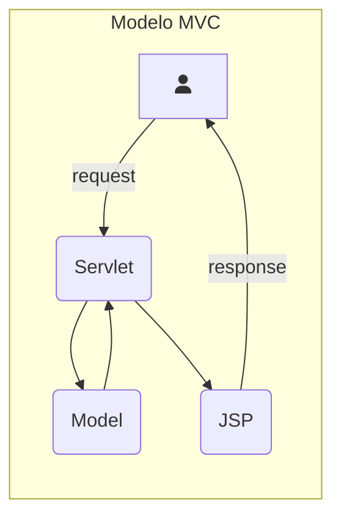
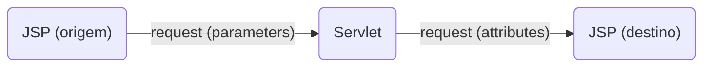
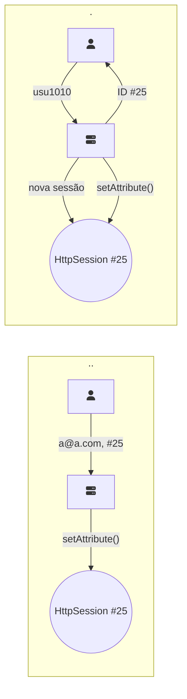

# O Papel de Cada Componente

• Se um JSP é um servlet, quando usar um e quando usar outro?





# Parameters (Parâmetros)

• São fornecidos pelo HTTP através de requisições GET ou POST

http://www.joaonogueira.dev/CadastroServlet?nome=João&empresa=joaonogueira.dev

```java
public class CadastroServlet extends HttpServlet {
  public void doGet(HttpServletRequest request, HttpServletResponse response) throws ServletException, IOException {
    String nome = request.getParameter("nome");//O retorno é sempre uma string
    String empresa = request.getParameter("empresa");
    CadastroService service = new CadastroService();
    service.cadastrar(nome, empresa);
    ...
  }
}
```

# Attributes (Atributos)

• São dados colocados numa área comum e podem ser compartilhados

```java
public class CadastroServlet extends HttpServlet {
  public void doGet(HttpServletRequest request, HttpServletResponse response) throws ServletException, IOException {
    ...
    Registro reg = service.cadastrar(nome, empresa);
    request.setAttribute("r", reg);//O atributo deve possuir um nome e pode ser de qualquer tipo
    request.getRequestDispatcher("sucesso.jsp").forward(request, response);//Redirecionamento para um JSP de destino
  }
}
```

sucesso.jsp

```java
<html>
<body>
<%
  Registro reg = (Registro) request.getAttribute("r");//request é um objeto implícito
%>
<H1>Cadastro feito com sucesso!</H1>
<H2>O ID do cadastro é: <%= reg.getId() %></H2>
</body>
</html>
```

## Escopos dos Atributos

• A visibilidade dos atributos depende do seu escopo

| Escopo   | Descrição                                                          |
|----------|--------------------------------------------------------------------|
| page     | Apenas a página que define o atributo o enxerga. Usado em JSPs     |
| request  | Atributos visíveis apenas enquanto durar a requisição              |
| context  | Atributos compartilhados com todos os servlets e JSPs da aplicação |
| session  | Atributos visíveis apenas a um cliente específico                  |

### O Escopo Page

• Usado em JSPs

• Um atributo é definido no JSP e só é visível dentro do JSP

```java
<%
  pageContext.setAttribute("nome", "João");//Define o atributo no escopo page
%>
<html>
<body>
<H1>Nome: <%= pageContext.getAttribute("nome") %></H1>//Lê o atributo
</body>
</html>
```

### O Escopo Request

• Atributos na request duram apenas enquanto durar a requisição

Servlet

```java
...
Registro reg = service.cadastrar(nome, empresa);
request.setAttribute("r", reg);
request.getRequestDispatcher("sucesso.jsp").forward(request, response);
...
```

sucesso.jsp

```java
<%
  Registro reg = (Registro) request.getAttribute("r");
%>
```

### O Escopo Context

• Os atributos são compartilhados por todos os servlets e JSPs da aplicação

Servlet

```java
ServletContext ctx = getServletContext();
ctx.setAttribute("versao", "1.0");
String versao = (String) ctx.getAttribute("versao");
```

JSP

```java
<%
  application.setAttribute("versao", "1.0");
%>
<%= application.getAttribute("versao") %>
```

### O Escopo Session

• Os atributos são exclusivos de um cliente da aplicação

• Outros clientes que usam a aplicação não têm acesso aos atributos

• A session define um estado de conversação entre um cliente específico e um servidor

– O servidor reconhece as múltiplas requisições do cliente

## Acesso Concorrente aos Atributos

• Lembre-se que em um ambiente web existem múltiplos clientes fazendo acessos simultâneos

• Apenas o escopo request é thread-safe

```java
ServletContext ctx = getServletContext();
synchronized(ctx) {
  ctx.setAttribute("versao", "1.0");
}
```

# Estado de Conversação

• Algumas aplicações exigem que o servidor saiba quem é o cliente com o qual ele está lidando

– Várias telas de cadastro

– Carrinho de compras

– Login de usuário

– etc.

• O problema é que o protocolo HTTP não armazena estado

## Sessão

• Na camada web, a forma de fazer isto é usando uma session (sessão)

– Representada pela interface HttpSession

Servlet

```java
HttpSession session = request.getSession();
session.setAttribute("usuario", "usu1010");
String u = (String) session.getAttribute("usuario");
```

JSP

```java
<%
  session.setAttribute("usuario", "usu1010");
%>
<%= session.getAttribute("usuario") %>
```

• A sessão é única para cada cliente

• Não existe a possibilidade de outro cliente ler ou escrever dados na sessão de outro cliente

• Se você estiver acessando uma aplicação e um atributo for colocado na sua sessão, numa requisição futura a aplicação poderá ler este atributo

### Funcionamento da Sessão

• Como o servidor sabe quem é o cliente?

• O servidor gera um ID único por cliente



• Para que o processo funcione, é necessário que cliente e servidor troquem a informação de ID da sessão

• Isto pode ser feito de duas formas

– Cookies

– URL rewriting

#### Sessão por Cookies 

• Cookies são informações enviadas pelo servidor e guardadas no cliente

• O servidor envia um cookie para o cliente e este o armazena

• A cada requisição, o cliente reenvia o cookie ao servidor

• Os cookies vão dentro do cabeçalho do protocolo HTTP

#### Sessão por URL Rewriting

• Usada normalmente quando o cliente não aceita cookies

• A cada URL chamada, o cliente reenvia o ID da sessão na URL

O container adiciona o ID da sessão à URL

http://www.joaonogueira.dev/Comprar;jsessionid=2379FD2

### Tempo de Vida da Sessão

• Pode ser que o cliente tenha seus dados colocados na sessão e pare o processo no meio

• Para evitar o gasto desnecessário de recursos, a sessão é destruída depois de um tempo 

– O tempo pode ser configurado no web.xml

• A sessão também pode ser destruída via programação 

– Método invalidate() da interface HttpSession

• Uma boa prática é remover os atributos da sessão que não são mais necessários 

– Método removeAttribute() da interface HttpSession

### Cookies

• Os cookies são pares de chave e valor armazenados no cliente

• Por padrão eles desaparecem assim que o browser é fechado, mas é possível configurá-los para que eles durem mais tempo

#### Trabalhando com Cookies

• O servidor é quem cria o cookie

```java
Cookie cookie = new Cookie("nomeCliente", "Carlos");
cookie.setMaxAge(30 * 60);
response.addCookie(cookie);
```

• Quando o cliente faz uma requisição, ele envia seus cookies ao servidor

• O servidor pode procurar pelo cookie desejado

```java
Cookie[] cookies = request.getCookies();
for (Cookie cookie : cookies) {
  if(cookie.getName().equals("nomeCliente")) {
    String nome = cookie.getValue();
  }
}
```

## Redirecionamento

• Após um servlet terminar sua tarefa, ele normalmente redireciona a requisição para um arquivo JSP, que será mostrado como resultado para o cliente

• Este redirecionamento pode ser feito de duas formas:

– Forward

– Redirect

### Forward

• O forward é um redirecionamento interno

– O próprio container faz o redirecionamento

– Olhando a URL, não é possível determinar para onde ocorreu o redirecionamento

```java
request.getRequestDispatcher("sucesso.jsp").forward(request, response);//Forward para sucesso.jsp
```

### Redirect

• O redirect é um redirecionamento para outra URL

– O container solicita ao browser a requisição de uma nova URL

– Olhando a URL, é possível ver para onde ocorreu o redirecionamento

```java
response.sendRedirect("sucesso.jsp");//Redirect para sucesso.jsp
```

Ao fazer um redirect, todos os dados da request são perdidos

### Forward ou Redirect?

• O que normalmente ocorre na prática é que o redirect é utilizado após alguma operação que salva, atualiza ou exclui dados da aplicação

– O redirect evita que o cliente pressione F5 no browser e o processo seja executado de novo

• Nas outras situações, normalmente o forward é utilizado

– Se o cliente pressionar F5 no browser o processo é executado de novo, mas isto não traz problemas

> Baseado nos cursos da Softblue