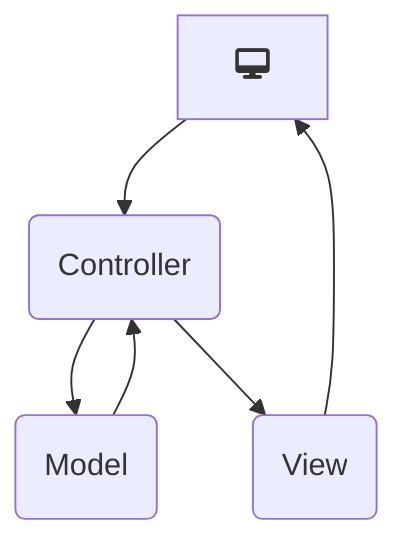
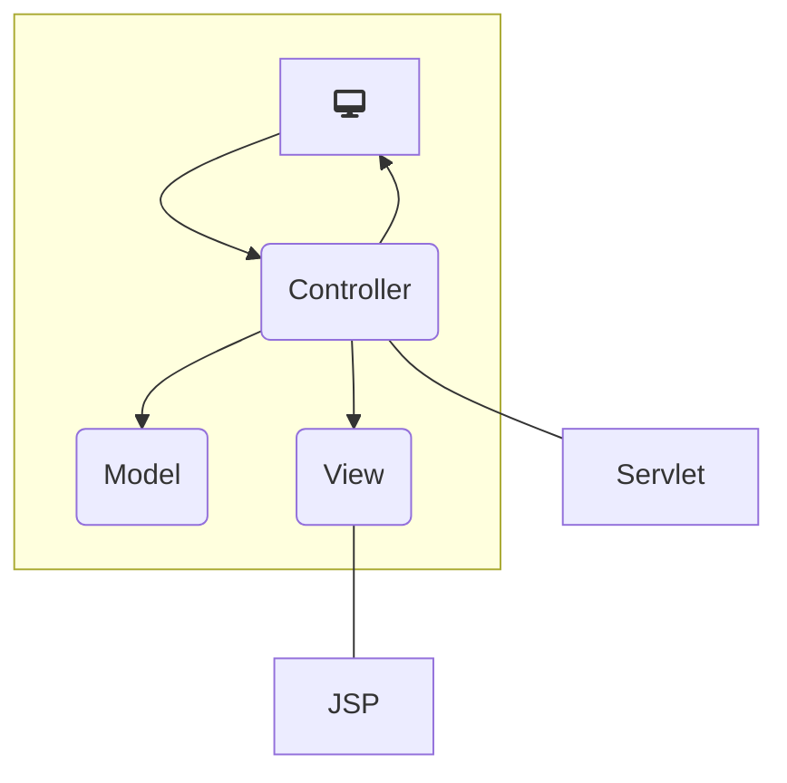
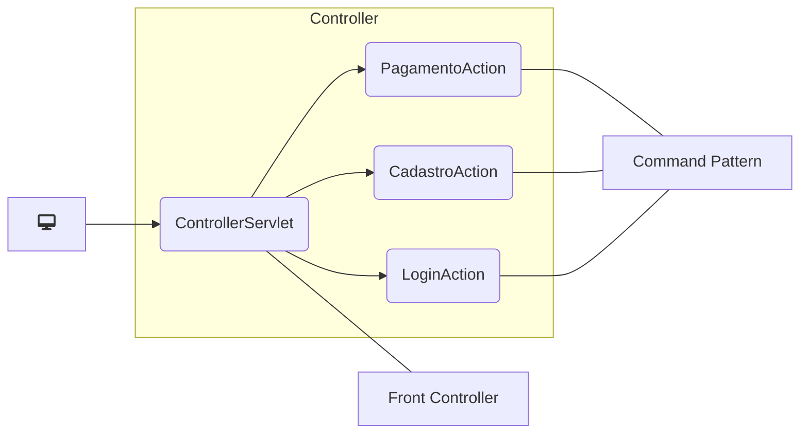
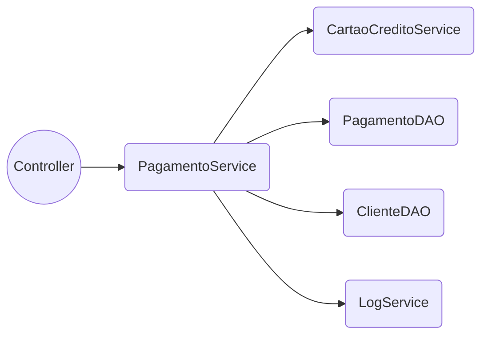

# O Modelo MVC

* Model – View – Controller.

* Permite a divisão da aplicação em camadas lógicas.

* Esta divisão facilita a manutenção e extensão futura do código.

## Controller

• É o componente chamado pelo cliente

• O controller executa os seguintes passos:

1. Prepara os dados que serão usados pelo model

2. Chama o model

3. Prepara os dados que serão usados pela view

4. Direciona para a view

## View

• É o resultado visual observado pelo cliente

• O direcionamento para uma determinada view é responsabilidade do controller

• Os dados presentes na view normalmente são renderizados com base em dados obtidos pelo model

## Model

• É onde está toda a lógica de negócio implementada pela aplicação

• O model compreende implementação da lógica, acesso a bancos de dados, acesso a sistemas externos, etc.

• O model não deve ter qualquer dependência com a tecnologia usada pelos controllers ou views

– Esta independência garante que o mesmo model pode ser usado para qualquer tipo de aplicação (web, desktop, dispositivos móveis, etc.)

# O MVC e as Aplicações Web

• O MVC pode ser aplicado para desenvolver qualquer tipo de aplicação

• Quando a aplicação é web, o MVC se encaixa perfeitamente

– O modo de funcionamento proposto pelo MVC e das aplicações web é muito similar

# O Servlet Como Controller

• No modelo MVC, os servlets fazem o papel dos controllers

• Uma boa opção é criar apenas um servlet na aplicação que intercepta todas as requisições

• O servlet, dependendo do que é requisitado, delega a operação para outras classes

# Estruturando a Camada Model

• O model é, sem dúvida, a camada mais importante da sua aplicação

• Nela está localizada a lógica de todo o funcionamento da aplicação

• É preciso que o model seja bem organizado para que o código seja de fácil manutenção e de fácil extensão

## Definição das Entidades

• As entidades (entities) são classes que representam os conceitos presentes na aplicação

• Na prática elas normalmente são mapeadas para tabelas do banco de dados

## Acesso a Dados

• Praticamente todas as aplicações comerciais possuem um meio de acessar e armazenar dados

– Banco de dados

– Sistemas externos

– Arquivos

• É importante criar um conjunto de classes que encapsulem o acesso aos dados

– Centraliza o acesso aos dados

– Permite mudar o mecanismo de persistência sem afetar outras partes do código

* DAO Pattern (Data Access Object)

## Definição dos Objetos de Negócio

• Os objetos de negócio (business objects) realizam tarefas específicas de negócio

O Model é uma Composição: Entity + Business Object + DAO

# Frameworks MVC

• Frameworks MVC tornam mais produtivo o desenvolvimento de aplicações web

• Trazem facilidades como suporte à validação de dados, tradução de dados vindos pelo HTTP, etc.

• Normalmente o framework faz o papel do controller

• Traz facilidades para trabalhar com as views

– Taglibs

• Exemplo de frameworks MVC no Java

– Struts

• http://struts.apache.org

– Spring

• http://www.springsource.org
